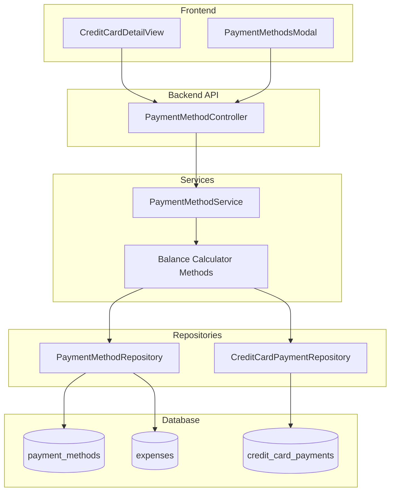

# Design Document: Credit Card Balance Types

## Overview

This design introduces three distinct balance calculations for credit cards: Statement Balance, Current (Posted) Balance, and Projected Balance. The implementation extends the existing `paymentMethodService.js` with new calculation methods and updates the `CreditCardDetailView.jsx` component to display all three balance types.

The core principle is using `COALESCE(posted_date, date)` as the "effective date" for all calculations, ensuring consistency between expense counts and balance calculations. This resolves the current confusion where editing an expense's posted_date changes the expense count but not the balance.

## Architecture



## Components and Interfaces

### Balance Calculator (PaymentMethodService Extension)

The existing `PaymentMethodService` will be extended with three new calculation methods:

```javascript
/**
 * Calculate statement balance for a credit card
 * Sum of expenses from past billing cycles minus payments before current cycle
 * @param {number} paymentMethodId - Credit card ID
 * @returns {Promise<number|null>} Statement balance or null if no billing cycle
 */
async calculateStatementBalance(paymentMethodId)

/**
 * Calculate current (posted) balance for a credit card
 * Sum of expenses with effective_date <= today minus payments <= today
 * @param {number} paymentMethodId - Credit card ID
 * @returns {Promise<number>} Current balance (minimum 0)
 */
async calculateCurrentBalance(paymentMethodId)

/**
 * Calculate projected balance for a credit card
 * Sum of ALL expenses minus ALL payments
 * @param {number} paymentMethodId - Credit card ID
 * @returns {Promise<number>} Projected balance (minimum 0)
 */
async calculateProjectedBalance(paymentMethodId)

/**
 * Get all three balance types for a credit card
 * @param {number} paymentMethodId - Credit card ID
 * @returns {Promise<BalanceTypes>} Object with all balance types
 */
async getAllBalanceTypes(paymentMethodId)

/**
 * Get billing cycle details for a specific period
 * @param {number} paymentMethodId - Credit card ID
 * @param {string} startDate - Cycle start date (YYYY-MM-DD)
 * @param {string} endDate - Cycle end date (YYYY-MM-DD)
 * @returns {Promise<BillingCycleDetails>} Cycle details with transaction count and total
 */
async getBillingCycleDetails(paymentMethodId, startDate, endDate)

/**
 * Get current billing cycle details
 * @param {number} paymentMethodId - Credit card ID
 * @returns {Promise<BillingCycleDetails|null>} Current cycle details or null if no billing cycle
 */
async getCurrentBillingCycleDetails(paymentMethodId)

/**
 * Get previous billing cycles (for history view)
 * @param {number} paymentMethodId - Credit card ID
 * @param {number} count - Number of past cycles to retrieve (default 6)
 * @returns {Promise<BillingCycleDetails[]>} Array of past cycle details
 */
async getPreviousBillingCycles(paymentMethodId, count = 6)
```

### Balance Types Interface

```typescript
interface BalanceTypes {
  statement_balance: number | null;  // null if no billing cycle configured
  current_balance: number;           // what you owe right now
  projected_balance: number;         // including future expenses
  has_pending_expenses: boolean;     // true if projected != current
  billing_cycle: {
    start_date: string;              // YYYY-MM-DD
    end_date: string;                // YYYY-MM-DD
  } | null;
}

interface BillingCycleDetails {
  start_date: string;                // YYYY-MM-DD
  end_date: string;                  // YYYY-MM-DD
  transaction_count: number;         // number of expenses in this cycle
  total_amount: number;              // sum of expenses in this cycle
  payment_count: number;             // number of payments in this cycle
  payment_total: number;             // sum of payments in this cycle
  is_current: boolean;               // true if this is the current cycle
}
```

### API Response Enhancement

The `getCreditCardWithComputedFields` method will be updated to return all balance types:

```javascript
{
  id: number,
  display_name: string,
  full_name: string,
  credit_limit: number,
  // Balance types
  statement_balance: number | null,
  current_balance: number,
  projected_balance: number,
  has_pending_expenses: boolean,
  // Current billing cycle details
  current_cycle: {
    start_date: string,
    end_date: string,
    transaction_count: number,
    total_amount: number,
    payment_count: number,
    payment_total: number
  } | null,
  // Existing computed fields
  utilization_percentage: number,
  days_until_due: number,
  expense_count: number  // deprecated, use current_cycle.transaction_count
}
```

### New API Endpoint for Billing Cycle History

```
GET /api/payment-methods/:id/billing-cycles
Query params: ?count=6 (optional, default 6)

Response:
{
  cycles: [
    {
      start_date: "2025-01-15",
      end_date: "2025-02-14",
      transaction_count: 23,
      total_amount: 1234.56,
      payment_count: 1,
      payment_total: 1000.00,
      is_current: true
    },
    // ... previous cycles
  ]
}
```

### Frontend Component Updates

The `CreditCardDetailView` component will be updated to display:

1. **Primary Balance Card**: Shows current balance prominently
2. **Statement Balance Card**: Shows statement balance (if billing cycle configured)
3. **Projected Balance Indicator**: Shows projected balance if different from current
4. **Current Billing Cycle Card**: Shows cycle dates, transaction count, and cycle total
5. **Billing Cycle History**: Expandable section showing past cycles with their details

## Data Models

### Existing Tables Used

**expenses table** (relevant fields):
- `id`: Primary key
- `date`: Transaction date (YYYY-MM-DD)
- `posted_date`: Posted date if different from transaction date (YYYY-MM-DD, nullable)
- `amount`: Expense amount
- `payment_method_id`: Foreign key to payment_methods

**payment_methods table** (relevant fields):
- `id`: Primary key
- `billing_cycle_start`: Day of month (1-31)
- `billing_cycle_end`: Day of month (1-31)
- `current_balance`: Stored balance (will be deprecated in favor of calculated)

**credit_card_payments table** (relevant fields):
- `id`: Primary key
- `payment_method_id`: Foreign key to payment_methods
- `amount`: Payment amount
- `payment_date`: Date of payment (YYYY-MM-DD)

### SQL Queries

**Statement Balance Query:**
```sql
-- Expenses from past billing cycles
SELECT COALESCE(SUM(amount), 0) as expense_total
FROM expenses 
WHERE payment_method_id = ?
  AND COALESCE(posted_date, date) < ?  -- current cycle start date

-- Payments before current cycle
SELECT COALESCE(SUM(amount), 0) as payment_total
FROM credit_card_payments
WHERE payment_method_id = ?
  AND payment_date < ?  -- current cycle start date
```

**Current Balance Query:**
```sql
-- Expenses with effective date <= today
SELECT COALESCE(SUM(amount), 0) as expense_total
FROM expenses 
WHERE payment_method_id = ?
  AND COALESCE(posted_date, date) <= ?  -- today

-- Payments with date <= today
SELECT COALESCE(SUM(amount), 0) as payment_total
FROM credit_card_payments
WHERE payment_method_id = ?
  AND payment_date <= ?  -- today
```

**Projected Balance Query:**
```sql
-- All expenses
SELECT COALESCE(SUM(amount), 0) as expense_total
FROM expenses 
WHERE payment_method_id = ?

-- All payments
SELECT COALESCE(SUM(amount), 0) as payment_total
FROM credit_card_payments
WHERE payment_method_id = ?
```

**Billing Cycle Details Query:**
```sql
-- Transaction count and total for a billing cycle
SELECT 
  COUNT(*) as transaction_count,
  COALESCE(SUM(amount), 0) as total_amount
FROM expenses 
WHERE payment_method_id = ?
  AND COALESCE(posted_date, date) >= ?  -- cycle start
  AND COALESCE(posted_date, date) <= ?  -- cycle end

-- Payment count and total for a billing cycle
SELECT 
  COUNT(*) as payment_count,
  COALESCE(SUM(amount), 0) as payment_total
FROM credit_card_payments
WHERE payment_method_id = ?
  AND payment_date >= ?  -- cycle start
  AND payment_date <= ?  -- cycle end
```

## Correctness Properties

*A property is a characteristic or behavior that should hold true across all valid executions of a system—essentially, a formal statement about what the system should do. Properties serve as the bridge between human-readable specifications and machine-verifiable correctness guarantees.*

### Property 1: Balance Ordering Invariant

*For any* credit card with expenses and payments, the statement balance SHALL be less than or equal to the current balance, which SHALL be less than or equal to the projected balance (statement ≤ current ≤ projected), assuming no future-dated payments.

**Validates: Requirements 1.1, 2.1, 3.1**

### Property 2: Effective Date Consistency

*For any* expense, the effective date used for balance calculations SHALL equal COALESCE(posted_date, date), and this same effective date SHALL be used for both expense counting and balance calculations.

**Validates: Requirements 1.4, 2.3, 5.1**

### Property 3: Non-Negative Balance Invariant

*For any* credit card and any combination of expenses and payments, all three balance types (statement, current, projected) SHALL be greater than or equal to zero.

**Validates: Requirements 1.5, 2.4, 3.3**

### Property 4: Payment Reduction Property

*For any* payment recorded on a credit card, the projected balance SHALL decrease by exactly the payment amount (or to zero if payment exceeds balance).

**Validates: Requirements 3.2, 6.3**

### Property 5: Expense Count and Balance Consistency

*For any* expense with a posted_date change, if the expense moves into or out of the current billing cycle based on effective_date, both the expense count and the current balance SHALL reflect this change consistently.

**Validates: Requirements 5.2, 5.3, 5.4**

### Property 6: Statement Balance Null When No Billing Cycle

*For any* credit card without billing_cycle_start and billing_cycle_end configured, the statement balance SHALL be null.

**Validates: Requirements 1.3, 7.2**

### Property 7: Projected Equals Current When No Future Expenses

*For any* credit card where all expenses have effective_date ≤ today and all payments have payment_date ≤ today, the projected balance SHALL equal the current balance.

**Validates: Requirements 4.4**

### Property 8: Billing Cycle Transaction Count Accuracy

*For any* billing cycle period and any set of expenses, the transaction count returned by getBillingCycleDetails SHALL equal the count of expenses where effective_date falls within the cycle period (inclusive).

**Validates: Requirements 8.2, 8.3**

### Property 9: Billing Cycle Total Accuracy

*For any* billing cycle period and any set of expenses, the total_amount returned by getBillingCycleDetails SHALL equal the sum of amounts for expenses where effective_date falls within the cycle period.

**Validates: Requirements 8.3, 9.3**

## Error Handling

### Invalid Payment Method
- If payment method ID doesn't exist: Return null/throw appropriate error
- If payment method is not a credit card: Throw error "Balance calculations only available for credit cards"

### Database Errors
- Wrap all database operations in try-catch
- Log errors with context (payment method ID, operation type)
- Return sensible defaults (0 for balances) on non-critical errors

### Edge Cases
- No expenses: All balances return 0
- No payments: Balances equal expense totals
- No billing cycle: Statement balance returns null
- Future-dated payments: Include in projected, exclude from current if date > today

## Testing Strategy

### Unit Tests
- Test each balance calculation method in isolation
- Test edge cases: empty data, single expense, single payment
- Test billing cycle boundary conditions
- Test null billing cycle handling

### Property-Based Tests
Property-based testing will use `fast-check` library (already in project) with minimum 100 iterations per property.

**Test Configuration:**
```javascript
fc.assert(
  fc.property(
    // generators
    (data) => {
      // property assertion
    }
  ),
  { numRuns: 100 }
);
```

**Property Tests to Implement:**
1. Balance ordering invariant (statement ≤ current ≤ projected)
2. Non-negative balance invariant
3. Payment reduction property
4. Effective date consistency
5. Statement balance null when no billing cycle
6. Projected equals current when no future expenses
7. Billing cycle transaction count accuracy
8. Billing cycle total accuracy

### Integration Tests
- Test full API flow from controller to database
- Test balance updates after expense CRUD operations
- Test balance updates after payment CRUD operations
- Test billing cycle history endpoint
- Test UI component rendering with various balance states
- Test billing cycle navigation in UI
