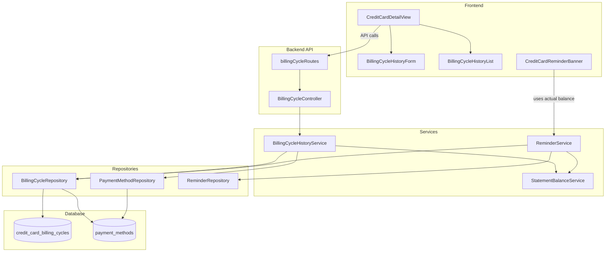

# Design Document: Credit Card Billing Cycle History

## Overview

This feature enables users to record their actual statement balance from credit card statements each billing cycle, creating a historical record for reconciliation and tracking. The system integrates with the existing statement balance calculation service to provide discrepancy analysis between user-provided and calculated values, and updates the reminder system to use actual statement balances as the authoritative source for payment alerts.

The design follows the existing layered architecture pattern (Controller → Service → Repository → Database) and integrates with existing credit card infrastructure including payment methods, statement balance calculation, and the reminder system.

## Architecture



## Components and Interfaces

### Backend Components

#### BillingCycleRepository

Data access layer for the `credit_card_billing_cycles` table.

```javascript
class BillingCycleRepository {
  /**
   * Create a new billing cycle record
   * @param {Object} data - Billing cycle data
   * @returns {Promise<Object>} Created record with ID
   */
  async create(data);
  
  /**
   * Find billing cycle by payment method and cycle end date
   * @param {number} paymentMethodId
   * @param {string} cycleEndDate - YYYY-MM-DD
   * @returns {Promise<Object|null>}
   */
  async findByPaymentMethodAndCycleEnd(paymentMethodId, cycleEndDate);
  
  /**
   * Get billing cycle history for a payment method
   * @param {number} paymentMethodId
   * @param {Object} options - { limit, startDate, endDate }
   * @returns {Promise<Array>} Records sorted by cycle_end_date DESC
   */
  async findByPaymentMethod(paymentMethodId, options);
  
  /**
   * Update a billing cycle record
   * @param {number} id
   * @param {Object} data
   * @returns {Promise<Object|null>}
   */
  async update(id, data);
  
  /**
   * Delete a billing cycle record
   * @param {number} id
   * @returns {Promise<boolean>}
   */
  async delete(id);
  
  /**
   * Get current billing cycle status for a payment method
   * @param {number} paymentMethodId
   * @param {string} currentCycleEndDate
   * @returns {Promise<Object|null>}
   */
  async getCurrentCycleStatus(paymentMethodId, currentCycleEndDate);
  
  /**
   * Get credit cards with missing billing cycle entries
   * @param {Date} referenceDate
   * @returns {Promise<Array>} Cards needing billing cycle entry
   */
  async getCreditCardsNeedingBillingCycleEntry(referenceDate);
}
```

#### BillingCycleHistoryService

Business logic for billing cycle history management.

```javascript
class BillingCycleHistoryService {
  /**
   * Create a billing cycle record with auto-calculated balance
   * @param {number} paymentMethodId
   * @param {Object} data - { actual_statement_balance, minimum_payment, due_date, notes }
   * @returns {Promise<Object>} Created record with discrepancy
   */
  async createBillingCycle(paymentMethodId, data);
  
  /**
   * Get billing cycle history with discrepancy calculations
   * @param {number} paymentMethodId
   * @param {Object} options
   * @returns {Promise<Array>}
   */
  async getBillingCycleHistory(paymentMethodId, options);
  
  /**
   * Update a billing cycle record
   * @param {number} paymentMethodId
   * @param {number} cycleId
   * @param {Object} data
   * @returns {Promise<Object>}
   */
  async updateBillingCycle(paymentMethodId, cycleId, data);
  
  /**
   * Delete a billing cycle record
   * @param {number} paymentMethodId
   * @param {number} cycleId
   * @returns {Promise<boolean>}
   */
  async deleteBillingCycle(paymentMethodId, cycleId);
  
  /**
   * Get current billing cycle status
   * @param {number} paymentMethodId
   * @returns {Promise<Object>} { hasActualBalance, cycleEndDate, actualBalance, calculatedBalance }
   */
  async getCurrentCycleStatus(paymentMethodId);
  
  /**
   * Calculate discrepancy between actual and calculated balance
   * @param {number} actualBalance
   * @param {number} calculatedBalance
   * @returns {Object} { amount, type, description }
   */
  calculateDiscrepancy(actualBalance, calculatedBalance);
}
```

#### BillingCycleController

HTTP request handler for billing cycle endpoints.

```javascript
class BillingCycleController {
  async createBillingCycle(req, res);    // POST /api/payment-methods/:id/billing-cycles
  async getBillingCycleHistory(req, res); // GET /api/payment-methods/:id/billing-cycles/history
  async updateBillingCycle(req, res);     // PUT /api/payment-methods/:id/billing-cycles/:cycleId
  async deleteBillingCycle(req, res);     // DELETE /api/payment-methods/:id/billing-cycles/:cycleId
  async getCurrentCycleStatus(req, res);  // GET /api/payment-methods/:id/billing-cycles/current
}
```

### Frontend Components

#### BillingCycleHistoryForm

Form component for entering actual statement balance.

```jsx
const BillingCycleHistoryForm = ({
  paymentMethodId,
  paymentMethodName,
  cycleStartDate,      // Pre-populated from billing cycle calculation
  cycleEndDate,        // Pre-populated from billing cycle calculation
  calculatedBalance,   // Shown for reference
  onSubmit,
  onCancel
}) => {
  // State: actualBalance, minimumPayment, dueDate, notes
  // Validation: actualBalance >= 0, dueDate format
  // Display: calculated balance, discrepancy preview
};
```

#### BillingCycleHistoryList

List component displaying billing cycle history.

```jsx
const BillingCycleHistoryList = ({
  cycles,              // Array of billing cycle records
  onEdit,              // Callback for edit action
  onDelete,            // Callback for delete action
  formatCurrency,      // Currency formatter
  formatDate           // Date formatter
}) => {
  // Display: cycle dates, actual balance, calculated balance, discrepancy indicator
  // Actions: edit, delete with confirmation
};
```

#### Updated ReminderService Integration

The existing `ReminderService.getCreditCardReminders()` will be updated to:
1. Check for actual statement balance in `credit_card_billing_cycles` table
2. Use actual balance as authoritative source for payment alerts
3. Suppress alerts when actual balance is zero or statement is paid

### API Endpoints

| Method | Endpoint | Description |
|--------|----------|-------------|
| POST | `/api/payment-methods/:id/billing-cycles` | Create billing cycle record |
| GET | `/api/payment-methods/:id/billing-cycles/history` | Get billing cycle history |
| PUT | `/api/payment-methods/:id/billing-cycles/:cycleId` | Update billing cycle record |
| DELETE | `/api/payment-methods/:id/billing-cycles/:cycleId` | Delete billing cycle record |
| GET | `/api/payment-methods/:id/billing-cycles/current` | Get current cycle status |

## Data Models

### Database Schema

```sql
CREATE TABLE credit_card_billing_cycles (
  id INTEGER PRIMARY KEY AUTOINCREMENT,
  payment_method_id INTEGER NOT NULL,
  cycle_start_date TEXT NOT NULL,
  cycle_end_date TEXT NOT NULL,
  actual_statement_balance REAL NOT NULL CHECK(actual_statement_balance >= 0),
  calculated_statement_balance REAL NOT NULL CHECK(calculated_statement_balance >= 0),
  minimum_payment REAL CHECK(minimum_payment IS NULL OR minimum_payment >= 0),
  due_date TEXT,
  notes TEXT,
  created_at TEXT DEFAULT CURRENT_TIMESTAMP,
  updated_at TEXT DEFAULT CURRENT_TIMESTAMP,
  FOREIGN KEY (payment_method_id) REFERENCES payment_methods(id) ON DELETE CASCADE,
  UNIQUE(payment_method_id, cycle_end_date)
);

-- Indexes for efficient querying
CREATE INDEX idx_billing_cycles_payment_method ON credit_card_billing_cycles(payment_method_id);
CREATE INDEX idx_billing_cycles_cycle_end ON credit_card_billing_cycles(cycle_end_date);
CREATE INDEX idx_billing_cycles_pm_cycle_end ON credit_card_billing_cycles(payment_method_id, cycle_end_date);
```

### TypeScript Interfaces (for documentation)

```typescript
interface BillingCycleRecord {
  id: number;
  payment_method_id: number;
  cycle_start_date: string;      // YYYY-MM-DD
  cycle_end_date: string;        // YYYY-MM-DD
  actual_statement_balance: number;
  calculated_statement_balance: number;
  minimum_payment: number | null;
  due_date: string | null;       // YYYY-MM-DD
  notes: string | null;
  created_at: string;
  updated_at: string;
}

interface BillingCycleWithDiscrepancy extends BillingCycleRecord {
  discrepancy: {
    amount: number;              // actual - calculated
    type: 'higher' | 'lower' | 'match';
    description: string;
  };
}

interface CurrentCycleStatus {
  hasActualBalance: boolean;
  cycleStartDate: string;
  cycleEndDate: string;
  actualBalance: number | null;
  calculatedBalance: number;
  daysUntilCycleEnd: number;
}

interface BillingCycleReminder {
  paymentMethodId: number;
  displayName: string;
  cycleEndDate: string;
  needsEntry: boolean;
}
```

### Request/Response Formats

#### Create Billing Cycle Request
```json
{
  "actual_statement_balance": 1234.56,
  "minimum_payment": 25.00,
  "due_date": "2025-02-15",
  "notes": "Statement received via email"
}
```

#### Create Billing Cycle Response
```json
{
  "success": true,
  "billingCycle": {
    "id": 1,
    "payment_method_id": 4,
    "cycle_start_date": "2025-01-16",
    "cycle_end_date": "2025-02-15",
    "actual_statement_balance": 1234.56,
    "calculated_statement_balance": 1189.23,
    "minimum_payment": 25.00,
    "due_date": "2025-02-15",
    "notes": "Statement received via email",
    "discrepancy": {
      "amount": 45.33,
      "type": "higher",
      "description": "Actual balance is $45.33 higher than tracked (potential untracked expenses)"
    }
  }
}
```

#### Get Current Cycle Status Response
```json
{
  "hasActualBalance": false,
  "cycleStartDate": "2025-01-16",
  "cycleEndDate": "2025-02-15",
  "actualBalance": null,
  "calculatedBalance": 1189.23,
  "daysUntilCycleEnd": 5,
  "needsEntry": true
}
```

## Historical Data Handling

### Design Decision: Forward-Only Tracking

The billing cycle history feature is designed for **forward-only tracking** - users are not required to backfill historical billing cycles. This addresses the common scenario where users have over a year of existing expense data.

### Behavior for Historical Periods

1. **No Backfill Required**: Users only need to enter actual statement balances for current and future billing cycles. Historical cycles without entries will continue to use calculated balances.

2. **Graceful Fallback**: For any billing cycle without a user-provided actual balance:
   - Display shows calculated statement balance (existing behavior)
   - Payment alerts use calculated balance (existing behavior)
   - No reminder is generated for past cycles

3. **Reminder Scope**: Billing cycle entry reminders are ONLY generated for:
   - The most recently completed billing cycle (if no entry exists)
   - Reminders are NOT generated for cycles older than one billing period

4. **Optional Historical Entry**: Users CAN optionally enter historical billing cycles if they want to reconcile past data, but this is not required or prompted.

### Implementation Details

```javascript
// In ReminderService - only remind for most recent completed cycle
async getBillingCycleReminders(referenceDate = new Date()) {
  const creditCards = await this.getCreditCardsWithBillingCycle();
  
  return creditCards.map(card => {
    const mostRecentCycle = this.calculateMostRecentCompletedCycle(
      card.billing_cycle_day, 
      referenceDate
    );
    
    // Only check if entry exists for the MOST RECENT completed cycle
    const hasEntry = await billingCycleRepository.findByPaymentMethodAndCycleEnd(
      card.id,
      mostRecentCycle.endDate
    );
    
    return {
      paymentMethodId: card.id,
      displayName: card.display_name,
      cycleEndDate: mostRecentCycle.endDate,
      needsEntry: !hasEntry,
      // Never remind for cycles older than the most recent
      isHistorical: false
    };
  });
}
```

### UI Considerations

1. **History List**: Shows all entered billing cycles (may have gaps for historical periods)
2. **Empty State**: Only prompts for current/recent cycle entry, not historical backfill
3. **Form Default**: Pre-populates with most recent completed cycle dates
4. **No "Catch Up" Mode**: No bulk entry or backfill wizard - keeps it simple

### Recommended Workflow for Existing Users

For users with existing expense history who want to start fresh with accurate statement tracking:

1. **Enter Recent Cycles**: Enter actual statement balances for the 1-2 most recent completed billing cycles
2. **Log Correction Payment**: If the calculated balance for older periods doesn't match reality, log a "correction" payment to zero out the discrepancy
   - Example: If calculated balance shows $500 from old expenses but actual statement is $0, log a $500 payment with notes "Historical balance correction"
3. **Continue Forward**: From this point, enter actual statement balances each cycle for accurate tracking

This approach leverages the existing payment system to reconcile historical data without requiring complex backfill functionality.


## Correctness Properties

*A property is a characteristic or behavior that should hold true across all valid executions of a system—essentially, a formal statement about what the system should do. Properties serve as the bridge between human-readable specifications and machine-verifiable correctness guarantees.*

### Property 1: Billing Cycle CRUD Round-Trip

*For any* valid billing cycle data (payment_method_id, cycle dates, actual_statement_balance), creating a record and then retrieving it by ID SHALL return an equivalent record with all fields preserved.

**Validates: Requirements 1.1, 2.1, 2.4**

### Property 2: Uniqueness Constraint Enforcement

*For any* payment_method_id and cycle_end_date combination, attempting to create a second billing cycle record with the same combination SHALL fail with a duplicate error.

**Validates: Requirements 1.3, 2.5**

### Property 3: Foreign Key Constraint Enforcement

*For any* billing cycle creation attempt with a non-existent payment_method_id, the operation SHALL fail with a foreign key constraint error.

**Validates: Requirements 1.2**

### Property 4: Cascade Delete Behavior

*For any* payment method with associated billing cycle records, deleting the payment method SHALL also delete all associated billing cycle records.

**Validates: Requirements 1.4**

### Property 5: History Sorting Order

*For any* set of billing cycle records for a payment method, retrieving the history SHALL return records sorted by cycle_end_date in descending order (most recent first).

**Validates: Requirements 2.2**

### Property 6: Discrepancy Calculation Correctness

*For any* billing cycle record with actual_statement_balance A and calculated_statement_balance C, the discrepancy amount SHALL equal (A - C).

**Validates: Requirements 3.1**

### Property 7: Discrepancy Type Classification

*For any* discrepancy amount D:
- If D > 0, the type SHALL be 'higher'
- If D < 0, the type SHALL be 'lower'
- If D = 0, the type SHALL be 'match'

**Validates: Requirements 3.2, 3.3, 3.4**

### Property 8: Update Preserves Calculated Balance

*For any* billing cycle record update operation, the calculated_statement_balance field SHALL remain unchanged from its original value, regardless of what other fields are modified.

**Validates: Requirements 2.3**

### Property 9: Statement Balance Display Priority

*For any* credit card with billing_cycle_day configured:
- If a billing cycle record exists for the current period, the displayed statement balance SHALL be the actual_statement_balance
- If no billing cycle record exists, the displayed statement balance SHALL be the calculated statement balance

**Validates: Requirements 7.1, 7.2**

### Property 10: Payment Alert Authoritative Balance

*For any* credit card payment alert calculation:
- If a billing cycle record exists for the current period, the required_payment amount SHALL equal the actual_statement_balance
- If actual_statement_balance is 0, payment alerts SHALL be suppressed
- If no billing cycle record exists, the required_payment SHALL equal the calculated statement balance

**Validates: Requirements 7.4, 7.5, 7.6**

### Property 11: Form Validation Non-Negative Balance

*For any* form submission with actual_statement_balance < 0, the submission SHALL be rejected with a validation error.

**Validates: Requirements 6.2**

### Property 12: Billing Cycle Reminder Generation

*For any* credit card with billing_cycle_day configured where the current date is past the cycle_end_date and no billing cycle record exists for that cycle, a reminder SHALL be generated.

**Validates: Requirements 4.1, 4.2**

### Property 13: Date Range Filtering

*For any* billing cycle history query with startDate and endDate filters, all returned records SHALL have cycle_end_date within the specified range (inclusive).

**Validates: Requirements 1.5**

## Error Handling

### Repository Layer Errors

| Error Condition | Error Type | HTTP Status | Message |
|-----------------|------------|-------------|---------|
| Invalid payment_method_id (FK violation) | ForeignKeyError | 400 | "Invalid payment method ID" |
| Duplicate (payment_method_id, cycle_end_date) | UniqueConstraintError | 409 | "Billing cycle record already exists for this period" |
| Record not found for update/delete | NotFoundError | 404 | "Billing cycle record not found" |
| Database connection failure | DatabaseError | 500 | "Database operation failed" |

### Service Layer Errors

| Error Condition | Error Type | HTTP Status | Message |
|-----------------|------------|-------------|---------|
| Payment method not found | NotFoundError | 404 | "Payment method not found" |
| Payment method is not a credit card | ValidationError | 400 | "Billing cycle history only available for credit cards" |
| No billing_cycle_day configured | ValidationError | 400 | "Billing cycle day not configured for this credit card" |
| Invalid actual_statement_balance | ValidationError | 400 | "Actual statement balance must be a non-negative number" |
| Invalid date format | ValidationError | 400 | "Invalid date format. Use YYYY-MM-DD" |

### Controller Layer Errors

| Error Condition | Error Type | HTTP Status | Message |
|-----------------|------------|-------------|---------|
| Missing required field | ValidationError | 400 | "Missing required field: {field_name}" |
| Invalid payment method ID format | ValidationError | 400 | "Invalid payment method ID" |
| Invalid cycle ID format | ValidationError | 400 | "Invalid billing cycle ID" |

### Error Response Format

```json
{
  "success": false,
  "error": "Error message describing the issue",
  "code": "ERROR_CODE",
  "details": {
    "field": "field_name",
    "value": "invalid_value"
  }
}
```

## Testing Strategy

### Dual Testing Approach

This feature requires both unit tests and property-based tests for comprehensive coverage:

- **Unit tests**: Verify specific examples, edge cases, API endpoint behavior, and error conditions
- **Property tests**: Verify universal properties across all valid inputs using randomized testing

### Property-Based Testing Configuration

- **Library**: fast-check (already used in the project)
- **Minimum iterations**: 100 per property test
- **Tag format**: `Feature: credit-card-billing-cycle-history, Property {number}: {property_text}`

### Test Files Structure

```
backend/
├── repositories/
│   └── billingCycleRepository.pbt.test.js    # Properties 1-5, 13
├── services/
│   ├── billingCycleHistoryService.pbt.test.js # Properties 6-8
│   └── reminderService.billingCycle.pbt.test.js # Properties 10, 12
├── controllers/
│   └── billingCycleController.test.js         # API endpoint tests

frontend/
├── components/
│   ├── BillingCycleHistoryForm.pbt.test.jsx   # Property 11
│   └── BillingCycleHistoryList.test.jsx       # UI rendering tests
│   └── CreditCardDetailView.billingCycle.test.jsx # Property 9
```

### Unit Test Coverage

1. **Repository Tests**
   - CRUD operations with valid data
   - Error handling for constraint violations
   - Query filtering with various date ranges

2. **Service Tests**
   - Auto-calculation of calculated_statement_balance
   - Discrepancy calculation edge cases (zero, very large numbers)
   - Integration with StatementBalanceService

3. **Controller Tests**
   - All API endpoints respond correctly
   - Request validation
   - Error response formatting

4. **Frontend Tests**
   - Form validation and submission
   - Empty state rendering
   - Discrepancy indicator styling
   - Integration with existing CreditCardDetailView

### Property Test Coverage

Each correctness property (1-13) will have a corresponding property-based test that:
- Generates random valid inputs using fast-check arbitraries
- Verifies the property holds for all generated inputs
- Includes edge cases in the generator (zero balances, boundary dates, etc.)

### Integration Test Scenarios

1. **Full CRUD Flow**: Create → Read → Update → Delete billing cycle
2. **Reminder Integration**: Verify reminders appear/disappear based on billing cycle entries
3. **Payment Alert Integration**: Verify alerts use actual balance when available
4. **Cascade Delete**: Verify billing cycles are deleted when payment method is deleted
