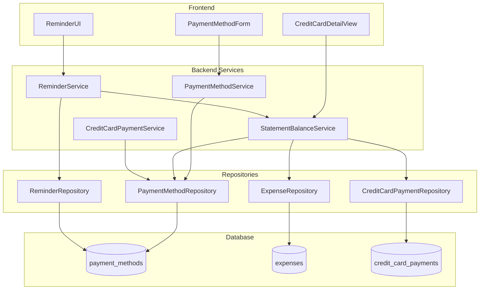

# Design Document: Credit Card Statement Balance

## Overview

This feature enhances credit card management by automatically calculating statement balances based on billing cycles and providing smart payment alerts. The system will track what amount is actually due from the previous billing cycle, enabling intelligent alert suppression when statements are paid in full while still showing the required payment amount when due.

The design introduces:
1. A new `billing_cycle_day` field to simplify billing cycle configuration (replacing the current start/end approach)
2. A new `StatementBalanceService` to calculate statement balances on-demand
3. Enhanced reminder logic that uses calculated statement balance for alert decisions
4. Updated frontend components for billing cycle configuration and statement balance display

## Architecture



## Components and Interfaces

### 1. Database Schema Changes

#### Migration: Add billing_cycle_day Column

The current schema uses `billing_cycle_start` and `billing_cycle_end` which is confusing. We'll add a simpler `billing_cycle_day` field that represents the day the statement closes.

```sql
-- Add billing_cycle_day column
ALTER TABLE payment_methods ADD COLUMN billing_cycle_day INTEGER 
  CHECK(billing_cycle_day IS NULL OR (billing_cycle_day >= 1 AND billing_cycle_day <= 31));

-- Migrate existing data: Use billing_cycle_end as the statement closing day
UPDATE payment_methods 
SET billing_cycle_day = billing_cycle_end 
WHERE type = 'credit_card' 
  AND billing_cycle_end IS NOT NULL 
  AND billing_cycle_day IS NULL;
```

The migration will:
1. Add the new `billing_cycle_day` column
2. For existing credit cards with `billing_cycle_end` set, copy that value to `billing_cycle_day` (since `billing_cycle_end` represents when the statement closes)
3. The existing `billing_cycle_start` and `billing_cycle_end` columns will be retained for backward compatibility but deprecated in favor of `billing_cycle_day`

#### Migration Logic for Existing Cards

For credit cards that already have billing cycle configured:
- `billing_cycle_end` → `billing_cycle_day` (the statement closing day)
- `billing_cycle_start` is no longer needed (it's always billing_cycle_day + 1 of the previous month)

For credit cards without billing cycle configured:
- They will continue to work with backward compatibility (using current_balance for alerts)
- Users can optionally configure billing_cycle_day later

### 2. StatementBalanceService (New)

A new service responsible for calculating statement balances on-demand.

```javascript
/**
 * StatementBalanceService
 * Calculates statement balance based on billing cycle and expenses
 */
class StatementBalanceService {
  /**
   * Calculate the previous billing cycle date range
   * @param {number} billingCycleDay - Day of month when statement closes (1-31)
   * @param {Date} referenceDate - Reference date (defaults to today)
   * @returns {Object} { startDate, endDate } in YYYY-MM-DD format
   */
  calculatePreviousCycleDates(billingCycleDay, referenceDate = new Date());

  /**
   * Calculate statement balance for a credit card
   * Statement balance = expenses in previous cycle - payments since statement date
   * @param {number} paymentMethodId - Credit card ID
   * @param {Date} referenceDate - Reference date (defaults to today)
   * @returns {Promise<Object>} { 
   *   statementBalance, 
   *   cycleStartDate, 
   *   cycleEndDate,
   *   totalExpenses,
   *   totalPayments,
   *   isPaid 
   * }
   */
  async calculateStatementBalance(paymentMethodId, referenceDate = new Date());

  /**
   * Get statement balance info for multiple credit cards
   * @param {Array<number>} paymentMethodIds - Array of credit card IDs
   * @param {Date} referenceDate - Reference date
   * @returns {Promise<Map<number, Object>>} Map of paymentMethodId to balance info
   */
  async getStatementBalances(paymentMethodIds, referenceDate = new Date());
}
```

### 3. PaymentMethodService Updates

Add validation for mandatory billing cycle fields on credit cards.

```javascript
/**
 * Enhanced validation for credit card creation/update
 * @param {Object} data - Payment method data
 * @returns {Object} { isValid, errors }
 */
validateCreditCard(data) {
  // Existing validation...
  
  // NEW: Require billing_cycle_day for credit cards
  if (!data.billing_cycle_day) {
    errors.push('Billing cycle day is required for credit cards');
  } else if (data.billing_cycle_day < 1 || data.billing_cycle_day > 31) {
    errors.push('Billing cycle day must be between 1 and 31');
  }
  
  // NEW: Require payment_due_day for credit cards
  if (!data.payment_due_day) {
    errors.push('Payment due day is required for credit cards');
  }
}
```

### 4. ReminderService Updates

Update to use StatementBalanceService for alert logic.

```javascript
/**
 * Get credit card payment reminders with statement balance
 * @param {Date} referenceDate - Reference date (defaults to today)
 * @returns {Promise<Object>} Credit card reminder status with statement balances
 */
async getCreditCardReminders(referenceDate = new Date()) {
  // Get all active credit cards with due dates
  const creditCards = await reminderRepository.getCreditCardsWithDueDates();
  
  // Calculate statement balance for each card
  const cardsWithBalances = await Promise.all(
    creditCards.map(async (card) => {
      const daysUntilDue = this.calculateDaysUntilDue(card.payment_due_day, referenceDate);
      
      // Calculate statement balance if billing cycle is configured
      let statementInfo = null;
      if (card.billing_cycle_day) {
        statementInfo = await statementBalanceService.calculateStatementBalance(
          card.id, 
          referenceDate
        );
      }
      
      // Determine if reminder should show
      // Show reminder if: statement_balance > 0 AND due within 7 days
      const statementBalance = statementInfo?.statementBalance ?? card.current_balance;
      const shouldShowReminder = statementBalance > 0 && 
        daysUntilDue !== null && 
        daysUntilDue >= 0 && 
        daysUntilDue <= REMINDER_DAYS_THRESHOLD;
      
      return {
        id: card.id,
        display_name: card.display_name,
        current_balance: card.current_balance || 0,
        statement_balance: statementBalance,
        required_payment: statementBalance, // Amount user needs to pay
        credit_limit: card.credit_limit,
        payment_due_day: card.payment_due_day,
        days_until_due: daysUntilDue,
        is_statement_paid: statementInfo?.isPaid ?? false,
        cycle_start_date: statementInfo?.cycleStartDate,
        cycle_end_date: statementInfo?.cycleEndDate,
        is_due_soon: shouldShowReminder,
        is_overdue: daysUntilDue !== null && daysUntilDue < 0 && statementBalance > 0
      };
    })
  );
  
  // Filter to cards needing attention
  const overdueCards = cardsWithBalances.filter(c => c.is_overdue);
  const dueSoonCards = cardsWithBalances.filter(c => c.is_due_soon && !c.is_overdue);
  
  return {
    overdueCount: overdueCards.length,
    dueSoonCount: dueSoonCards.length,
    overdueCards,
    dueSoonCards,
    allCreditCards: cardsWithBalances
  };
}
```

### 5. ReminderRepository Updates

Include `billing_cycle_day` in the credit card query.

```javascript
async getCreditCardsWithDueDates() {
  const sql = `
    SELECT 
      id,
      display_name,
      full_name,
      current_balance,
      credit_limit,
      payment_due_day,
      billing_cycle_day,
      billing_cycle_start,
      billing_cycle_end
    FROM payment_methods
    WHERE type = 'credit_card'
      AND is_active = 1
      AND payment_due_day IS NOT NULL
    ORDER BY display_name ASC
  `;
  // ...
}
```

### 6. Frontend: PaymentMethodForm Updates

Add billing cycle day field with required validation for credit cards.

```jsx
// New form field for billing_cycle_day
{formData.type === 'credit_card' && (
  <div className="form-group">
    <label htmlFor="billing_cycle_day">Statement Closing Day *</label>
    <input
      type="number"
      id="billing_cycle_day"
      value={formData.billing_cycle_day}
      onChange={(e) => handleChange('billing_cycle_day', e.target.value)}
      placeholder="1-31"
      min="1"
      max="31"
      required
      disabled={loading}
      className={validationErrors.billing_cycle_day ? 'input-error' : ''}
    />
    {validationErrors.billing_cycle_day && (
      <span className="validation-error">{validationErrors.billing_cycle_day}</span>
    )}
    <span className="form-hint">
      The day your statement closes each month (found on your statement)
    </span>
  </div>
)}
```

### 7. Frontend: CreditCardDetailView Updates

Display calculated statement balance with payment status.

```jsx
// Statement Balance Card with status indicator
<div className={`cc-overview-card balance-card statement-balance-card ${
  paymentMethod.is_statement_paid ? 'paid' : ''
}`}>
  <div className="overview-label">
    Statement Balance
    {paymentMethod.is_statement_paid && (
      <span className="paid-badge">✓ Paid</span>
    )}
  </div>
  <div className="overview-value balance-value">
    {paymentMethod.is_statement_paid 
      ? '$0.00' 
      : formatCurrency(paymentMethod.statement_balance)
    }
  </div>
  <div className="balance-description">
    {paymentMethod.is_statement_paid 
      ? 'Statement paid in full'
      : `Due by day ${paymentMethod.payment_due_day}`
    }
  </div>
  {paymentMethod.cycle_end_date && (
    <div className="cycle-dates">
      Statement period: {formatDate(paymentMethod.cycle_start_date)} - {formatDate(paymentMethod.cycle_end_date)}
    </div>
  )}
</div>
```

## Data Models

### PaymentMethod (Updated)

```typescript
interface PaymentMethod {
  id: number;
  type: 'cash' | 'cheque' | 'debit' | 'credit_card';
  display_name: string;
  full_name?: string;
  account_details?: string;
  credit_limit?: number;
  current_balance: number;
  payment_due_day?: number;        // Day of month (1-31)
  billing_cycle_day?: number;      // NEW: Day statement closes (1-31)
  billing_cycle_start?: number;    // DEPRECATED: Use billing_cycle_day
  billing_cycle_end?: number;      // DEPRECATED: Use billing_cycle_day
  is_active: boolean;
  created_at: string;
  updated_at: string;
}
```

### StatementBalanceInfo (New)

```typescript
interface StatementBalanceInfo {
  statementBalance: number;      // Amount due from previous cycle
  cycleStartDate: string;        // YYYY-MM-DD
  cycleEndDate: string;          // YYYY-MM-DD
  totalExpenses: number;         // Total expenses in cycle
  totalPayments: number;         // Payments made since statement
  isPaid: boolean;               // True if statementBalance <= 0
}
```

### CreditCardReminder (Updated)

```typescript
interface CreditCardReminder {
  id: number;
  display_name: string;
  current_balance: number;
  statement_balance: number;     // NEW: Calculated statement balance
  required_payment: number;      // NEW: Amount user needs to pay
  credit_limit?: number;
  payment_due_day: number;
  days_until_due: number | null;
  is_statement_paid: boolean;    // NEW: True if statement paid in full
  cycle_start_date?: string;     // NEW: Statement period start
  cycle_end_date?: string;       // NEW: Statement period end
  is_due_soon: boolean;
  is_overdue: boolean;
}
```

## Correctness Properties

*A property is a characteristic or behavior that should hold true across all valid executions of a system-essentially, a formal statement about what the system should do. Properties serve as the bridge between human-readable specifications and machine-verifiable correctness guarantees.*


### Property 1: Required Fields Validation

*For any* credit card creation request, if `billing_cycle_day` or `payment_due_day` is missing, the request should be rejected with an appropriate error message.

**Validates: Requirements 1.1, 1.2, 1.5**

### Property 2: Billing Cycle Day Range Validation

*For any* credit card creation or update request, if `billing_cycle_day` or `payment_due_day` is provided, it must be between 1 and 31 inclusive; values outside this range should be rejected.

**Validates: Requirements 1.3, 1.4**

### Property 3: Update Null Prevention

*For any* credit card update request that attempts to set `billing_cycle_day` or `payment_due_day` to null, the request should be rejected.

**Validates: Requirements 1.6**

### Property 4: Migration Data Preservation

*For any* existing payment method data in the database, running the migration should preserve all existing field values without data loss.

**Validates: Requirements 2.3**

### Property 5: Migration Idempotence

*For any* database state, running the migration N times (where N >= 1) should produce the same result as running it once.

**Validates: Requirements 2.4**

### Property 6: Statement Balance Expense Calculation

*For any* credit card with a configured billing cycle and a set of expenses, the statement balance should equal the sum of all expenses where `COALESCE(posted_date, date)` falls within the previous billing cycle period.

**Validates: Requirements 3.1, 3.2**

### Property 7: Billing Cycle Date Calculation

*For any* billing_cycle_day value (1-31) and reference date, the previous billing cycle should be calculated as: start = (billing_cycle_day + 1) of two months ago, end = billing_cycle_day of previous month.

**Validates: Requirements 3.3**

### Property 8: Payment Subtraction in Statement Balance

*For any* credit card with calculated statement expenses, the final statement balance should equal (total expenses in cycle) minus (total payments made since the statement date).

**Validates: Requirements 3.5, 4.2, 4.3**

### Property 9: Statement Balance Floor at Zero

*For any* statement balance calculation that results in a negative value (due to overpayment), the returned statement balance should be zero.

**Validates: Requirements 3.6, 4.4**

### Property 10: Alert Show Logic

*For any* credit card where calculated statement balance > 0 AND days until due is between 0 and 7 (inclusive), a payment reminder should be shown with the required payment amount.

**Validates: Requirements 5.2, 5.4**

### Property 11: Alert Suppression Logic

*For any* credit card where calculated statement balance <= 0, no payment reminder should be shown regardless of the current balance or days until due.

**Validates: Requirements 5.3**

### Property 12: Current Balance Preserved in Response

*For any* credit card reminder response, the `current_balance` field should always be present and reflect the actual current balance, independent of statement balance calculations.

**Validates: Requirements 5.5**

### Property 13: Backward Compatibility for Unconfigured Cards

*For any* credit card without a `billing_cycle_day` configured, the reminder service should use `current_balance` for alert logic instead of calculated statement balance.

**Validates: Requirements 5.6**

### Property 14: Frontend Form Payload Completeness

*For any* credit card form submission, the payload sent to the backend should include `billing_cycle_day` when the field has a value.

**Validates: Requirements 6.6**

### Property 15: Statement Paid Indicator Display

*For any* credit card display where statement balance <= 0, a "Statement Paid" or equivalent indicator should be shown.

**Validates: Requirements 7.2, 8.5**

### Property 16: Urgency Indicator Correctness

*For any* credit card reminder, the urgency indicator should correctly reflect: "overdue" when days_until_due < 0 AND statement_balance > 0, "due_soon" when 0 <= days_until_due <= 7 AND statement_balance > 0, "paid" when statement_balance <= 0.

**Validates: Requirements 8.4**

## Error Handling

### Backend Error Handling

1. **Validation Errors (400 Bad Request)**
   - Missing required fields (billing_cycle_day, payment_due_day)
   - Invalid range values (outside 1-31)
   - Attempting to null required fields on update

2. **Not Found Errors (404)**
   - Payment method not found when calculating statement balance
   - Credit card not found for reminder calculation

3. **Database Errors (500)**
   - Migration failures (with rollback)
   - Query failures in statement balance calculation

### Frontend Error Handling

1. **Form Validation**
   - Display inline errors for invalid billing cycle day
   - Prevent form submission until required fields are valid

2. **API Error Display**
   - Show user-friendly error messages for failed API calls
   - Retry logic for transient failures

3. **Graceful Degradation**
   - If statement balance calculation fails, fall back to showing current balance
   - Display loading states during calculations

## Testing Strategy

### Unit Tests

1. **StatementBalanceService**
   - Test cycle date calculation for various billing_cycle_day values
   - Test edge cases: month boundaries, leap years, months with fewer days
   - Test expense filtering by posted_date vs date
   - Test payment subtraction logic
   - Test floor-at-zero behavior

2. **PaymentMethodService**
   - Test required field validation for credit cards
   - Test range validation for billing_cycle_day and payment_due_day
   - Test update null prevention

3. **ReminderService**
   - Test alert show/suppress logic based on statement balance
   - Test backward compatibility for unconfigured cards
   - Test urgency indicator calculation

### Property-Based Tests

Property-based tests should be written for the following properties using fast-check:

- **Property 1**: Required fields validation
- **Property 2**: Range validation
- **Property 6**: Statement balance expense calculation
- **Property 7**: Billing cycle date calculation
- **Property 8**: Payment subtraction
- **Property 9**: Floor at zero
- **Property 10**: Alert show logic
- **Property 11**: Alert suppression logic
- **Property 13**: Backward compatibility

Each property test should run a minimum of 100 iterations.

### Integration Tests

1. **End-to-end flow**: Create credit card → Add expenses → Record payment → Verify statement balance
2. **Reminder integration**: Verify reminders correctly reflect statement balance state
3. **Migration testing**: Verify existing data is preserved after migration

### Frontend Tests

1. **PaymentMethodForm**: Test billing cycle day field rendering and validation
2. **CreditCardDetailView**: Test statement balance display and paid indicator
3. **ReminderUI**: Test required payment amount display and urgency indicators
