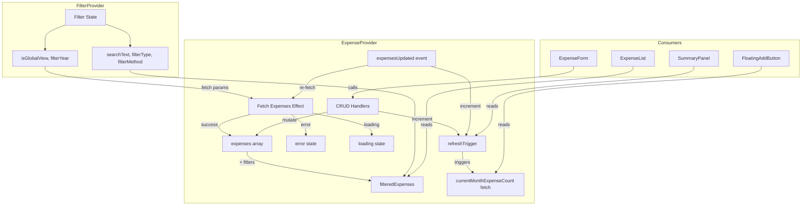

# Design Document

## Overview

This design document describes the architecture for extracting expense data state management from App.jsx into a dedicated ExpenseContext. This is Phase 2 of the frontend state management refactoring, building on the FilterContext pattern established in Phase 1.

The primary goals are:
1. Remove ~8 useState hooks and ~3 useEffect hooks from AppContent
2. Centralize expense fetching, CRUD operations, and client-side filtering
3. Eliminate the duplicated fetch logic (initial fetch + expensesUpdated event handler)
4. Improve testability of expense data management
5. Maintain 100% backward compatibility with existing behavior

Key design decision: ExpenseProvider must be nested inside FilterProvider because it consumes filter/view state (isGlobalView, filterYear, selectedYear, selectedMonth, searchText, filterType, filterMethod) to drive fetching and filtering logic.

## Architecture

The solution nests ExpenseProvider inside the existing FilterProvider. ExpenseProvider consumes FilterContext internally via `useFilterContext()` to access view mode and filter values.

```
┌──────────────────────────────────────────────────────────────┐
│                          App.jsx                              │
│  ┌──────────────────────────────────────────────────────┐    │
│  │                  FilterProvider                       │    │
│  │  ┌──────────────────────────────────────────────┐    │    │
│  │  │              ExpenseProvider                   │    │    │
│  │  │  ┌──────────────────────────────────────┐    │    │    │
│  │  │  │         Expense State                 │    │    │    │
│  │  │  │  - expenses[], loading, error         │    │    │    │
│  │  │  │  - filteredExpenses (derived)         │    │    │    │
│  │  │  │  - currentMonthExpenseCount           │    │    │    │
│  │  │  │  - refreshTrigger                     │    │    │    │
│  │  │  │  - CRUD handlers                      │    │    │    │
│  │  │  └──────────────────────────────────────┘    │    │    │
│  │  │                     │                         │    │    │
│  │  │                     ▼                         │    │    │
│  │  │  ┌──────────────────────────────────────┐    │    │    │
│  │  │  │        Child Components               │    │    │    │
│  │  │  │  - ExpenseList (expenses, handlers)   │    │    │    │
│  │  │  │  - ExpenseForm (onExpenseAdded)       │    │    │    │
│  │  │  │  - SummaryPanel (refreshTrigger)      │    │    │    │
│  │  │  │  - FloatingAddButton (count)          │    │    │    │
│  │  │  └──────────────────────────────────────┘    │    │    │
│  │  └──────────────────────────────────────────────┘    │    │
│  └──────────────────────────────────────────────────────┘    │
└──────────────────────────────────────────────────────────────┘
```

### Data Flow



## Components and Interfaces

### ExpenseContext

```javascript
// frontend/src/contexts/ExpenseContext.jsx

import { createContext, useContext, useState, useEffect, useMemo, useCallback } from 'react';
import { API_ENDPOINTS } from '../config';
import { useFilterContext } from './FilterContext';

const ExpenseContext = createContext(null);

/**
 * ExpenseProvider - Manages expense data, fetching, CRUD, and filtering
 * 
 * Must be nested inside FilterProvider (consumes FilterContext internally).
 */
export function ExpenseProvider({ children }) {
  const {
    searchText, filterType, filterMethod, filterYear,
    selectedYear, selectedMonth, isGlobalView,
  } = useFilterContext();

  // Core expense state
  const [expenses, setExpenses] = useState([]);
  const [loading, setLoading] = useState(false);
  const [error, setError] = useState(null);
  const [refreshTrigger, setRefreshTrigger] = useState(0);
  const [currentMonthExpenseCount, setCurrentMonthExpenseCount] = useState(0);

  // Budget alert refresh trigger (exposed for AppContent to use)
  const [budgetAlertRefreshTrigger, setBudgetAlertRefreshTrigger] = useState(0);

  // --- Expense Fetching ---
  useEffect(() => {
    const fetchExpenses = async () => {
      setLoading(true);
      setError(null);
      try {
        let url;
        if (isGlobalView) {
          url = filterYear
            ? `${API_ENDPOINTS.EXPENSES}?year=${filterYear}`
            : API_ENDPOINTS.EXPENSES;
        } else {
          url = `${API_ENDPOINTS.EXPENSES}?year=${selectedYear}&month=${selectedMonth}`;
        }
        const response = await fetch(url);
        if (!response.ok) {
          const errorText = await response.text();
          let errorMessage = 'Unable to load expenses. Please try again.';
          try {
            const errorData = JSON.parse(errorText);
            errorMessage = errorData.error || errorMessage;
          } catch { /* use default */ }
          throw new Error(errorMessage);
        }
        const data = await response.json();
        setExpenses(data);
      } catch (err) {
        let userMessage = err.message;
        if (err.message.includes('fetch') || err.message.includes('NetworkError') || err.message.includes('Failed to fetch')) {
          userMessage = 'Unable to connect to the server. Please check your connection and try again.';
        }
        setError(userMessage);
        console.error('Error fetching expenses:', err);
        // Keep existing expenses if we have them
      } finally {
        setLoading(false);
      }
    };
    fetchExpenses();
  }, [selectedYear, selectedMonth, isGlobalView, filterYear]);

  // --- expensesUpdated Event Listener ---
  useEffect(() => {
    const handleExpensesUpdated = () => {
      setRefreshTrigger(prev => prev + 1);
      setBudgetAlertRefreshTrigger(prev => prev + 1);
      // Re-fetch expenses
      const refetch = async () => {
        try {
          let url;
          if (isGlobalView) {
            url = filterYear
              ? `${API_ENDPOINTS.EXPENSES}?year=${filterYear}`
              : API_ENDPOINTS.EXPENSES;
          } else {
            url = `${API_ENDPOINTS.EXPENSES}?year=${selectedYear}&month=${selectedMonth}`;
          }
          const response = await fetch(url);
          if (response.ok) {
            const data = await response.json();
            setExpenses(data);
          }
        } catch (err) {
          console.error('Error refreshing expenses:', err);
        }
      };
      refetch();
    };
    window.addEventListener('expensesUpdated', handleExpensesUpdated);
    return () => window.removeEventListener('expensesUpdated', handleExpensesUpdated);
  }, [selectedYear, selectedMonth, isGlobalView, filterYear]);

  // --- Current Month Expense Count ---
  useEffect(() => {
    let isMounted = true;
    const fetchCount = async () => {
      try {
        const now = new Date();
        const url = `${API_ENDPOINTS.EXPENSES}?year=${now.getFullYear()}&month=${now.getMonth() + 1}`;
        const response = await fetch(url);
        if (response.ok && isMounted) {
          const data = await response.json();
          setCurrentMonthExpenseCount(data.length);
        }
      } catch (err) {
        if (isMounted) console.error('Error fetching current month expense count:', err);
      }
    };
    fetchCount();
    return () => { isMounted = false; };
  }, [refreshTrigger]);

  // --- CRUD Handlers ---
  const handleExpenseAdded = useCallback((newExpense) => {
    const dateParts = newExpense.date.split('-');
    const expenseYear = parseInt(dateParts[0], 10);
    const expenseMonth = parseInt(dateParts[1], 10);
    if (isGlobalView || (expenseYear === selectedYear && expenseMonth === selectedMonth)) {
      setExpenses(prev => {
        const newList = [...prev, newExpense];
        newList.sort((a, b) => new Date(a.date) - new Date(b.date));
        return newList;
      });
    }
    setRefreshTrigger(prev => prev + 1);
    setBudgetAlertRefreshTrigger(prev => prev + 1);
  }, [isGlobalView, selectedYear, selectedMonth]);

  const handleExpenseDeleted = useCallback((deletedId) => {
    setExpenses(prev => prev.filter(e => e.id !== deletedId));
    setRefreshTrigger(prev => prev + 1);
    setBudgetAlertRefreshTrigger(prev => prev + 1);
  }, []);

  const handleExpenseUpdated = useCallback((updatedExpense) => {
    setExpenses(prev => prev.map(e => e.id === updatedExpense.id ? updatedExpense : e));
    setRefreshTrigger(prev => prev + 1);
    setBudgetAlertRefreshTrigger(prev => prev + 1);
  }, []);

  const triggerRefresh = useCallback(() => {
    setRefreshTrigger(prev => prev + 1);
  }, []);

  const clearError = useCallback(() => {
    setError(null);
  }, []);

  // --- Client-Side Filtering ---
  const filteredExpenses = useMemo(() => {
    return expenses.filter(expense => {
      if (searchText) {
        const searchLower = searchText.toLowerCase();
        const placeMatch = expense.place && expense.place.toLowerCase().includes(searchLower);
        const notesMatch = expense.notes && expense.notes.toLowerCase().includes(searchLower);
        if (!placeMatch && !notesMatch) return false;
      }
      if (filterType && expense.type !== filterType) return false;
      if (filterMethod && expense.method !== filterMethod) return false;
      return true;
    });
  }, [expenses, searchText, filterType, filterMethod]);

  // --- Context Value ---
  const value = useMemo(() => ({
    expenses,
    filteredExpenses,
    loading,
    error,
    refreshTrigger,
    budgetAlertRefreshTrigger,
    currentMonthExpenseCount,
    handleExpenseAdded,
    handleExpenseDeleted,
    handleExpenseUpdated,
    triggerRefresh,
    clearError,
  }), [
    expenses, filteredExpenses, loading, error,
    refreshTrigger, budgetAlertRefreshTrigger, currentMonthExpenseCount,
    handleExpenseAdded, handleExpenseDeleted, handleExpenseUpdated,
    triggerRefresh, clearError,
  ]);

  return (
    <ExpenseContext.Provider value={value}>
      {children}
    </ExpenseContext.Provider>
  );
}

/**
 * useExpenseContext - Custom hook for consuming expense context
 */
export function useExpenseContext() {
  const context = useContext(ExpenseContext);
  if (context === null) {
    throw new Error('useExpenseContext must be used within an ExpenseProvider');
  }
  return context;
}

export default ExpenseContext;
```

### Context Value Interface

```typescript
// Type definition for documentation purposes
interface ExpenseContextValue {
  // Core state
  expenses: Expense[];
  filteredExpenses: Expense[];
  loading: boolean;
  error: string | null;
  refreshTrigger: number;
  budgetAlertRefreshTrigger: number;
  currentMonthExpenseCount: number;

  // CRUD handlers
  handleExpenseAdded: (newExpense: Expense) => void;
  handleExpenseDeleted: (deletedId: number) => void;
  handleExpenseUpdated: (updatedExpense: Expense) => void;

  // Utilities
  triggerRefresh: () => void;
  clearError: () => void;
}
```

### App.jsx Integration

After refactoring, App.jsx nests ExpenseProvider inside FilterProvider:

```javascript
function App() {
  const [paymentMethods, setPaymentMethods] = useState([]);
  // ... payment methods fetch ...

  return (
    <FilterProvider paymentMethods={paymentMethods}>
      <ExpenseProvider>
        <AppContent
          paymentMethods={paymentMethods}
          showPaymentMethods={showPaymentMethods}
          setShowPaymentMethods={setShowPaymentMethods}
          onPaymentMethodsUpdate={...}
        />
      </ExpenseProvider>
    </FilterProvider>
  );
}

function AppContent({ paymentMethods, ... }) {
  const { searchText, filterType, ... } = useFilterContext();
  const {
    expenses, filteredExpenses, loading, error,
    refreshTrigger, budgetAlertRefreshTrigger, currentMonthExpenseCount,
    handleExpenseAdded, handleExpenseDeleted, handleExpenseUpdated,
    triggerRefresh, clearError,
  } = useExpenseContext();

  // Expense-related useState hooks REMOVED
  // Expense fetch useEffect REMOVED
  // filteredExpenses useMemo REMOVED
  // expensesUpdated event listener REMOVED
  // currentMonthExpenseCount fetch REMOVED

  // Remaining: UI modal state, people state, version info, budget alerts, etc.
}
```

### Design Decisions

1. **budgetAlertRefreshTrigger in ExpenseContext**: CRUD handlers currently increment both refreshTrigger and budgetAlertRefreshTrigger. Rather than splitting this into a separate context, we keep it in ExpenseContext since it's always incremented alongside refreshTrigger during expense mutations. AppContent reads it from the context to pass to its budget alert fetch effect.

2. **No expenseApi.js usage for fetching**: The current App.jsx fetches expenses via raw `fetch()` calls with `API_ENDPOINTS.EXPENSES`, not via the `expenseApi.js` service. The design preserves this pattern to maintain exact behavioral parity. A future refactoring could migrate to `expenseApi.getExpenses()`.

3. **showExpenseForm stays in AppContent**: The `setShowExpenseForm(false)` call that currently lives in `handleExpenseAdded` is a UI concern. In the context, `handleExpenseAdded` only manages data. AppContent wraps it to also close the form.

## Data Models

### Expense State Model

| Field | Type | Default | Description |
|-------|------|---------|-------------|
| expenses | Expense[] | [] | Raw expenses array from API |
| loading | boolean | false | Whether expenses are being fetched |
| error | string \| null | null | User-friendly error message |
| refreshTrigger | number | 0 | Counter to trigger dependent re-fetches |
| budgetAlertRefreshTrigger | number | 0 | Counter to trigger budget alert re-fetches |
| currentMonthExpenseCount | number | 0 | Expense count for current calendar month |

### Derived State Model

| Field | Type | Computation | Description |
|-------|------|-------------|-------------|
| filteredExpenses | Expense[] | expenses filtered by searchText + filterType + filterMethod | Client-side filtered subset |

### Expense Object Shape (from API)

| Field | Type | Description |
|-------|------|-------------|
| id | number | Unique expense ID |
| date | string | Date in YYYY-MM-DD format |
| place | string | Merchant/place name |
| notes | string \| null | Optional notes |
| amount | number | Expense amount |
| type | string | Category (from CATEGORIES) |
| method | string | Payment method display name |
| week | number | Week of month (1-5) |


## Correctness Properties

*A property is a characteristic or behavior that should hold true across all valid executions of a system—essentially, a formal statement about what the system should do. Properties serve as the bridge between human-readable specifications and machine-verifiable correctness guarantees.*

Based on the prework analysis, the following properties have been consolidated to eliminate redundancy. Interface completeness (1.1-1.8), initial state (2.1-2.3), hook error (8.2), and event-driven refresh (6.1-6.2) are covered by unit/example tests rather than properties.

### Property 1: Fetch URL construction matches view mode

*For any* combination of view mode (monthly vs global), selectedYear, selectedMonth, and filterYear, the expense fetch URL SHALL be:
- `?year={selectedYear}&month={selectedMonth}` when in monthly view
- no query params when in global view with no year filter
- `?year={filterYear}` when in global view with a year filter

**Validates: Requirements 3.1, 3.2, 3.3, 3.4**

### Property 2: Loading state transitions during fetch

*For any* expense fetch cycle (triggered by view mode or filter changes), loading SHALL be true while the fetch is in progress and false after it completes (whether success or failure).

**Validates: Requirements 3.5, 3.6, 3.7, 3.8**

### Property 3: handleExpenseAdded inserts in date-sorted order

*For any* expenses array and any new expense whose date falls within the current view (matching year/month in monthly view, or any date in global view), calling handleExpenseAdded SHALL result in the expenses array containing the new expense and being sorted by date ascending.

**Validates: Requirements 4.1**

### Property 4: handleExpenseAdded skips out-of-view expenses

*For any* new expense whose year/month does not match the selected year/month while in monthly view, calling handleExpenseAdded SHALL not change the expenses array length.

**Validates: Requirements 4.2**

### Property 5: handleExpenseDeleted removes exactly the target expense

*For any* expenses array with unique IDs and any valid expense ID in that array, calling handleExpenseDeleted SHALL result in an array with length reduced by 1, containing all original expenses except the one with the deleted ID.

**Validates: Requirements 4.4**

### Property 6: handleExpenseUpdated replaces the matching expense

*For any* expenses array and any updated expense object whose ID matches an expense in the array, calling handleExpenseUpdated SHALL result in the array containing the updated expense at the same position, with all other expenses unchanged.

**Validates: Requirements 4.6**

### Property 7: CRUD operations increment refreshTrigger

*For any* CRUD operation (add, delete, update), the refreshTrigger SHALL increase by exactly 1 after the operation completes.

**Validates: Requirements 4.3, 4.5, 4.7**

### Property 8: Client-side filtering with AND logic

*For any* expenses array and any combination of filter values (searchText, filterType, filterMethod), filteredExpenses SHALL contain exactly the expenses where:
- If searchText is non-empty: expense.place or expense.notes contains searchText (case-insensitive)
- If filterType is non-empty: expense.type equals filterType
- If filterMethod is non-empty: expense.method equals filterMethod
- All active conditions are combined with AND logic
- If no filters are active: filteredExpenses equals the full expenses array

**Validates: Requirements 5.1, 5.2, 5.3, 5.4, 5.5, 5.6**

## Error Handling

### Context Usage Outside Provider

When `useExpenseContext` is called outside of an `ExpenseProvider`, the hook throws a descriptive error:

```javascript
throw new Error('useExpenseContext must be used within an ExpenseProvider');
```

### ExpenseProvider Outside FilterProvider

Since ExpenseProvider calls `useFilterContext()` internally, using it outside of FilterProvider will throw the FilterContext error. This is by design — the nesting order is enforced.

### Fetch Errors

The expense fetch effect handles two categories of errors:

1. **Network errors** (fetch failures, connection issues): Sets a generic user-friendly message: "Unable to connect to the server. Please check your connection and try again."
2. **Server errors** (non-ok HTTP responses): Attempts to parse JSON error body. Falls back to "Unable to load expenses. Please try again." if parsing fails.

In both cases, existing expenses are preserved (not cleared) if the array already has data.

### CRUD Handler Errors

CRUD handlers (add, delete, update) operate on the local state only — they don't make API calls. The API calls happen in the components (ExpenseForm, ExpenseList). If a component's API call fails, it handles the error locally and doesn't call the context handler.

## Testing Strategy

### Unit Tests

Unit tests verify specific examples and edge cases:

1. **Context hook error**: Verify `useExpenseContext` throws when used outside provider
2. **Initial state**: Verify default values (empty array, loading false, error null)
3. **Provider nesting**: Verify ExpenseProvider requires FilterProvider
4. **Fetch URL examples**: Verify specific URL construction for monthly view, global view, global with year
5. **Error handling**: Verify network error message, server error parsing
6. **Event handling**: Verify expensesUpdated event triggers refresh

### Property-Based Tests

Property-based tests verify universal properties using fast-check:

1. **Property 1**: Fetch URL construction — generate random year/month/filterYear/isGlobalView combinations, verify URL
2. **Property 2**: Loading state transitions — verify loading is true during fetch, false after
3. **Property 3**: handleExpenseAdded sorted insertion — generate random expense arrays and new expenses, verify sorted order
4. **Property 4**: handleExpenseAdded view filtering — generate expenses with mismatched dates, verify no insertion
5. **Property 5**: handleExpenseDeleted removal — generate arrays with unique IDs, delete random ID, verify removal
6. **Property 6**: handleExpenseUpdated replacement — generate arrays, update random expense, verify replacement
7. **Property 7**: CRUD refreshTrigger increment — verify counter increases by 1 for each operation
8. **Property 8**: Client-side filtering — generate random expenses and filter combinations, verify AND logic

Each property test runs minimum 100 iterations with randomly generated data.

### Integration Tests

Integration tests verify the context works correctly within App.jsx:

1. Expense data flows correctly to ExpenseList via props
2. CRUD handlers from ExpenseForm/ExpenseList update context state
3. View mode changes trigger re-fetch with correct URL
4. Filtered expenses update when filter state changes

### Test File Structure

```
frontend/src/contexts/
├── ExpenseContext.jsx              # Context implementation
├── ExpenseContext.test.jsx         # Unit tests
└── ExpenseContext.pbt.test.jsx     # Property-based tests
```

### Test Configuration

- Use `@testing-library/react` for rendering and interaction
- Use `fast-check` for property-based testing
- Mock `fetch` globally for all tests (no real API calls)
- Wrap test components in both FilterProvider and ExpenseProvider
- Minimum 100 iterations per property test
- Tag format: `Feature: expense-context, Property N: description`
