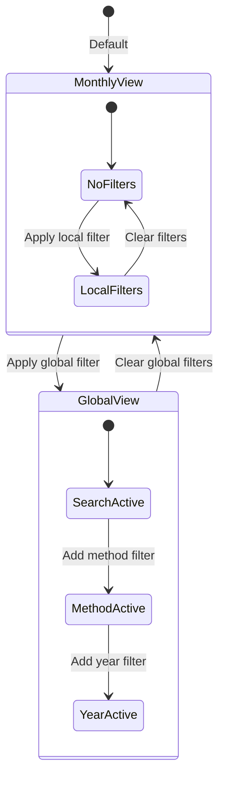

# Design Document: Expense List UX Improvements

## Overview

This design document outlines the frontend-only changes to improve the ExpenseList component's filter UX. The improvements focus on consolidating redundant filters, organizing specialized filters, providing better filter state visibility, and enhancing global/monthly view navigation.

The implementation follows React 18 patterns with functional components and hooks, maintaining consistency with the existing codebase architecture.

## Architecture

### Component Structure

The changes are contained within the ExpenseList component and its CSS, with minor updates to App.jsx for the global view indicator enhancement.

```
frontend/src/components/
├── ExpenseList.jsx          # Main component with filter consolidation
├── ExpenseList.css          # Updated styles for new filter UI
├── FilterChip.jsx           # New component for removable filter chips
├── FilterChip.css           # Styles for filter chips
├── AdvancedFilters.jsx      # New component for collapsible advanced filters
└── AdvancedFilters.css      # Styles for advanced filters section
```

### State Management

All filter state remains local to the ExpenseList component (for local filters) or App.jsx (for global filters). No new global state management is required.



## Components and Interfaces

### SmartMethodFilter Component (Inline in ExpenseList)

The smart method filter consolidates the previous "Method" and "Method Type" dropdowns into a single grouped dropdown.

```jsx
// Filter option structure for grouped dropdown
interface FilterOption {
  value: string;           // The filter value to apply
  label: string;           // Display text
  type: 'header' | 'item'; // Whether this is a group header or selectable item
  indent?: boolean;        // Whether to indent (for items under headers)
}

// Example grouped options:
// [
//   { value: 'type:cash', label: 'Cash', type: 'header' },
//   { value: 'method:Cash', label: 'Cash', type: 'item', indent: true },
//   { value: 'type:credit_card', label: 'Credit Card', type: 'header' },
//   { value: 'method:Visa', label: 'Visa', type: 'item', indent: true },
//   { value: 'method:Mastercard', label: 'Mastercard', type: 'item', indent: true },
// ]
```

### FilterChip Component

A reusable component for displaying active filters as removable chips.

```jsx
interface FilterChipProps {
  label: string;      // Filter type label (e.g., "Type", "Method")
  value: string;      // Filter value (e.g., "Groceries", "Visa")
  onRemove: () => void; // Callback when chip is removed
}

// Usage:
<FilterChip 
  label="Type" 
  value="Groceries" 
  onRemove={() => setLocalFilterType('')} 
/>
```

### AdvancedFilters Component

A collapsible section containing specialized filters.

```jsx
interface AdvancedFiltersProps {
  isExpanded: boolean;
  onToggle: () => void;
  activeCount: number;        // Number of active advanced filters
  children: React.ReactNode;  // The filter dropdowns
}

// Usage:
<AdvancedFilters 
  isExpanded={showAdvancedFilters}
  onToggle={() => setShowAdvancedFilters(!showAdvancedFilters)}
  activeCount={advancedFilterCount}
>
  <select value={localFilterInvoice} ... />
  <select value={localFilterInsurance} ... />
</AdvancedFilters>
```

### GlobalViewBanner Component (Inline in App.jsx)

Enhanced banner for global view indication.

```jsx
interface GlobalViewBannerProps {
  isGlobalView: boolean;
  triggerFilters: string[];   // Which filters triggered global view
  onReturnToMonthly: () => void;
}
```

## Data Models

### Filter State Model

```typescript
// Local filter state (ExpenseList component)
interface LocalFilterState {
  type: string;              // Category filter
  method: string;            // Smart method filter value (can be method or type)
  methodFilterMode: 'method' | 'type'; // Whether filtering by specific method or type
  invoice: string;           // Invoice filter ('', 'with-invoice', 'without-invoice')
  insurance: string;         // Insurance status filter
  showAdvancedFilters: boolean; // Advanced filters section expanded state
}

// Global filter state (App.jsx)
interface GlobalFilterState {
  searchText: string;
  filterType: string;
  filterMethod: string;
  filterYear: string;
}
```

### Smart Method Filter Value Encoding

The smart method filter uses a prefix encoding to distinguish between method types and specific methods:

```typescript
// Value encoding:
// - 'type:cash' -> Filter by payment method type 'cash'
// - 'type:debit' -> Filter by payment method type 'debit'
// - 'type:cheque' -> Filter by payment method type 'cheque'
// - 'type:credit_card' -> Filter by payment method type 'credit_card'
// - 'method:Visa' -> Filter by specific method 'Visa'
// - '' -> No filter (show all)

function parseSmartMethodFilter(value: string): { mode: 'type' | 'method' | 'none', filterValue: string } {
  if (!value) return { mode: 'none', filterValue: '' };
  if (value.startsWith('type:')) return { mode: 'type', filterValue: value.slice(5) };
  if (value.startsWith('method:')) return { mode: 'method', filterValue: value.slice(7) };
  return { mode: 'none', filterValue: '' };
}
```

### Active Filter Representation

```typescript
interface ActiveFilter {
  id: string;        // Unique identifier for the filter
  type: string;      // Filter category ('type', 'method', 'invoice', 'insurance')
  label: string;     // Display label
  value: string;     // Current filter value
  onClear: () => void; // Function to clear this filter
}

// Example:
const activeFilters: ActiveFilter[] = [
  { id: 'type', type: 'type', label: 'Type', value: 'Groceries', onClear: () => setLocalFilterType('') },
  { id: 'method', type: 'method', label: 'Method', value: 'Credit Card', onClear: () => setSmartMethodFilter('') },
];
```


## Correctness Properties

*A property is a characteristic or behavior that should hold true across all valid executions of a system—essentially, a formal statement about what the system should do. Properties serve as the bridge between human-readable specifications and machine-verifiable correctness guarantees.*

### Property 1: Smart Method Filter Grouped Options Generation

*For any* list of payment methods with their types, the smart method filter SHALL generate grouped options where each method type appears as a header followed by its associated methods as indented items, and the total number of selectable items equals the number of payment methods plus the number of distinct method types.

**Validates: Requirements 1.1**

### Property 2: Smart Method Type Filtering

*For any* list of expenses and any selected method type (cash, debit, cheque, credit_card), the filtered result SHALL contain only expenses where the payment method's type matches the selected type, and SHALL contain all such expenses from the original list.

**Validates: Requirements 1.2**

### Property 3: Smart Method Specific Filtering

*For any* list of expenses and any selected specific payment method, the filtered result SHALL contain only expenses where the payment method exactly matches the selected method, and SHALL contain all such expenses from the original list.

**Validates: Requirements 1.3**

### Property 4: Advanced Filter Badge Count Accuracy

*For any* combination of advanced filter states (invoice filter and insurance filter), the badge count displayed on the collapsed Advanced Filters section SHALL equal the count of non-empty advanced filter values.

**Validates: Requirements 2.2, 2.4**

### Property 5: Total Filter Count Badge Accuracy

*For any* combination of local filter states (type, method, invoice, insurance), the filter count badge SHALL display a number equal to the count of non-empty filter values, and SHALL be visible if and only if at least one filter is active.

**Validates: Requirements 3.1, 3.2, 3.3**

### Property 6: Filter Chips Generation

*For any* combination of active filters, the number of filter chips rendered SHALL equal the number of non-empty filter values, and each active filter SHALL have exactly one corresponding chip.

**Validates: Requirements 4.1**

### Property 7: Filter Chip Removal Independence

*For any* set of active filters and any single chip removal action, only the filter corresponding to the removed chip SHALL be cleared, and all other filters SHALL remain unchanged.

**Validates: Requirements 4.2**

### Property 8: Filter Chip Label Formatting

*For any* active filter, the corresponding chip label SHALL contain both the filter type name and the filter value in the format "{Type}: {Value}".

**Validates: Requirements 4.3**

### Property 9: Return to Monthly View Action

*For any* global view state with active global filters (searchText, filterMethod, filterYear), clicking "Return to Monthly View" SHALL clear all three global filter values, resulting in isGlobalView becoming false.

**Validates: Requirements 5.3**

### Property 10: Global View Trigger Identification

*For any* global view state, the displayed trigger list SHALL contain exactly the names of the non-empty global filters (searchText → "Search", filterMethod → "Payment Method", filterYear → "Year").

**Validates: Requirements 5.4**

## Error Handling

### Invalid Filter Values

- If a filter value is set to an invalid option (e.g., a deleted payment method), the filter should gracefully fall back to showing all items
- The smart method filter should handle cases where payment methods have no type assigned by grouping them under "Other"

### Empty States

- When all expenses are filtered out, display a helpful message indicating the active filters and suggesting to clear them
- When payment methods fail to load, the smart method filter should show a loading state or fallback to a simple text input

### Edge Cases

- Handle payment methods with special characters in their names
- Handle very long filter values by truncating with ellipsis in chips
- Handle rapid filter changes without race conditions using proper React state management

## Testing Strategy

### Unit Tests

Unit tests should cover specific examples and edge cases:

1. **FilterChip Component**
   - Renders with correct label and value
   - Calls onRemove when remove button clicked
   - Handles long values with truncation

2. **AdvancedFilters Component**
   - Renders collapsed by default
   - Expands when toggle clicked
   - Shows correct badge count

3. **Smart Method Filter**
   - Generates correct grouped options structure
   - Handles empty payment methods list
   - Handles methods with missing type

4. **Global View Banner**
   - Shows correct trigger filters
   - Return button clears correct filters

### Property-Based Tests

Property-based tests should verify universal properties across all inputs. Use `fast-check` library for React/JavaScript property testing.

**Configuration:**
- Minimum 100 iterations per property test
- Each test tagged with: **Feature: expense-list-ux-improvements, Property {number}: {property_text}**

**Property Tests to Implement:**

1. **Smart Method Type Filtering Property** (Property 2)
   - Generate random expenses with various payment methods
   - Generate random method type selection
   - Verify filtered results contain only matching type expenses

2. **Smart Method Specific Filtering Property** (Property 3)
   - Generate random expenses with various payment methods
   - Generate random specific method selection
   - Verify filtered results contain only exact method matches

3. **Filter Count Badge Accuracy Property** (Property 5)
   - Generate random combinations of filter states
   - Verify badge count equals count of non-empty filters

4. **Filter Chip Removal Independence Property** (Property 7)
   - Generate random active filter combinations
   - Remove one filter
   - Verify only that filter was cleared

5. **Return to Monthly View Property** (Property 9)
   - Generate random global filter states
   - Execute return action
   - Verify all global filters cleared

6. **Global View Trigger Identification Property** (Property 10)
   - Generate random global filter combinations
   - Verify trigger list matches non-empty filters

### Integration Tests

Integration tests should verify component interactions:

1. Filter state flows correctly between components
2. Clearing filters updates all dependent UI elements
3. Global view transitions work correctly with filter changes

