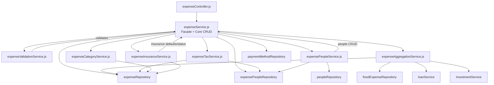

# Design Document: Expense Service Refactor

## Overview

This refactoring decomposes the 2,391-line `expenseService.js` god object into 6 focused sub-services plus a slim orchestrator/facade. The facade (`expenseService.js`) retains core CRUD logic and delegates domain-specific operations to sub-services. All existing consumers (controllers, tests, other services) continue importing `expenseService` unchanged — the facade re-exports every public method.

The approach is a strangler fig pattern applied at the module level: extract one concern at a time, wire it through the facade, verify tests pass, repeat.

## Architecture



### Key Design Decisions

1. **Facade pattern over re-exports**: `expenseService.js` remains a class instance that delegates to sub-services rather than a barrel file. This preserves the `new ExpenseService()` singleton pattern and allows the facade to orchestrate cross-cutting concerns (e.g., calling validation before CRUD).

2. **CRUD stays in the facade**: `createExpense`, `updateExpense`, `deleteExpense`, `getExpenses`, `getExpenseById` and their private helpers (`_createSingleExpense`, `_resolvePaymentMethod`, `_processReimbursement`, `_updateCreditCardBalanceOnCreate/Delete`, `_calculateFutureDate`, `_validateFutureMonths`, `_isFutureDate`, `_getEffectivePostingDate`, `_triggerBudgetRecalculation`, `_validatePeopleExist`) remain in the facade. These methods are tightly coupled to each other and to the expense creation/update lifecycle.

3. **Sub-services are plain classes**: Each sub-service is a CommonJS module exporting a singleton instance, matching the existing project pattern.

4. **No circular dependencies**: Sub-services depend on repositories and utilities, not on each other or on the facade. The facade depends on sub-services. The People_Service receives the facade's CRUD methods via constructor injection to avoid circular imports.

## Components and Interfaces

### expenseValidationService.js

Extracted methods:
- `validateExpense(expense)` — core field validation
- `isValidDate(dateString)` — date format check
- `validatePostedDate(expense)` — posted date business rules
- `validateInsuranceData(insuranceData, expenseAmount)` — insurance field validation
- `validateReimbursement(reimbursement, originalAmount)` — reimbursement amount validation
- `validateInsurancePersonAllocations(personAllocations)` — insurance person allocation rules
- `validatePersonAllocations(totalAmount, allocations)` — allocation sum validation

Dependencies: `../utils/categories` (CATEGORIES constant)

### expenseInsuranceService.js

Extracted methods:
- `updateInsuranceStatus(id, status)` — update claim status with validation
- `updateInsuranceEligibility(id, eligible, originalCost)` — toggle insurance eligibility
- `applyInsuranceDefaults(expenseData)` — set default claim_status and original_cost

Dependencies: `expenseRepository`, `expenseValidationService`

### expensePeopleService.js

Extracted methods:
- `createExpenseWithPeople(expenseData, personAllocations, futureMonths)` — create expense + people links
- `updateExpenseWithPeople(id, expenseData, personAllocations, futureMonths)` — update expense + people links
- `getExpenseWithPeople(id)` — fetch expense with people data
- `groupExpensesByPerson(expenses)` — group expense list by person
- `calculatePersonTotals(expenses)` — compute per-person totals
- `handleUnassignedExpenses(expenses)` — identify unassigned medical expenses

Dependencies: `expenseRepository`, `expensePeopleRepository`, `peopleRepository`, `expenseValidationService`

Note: `createExpenseWithPeople` and `updateExpenseWithPeople` need access to the facade's `createExpense`, `updateExpense`, `deleteExpense`, and `getExpenseById` methods. These are injected via an `init(facadeMethods)` call during facade construction to avoid circular requires.

### expenseTaxService.js

Extracted methods:
- `getTaxDeductibleSummary(year)` — full tax deductible report
- `getTaxDeductibleYoYSummary(year)` — year-over-year comparison
- `getTaxDeductibleWithPeople(year)` — person-grouped tax report
- `calculateInsuranceSummary(medicalExpenses)` — insurance totals helper

Dependencies: `expenseRepository`, `expensePeopleRepository`, `peopleRepository`, `../utils/categories`

### expenseAggregationService.js

Extracted methods:
- `getSummary(year, month, includePrevious)` — monthly summary
- `getAnnualSummary(year)` — annual summary with net worth
- `getMonthlyGross(year, month)` — get income
- `setMonthlyGross(year, month, grossAmount)` — set income
- `getExpensesByCategory(year, month, category)` — category drill-down
- `getExpensesByPaymentMethod(year, month, method)` — method drill-down
- All private helpers: `_getMonthSummary`, `_calculatePreviousMonth`, `_getYearEndInvestmentValues`, `_getYearEndLoanBalances`, `_getMonthlyVariableExpenses`, `_getMonthlyFixedExpenses`, `_getMonthlyIncome`, `_getTransactionCount`, `_getCategoryTotals`, `_getMethodTotals`, `_buildAnnualSummary`, `_createMonthMap`, `_buildMonthlyTotals`, `_arrayToObject`

Dependencies: `expenseRepository`, `fixedExpenseRepository`, `loanService`, `investmentService`, `../database/db`, `../utils/validators`, `../utils/categories`

### expenseCategoryService.js

Extracted methods:
- `getDistinctPlaces()` — list unique place names
- `getSuggestedCategory(place)` — suggest category from history

Dependencies: `expenseRepository`

### expenseService.js (Refactored Facade)

Retains:
- Core CRUD: `createExpense`, `getExpenses`, `getExpenseById`, `updateExpense`, `deleteExpense`
- Private CRUD helpers: `_createSingleExpense`, `_resolvePaymentMethod`, `_processReimbursement`, `_updateCreditCardBalanceOnCreate`, `_updateCreditCardBalanceOnDelete`, `_calculateFutureDate`, `_validateFutureMonths`, `_isFutureDate`, `_getEffectivePostingDate`, `_triggerBudgetRecalculation`, `_validatePeopleExist`

Delegates (via thin wrapper methods):
- Validation methods → `expenseValidationService`
- Insurance methods → `expenseInsuranceService`
- People methods → `expensePeopleService`
- Tax methods → `expenseTaxService`
- Aggregation methods → `expenseAggregationService`
- Category methods → `expenseCategoryService`

```javascript
// Facade delegation pattern example
class ExpenseService {
  constructor() {
    this.validationService = require('./expenseValidationService');
    this.insuranceService = require('./expenseInsuranceService');
    this.peopleService = require('./expensePeopleService');
    this.taxService = require('./expenseTaxService');
    this.aggregationService = require('./expenseAggregationService');
    this.categoryService = require('./expenseCategoryService');
    
    // Initialize people service with facade methods
    this.peopleService.init({
      createExpense: this.createExpense.bind(this),
      updateExpense: this.updateExpense.bind(this),
      deleteExpense: this.deleteExpense.bind(this),
      getExpenseById: this.getExpenseById.bind(this),
    });
  }

  // Delegated methods
  validateExpense(expense) { return this.validationService.validateExpense(expense); }
  getSummary(year, month, prev) { return this.aggregationService.getSummary(year, month, prev); }
  // ... etc for all delegated methods
}

module.exports = new ExpenseService();
```

## Data Models

No data model changes. This is a pure code-organization refactoring. All database tables, schemas, and repository interfaces remain unchanged.

The only structural change is the file layout:

```
backend/services/
├── expenseService.js                  (refactored: facade + core CRUD)
├── expenseValidationService.js        (new)
├── expenseInsuranceService.js         (new)
├── expensePeopleService.js            (new)
├── expenseTaxService.js               (new)
├── expenseAggregationService.js       (new)
└── expenseCategoryService.js          (new)
```


## Correctness Properties

*A property is a characteristic or behavior that should hold true across all valid executions of a system — essentially, a formal statement about what the system should do. Properties serve as the bridge between human-readable specifications and machine-verifiable correctness guarantees.*

Since this is a pure refactoring, the core correctness guarantee is behavioral equivalence: every extracted sub-service must produce identical outputs to the original monolithic service for the same inputs. The properties below formalize this.

### Property 1: Validation equivalence

*For any* expense data object (valid or invalid), calling `expenseValidationService.validateExpense(data)` should either throw the same error with the same message, or succeed without error, identically to the original `ExpenseService.validateExpense(data)`.

**Validates: Requirements 2.3, 2.4**

### Property 2: Insurance defaults equivalence

*For any* expense data object, calling `expenseInsuranceService.applyInsuranceDefaults(data)` should return a result deeply equal to the original `ExpenseService._applyInsuranceDefaults(data)`.

**Validates: Requirements 3.3**

### Property 3: People grouping equivalence

*For any* array of expense objects with people allocation data, calling `expensePeopleService.groupExpensesByPerson(expenses)` should return a result deeply equal to the original `ExpenseService.groupExpensesByPerson(expenses)`.

**Validates: Requirements 4.3**

### Property 4: Person totals equivalence

*For any* array of expense objects with people allocation data, calling `expensePeopleService.calculatePersonTotals(expenses)` should return a result deeply equal to the original `ExpenseService.calculatePersonTotals(expenses)`.

**Validates: Requirements 4.3**

### Property 5: Insurance summary equivalence

*For any* array of medical expense objects, calling `expenseTaxService.calculateInsuranceSummary(expenses)` should return a result deeply equal to the original `ExpenseService._calculateInsuranceSummary(expenses)`.

**Validates: Requirements 5.2**

### Property 6: Facade API surface completeness

*For all* public method names on the original ExpenseService instance (captured before refactoring), the refactored facade instance should have a method with the same name and the same arity.

**Validates: Requirements 1.1, 1.3**

## Error Handling

Error handling behavior must be preserved exactly:

- **Validation errors**: All validation methods throw `Error` with specific messages. The extracted `expenseValidationService` must throw identical error messages for identical invalid inputs.
- **Not-found errors**: Insurance status/eligibility updates throw when the expense doesn't exist or isn't medical. The extracted `expenseInsuranceService` must preserve these checks.
- **People validation errors**: Person-not-found errors, allocation sum mismatches — preserved in `expensePeopleService`.
- **No new error types**: The refactoring must not introduce new error types or change existing error messages.

## Testing Strategy

### Dual Testing Approach

- **Unit tests**: Verify specific examples — method existence on sub-services, specific delegation paths, edge cases
- **Property tests**: Verify behavioral equivalence across generated inputs using fast-check

### Property-Based Testing Configuration

- Library: **fast-check** (already used throughout the project)
- Minimum 100 iterations per property test
- Each test tagged with: **Feature: expense-service-refactor, Property {N}: {title}**
- Each correctness property implemented as a single property-based test

### Test Organization

Since this is a refactoring, the primary testing strategy is:

1. **Before refactoring**: Capture the behavior of pure functions (validation, insurance defaults, people grouping, person totals, insurance summary) by snapshotting the original implementations
2. **After extraction**: Run property tests comparing extracted sub-service output against original behavior
3. **Existing test suite**: All ~30 existing `expenseService.*.pbt.test.js` and `expenseService.*.test.js` files must pass unchanged — they import `./expenseService` which is the facade

### What to Test

- **Property tests** (fast-check): Behavioral equivalence properties 1-6 above
- **Unit tests**: Method existence checks on each sub-service, facade delegation wiring, constructor injection of facade methods into people service
- **Existing tests**: Run full backend test suite to verify zero regressions
