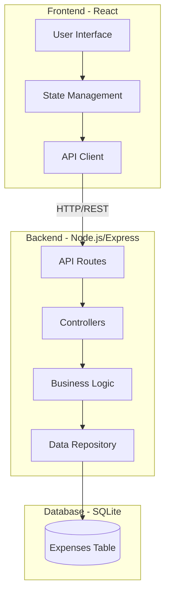

# Design Document

## Overview

The Expense Tracker Application is a full-stack web application consisting of a React-based frontend and a Node.js/Express backend with a relational database. The system enables users to record expenses with detailed attributes, view transactions by month, search through records, and analyze spending through various aggregated views including weekly totals and payment method breakdowns.

## Architecture

### System Architecture



### Technology Stack

**Frontend:**
- React 18+ for UI components
- React Hooks for state management
- Fetch API for HTTP requests
- CSS for styling

**Backend:**
- Node.js with Express framework
- SQLite3 for database
- CORS middleware for cross-origin requests
- Body-parser for JSON parsing

**Database:**
- SQLite (file-based, simple setup)

## Components and Interfaces

### Frontend Components

#### 1. App Component
- Root component managing overall application state
- Coordinates between child components
- Manages selected month/year state

#### 2. ExpenseForm Component
- Input fields: date, place, notes, amount, type dropdown, method dropdown
- Validates required fields before submission
- Calculates week automatically from date
- Submits new expense to backend API

#### 3. MonthSelector Component
- Dropdown for year selection
- Dropdown for month selection
- Triggers data refresh when selection changes

#### 4. ExpenseList Component
- Displays table of expenses for selected month
- Columns: Date, Place, Notes, Amount, Type, Week, Method
- Delete button for each row
- Sorted by date (most recent first)

#### 5. SearchBar Component
- Text input for search query
- Filters expense list in real-time
- Searches place and notes fields (case-insensitive)

#### 6. SummaryPanel Component
- Displays multiple summary sections:
  - Weekly totals (weeks 1-5)
  - Payment method totals (all 6 methods)
  - Type-specific totals (Gas and Food)
  - Overall total for the month

### Backend API Endpoints

#### POST /api/expenses
- Creates a new expense entry
- Request body: `{ date, place, notes, amount, type, method }`
- Calculates week from date
- Returns: Created expense with ID

#### GET /api/expenses
- Retrieves all expenses
- Query parameters: `year`, `month` (optional)
- Returns: Array of expense objects

#### DELETE /api/expenses/:id
- Deletes expense by ID
- Returns: Success status

#### GET /api/expenses/summary
- Retrieves aggregated data for a specific month
- Query parameters: `year`, `month` (required)
- Returns: Object containing weekly totals, payment method totals, type totals

### Data Repository Layer

#### ExpenseRepository
- `create(expense)`: Insert new expense into database
- `findAll(filters)`: Query expenses with optional year/month filters
- `findById(id)`: Retrieve single expense
- `delete(id)`: Remove expense from database
- `getSummary(year, month)`: Calculate aggregated totals

## Data Models

### Expense Entry

```typescript
interface Expense {
  id: number;              // Auto-generated primary key
  date: string;            // ISO 8601 format (YYYY-MM-DD)
  place: string;           // Max 200 characters
  notes: string;           // Max 200 characters
  amount: number;          // Decimal with 2 places
  type: 'Other' | 'Food' | 'Gas';
  week: number;            // 1-5, calculated from date
  method: 'Cash' | 'Debit' | 'CIBC MC' | 'PCF MC' | 'WS VISA' | 'VISA';
  created_at: string;      // Timestamp
}
```

### Database Schema

```sql
CREATE TABLE expenses (
  id INTEGER PRIMARY KEY AUTOINCREMENT,
  date TEXT NOT NULL,
  place TEXT,
  notes TEXT,
  amount REAL NOT NULL,
  type TEXT NOT NULL CHECK(type IN ('Other', 'Food', 'Gas')),
  week INTEGER NOT NULL CHECK(week >= 1 AND week <= 5),
  method TEXT NOT NULL CHECK(method IN ('Cash', 'Debit', 'CIBC MC', 'PCF MC', 'WS VISA', 'VISA')),
  created_at TEXT DEFAULT CURRENT_TIMESTAMP
);

CREATE INDEX idx_date ON expenses(date);
CREATE INDEX idx_type ON expenses(type);
CREATE INDEX idx_method ON expenses(method);
```

### Summary Response

```typescript
interface Summary {
  weeklyTotals: {
    week1: number;
    week2: number;
    week3: number;
    week4: number;
    week5: number;
  };
  methodTotals: {
    Cash: number;
    Debit: number;
    'CIBC MC': number;
    'PCF MC': number;
    'WS VISA': number;
    VISA: number;
  };
  typeTotals: {
    Gas: number;
    Food: number;
  };
  total: number;
}
```

## Error Handling

### Frontend Error Handling
- Display user-friendly error messages for failed API calls
- Validate form inputs before submission
- Show loading states during API requests
- Handle network errors gracefully

### Backend Error Handling
- Return appropriate HTTP status codes:
  - 200: Success
  - 201: Created
  - 400: Bad request (validation errors)
  - 404: Not found
  - 500: Server error
- Log errors to console for debugging
- Return JSON error responses with descriptive messages

### Validation Rules
- Date: Required, valid date format
- Amount: Required, positive number with max 2 decimal places
- Type: Required, must be one of the three valid options
- Method: Required, must be one of the six valid options
- Place: Optional, max 200 characters
- Notes: Optional, max 200 characters

## Testing Strategy

### Frontend Testing
- Component rendering tests for each React component
- Form validation tests
- User interaction tests (button clicks, form submissions)
- API integration tests with mocked responses

### Backend Testing
- API endpoint tests for all routes
- Database operation tests
- Week calculation logic tests
- Summary aggregation tests
- Error handling tests

### Integration Testing
- End-to-end tests for complete user workflows:
  - Add expense and verify it appears in list
  - Delete expense and verify removal
  - Filter by month and verify correct data
  - Search functionality
  - Summary calculations

## Implementation Notes

### Week Calculation Logic
```javascript
function calculateWeek(dateString) {
  const date = new Date(dateString);
  const day = date.getDate();
  return Math.ceil(day / 7);
}
```

### Frontend State Management
- Use React useState for local component state
- Use useEffect for data fetching on mount and filter changes
- Lift state up to App component for shared data (selected month/year)

### API Communication
- Base URL configuration for environment flexibility
- Consistent error handling across all API calls
- Loading states for better UX

### Database Initialization
- Create database file and table on first run
- Seed with sample data for development (optional)
- Migrations not needed for initial version (single table)

## Security Considerations

- Input validation on both frontend and backend
- SQL injection prevention using parameterized queries
- CORS configuration to restrict allowed origins
- No authentication required for initial version (single-user application)

## Performance Considerations

- Database indexes on date, type, and method columns for faster queries
- Limit query results if dataset grows large
- Consider pagination for expense list if needed
- Cache summary calculations on frontend to avoid redundant API calls
