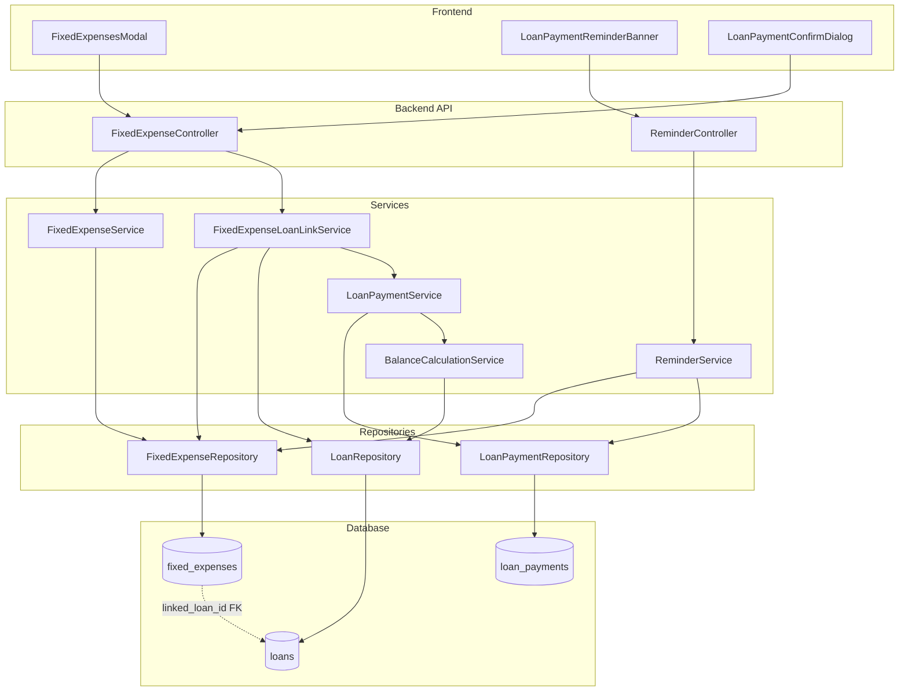

# Design Document: Fixed Expense Loan Linkage

## Overview

This design extends the fixed expenses system to support optional loan linkage and payment due dates. The feature enables users to associate fixed expenses with loans/mortgages, receive payment reminders, and streamline the loan payment recording workflow. The design integrates with the existing reminder service infrastructure and loan payment tracking system.

Key design decisions:
- **Optional fields**: payment_due_day and linked_loan_id are nullable to maintain backward compatibility
- **Soft linkage**: Deleting a loan sets linked_loan_id to null rather than cascading to delete the fixed expense
- **Payment type restriction**: Credit cards are excluded from fixed expenses to ensure appropriate payment tracking
- **User-confirmed automation**: Payment creation requires user confirmation rather than being fully automatic

## Architecture



### Component Responsibilities

1. **FixedExpenseController**: Extended to handle loan linkage and payment due day fields
2. **FixedExpenseService**: Extended validation for new fields and payment type restrictions
3. **FixedExpenseLoanLinkService**: New service for loan linkage operations and amount synchronization
4. **ReminderService**: Extended to include loan payment reminders based on linked fixed expenses
5. **FixedExpensesModal**: Extended UI for setting due day, linking loans, and viewing loan info
6. **LoanPaymentReminderBanner**: New component for displaying upcoming loan payment alerts
7. **LoanPaymentConfirmDialog**: New component for confirming automatic payment creation

## Components and Interfaces

### Backend API Endpoints

```
# Existing endpoints (extended)
GET    /api/fixed-expenses/:year/:month     - Returns fixed expenses with loan linkage info
POST   /api/fixed-expenses                  - Create with optional payment_due_day, linked_loan_id
PUT    /api/fixed-expenses/:id              - Update with optional payment_due_day, linked_loan_id
POST   /api/fixed-expenses/carry-forward    - Carry forward preserving linkage

# New endpoints
GET    /api/fixed-expenses/linkable-loans   - Get loans available for linking (loan/mortgage only)
GET    /api/fixed-expenses/:id/loan-info    - Get linked loan details (balance, payments, rate)
POST   /api/fixed-expenses/:id/create-payment - Create loan payment from linked fixed expense
GET    /api/reminders/loan-payments         - Get upcoming loan payment reminders
```

### FixedExpenseLoanLinkService Interface

```javascript
class FixedExpenseLoanLinkService {
  /**
   * Get loans available for linking (excludes lines of credit)
   * @returns {Promise<Array>} Array of linkable loans with current balance
   */
  async getLinkableLoans();
  
  /**
   * Get detailed info for a linked loan
   * @param {number} fixedExpenseId - Fixed expense ID
   * @returns {Promise<Object|null>} Loan info or null if not linked
   */
  async getLinkedLoanInfo(fixedExpenseId);
  
  /**
   * Validate loan linkage
   * @param {number} loanId - Loan ID to link
   * @param {number} year - Fixed expense year
   * @param {number} month - Fixed expense month
   * @param {number} excludeFixedExpenseId - ID to exclude (for updates)
   * @throws {Error} If loan is already linked in this month
   */
  async validateLoanLinkage(loanId, year, month, excludeFixedExpenseId);
  
  /**
   * Get suggested payment amount for a loan
   * @param {number} loanId - Loan ID
   * @returns {Promise<Object>} { amount, source }
   */
  async getSuggestedPaymentAmount(loanId);
  
  /**
   * Create loan payment from fixed expense
   * @param {number} fixedExpenseId - Fixed expense ID
   * @param {Object} options - { amount, paymentDate }
   * @returns {Promise<Object>} Created payment entry
   */
  async createPaymentFromFixedExpense(fixedExpenseId, options);
}
```

### Extended ReminderService Interface

```javascript
// Added to existing ReminderService
class ReminderService {
  /**
   * Get loan payment reminders based on linked fixed expenses
   * @param {Date} referenceDate - Reference date (defaults to today)
   * @returns {Promise<Object>} Loan payment reminder status
   */
  async getLoanPaymentReminders(referenceDate = new Date());
  
  /**
   * Check if loan payment exists for current month
   * @param {number} loanId - Loan ID
   * @param {number} year - Year
   * @param {number} month - Month
   * @returns {Promise<boolean>} True if payment exists
   */
  async hasLoanPaymentForMonth(loanId, year, month);
}
```

### Extended FixedExpenseService Interface

```javascript
// Extended validation in existing FixedExpenseService
class FixedExpenseService {
  /**
   * Validate fixed expense data (extended)
   * @param {Object} fixedExpense - Fixed expense data
   * @param {Array} validPaymentTypes - Valid payment types (excludes credit cards)
   * @throws {Error} If validation fails
   */
  validateFixedExpense(fixedExpense, validPaymentTypes);
  
  /**
   * Get valid payment types for fixed expenses (excludes credit cards)
   * @returns {Promise<Array<string>>} Array of valid payment type display names
   */
  async getValidPaymentTypes();
}
```

## Data Models

### Schema Changes: fixed_expenses Table

```sql
-- Add new columns to fixed_expenses table
ALTER TABLE fixed_expenses ADD COLUMN payment_due_day INTEGER CHECK(payment_due_day >= 1 AND payment_due_day <= 31);
ALTER TABLE fixed_expenses ADD COLUMN linked_loan_id INTEGER REFERENCES loans(id) ON DELETE SET NULL;

-- Index for efficient loan linkage queries
CREATE INDEX IF NOT EXISTS idx_fixed_expenses_linked_loan ON fixed_expenses(linked_loan_id);
```

### Migration Script

```javascript
async function migrateFixedExpensesLoanLinkage(db) {
  const migrationName = 'fixed_expenses_loan_linkage_v1';
  
  const isApplied = await checkMigrationApplied(db, migrationName);
  if (isApplied) return;

  await createBackup();

  return new Promise((resolve, reject) => {
    db.serialize(() => {
      db.run('BEGIN TRANSACTION', (err) => {
        if (err) return reject(err);

        // Add payment_due_day column
        db.run(`
          ALTER TABLE fixed_expenses 
          ADD COLUMN payment_due_day INTEGER CHECK(payment_due_day >= 1 AND payment_due_day <= 31)
        `, (err) => {
          if (err && !err.message.includes('duplicate column')) {
            db.run('ROLLBACK');
            return reject(err);
          }

          // Add linked_loan_id column with foreign key
          db.run(`
            ALTER TABLE fixed_expenses 
            ADD COLUMN linked_loan_id INTEGER REFERENCES loans(id) ON DELETE SET NULL
          `, (err) => {
            if (err && !err.message.includes('duplicate column')) {
              db.run('ROLLBACK');
              return reject(err);
            }

            // Create index
            db.run(`
              CREATE INDEX IF NOT EXISTS idx_fixed_expenses_linked_loan 
              ON fixed_expenses(linked_loan_id)
            `, (err) => {
              if (err) {
                db.run('ROLLBACK');
                return reject(err);
              }

              markMigrationApplied(db, migrationName).then(() => {
                db.run('COMMIT', (err) => {
                  if (err) {
                    db.run('ROLLBACK');
                    return reject(err);
                  }
                  resolve();
                });
              }).catch(reject);
            });
          });
        });
      });
    });
  });
}
```

### Extended Fixed Expense Object

```javascript
{
  id: number,
  year: number,
  month: number,
  name: string,
  amount: number,
  category: string,
  payment_type: string,           // Must be Cash, Debit, or Cheque (not credit card)
  payment_due_day: number | null, // 1-31 or null
  linked_loan_id: number | null,  // FK to loans or null
  created_at: string,
  updated_at: string
}
```

### Linked Loan Info Response

```javascript
{
  loanId: number,
  loanName: string,
  loanType: string,              // 'loan' or 'mortgage'
  initialBalance: number,
  currentBalance: number,
  totalPayments: number,
  paymentCount: number,
  currentRate: number | null,
  isPaidOff: boolean,
  suggestedPayment: {
    amount: number | null,
    source: 'monthly_payment' | 'average_history' | 'none'
  }
}
```

### Loan Payment Reminder Response

```javascript
{
  overdueCount: number,
  dueSoonCount: number,
  hasLinkedFixedExpenses: boolean,
  overduePayments: [
    {
      fixedExpenseId: number,
      fixedExpenseName: string,
      loanId: number,
      loanName: string,
      amount: number,
      dueDay: number,
      daysOverdue: number
    }
  ],
  dueSoonPayments: [
    {
      fixedExpenseId: number,
      fixedExpenseName: string,
      loanId: number,
      loanName: string,
      amount: number,
      dueDay: number,
      daysUntilDue: number
    }
  ]
}
```

