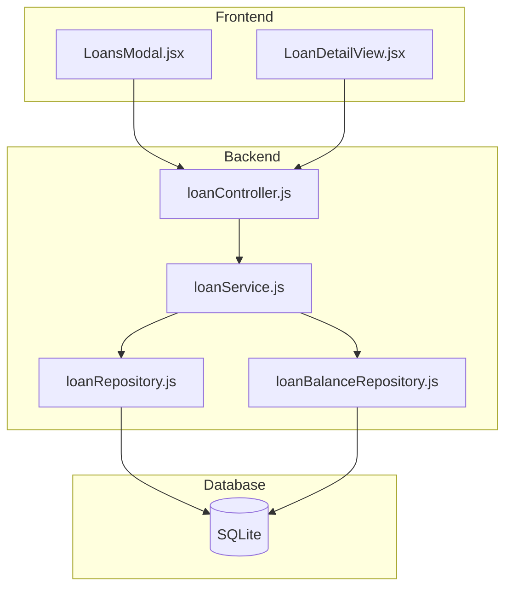

# Design Document: Fixed Interest Rate Loans

## Overview

This feature adds support for fixed interest rate configuration on loans of type "loan" (excluding line_of_credit and mortgage). When a loan has a fixed interest rate configured, the system simplifies the balance entry workflow by auto-populating the rate field and hiding rate-related UI elements that are not relevant for fixed-rate loans.

The design follows the existing layered architecture (Controller → Service → Repository → Database) and maintains backward compatibility with existing loans and balance entries.

## Architecture



### Data Flow

1. **Loan Creation/Update**: Frontend sends loan data including optional `fixed_interest_rate` → Controller validates → Service applies business rules → Repository persists to database

2. **Balance Entry Creation**: Frontend sends balance data (rate optional for fixed-rate loans) → Controller validates → Service checks if loan has fixed rate and auto-populates if needed → Repository persists

3. **Balance History Display**: Frontend requests balance history → Service retrieves data and includes loan's fixed_interest_rate flag → Frontend conditionally renders columns based on flag

## Components and Interfaces

### Database Schema Changes

**loans table modification:**
```sql
ALTER TABLE loans ADD COLUMN fixed_interest_rate REAL DEFAULT NULL;
```

The `fixed_interest_rate` column:
- Type: REAL (nullable)
- Default: NULL (indicates variable-rate loan)
- Constraint: Must be >= 0 when set
- Only applicable when `loan_type = 'loan'`

### Backend Components

#### loanRepository.js

**Modified Methods:**

```javascript
// create() - Add fixed_interest_rate to INSERT
async create(loan) {
  // Include fixed_interest_rate in params
  // Only set if loan_type === 'loan'
}

// update() - Add fixed_interest_rate to UPDATE
async update(id, loan) {
  // Include fixed_interest_rate in params
  // Only update if loan_type === 'loan'
}

// getAllWithCurrentBalances() - Include fixed_interest_rate in SELECT
async getAllWithCurrentBalances() {
  // Add fixed_interest_rate to returned fields
}
```

#### loanService.js

**Modified Methods:**

```javascript
// validateLoan() - Add fixed_interest_rate validation
validateLoan(loan) {
  // If fixed_interest_rate is provided:
  //   - Validate loan_type === 'loan'
  //   - Validate value >= 0
}

// createLoan() - Handle fixed_interest_rate
async createLoan(data) {
  // Include fixed_interest_rate only for loan_type === 'loan'
}

// updateLoan() - Handle fixed_interest_rate
async updateLoan(id, data) {
  // Include fixed_interest_rate only for loan_type === 'loan'
}
```

#### loanBalanceRepository.js

**Modified Methods:**

```javascript
// upsert() - Handle optional rate for fixed-rate loans
async upsert(balanceEntry, fixedRate = null) {
  // If rate not provided and fixedRate is set, use fixedRate
  // If rate not provided and fixedRate is null, throw validation error
}
```

### Frontend Components

#### LoansModal.jsx

**Changes:**
- Add `fixed_interest_rate` to form state
- Conditionally render fixed rate input field when `loan_type === 'loan'`
- Include `fixed_interest_rate` in create/update API calls

#### LoanDetailView.jsx

**Changes:**
- Pass `fixed_interest_rate` to balance entry form
- Conditionally hide rate input when loan has fixed rate
- Conditionally hide Rate Change column in balance history table
- Display "Fixed Rate" indicator when applicable

### API Contracts

#### POST /api/loans

**Request Body (updated):**
```json
{
  "name": "string",
  "initial_balance": "number",
  "start_date": "string",
  "loan_type": "loan|line_of_credit|mortgage",
  "notes": "string|null",
  "fixed_interest_rate": "number|null"  // NEW - only for loan_type='loan'
}
```

#### PUT /api/loans/:id

**Request Body (updated):**
```json
{
  "name": "string",
  "notes": "string|null",
  "fixed_interest_rate": "number|null"  // NEW - only for loan_type='loan'
}
```

#### POST /api/loans/:loanId/balances

**Request Body (updated):**
```json
{
  "year": "number",
  "month": "number",
  "remaining_balance": "number",
  "rate": "number|undefined"  // Optional if loan has fixed_interest_rate
}
```

## Data Models

### Loan Model (Extended)

```javascript
{
  id: number,
  name: string,
  initial_balance: number,
  start_date: string,
  notes: string | null,
  loan_type: 'loan' | 'line_of_credit' | 'mortgage',
  is_paid_off: 0 | 1,
  estimated_months_left: number | null,
  fixed_interest_rate: number | null,  // NEW
  // ... mortgage-specific fields
  created_at: string,
  updated_at: string
}
```

### Balance Entry Model (Unchanged)

```javascript
{
  id: number,
  loan_id: number,
  year: number,
  month: number,
  remaining_balance: number,
  rate: number,  // Still required in DB, auto-populated for fixed-rate loans
  created_at: string,
  updated_at: string
}
```

## Correctness Properties

*A property is a characteristic or behavior that should hold true across all valid executions of a system—essentially, a formal statement about what the system should do. Properties serve as the bridge between human-readable specifications and machine-verifiable correctness guarantees.*

### Property 1: Loan Type Restriction

*For any* loan, if `loan_type` is 'line_of_credit' or 'mortgage', then `fixed_interest_rate` must be NULL. Only loans with `loan_type='loan'` may have a non-NULL `fixed_interest_rate`.

**Validates: Requirements 1.2, 1.3, 4.5**

### Property 2: Non-Negative Rate Validation

*For any* loan with a non-NULL `fixed_interest_rate`, the value must be greater than or equal to zero. Negative values must be rejected with a validation error.

**Validates: Requirements 1.4, 4.3**

### Property 3: Auto-Population Round Trip

*For any* loan with a non-NULL `fixed_interest_rate`, creating a balance entry without specifying a rate should result in the balance entry having `rate` equal to the loan's `fixed_interest_rate`.

**Validates: Requirements 2.2, 5.4**

### Property 4: Variable Rate Requires Explicit Rate

*For any* loan with NULL `fixed_interest_rate`, creating a balance entry without specifying a rate must result in a validation error.

**Validates: Requirements 2.3, 5.5, 6.3**

### Property 5: API Round Trip Preservation

*For any* loan with `loan_type='loan'`, creating or updating the loan with a `fixed_interest_rate` value, then retrieving the loan, should return the same `fixed_interest_rate` value.

**Validates: Requirements 5.1, 5.2, 5.3**

### Property 6: Existing Balance Entries Unchanged

*For any* loan that is converted from variable-rate (NULL `fixed_interest_rate`) to fixed-rate (non-NULL `fixed_interest_rate`), all existing balance entries must retain their original `rate` values unchanged.

**Validates: Requirements 4.6, 6.2**

### Property 7: Backward Compatibility

*For any* loan with NULL `fixed_interest_rate`, the system must behave identically to the pre-feature behavior: requiring explicit rate input for balance entries and displaying rate change columns in the UI.

**Validates: Requirements 6.1, 6.4**

## Error Handling

### Validation Errors

| Error Condition | Error Message | HTTP Status |
|----------------|---------------|-------------|
| Fixed rate on non-loan type | "Fixed interest rate can only be set for loans, not for lines of credit or mortgages" | 400 |
| Negative fixed rate | "Fixed interest rate must be greater than or equal to zero" | 400 |
| Missing rate for variable loan | "Interest rate is required for loans without a fixed interest rate" | 400 |
| Invalid rate format | "Fixed interest rate must be a valid number" | 400 |

### Migration Errors

- If migration fails, the system should log the error and continue operating with existing schema
- Migration is idempotent - running multiple times should not cause errors

## Testing Strategy

### Unit Tests

- **loanService.test.js**: Test validation logic for fixed_interest_rate
- **loanRepository.test.js**: Test CRUD operations with fixed_interest_rate
- **loanBalanceRepository.test.js**: Test balance creation with auto-populated rate

### Property-Based Tests

Property-based tests will use the `fast-check` library to generate random inputs and verify properties hold across all valid inputs. Each test should run a minimum of 100 iterations.

- **loanService.fixedRate.pbt.test.js**: Properties 1, 2, 5, 6, 7
- **loanBalanceRepository.fixedRate.pbt.test.js**: Properties 3, 4

### Integration Tests

- Test full flow: create fixed-rate loan → add balance without rate → verify rate auto-populated
- Test full flow: create variable-rate loan → add balance without rate → verify error
- Test migration: verify existing data preserved after migration

### Frontend Tests

- **LoansModal.test.jsx**: Test conditional rendering of fixed rate field
- **LoanDetailView.test.jsx**: Test conditional rendering of rate input and rate change column
