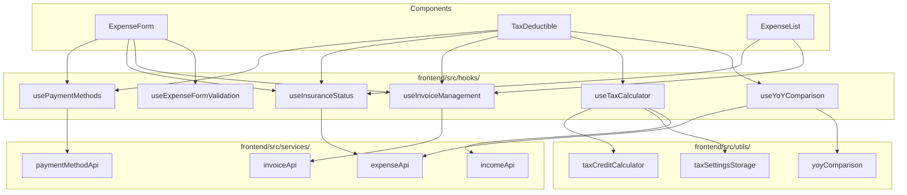

# Design Document: Frontend Custom Hooks Extraction

## Overview

This design describes the extraction of six custom React hooks from three oversized components (ExpenseForm ~1663 lines, TaxDeductible ~1677 lines, ExpenseList ~1111 lines) into a new `frontend/src/hooks/` directory. This is a pure refactoring — no functional changes, no new features, no API changes.

Each hook encapsulates a distinct concern:
- `usePaymentMethods` — payment method fetching, inactive method handling, localStorage memory
- `useInsuranceStatus` — insurance claim status updates and quick status UI state
- `useInvoiceManagement` — invoice fetching/caching, modal state, person link updates
- `useExpenseFormValidation` — form field validation rules
- `useTaxCalculator` — tax credit calculator state with localStorage persistence
- `useYoYComparison` — year-over-year data fetching and change calculations

The hooks consume existing service layer functions (`paymentMethodApi`, `invoiceApi`, `expenseApi`) and utility modules (`taxCreditCalculator`, `taxSettingsStorage`, `yoyComparison`). No new API endpoints are needed.

## Architecture



The hooks sit between the components and the existing service/utility layers. Components call hooks instead of directly managing state and API calls for these concerns. The service and utility layers remain unchanged.

## Components and Interfaces

### 1. usePaymentMethods

**File:** `frontend/src/hooks/usePaymentMethods.js`

**Extracted from:** ExpenseForm (lines 82–310), TaxDeductible (lines 95–105)

```javascript
/**
 * @param {Object} options
 * @param {number|null} options.expensePaymentMethodId - Payment method ID of expense being edited (for inactive method handling)
 * @param {boolean} options.activeOnly - Whether to fetch only active methods (default: true)
 * @returns {Object}
 */
function usePaymentMethods({ expensePaymentMethodId = null, activeOnly = true } = {}) {
  return {
    paymentMethods,          // Array - active (or all) payment methods
    loading,                 // boolean
    error,                   // string|null
    inactivePaymentMethod,   // Object|null - the inactive method for the edited expense
    getLastUsedId,           // (methods?) => number|null - reads from localStorage
    saveLastUsed,            // (id) => void - writes to localStorage
    defaultPaymentMethodId,  // number - DEFAULT_PAYMENT_METHOD_ID (1)
  };
}
```

**Key behaviors:**
- Fetches `getActivePaymentMethods()` or `getPaymentMethods({ activeOnly })` on mount
- If `expensePaymentMethodId` is provided and not in the active list, fetches it via `getPaymentMethod(id)` and stores as `inactivePaymentMethod`
- `getLastUsedId` reads from localStorage key `expense-tracker-last-payment-method-id`, with migration from legacy `expense-tracker-last-payment-method` string key
- `saveLastUsed` writes to localStorage
- Cleanup via `isMounted` flag pattern

### 2. useInsuranceStatus

**File:** `frontend/src/hooks/useInsuranceStatus.js`

**Extracted from:** ExpenseList (lines 260–275), TaxDeductible (lines 430–455)

```javascript
/**
 * @param {Object} options
 * @param {Function} options.onStatusChanged - Callback after successful status update
 * @returns {Object}
 */
function useInsuranceStatus({ onStatusChanged } = {}) {
  return {
    updateStatus,            // (expenseId, newStatus) => Promise<void>
    updating,                // boolean
    error,                   // string|null
    quickStatusExpense,      // Object|null - expense for QuickStatusUpdate popup
    openQuickStatus,         // (expense, event?) => void
    closeQuickStatus,        // () => void
  };
}
```

**Key behaviors:**
- `updateStatus` calls `expenseApi.updateInsuranceStatus(expenseId, status)`, then invokes `onStatusChanged` callback
- Dispatches `window.dispatchEvent(new CustomEvent('expensesUpdated'))` after successful update
- Manages `quickStatusExpense` state for the QuickStatusUpdate component popup

### 3. useInvoiceManagement

**File:** `frontend/src/hooks/useInvoiceManagement.js`

**Extracted from:** ExpenseList (lines 370–440), TaxDeductible (lines 55–60, 460–490)

```javascript
/**
 * @param {Object} options
 * @param {Array} options.expenses - Array of expenses to auto-load invoices for (tax-deductible ones)
 * @returns {Object}
 */
function useInvoiceManagement({ expenses = [] } = {}) {
  return {
    invoiceCache,            // Map<expenseId, Invoice[]>
    loadingInvoices,         // Set<expenseId>
    fetchInvoices,           // (expenseId) => Promise<Invoice[]>
    handleInvoiceUpdated,    // (expenseId, newInvoice) => void
    handleInvoiceDeleted,    // (expenseId, invoiceId?) => void
    handlePersonLinkUpdated, // (expenseId, invoiceId, personId) => Promise<void>
    // Modal state
    showInvoiceModal,        // boolean
    invoiceModalExpense,     // Object|null
    invoiceModalInvoices,    // Invoice[]
    openInvoiceModal,        // (expense, invoices) => void
    closeInvoiceModal,       // () => void
  };
}
```

**Key behaviors:**
- Maintains a `Map<expenseId, Invoice[]>` cache
- Auto-loads invoices for tax-deductible expenses (`type === 'Tax - Medical' || type === 'Tax - Donation'`) when `expenses` array changes
- Skips already-cached or currently-loading expense IDs
- `handlePersonLinkUpdated` calls `invoiceApi.updateInvoicePersonLink` and updates the cache entry
- Modal state is simple open/close with expense and invoices data

### 4. useExpenseFormValidation

**File:** `frontend/src/hooks/useExpenseFormValidation.js`

**Extracted from:** ExpenseForm (lines 730–810)

```javascript
/**
 * @returns {Object}
 */
function useExpenseFormValidation() {
  return {
    validate,  // (formData, options) => { valid: boolean, errors: Object }
  };
}

/**
 * @param {Object} formData - { date, amount, type, payment_method_id, place, notes }
 * @param {Object} options
 * @param {boolean} options.isMedicalExpense
 * @param {boolean} options.insuranceEligible
 * @param {string} options.originalCost
 * @param {boolean} options.isCreditCard
 * @param {string} options.postedDate
 * @param {boolean} options.showGenericReimbursementUI
 * @param {string} options.genericOriginalCost
 * @returns {{ valid: boolean, errors: { message: string, field: string }[] }}
 */
```

**Key behaviors:**
- Pure validation logic — no state, no side effects, no API calls
- Validates: date required, amount > 0, type required, payment_method_id required, place length ≤ 200, notes length ≤ 200
- Medical insurance: original cost required when insurance eligible, out-of-pocket ≤ original cost
- Credit card: posted date ≥ expense date
- Generic reimbursement: original cost ≥ 0, net amount ≤ original cost
- Returns structured errors array instead of setting message state (component maps errors to its own message state)

### 5. useTaxCalculator

**File:** `frontend/src/hooks/useTaxCalculator.js`

**Extracted from:** TaxDeductible (lines 70–75, 175–185, 455–500)

```javascript
/**
 * @param {Object} options
 * @param {number} options.year - Tax year
 * @param {number} options.medicalTotal - Total medical expenses
 * @param {number} options.donationTotal - Total donation expenses
 * @returns {Object}
 */
function useTaxCalculator({ year, medicalTotal = 0, donationTotal = 0 }) {
  return {
    netIncome,               // number|null
    netIncomeInput,          // string - raw input value
    selectedProvince,        // string - province code
    loadingAppIncome,        // boolean
    taxCredits,              // Object|null - result from calculateAllTaxCredits
    handleNetIncomeChange,   // (event) => void
    handleProvinceChange,    // (event) => void
    handleUseAppIncome,      // () => Promise<void>
  };
}
```

**Key behaviors:**
- Loads saved net income and province from `taxSettingsStorage` on mount and when `year` changes
- `handleNetIncomeChange` parses input, saves valid values via `saveNetIncomeForYear`
- `handleProvinceChange` saves via `saveSelectedProvince`
- `handleUseAppIncome` calls `getAnnualIncomeByCategory(year)` and populates net income
- `taxCredits` is a `useMemo` that calls `calculateAllTaxCredits` when inputs change

### 6. useYoYComparison

**File:** `frontend/src/hooks/useYoYComparison.js`

**Extracted from:** TaxDeductible (lines 155–175, 530–560)

```javascript
/**
 * @param {Object} options
 * @param {number} options.year - Current year
 * @param {number} options.refreshTrigger - Trigger to re-fetch data
 * @returns {Object}
 */
function useYoYComparison({ year, refreshTrigger }) {
  return {
    previousYearData,        // Object|null - { medicalTotal, donationTotal, totalDeductible }
    yoyLoading,              // boolean
    yoyError,                // string|null
    calculateChange,         // (current, previous) => { change, direction, formatted }
    getIndicator,            // (direction) => string
  };
}
```

**Key behaviors:**
- Fetches `getTaxDeductibleSummary(year - 1)` on mount and when `year` or `refreshTrigger` changes
- Exposes `calculateChange` (wraps `calculatePercentageChange`) and `getIndicator` (wraps `getChangeIndicator`) from `yoyComparison` utils
- Error handling sets `yoyError` string and `previousYearData` to null

## Data Models

No new data models are introduced. The hooks operate on existing data structures:

**Payment Method** (from `paymentMethodApi`):
```javascript
{ id: number, display_name: string, type: string, is_active: number }
```

**Invoice** (from `invoiceApi`):
```javascript
{ id: number, expenseId: number, personId: number|null, personName: string|null, filename: string }
```

**Insurance Status** (from `expenseApi`):
```javascript
{ claim_status: 'not_claimed' | 'in_progress' | 'paid' | 'denied' }
```

**Validation Result** (new, from `useExpenseFormValidation`):
```javascript
{ valid: boolean, errors: Array<{ message: string, field: string }> }
```

**Tax Credits** (from `taxCreditCalculator`):
```javascript
{
  agiThreshold: number, deductibleMedical: number, thresholdProgress: number,
  federal: { medicalCredit, donationCredit, total, rates },
  provincial: { medicalCredit, donationCredit, total, rates, provinceName },
  totalTaxSavings: number
}
```


## Correctness Properties

*A property is a characteristic or behavior that should hold true across all valid executions of a system — essentially, a formal statement about what the system should do. Properties serve as the bridge between human-readable specifications and machine-verifiable correctness guarantees.*

The following properties were derived from the acceptance criteria prework analysis. Each property is universally quantified and suitable for property-based testing with fast-check.

### Property 1: Payment method localStorage round-trip

*For any* valid payment method ID from the active methods list, calling `saveLastUsed(id)` and then `getLastUsedId(methods)` SHALL return the same ID.

This is a round-trip property on the localStorage persistence mechanism. The save/load cycle must be lossless for any valid ID.

**Validates: Requirements 1.4**

### Property 2: Quick status state round-trip

*For any* expense object, calling `openQuickStatus(expense)` sets `quickStatusExpense` to that expense, and then calling `closeQuickStatus()` sets `quickStatusExpense` to null.

This is a round-trip property on the hook's internal state management.

**Validates: Requirements 2.3**

### Property 3: Invoice cache deduplication

*For any* expense ID, after the first call to `fetchInvoices(expenseId)` resolves, a second call to `fetchInvoices(expenseId)` SHALL return the cached result without triggering an additional API call.

This is an idempotence property — fetching the same ID twice should produce one API call.

**Validates: Requirements 3.2**

### Property 4: Invoice cache consistency after person link update

*For any* cached invoice with a given expense ID and invoice ID, after calling `handlePersonLinkUpdated(expenseId, invoiceId, newPersonId)`, the cached invoice entry for that invoice ID SHALL have its `personId` updated to `newPersonId`.

This is an invariant property — the cache must stay consistent with mutations.

**Validates: Requirements 3.3**

### Property 5: Invoice modal state round-trip

*For any* expense object and invoices array, calling `openInvoiceModal(expense, invoices)` sets `showInvoiceModal` to true, `invoiceModalExpense` to the expense, and `invoiceModalInvoices` to the invoices. Then calling `closeInvoiceModal()` sets `showInvoiceModal` to false and clears the other values.

**Validates: Requirements 3.4**

### Property 6: Validation rejects invalid basic fields

*For any* form data where the date is empty, or the amount is non-positive (zero, negative, or NaN), or the type is empty, or the payment_method_id is null/undefined, the `validate` function SHALL return `{ valid: false }` with at least one error entry.

This combines the basic field validation rules into a single property covering all required-field checks.

**Validates: Requirements 4.1, 4.2, 4.3, 4.4**

### Property 7: Validation rejects original cost less than net amount

*For any* expense (medical with insurance or non-medical with reimbursement) where the original cost is less than the net amount (out-of-pocket), the `validate` function SHALL return `{ valid: false }` with an error about the cost relationship.

This combines the insurance amount validation (4.5) and generic reimbursement validation (4.7) since they enforce the same invariant: `originalCost >= netAmount`.

**Validates: Requirements 4.5, 4.7**

### Property 8: Validation rejects posted date before expense date

*For any* credit card expense where the posted date is strictly before the expense date, the `validate` function SHALL return `{ valid: false }` with a posted date error.

**Validates: Requirements 4.6**

### Property 9: Valid form data passes validation

*For any* form data with a non-empty date, positive amount, non-empty type, valid payment_method_id, place ≤ 200 chars, notes ≤ 200 chars, and consistent cost relationships (original cost ≥ net amount when applicable, posted date ≥ expense date when applicable), the `validate` function SHALL return `{ valid: true, errors: [] }`.

This is the complement of Properties 6–8: valid inputs always pass.

**Validates: Requirements 4.8**

### Property 10: Tax settings localStorage round-trip

*For any* valid year and non-negative net income value, calling `handleNetIncomeChange` with that value and then re-initializing the hook with the same year SHALL restore the same net income. Similarly, *for any* valid province code, calling `handleProvinceChange` and re-initializing SHALL restore the same province.

This combines the net income round-trip (5.2) and province round-trip (5.3) into a single storage persistence property.

**Validates: Requirements 5.2, 5.3**

### Property 11: Tax credits computation matches utility

*For any* valid combination of (medicalTotal ≥ 0, donationTotal ≥ 0, netIncome ≥ 0, year, provinceCode), the `taxCredits` value exposed by the hook SHALL equal the result of calling `calculateAllTaxCredits` directly with the same parameters.

This is a model-based property — the hook's memoized computation must match the standalone utility.

**Validates: Requirements 5.5**

### Property 12: YoY calculateChange matches utility

*For any* pair of non-negative numbers (current, previous), the hook's `calculateChange(current, previous)` SHALL return the same result as `calculatePercentageChange(current, previous)` from the yoyComparison utility.

This is a model-based property — the hook's wrapper must be a transparent pass-through.

**Validates: Requirements 6.2**

## Error Handling

Since this is a refactoring, error handling patterns are preserved from the existing components:

| Hook | Error Source | Handling |
|------|-------------|----------|
| usePaymentMethods | API fetch failure | Sets `error` string, sets `loading` to false, returns empty `paymentMethods` array |
| useInsuranceStatus | Status update failure | Sets `error` string, sets `updating` to false, does not call `onStatusChanged` |
| useInvoiceManagement | Invoice fetch failure | Logs error, sets empty array in cache for that expense ID, removes from loading set |
| useInvoiceManagement | Person link update failure | Logs error, preserves existing cache state unchanged |
| useExpenseFormValidation | N/A (pure logic) | Returns structured error objects — no async operations |
| useTaxCalculator | Income API failure | Logs error, sets `loadingAppIncome` to false, preserves existing net income value |
| useYoYComparison | Summary API failure | Sets `yoyError` string, sets `yoyLoading` to false, sets `previousYearData` to null |

All hooks use the `isMounted` flag pattern (where applicable) to prevent state updates after unmount. The `useInvoiceManagement` hook uses `Promise.all` with individual try/catch per expense to prevent one failure from blocking others.

## Testing Strategy

### Dual Testing Approach

This refactoring uses both unit tests and property-based tests:

- **Unit tests**: Verify specific examples, edge cases, error conditions, and integration with mocked APIs
- **Property tests**: Verify universal properties across randomly generated inputs using fast-check

### Property-Based Testing Configuration

- **Library**: fast-check v4.5.3 (already installed in frontend)
- **Framework**: Vitest with `@testing-library/react` for hook rendering via `renderHook`
- **Minimum iterations**: 100 per property test
- **Tag format**: Comment referencing design property, e.g., `// Feature: frontend-custom-hooks, Property 6: Validation rejects invalid basic fields`

### Test File Organization

Each hook gets its own test file in `frontend/src/hooks/`:

| Hook | Unit Test File | PBT Test File |
|------|---------------|---------------|
| usePaymentMethods | `usePaymentMethods.test.js` | `usePaymentMethods.pbt.test.js` |
| useInsuranceStatus | `useInsuranceStatus.test.js` | `useInsuranceStatus.pbt.test.js` |
| useInvoiceManagement | `useInvoiceManagement.test.js` | `useInvoiceManagement.pbt.test.js` |
| useExpenseFormValidation | `useExpenseFormValidation.test.js` | `useExpenseFormValidation.pbt.test.js` |
| useTaxCalculator | `useTaxCalculator.test.js` | `useTaxCalculator.pbt.test.js` |
| useYoYComparison | `useYoYComparison.test.js` | `useYoYComparison.pbt.test.js` |

### Property-to-Test Mapping

Each correctness property maps to a single property-based test:

| Property | Test Location | Pattern |
|----------|--------------|---------|
| Property 1 (payment method round-trip) | `usePaymentMethods.pbt.test.js` | Round-trip |
| Property 2 (quick status round-trip) | `useInsuranceStatus.pbt.test.js` | Round-trip |
| Property 3 (cache deduplication) | `useInvoiceManagement.pbt.test.js` | Idempotence |
| Property 4 (cache consistency) | `useInvoiceManagement.pbt.test.js` | Invariant |
| Property 5 (modal round-trip) | `useInvoiceManagement.pbt.test.js` | Round-trip |
| Property 6 (invalid field rejection) | `useExpenseFormValidation.pbt.test.js` | Error condition |
| Property 7 (cost relationship) | `useExpenseFormValidation.pbt.test.js` | Error condition |
| Property 8 (posted date) | `useExpenseFormValidation.pbt.test.js` | Error condition |
| Property 9 (valid data passes) | `useExpenseFormValidation.pbt.test.js` | Invariant |
| Property 10 (tax settings round-trip) | `useTaxCalculator.pbt.test.js` | Round-trip |
| Property 11 (tax credits match) | `useTaxCalculator.pbt.test.js` | Model-based |
| Property 12 (YoY change match) | `useYoYComparison.pbt.test.js` | Model-based |

### Unit Test Focus Areas

- API mock setup and teardown for each hook
- Error handling paths (API failures, network errors)
- Edge cases: empty arrays, null values, undefined props
- Legacy localStorage migration (usePaymentMethods)
- Component unmount cleanup (isMounted patterns)
- Existing component tests continue passing after refactoring
