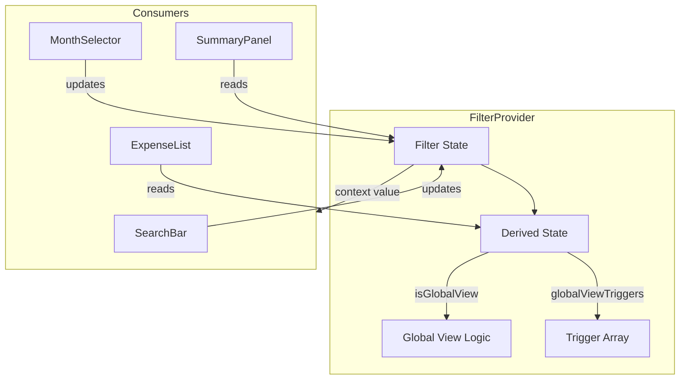

# Design Document

## Overview

This design document describes the architecture for extracting filter and view mode state management from the monolithic App.jsx component into a dedicated React Context. The refactoring uses React's built-in Context API (no new dependencies) to create a centralized state management solution for filter-related state.

The primary goals are:
1. Reduce App.jsx complexity by removing ~15 useState hooks and related handlers
2. Eliminate prop drilling for filter state across the component tree
3. Centralize filter validation and business logic
4. Improve testability of filter state management
5. Maintain 100% backward compatibility with existing behavior

## Architecture

The solution follows React's recommended Context pattern with a Provider component wrapping the application and a custom hook for consuming the context.

```
┌─────────────────────────────────────────────────────────────┐
│                         App.jsx                              │
│  ┌─────────────────────────────────────────────────────┐    │
│  │                  FilterProvider                      │    │
│  │  ┌─────────────────────────────────────────────┐    │    │
│  │  │              Filter State                    │    │    │
│  │  │  - searchText, filterType, filterMethod     │    │    │
│  │  │  - filterYear, filterInsurance              │    │    │
│  │  │  - selectedYear, selectedMonth              │    │    │
│  │  │  - isGlobalView (derived)                   │    │    │
│  │  │  - globalViewTriggers (derived)             │    │    │
│  │  └─────────────────────────────────────────────┘    │    │
│  │                        │                             │    │
│  │                        ▼                             │    │
│  │  ┌─────────────────────────────────────────────┐    │    │
│  │  │           Child Components                   │    │    │
│  │  │  - SearchBar (via props or context)         │    │    │
│  │  │  - ExpenseList (via props or context)       │    │    │
│  │  │  - MonthSelector (via props or context)     │    │    │
│  │  │  - SummaryPanel (via props or context)      │    │    │
│  │  └─────────────────────────────────────────────┘    │    │
│  └─────────────────────────────────────────────────────┘    │
└─────────────────────────────────────────────────────────────┘
```

### State Flow



## Components and Interfaces

### FilterContext

The React Context that holds the filter state and provides it to consumers.

```javascript
// frontend/src/contexts/FilterContext.jsx

import { createContext, useContext, useState, useMemo, useCallback } from 'react';
import { CATEGORIES } from '../utils/constants';

const FilterContext = createContext(null);

/**
 * FilterProvider - Manages all filter and view mode state
 * 
 * @param {Object} props
 * @param {React.ReactNode} props.children - Child components
 * @param {string[]} props.paymentMethods - Available payment methods for validation
 */
export function FilterProvider({ children, paymentMethods = [] }) {
  // Filter state
  const [searchText, setSearchText] = useState('');
  const [filterType, setFilterType] = useState('');
  const [filterMethod, setFilterMethod] = useState('');
  const [filterYear, setFilterYear] = useState('');
  const [filterInsurance, setFilterInsurance] = useState('');
  
  // View state
  const [selectedYear, setSelectedYear] = useState(() => new Date().getFullYear());
  const [selectedMonth, setSelectedMonth] = useState(() => new Date().getMonth() + 1);

  // Derived state: isGlobalView
  const isGlobalView = useMemo(() => {
    return searchText.trim().length > 0 || 
           filterMethod !== '' || 
           filterYear !== '' || 
           filterInsurance !== '';
  }, [searchText, filterMethod, filterYear, filterInsurance]);

  // Derived state: globalViewTriggers
  const globalViewTriggers = useMemo(() => {
    const triggers = [];
    if (searchText.trim().length > 0) triggers.push('Search');
    if (filterMethod) triggers.push('Payment Method');
    if (filterYear) triggers.push('Year');
    if (filterInsurance) triggers.push('Insurance Status');
    return triggers;
  }, [searchText, filterMethod, filterYear, filterInsurance]);

  // Handler: searchText change
  const handleSearchChange = useCallback((text) => {
    setSearchText(text);
  }, []);

  // Handler: filterType change with validation
  const handleFilterTypeChange = useCallback((type) => {
    if (type && !CATEGORIES.includes(type)) {
      console.warn(`Invalid category selected: ${type}. Resetting to empty.`);
      setFilterType('');
      return;
    }
    setFilterType(type);
  }, []);

  // Handler: filterMethod change with validation
  const handleFilterMethodChange = useCallback((method) => {
    if (method && paymentMethods.length > 0 && !paymentMethods.includes(method)) {
      console.warn(`Invalid payment method selected: ${method}. Resetting to empty.`);
      setFilterMethod('');
      return;
    }
    setFilterMethod(method);
  }, [paymentMethods]);

  // Handler: filterYear change
  const handleFilterYearChange = useCallback((year) => {
    setFilterYear(year);
  }, []);

  // Handler: month change
  const handleMonthChange = useCallback((year, month) => {
    setSelectedYear(year);
    setSelectedMonth(month);
  }, []);

  // Handler: clear all filters
  const handleClearFilters = useCallback(() => {
    setSearchText('');
    setFilterType('');
    setFilterMethod('');
    setFilterYear('');
    setFilterInsurance('');
  }, []);

  // Handler: return to monthly view (clear only global-triggering filters)
  const handleReturnToMonthlyView = useCallback(() => {
    setSearchText('');
    setFilterMethod('');
    setFilterYear('');
    setFilterInsurance('');
  }, []);

  const value = useMemo(() => ({
    // Filter state
    searchText,
    filterType,
    filterMethod,
    filterYear,
    filterInsurance,
    
    // View state
    selectedYear,
    selectedMonth,
    
    // Derived state
    isGlobalView,
    globalViewTriggers,
    
    // Setters (for direct access when needed)
    setFilterInsurance,
    
    // Handlers
    handleSearchChange,
    handleFilterTypeChange,
    handleFilterMethodChange,
    handleFilterYearChange,
    handleMonthChange,
    handleClearFilters,
    handleReturnToMonthlyView,
  }), [
    searchText, filterType, filterMethod, filterYear, filterInsurance,
    selectedYear, selectedMonth,
    isGlobalView, globalViewTriggers,
    handleSearchChange, handleFilterTypeChange, handleFilterMethodChange,
    handleFilterYearChange, handleMonthChange, handleClearFilters,
    handleReturnToMonthlyView,
  ]);

  return (
    <FilterContext.Provider value={value}>
      {children}
    </FilterContext.Provider>
  );
}

/**
 * useFilterContext - Custom hook for consuming filter context
 * 
 * @returns {Object} Filter context value
 * @throws {Error} If used outside of FilterProvider
 */
export function useFilterContext() {
  const context = useContext(FilterContext);
  if (context === null) {
    throw new Error('useFilterContext must be used within a FilterProvider');
  }
  return context;
}

export default FilterContext;
```

### Context Value Interface

```typescript
// Type definition for documentation purposes (not actual TypeScript)
interface FilterContextValue {
  // Filter state
  searchText: string;
  filterType: string;
  filterMethod: string;
  filterYear: string;
  filterInsurance: string;
  
  // View state
  selectedYear: number;
  selectedMonth: number;
  
  // Derived state
  isGlobalView: boolean;
  globalViewTriggers: string[];
  
  // Direct setters
  setFilterInsurance: (value: string) => void;
  
  // Handlers
  handleSearchChange: (text: string) => void;
  handleFilterTypeChange: (type: string) => void;
  handleFilterMethodChange: (method: string) => void;
  handleFilterYearChange: (year: string) => void;
  handleMonthChange: (year: number, month: number) => void;
  handleClearFilters: () => void;
  handleReturnToMonthlyView: () => void;
}
```

### App.jsx Integration

After refactoring, App.jsx will:
1. Wrap content with FilterProvider
2. Consume filter state via useFilterContext
3. Continue passing props to children for backward compatibility

```javascript
// Simplified App.jsx structure after refactoring
function App() {
  // Payment methods still fetched here (needed for FilterProvider)
  const [paymentMethods, setPaymentMethods] = useState([]);
  
  // ... other non-filter state remains ...
  
  return (
    <FilterProvider paymentMethods={paymentMethods}>
      <AppContent />
    </FilterProvider>
  );
}

function AppContent() {
  // Access filter state via context
  const {
    searchText, filterType, filterMethod, filterYear, filterInsurance,
    selectedYear, selectedMonth,
    isGlobalView, globalViewTriggers,
    handleSearchChange, handleFilterTypeChange, handleFilterMethodChange,
    handleFilterYearChange, handleMonthChange, handleClearFilters,
    handleReturnToMonthlyView, setFilterInsurance,
  } = useFilterContext();
  
  // ... rest of component logic ...
}
```

## Data Models

### Filter State Model

| Field | Type | Default | Description |
|-------|------|---------|-------------|
| searchText | string | '' | Text search query for place/notes |
| filterType | string | '' | Selected category filter |
| filterMethod | string | '' | Selected payment method filter |
| filterYear | string | '' | Selected year filter for global search |
| filterInsurance | string | '' | Insurance status filter |

### View State Model

| Field | Type | Default | Description |
|-------|------|---------|-------------|
| selectedYear | number | Current year | Currently selected year for monthly view |
| selectedMonth | number | Current month (1-12) | Currently selected month |

### Derived State Model

| Field | Type | Computation | Description |
|-------|------|-------------|-------------|
| isGlobalView | boolean | `searchText \|\| filterMethod \|\| filterYear \|\| filterInsurance` | Whether app is in global view mode |
| globalViewTriggers | string[] | Array of active filter names | Which filters triggered global view |

## Correctness Properties

*A property is a characteristic or behavior that should hold true across all valid executions of a system—essentially, a formal statement about what the system should do. Properties serve as the bridge between human-readable specifications and machine-verifiable correctness guarantees.*


Based on the prework analysis, the following properties have been consolidated to eliminate redundancy:

### Property 1: Context provides complete interface

*For any* FilterProvider instance, the context value SHALL contain all required fields: filter state (searchText, filterType, filterMethod, filterYear, filterInsurance), view state (selectedYear, selectedMonth), derived state (isGlobalView, globalViewTriggers), and all handler functions.

**Validates: Requirements 1.1, 1.2, 1.3, 1.4, 1.5**

### Property 2: Default values initialization

*For any* initial render of FilterProvider, filter state values SHALL be empty strings ('') and view state SHALL be initialized to the current year and month.

**Validates: Requirements 2.1**

### Property 3: isGlobalView computation

*For any* combination of filter values, isGlobalView SHALL be true if and only if at least one of searchText (non-empty after trim), filterMethod, filterYear, or filterInsurance is non-empty. filterType alone SHALL NOT trigger global view.

**Validates: Requirements 2.2, 2.3**

### Property 4: globalViewTriggers computation

*For any* combination of active filters, globalViewTriggers SHALL contain exactly the names of the active global-triggering filters ('Search' for searchText, 'Payment Method' for filterMethod, 'Year' for filterYear, 'Insurance Status' for filterInsurance).

**Validates: Requirements 2.4**

### Property 5: Filter validation

*For any* value passed to handleFilterTypeChange, if the value is non-empty and not in CATEGORIES, filterType SHALL be reset to empty string. *For any* value passed to handleFilterMethodChange, if the value is non-empty and paymentMethods is non-empty and the value is not in paymentMethods, filterMethod SHALL be reset to empty string. If paymentMethods is empty, validation SHALL be skipped.

**Validates: Requirements 2.5, 2.6, 7.2, 7.3**

### Property 6: handleClearFilters resets all filters

*For any* state where filters have values, calling handleClearFilters SHALL result in all filter values (searchText, filterType, filterMethod, filterYear, filterInsurance) being empty strings.

**Validates: Requirements 2.7**

### Property 7: handleReturnToMonthlyView preserves filterType

*For any* state where filterType has a value, calling handleReturnToMonthlyView SHALL clear searchText, filterMethod, filterYear, and filterInsurance while preserving the filterType value.

**Validates: Requirements 2.8**

### Property 8: Handlers update state correctly

*For any* value passed to a handler function:
- handleSearchChange(text) SHALL set searchText to text
- handleFilterYearChange(year) SHALL set filterYear to year
- handleMonthChange(year, month) SHALL set selectedYear to year and selectedMonth to month
- setFilterInsurance(value) SHALL set filterInsurance to value

**Validates: Requirements 6.1, 6.4, 6.5, 6.6**

## Error Handling

### Context Usage Outside Provider

When `useFilterContext` is called outside of a `FilterProvider`, the hook throws a descriptive error:

```javascript
throw new Error('useFilterContext must be used within a FilterProvider');
```

This provides clear guidance to developers during development.

### Invalid Filter Values

When invalid values are passed to filter handlers:

1. **Invalid category**: `handleFilterTypeChange` logs a warning and resets to empty string
2. **Invalid payment method**: `handleFilterMethodChange` logs a warning and resets to empty string (only when paymentMethods list is non-empty)

```javascript
console.warn(`Invalid category selected: ${type}. Resetting to empty.`);
```

### Empty Payment Methods List

When `paymentMethods` prop is empty or not provided, payment method validation is skipped. This handles the case where payment methods haven't been fetched yet.

## Testing Strategy

### Unit Tests

Unit tests will verify specific examples and edge cases:

1. **Context hook error**: Verify `useFilterContext` throws when used outside provider
2. **Initial state**: Verify default values match current date
3. **Edge cases**: Empty strings, whitespace-only search text, boundary month values (1, 12)

### Property-Based Tests

Property-based tests will verify universal properties using fast-check library (already used in the project):

1. **Property 1**: Context interface completeness
2. **Property 2**: Default value initialization
3. **Property 3**: isGlobalView computation correctness
4. **Property 4**: globalViewTriggers array correctness
5. **Property 5**: Filter validation behavior
6. **Property 6**: handleClearFilters behavior
7. **Property 7**: handleReturnToMonthlyView behavior
8. **Property 8**: Handler state update correctness

Each property test will run minimum 100 iterations with randomly generated filter values.

### Integration Tests

Integration tests will verify the context works correctly within App.jsx:

1. Filter state flows correctly to child components
2. Event handlers from child components update context state
3. Global view mode triggers correctly based on filter state
4. Return to monthly view clears appropriate filters

### Test File Structure

```
frontend/src/contexts/
├── FilterContext.jsx           # Context implementation
├── FilterContext.test.jsx      # Unit tests
└── FilterContext.pbt.test.jsx  # Property-based tests
```

### Test Configuration

- Use `@testing-library/react` for rendering and interaction
- Use `fast-check` for property-based testing (already a project dependency)
- Minimum 100 iterations per property test
- Tag format: `Feature: frontend-state-management, Property N: description`
