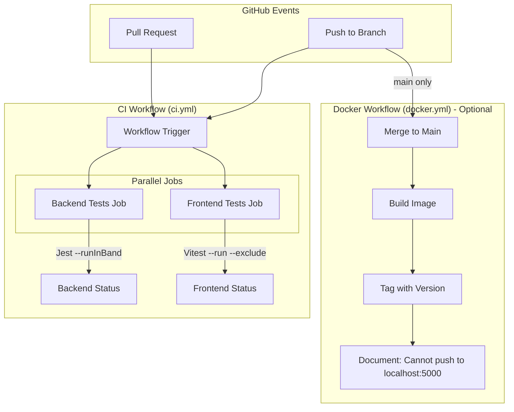

# Design Document: GitHub Actions CI/CD

## Overview

This design document outlines the implementation of GitHub Actions CI/CD for the expense tracker application. The solution provides automated test execution on pull requests and pushes, with parallel job execution for faster feedback. An optional Docker build workflow is included for documentation purposes, with clear acknowledgment that pushing to a local registry from GitHub Actions is not feasible.

The CI/CD implementation follows GitHub Actions best practices:
- Workflow files stored in `.github/workflows/`
- YAML-based configuration
- Matrix strategies for parallel execution
- Caching for improved performance
- Clear job dependencies and status reporting

## Architecture



## Components and Interfaces

### Component 1: CI Workflow File (ci.yml)

**Purpose**: Main workflow that runs tests on PRs and pushes

**Location**: `.github/workflows/ci.yml`

**Interface**:
```yaml
name: CI
on:
  push:
    branches: [main, 'feature/**']
  pull_request:
    branches: [main]

jobs:
  backend-tests:
    # Runs Jest tests for backend
  frontend-tests:
    # Runs Vitest tests for frontend (excluding performance tests)
```

**Responsibilities**:
- Trigger on push to main and feature branches
- Trigger on pull requests to main
- Run backend and frontend tests in parallel
- Report status to GitHub

### Component 2: Backend Test Job

**Purpose**: Execute Jest tests for the Node.js backend

**Configuration**:
```yaml
backend-tests:
  runs-on: ubuntu-latest
  defaults:
    run:
      working-directory: backend
  steps:
    - Checkout code
    - Setup Node.js 20
    - Cache npm dependencies
    - Install dependencies (npm ci)
    - Run tests (npm test)
```

**Environment Variables**:
- `NODE_ENV=test` (set by cross-env in package.json)

### Component 3: Frontend Test Job

**Purpose**: Execute Vitest tests for the React frontend, excluding performance tests

**Configuration**:
```yaml
frontend-tests:
  runs-on: ubuntu-latest
  defaults:
    run:
      working-directory: frontend
  steps:
    - Checkout code
    - Setup Node.js 20
    - Cache npm dependencies
    - Install dependencies (npm ci)
    - Run tests with exclusion (npx vitest --run --exclude '**/App.performance.test.jsx')
```

**Test Exclusion**:
- Excludes `App.performance.test.jsx` which has 90-second timeouts
- Uses Vitest's `--exclude` flag for CI-specific exclusion

### Component 4: Docker Build Workflow (docker.yml) - Optional

**Purpose**: Build Docker image on merge to main (documentation/future use)

**Location**: `.github/workflows/docker.yml`

**Configuration**:
```yaml
name: Docker Build
on:
  push:
    branches: [main]

jobs:
  build:
    runs-on: ubuntu-latest
    steps:
      - Checkout code
      - Setup Docker Buildx
      - Build image with version tag
      # Note: Cannot push to localhost:5000 from GitHub Actions
```

**Limitations Documented**:
- GitHub Actions runners cannot access localhost:5000
- Image is built but not pushed
- Serves as template for future registry integration

### Component 5: Documentation Updates

**Purpose**: Update existing documentation to reference CI/CD

**Files to Update**:
- `docs/development/FEATURE_BRANCH_WORKFLOW.md` - Add CI/CD integration section
- Create `docs/development/GITHUB_ACTIONS_CICD.md` - Dedicated CI/CD documentation

## Data Models

### Workflow Trigger Events

```typescript
interface WorkflowTrigger {
  event: 'push' | 'pull_request';
  branches: string[];  // ['main', 'feature/**'] for push, ['main'] for PR
}
```

### Job Configuration

```typescript
interface JobConfig {
  name: string;
  runsOn: 'ubuntu-latest';
  workingDirectory: string;  // 'backend' or 'frontend'
  nodeVersion: '20';
  steps: Step[];
}

interface Step {
  name: string;
  uses?: string;  // Action reference like 'actions/checkout@v4'
  run?: string;   // Shell command
  with?: Record<string, string>;  // Action inputs
}
```

### Test Execution Results

```typescript
interface TestResult {
  job: 'backend-tests' | 'frontend-tests';
  status: 'success' | 'failure' | 'cancelled';
  duration: number;  // seconds
  testsRun: number;
  testsPassed: number;
  testsFailed: number;
}
```

### Cache Configuration

```typescript
interface CacheConfig {
  path: string;  // '~/.npm'
  key: string;   // '${{ runner.os }}-node-${{ hashFiles('**/package-lock.json') }}'
  restoreKeys: string[];
}
```


## Correctness Properties

*A property is a characteristic or behavior that should hold true across all valid executions of a system—essentially, a formal statement about what the system should do. Properties serve as the bridge between human-readable specifications and machine-verifiable correctness guarantees.*

### Analysis

After analyzing all acceptance criteria, this feature consists entirely of:
1. **Static configuration files** (GitHub Actions YAML workflows)
2. **Documentation updates** (Markdown files)
3. **Platform behaviors** (GitHub Actions built-in functionality)

Since there is no runtime code being written—only declarative YAML configuration and documentation—there are no universal properties that can be tested with property-based testing. The acceptance criteria fall into these categories:

**Platform Behaviors (Not Testable by Us)**:
- GitHub Actions automatically re-runs tests on PR updates
- GitHub Actions displays status checks
- GitHub Actions fails workflows on non-zero exit codes
- GitHub Actions marks successful workflows

**Configuration Validations (Example-Based)**:
- Workflow triggers on correct branches
- Jobs are configured with correct Node.js version
- Test commands include correct flags
- Caching is configured

**Documentation Requirements (Manual Review)**:
- Files contain required content
- Limitations are documented

### Conclusion

No property-based tests are applicable for this feature. Validation will be performed through:
1. **YAML Linting**: Validate workflow syntax
2. **Manual Testing**: Push to a branch and verify workflow runs
3. **Documentation Review**: Verify content completeness

## Error Handling

### Workflow-Level Error Handling

**Test Failures**:
- When tests fail, the job exits with non-zero code
- GitHub Actions automatically marks the job as failed
- PR status checks reflect the failure
- Developers can view logs to diagnose issues

**Dependency Installation Failures**:
- `npm ci` fails if package-lock.json is out of sync
- Clear error message in workflow logs
- Developer must fix package-lock.json locally

**Timeout Handling**:
- GitHub Actions has default 6-hour timeout per job
- Individual test timeouts configured in Jest (30s) and Vitest (30s)
- Performance tests excluded to prevent CI timeouts

### Docker Build Error Handling

**Build Failures**:
- Dockerfile syntax errors caught during build
- Missing dependencies cause build failure
- Clear error messages in workflow logs

**Version Extraction Failures**:
- If package.json is malformed, version extraction fails
- Workflow should use fallback tag (e.g., 'latest')

### Recovery Strategies

| Error Type | Recovery Action |
|------------|-----------------|
| Test failure | Fix code, push new commit |
| npm ci failure | Run `npm install` locally, commit package-lock.json |
| Timeout | Exclude slow tests or increase timeout |
| Docker build failure | Fix Dockerfile or dependencies |

## Testing Strategy

### Validation Approach

Since this feature creates configuration files rather than runtime code, testing follows a different approach:

**1. YAML Syntax Validation**
- Use `actionlint` or similar tool to validate workflow syntax
- GitHub provides built-in validation when workflows are pushed

**2. Manual Integration Testing**
- Create a test branch with intentional test failure
- Verify workflow triggers and fails correctly
- Create a test branch with passing tests
- Verify workflow triggers and succeeds

**3. Documentation Review**
- Verify all required sections are present
- Verify limitations are clearly documented
- Verify integration with existing workflow documentation

### Test Scenarios

| Scenario | Expected Outcome |
|----------|------------------|
| Push to main branch | CI workflow triggers, both jobs run |
| Push to feature/* branch | CI workflow triggers, both jobs run |
| Open PR to main | CI workflow triggers, status check appears |
| Backend test fails | Backend job fails, workflow fails |
| Frontend test fails | Frontend job fails, workflow fails |
| All tests pass | Both jobs succeed, workflow succeeds |
| Merge to main | Docker workflow triggers (optional) |

### Verification Checklist

Before considering the feature complete:

- [ ] `.github/workflows/ci.yml` exists and is valid YAML
- [ ] CI workflow triggers on push to main
- [ ] CI workflow triggers on push to feature/* branches
- [ ] CI workflow triggers on PR to main
- [ ] Backend tests run with `--runInBand` flag
- [ ] Frontend tests run with `--run` flag
- [ ] Performance tests are excluded from frontend tests
- [ ] Both jobs run in parallel (no `needs` dependency)
- [ ] Node.js 20 is used in both jobs
- [ ] npm dependencies are cached
- [ ] `.github/workflows/docker.yml` exists (optional)
- [ ] Documentation updated in FEATURE_BRANCH_WORKFLOW.md
- [ ] CI/CD documentation created

### No Property-Based Tests Required

This feature does not require property-based tests because:
1. No runtime code is being written
2. All artifacts are static configuration files
3. Validation is performed by the GitHub Actions platform itself
4. Manual integration testing verifies correct behavior
