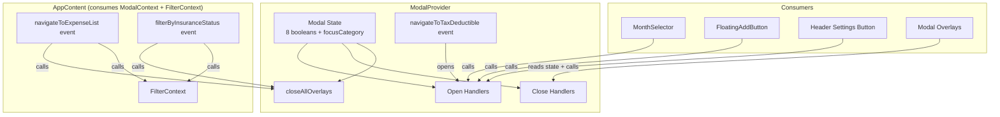

# Design Document

## Overview

This design document describes the architecture for extracting modal visibility state management from App.jsx into a dedicated ModalContext. This is Phase 3 of the frontend state management refactoring, building on the FilterContext (Phase 1) and ExpenseContext (Phase 2) patterns.

The primary goals are:
1. Remove 9 useState hooks (8 boolean visibility + 1 focus category) from AppContent
2. Centralize modal open/close handlers into reusable, memoized callbacks
3. Move modal-related window event listeners (navigateToTaxDeductible, navigateToExpenseList, filterByInsuranceStatus) into the provider
4. Enable any component to control modal visibility without prop drilling
5. Maintain 100% backward compatibility with existing behavior

Key design decision: ModalProvider is independent of FilterContext and ExpenseContext — it manages only UI visibility state. It is nested inside ExpenseProvider so that all child components can access all three contexts. The modal-related window event listeners that also touch filter state (navigateToExpenseList dispatches a category filter change, filterByInsuranceStatus dispatches an insurance filter change) will remain in AppContent since they need both ModalContext and FilterContext. Only the pure modal-opening listener (navigateToTaxDeductible) moves into the provider.

## Architecture

The solution nests ModalProvider inside the existing ExpenseProvider. ModalProvider is self-contained — it does not consume FilterContext or ExpenseContext.

```
┌──────────────────────────────────────────────────────────────┐
│                          App.jsx                              │
│  ┌──────────────────────────────────────────────────────┐    │
│  │                  FilterProvider                       │    │
│  │  ┌──────────────────────────────────────────────┐    │    │
│  │  │              ExpenseProvider                   │    │    │
│  │  │  ┌──────────────────────────────────────┐    │    │    │
│  │  │  │           ModalProvider               │    │    │    │
│  │  │  │  - showExpenseForm                    │    │    │    │
│  │  │  │  - showBackupSettings                 │    │    │    │
│  │  │  │  - showAnnualSummary                  │    │    │    │
│  │  │  │  - showTaxDeductible                  │    │    │    │
│  │  │  │  - showBudgetManagement               │    │    │    │
│  │  │  │  - budgetManagementFocusCategory      │    │    │    │
│  │  │  │  - showBudgetHistory                  │    │    │    │
│  │  │  │  - showPeopleManagement               │    │    │    │
│  │  │  │  - showAnalyticsHub                   │    │    │    │
│  │  │  │  - open/close handlers                │    │    │    │
│  │  │  │  - closeAllOverlays                   │    │    │    │
│  │  │  └──────────────────────────────────────┘    │    │    │
│  │  │                     │                         │    │    │
│  │  │                     ▼                         │    │    │
│  │  │  ┌──────────────────────────────────────┐    │    │    │
│  │  │  │        AppContent + Children          │    │    │    │
│  │  │  └──────────────────────────────────────┘    │    │    │
│  │  └──────────────────────────────────────────────┘    │    │
│  └──────────────────────────────────────────────────────┘    │
└──────────────────────────────────────────────────────────────┘
```

### Data Flow



## Components and Interfaces

### ModalContext

```javascript
// frontend/src/contexts/ModalContext.jsx

import { createContext, useContext, useState, useCallback, useMemo, useEffect } from 'react';

const ModalContext = createContext(null);

/**
 * ModalProvider - Manages all modal visibility state
 * 
 * Independent of FilterContext and ExpenseContext.
 * Nested inside ExpenseProvider for component tree access.
 */
export function ModalProvider({ children }) {
  // Modal visibility state
  const [showExpenseForm, setShowExpenseForm] = useState(false);
  const [showBackupSettings, setShowBackupSettings] = useState(false);
  const [showAnnualSummary, setShowAnnualSummary] = useState(false);
  const [showTaxDeductible, setShowTaxDeductible] = useState(false);
  const [showBudgetManagement, setShowBudgetManagement] = useState(false);
  const [budgetManagementFocusCategory, setBudgetManagementFocusCategory] = useState(null);
  const [showBudgetHistory, setShowBudgetHistory] = useState(false);
  const [showPeopleManagement, setShowPeopleManagement] = useState(false);
  const [showAnalyticsHub, setShowAnalyticsHub] = useState(false);

  // --- Open Handlers ---
  const openExpenseForm = useCallback(() => setShowExpenseForm(true), []);
  const closeExpenseForm = useCallback(() => setShowExpenseForm(false), []);

  const openBackupSettings = useCallback(() => setShowBackupSettings(true), []);
  const closeBackupSettings = useCallback(() => setShowBackupSettings(false), []);

  const openAnnualSummary = useCallback(() => setShowAnnualSummary(true), []);
  const closeAnnualSummary = useCallback(() => setShowAnnualSummary(false), []);

  const openTaxDeductible = useCallback(() => setShowTaxDeductible(true), []);
  const closeTaxDeductible = useCallback(() => setShowTaxDeductible(false), []);

  const openBudgetManagement = useCallback((category = null) => {
    setBudgetManagementFocusCategory(category);
    setShowBudgetManagement(true);
  }, []);
  const closeBudgetManagement = useCallback(() => {
    setShowBudgetManagement(false);
    setBudgetManagementFocusCategory(null);
  }, []);

  const openBudgetHistory = useCallback(() => setShowBudgetHistory(true), []);
  const closeBudgetHistory = useCallback(() => setShowBudgetHistory(false), []);

  const openPeopleManagement = useCallback(() => setShowPeopleManagement(true), []);
  const closePeopleManagement = useCallback(() => setShowPeopleManagement(false), []);

  const openAnalyticsHub = useCallback(() => setShowAnalyticsHub(true), []);
  const closeAnalyticsHub = useCallback(() => setShowAnalyticsHub(false), []);

  // --- Bulk Close ---
  const closeAllOverlays = useCallback(() => {
    setShowTaxDeductible(false);
    setShowAnnualSummary(false);
    setShowBackupSettings(false);
    setShowBudgetHistory(false);
  }, []);

  // --- Window Event Listeners ---
  useEffect(() => {
    const handleNavigateToTaxDeductible = (event) => {
      setShowTaxDeductible(true);
      if (event.detail?.insuranceFilter) {
        setTimeout(() => {
          window.dispatchEvent(new CustomEvent('setTaxDeductibleInsuranceFilter', {
            detail: { insuranceFilter: event.detail.insuranceFilter }
          }));
        }, 100);
      }
    };
    window.addEventListener('navigateToTaxDeductible', handleNavigateToTaxDeductible);
    return () => window.removeEventListener('navigateToTaxDeductible', handleNavigateToTaxDeductible);
  }, []);

  // --- Context Value ---
  const value = useMemo(() => ({
    // Visibility state
    showExpenseForm,
    showBackupSettings,
    showAnnualSummary,
    showTaxDeductible,
    showBudgetManagement,
    budgetManagementFocusCategory,
    showBudgetHistory,
    showPeopleManagement,
    showAnalyticsHub,

    // Open/close handlers
    openExpenseForm, closeExpenseForm,
    openBackupSettings, closeBackupSettings,
    openAnnualSummary, closeAnnualSummary,
    openTaxDeductible, closeTaxDeductible,
    openBudgetManagement, closeBudgetManagement,
    openBudgetHistory, closeBudgetHistory,
    openPeopleManagement, closePeopleManagement,
    openAnalyticsHub, closeAnalyticsHub,

    // Bulk operations
    closeAllOverlays,
  }), [
    showExpenseForm, showBackupSettings, showAnnualSummary,
    showTaxDeductible, showBudgetManagement, budgetManagementFocusCategory,
    showBudgetHistory, showPeopleManagement, showAnalyticsHub,
    openExpenseForm, closeExpenseForm,
    openBackupSettings, closeBackupSettings,
    openAnnualSummary, closeAnnualSummary,
    openTaxDeductible, closeTaxDeductible,
    openBudgetManagement, closeBudgetManagement,
    openBudgetHistory, closeBudgetHistory,
    openPeopleManagement, closePeopleManagement,
    openAnalyticsHub, closeAnalyticsHub,
    closeAllOverlays,
  ]);

  return (
    <ModalContext.Provider value={value}>
      {children}
    </ModalContext.Provider>
  );
}

/**
 * useModalContext - Custom hook for consuming modal context
 */
export function useModalContext() {
  const context = useContext(ModalContext);
  if (context === null) {
    throw new Error('useModalContext must be used within a ModalProvider');
  }
  return context;
}

export default ModalContext;
```

### Context Value Interface

```typescript
// Type definition for documentation purposes
interface ModalContextValue {
  // Visibility state
  showExpenseForm: boolean;
  showBackupSettings: boolean;
  showAnnualSummary: boolean;
  showTaxDeductible: boolean;
  showBudgetManagement: boolean;
  budgetManagementFocusCategory: string | null;
  showBudgetHistory: boolean;
  showPeopleManagement: boolean;
  showAnalyticsHub: boolean;

  // Open handlers
  openExpenseForm: () => void;
  openBackupSettings: () => void;
  openAnnualSummary: () => void;
  openTaxDeductible: () => void;
  openBudgetManagement: (category?: string | null) => void;
  openBudgetHistory: () => void;
  openPeopleManagement: () => void;
  openAnalyticsHub: () => void;

  // Close handlers
  closeExpenseForm: () => void;
  closeBackupSettings: () => void;
  closeAnnualSummary: () => void;
  closeTaxDeductible: () => void;
  closeBudgetManagement: () => void;
  closeBudgetHistory: () => void;
  closePeopleManagement: () => void;
  closeAnalyticsHub: () => void;

  // Bulk operations
  closeAllOverlays: () => void;
}
```

### App.jsx Integration

After refactoring, App.jsx nests ModalProvider inside ExpenseProvider:

```javascript
function App() {
  const [paymentMethods, setPaymentMethods] = useState([]);
  // ... payment methods fetch (stays here — shared data, Phase 4 scope) ...
  // showPaymentMethods also stays here — tied to paymentMethodsRefreshTrigger

  return (
    <FilterProvider paymentMethods={paymentMethods}>
      <ExpenseProvider>
        <ModalProvider>
          <AppContent
            paymentMethods={paymentMethods}
            showPaymentMethods={showPaymentMethods}
            setShowPaymentMethods={setShowPaymentMethods}
            onPaymentMethodsUpdate={...}
          />
        </ModalProvider>
      </ExpenseProvider>
    </FilterProvider>
  );
}

function AppContent({ paymentMethods, ... }) {
  const { ... } = useFilterContext();
  const { ... } = useExpenseContext();
  const {
    showExpenseForm, showBackupSettings, showAnnualSummary,
    showTaxDeductible, showBudgetManagement, budgetManagementFocusCategory,
    showBudgetHistory, showPeopleManagement, showAnalyticsHub,
    openExpenseForm, closeExpenseForm,
    openBackupSettings, closeBackupSettings,
    openAnnualSummary, closeAnnualSummary,
    openTaxDeductible, closeTaxDeductible,
    openBudgetManagement, closeBudgetManagement,
    openBudgetHistory, closeBudgetHistory,
    openPeopleManagement, closePeopleManagement,
    openAnalyticsHub, closeAnalyticsHub,
    closeAllOverlays,
  } = useModalContext();

  // Modal useState hooks REMOVED (9 hooks)
  // handleManageBudgets REMOVED (replaced by openBudgetManagement)
  // handleCloseBudgetManagement simplified (uses closeBudgetManagement + triggerRefresh)
  // handleClosePeopleManagement REMOVED (replaced by closePeopleManagement)
  // navigateToTaxDeductible event listener REMOVED (moved to ModalProvider)

  // navigateToExpenseList and filterByInsuranceStatus event listeners STAY
  // (they call closeAllOverlays + filter context handlers)
}
```

### Design Decisions

1. **showPaymentMethods stays in App (not ModalProvider)**: The `showPaymentMethods` state lives in the App component (not AppContent) because it's tied to the `paymentMethodsRefreshTrigger` and the `openPaymentMethods` window event listener. Moving it into ModalProvider would require either passing the refresh callback into the provider or splitting the concern. This is better addressed in Phase 4 (SharedDataContext) when payment method data fetching is centralized.

2. **navigateToExpenseList and filterByInsuranceStatus stay in AppContent**: These event listeners call both `closeAllOverlays` (modal concern) and filter context handlers (`handleFilterTypeChange`, `setFilterInsurance`). Since ModalProvider is independent of FilterContext, these cross-cutting listeners remain in AppContent where both contexts are available.

3. **navigateToTaxDeductible moves to ModalProvider**: This listener only opens a modal and dispatches a follow-up event. It has no filter context dependency, so it belongs in the provider.

4. **closeAllOverlays is selective**: It only closes "overlay" modals (tax deductible, annual summary, backup settings, budget history) — the ones that the navigation events currently close. It does not close "action" modals (expense form, budget management, people management, analytics hub) which are user-initiated and should not be dismissed by navigation events.

5. **Memoized handlers with useCallback**: All open/close handlers are wrapped in useCallback with empty dependency arrays since they only call state setters. This prevents unnecessary re-renders in consuming components.

## Data Models

### Modal State Model

| Field | Type | Default | Description |
|-------|------|---------|-------------|
| showExpenseForm | boolean | false | Expense form modal visibility |
| showBackupSettings | boolean | false | Backup settings modal visibility |
| showAnnualSummary | boolean | false | Annual summary modal visibility |
| showTaxDeductible | boolean | false | Tax deductible modal visibility |
| showBudgetManagement | boolean | false | Budget management modal visibility |
| budgetManagementFocusCategory | string \| null | null | Category to auto-focus in budget management |
| showBudgetHistory | boolean | false | Budget history modal visibility |
| showPeopleManagement | boolean | false | People management modal visibility |
| showAnalyticsHub | boolean | false | Analytics hub modal visibility |

### closeAllOverlays Target Set

| Modal | Closed by closeAllOverlays | Reason |
|-------|---------------------------|--------|
| showTaxDeductible | Yes | Overlay view |
| showAnnualSummary | Yes | Overlay view |
| showBackupSettings | Yes | Overlay view |
| showBudgetHistory | Yes | Overlay view |
| showExpenseForm | No | User-initiated action |
| showBudgetManagement | No | User-initiated action |
| showPeopleManagement | No | User-initiated action |
| showAnalyticsHub | No | User-initiated action |


## Correctness Properties

*A property is a characteristic or behavior that should hold true across all valid executions of a system—essentially, a formal statement about what the system should do. Properties serve as the bridge between human-readable specifications and machine-verifiable correctness guarantees.*

Based on the prework analysis, the 16 open/close handler criteria (2.1-2.16) and the 2 closeAllOverlays criteria (3.1-3.2) consolidate into 3 distinct properties. Interface completeness (1.1-1.9), hook error (4.2), provider independence (5.2), and event listeners (6.1-6.3) are covered by unit/example tests.

### Property 1: Open/close round-trip for simple modals

*For any* simple modal (expenseForm, backupSettings, annualSummary, taxDeductible, budgetHistory, peopleManagement, analyticsHub), calling its open handler SHALL set its visibility to true, and subsequently calling its close handler SHALL set its visibility back to false. The open/close cycle is a round-trip that restores the initial state.

**Validates: Requirements 2.1, 2.2, 2.3, 2.4, 2.5, 2.6, 2.7, 2.8, 2.11, 2.12, 2.13, 2.14, 2.15, 2.16**

### Property 2: Budget management open with focus category and close resets

*For any* string category (including null), calling openBudgetManagement(category) SHALL set showBudgetManagement to true and budgetManagementFocusCategory to the provided category. Subsequently calling closeBudgetManagement SHALL set showBudgetManagement to false and budgetManagementFocusCategory to null, regardless of what category was previously set.

**Validates: Requirements 2.9, 2.10**

### Property 3: closeAllOverlays selectively closes overlay modals

*For any* combination of initial modal visibility states (all 8 booleans set randomly to true or false), calling closeAllOverlays SHALL set showTaxDeductible, showAnnualSummary, showBackupSettings, and showBudgetHistory to false, while leaving showExpenseForm, showBudgetManagement, showPeopleManagement, and showAnalyticsHub unchanged from their initial values.

**Validates: Requirements 3.1, 3.2**

## Error Handling

### Context Usage Outside Provider

When `useModalContext` is called outside of a `ModalProvider`, the hook throws a descriptive error:

```javascript
throw new Error('useModalContext must be used within a ModalProvider');
```

### Provider Independence

ModalProvider does not consume FilterContext or ExpenseContext. It can be rendered standalone (useful for testing) or nested at any level in the component tree. If placed outside FilterProvider/ExpenseProvider, it still functions correctly — only the child components that need filter/expense context would fail.

### Event Listener Cleanup

The `navigateToTaxDeductible` event listener is registered in a useEffect with proper cleanup (removeEventListener in the return function). This prevents memory leaks on unmount.

## Testing Strategy

### Unit Tests

Unit tests verify specific examples and edge cases:

1. **Context hook error**: Verify `useModalContext` throws when used outside provider
2. **Initial state**: Verify all modals default to false and focusCategory defaults to null
3. **Provider independence**: Verify ModalProvider works without FilterProvider or ExpenseProvider
4. **Interface completeness**: Verify all expected state values and handlers are present in context
5. **navigateToTaxDeductible event**: Verify the event opens the tax deductible modal
6. **navigateToExpenseList integration**: Verify the event closes overlay modals (integration test in App.jsx)
7. **filterByInsuranceStatus integration**: Verify the event closes overlay modals (integration test in App.jsx)

### Property-Based Tests

Property-based tests verify universal properties using fast-check:

1. **Property 1**: Open/close round-trip — generate random sequences of open/close calls for all simple modals, verify each open sets true and each close sets false
2. **Property 2**: Budget management focus category — generate random category strings, verify open sets category and close resets to null
3. **Property 3**: closeAllOverlays selectivity — generate random initial states for all 8 modals, verify overlay modals are closed and non-overlay modals are unchanged

Each property test runs minimum 100 iterations with randomly generated data.

### Integration Tests

Integration tests verify the context works correctly within App.jsx:

1. Modal open/close from MonthSelector buttons works through context
2. Modal overlay click-to-close calls context close handlers
3. FloatingAddButton opens expense form through context
4. Header settings button opens backup settings through context
5. Navigation events correctly close overlays and update filters

### Test File Structure

```
frontend/src/contexts/
├── ModalContext.jsx              # Context implementation
├── ModalContext.test.jsx         # Unit tests
└── ModalContext.pbt.test.jsx     # Property-based tests
```

### Test Configuration

- Use `@testing-library/react` for rendering and interaction
- Use `fast-check` for property-based testing
- No API mocking needed (ModalContext has no API calls)
- Wrap test components in ModalProvider only (no FilterProvider/ExpenseProvider needed for context-level tests)
- Minimum 100 iterations per property test
- Tag format: `Feature: modal-context, Property N: description`
