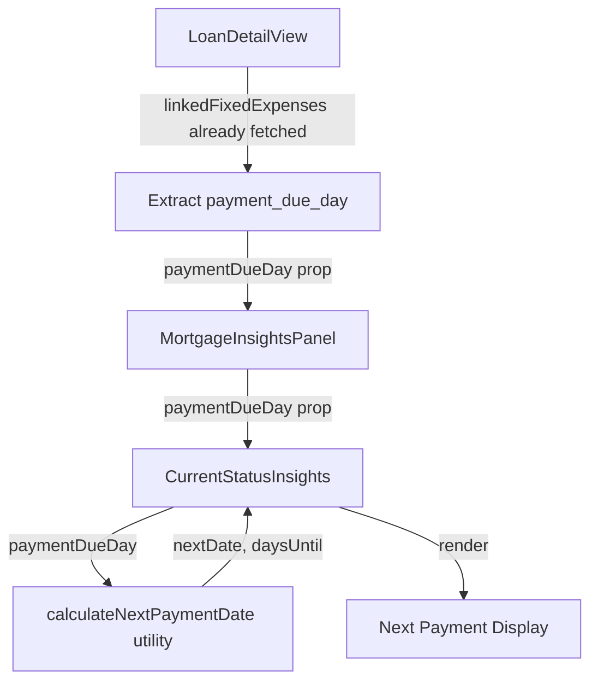

# Design Document: Mortgage Payment Date Display

## Overview

This feature displays the next mortgage payment date in the CurrentStatusInsights component by reusing the existing `payment_due_day` from linked fixed expenses. The implementation is entirely frontend — no database migrations, no API changes, no form updates.

The data already exists: `LoanDetailView` fetches linked fixed expenses (which include `payment_due_day`). We just need to:
1. Pass `payment_due_day` down through the component tree
2. Create a small utility to calculate the next payment date
3. Render it in CurrentStatusInsights with visual indicators

## Architecture

### Component Data Flow



### Existing Infrastructure Leveraged

- `LoanDetailView.jsx` already calls `getFixedExpensesByLoan(loan.id)` and stores results in `linkedFixedExpenses` state
- `backend/utils/dateUtils.js` has `calculateDaysUntilDue()` — the frontend utility mirrors this logic
- `reminderService.getLoanPaymentReminders()` already uses `payment_due_day` for reminder banners

## Components and Interfaces

### 1. LoanDetailView Changes (`frontend/src/components/LoanDetailView.jsx`)

Extract `payment_due_day` from the first linked fixed expense and pass it to MortgageInsightsPanel:

```jsx
// Derive paymentDueDay from linked fixed expenses (already fetched)
const paymentDueDay = linkedFixedExpenses.length > 0 
  ? linkedFixedExpenses[0].payment_due_day 
  : null;

// Pass to MortgageInsightsPanel
<MortgageInsightsPanel 
  mortgageId={loanData.id}
  mortgageData={loanData}
  paymentDueDay={paymentDueDay}
/>
```

### 2. MortgageInsightsPanel Changes (`frontend/src/components/MortgageInsightsPanel.jsx`)

Accept and forward `paymentDueDay` prop:

```jsx
const MortgageInsightsPanel = ({ mortgageId, mortgageData, paymentDueDay }) => {
  // ... existing code ...
  
  <CurrentStatusInsights 
    insights={insights}
    onEditPayment={handleEditPayment}
    onEditRate={handleEditRate}
    loading={isLoading}
    paymentDueDay={paymentDueDay}
  />
};
```

### 3. Next Payment Calculator (`frontend/src/utils/nextPaymentCalculator.js`)

New utility module mirroring the backend `calculateDaysUntilDue` logic:

```javascript
/**
 * Calculate the next payment date based on payment_due_day and current date.
 * Mirrors backend/utils/dateUtils.js calculateDaysUntilDue logic.
 * 
 * @param {number} paymentDueDay - Day of month (1-31)
 * @param {Date} [referenceDate=new Date()] - Reference date
 * @returns {{ nextDate: Date, daysUntil: number } | null}
 */
export function calculateNextPaymentDate(paymentDueDay, referenceDate = new Date()) {
  // Returns null if paymentDueDay is invalid
  // Determines if due date is this month or next
  // Adjusts for short months (Feb, 30-day months)
  // Returns the next Date and days until
}

/**
 * Get the last day of a given month.
 * @param {number} year
 * @param {number} month - 0-indexed (0=Jan, 11=Dec)
 * @returns {number}
 */
export function getLastDayOfMonth(year, month) {
  return new Date(year, month + 1, 0).getDate();
}

/**
 * Format a next payment date for display.
 * @param {Date} date
 * @returns {string} e.g., "January 15, 2025"
 */
export function formatNextPaymentDate(date) {
  return date.toLocaleDateString('en-US', {
    year: 'numeric',
    month: 'long',
    day: 'numeric'
  });
}
```

### 4. CurrentStatusInsights Changes (`frontend/src/components/CurrentStatusInsights.jsx`)

Add a new section for next payment display, placed between the Current Payment and Current Balance sections:

```jsx
const CurrentStatusInsights = ({ 
  insights, 
  onEditPayment,
  onEditRate,
  loading = false,
  paymentDueDay = null  // NEW PROP
}) => {
  // Calculate next payment info
  const nextPaymentInfo = paymentDueDay 
    ? calculateNextPaymentDate(paymentDueDay) 
    : null;
  
  const isPaymentToday = nextPaymentInfo?.daysUntil === 0;
  const isPaymentSoon = nextPaymentInfo?.daysUntil >= 0 && nextPaymentInfo?.daysUntil <= 7;

  // ... existing sections ...

  // NEW: Next Payment section (after Current Payment, before Current Balance)
  <div className="insights-section">
    <div className="insights-next-payment">
      <span className="next-payment-label">Next Payment</span>
      {nextPaymentInfo ? (
        <div className="next-payment-info">
          <span className={`next-payment-date ${isPaymentToday ? 'today' : isPaymentSoon ? 'soon' : ''}`}>
            {isPaymentToday ? 'Payment due today' : formatNextPaymentDate(nextPaymentInfo.nextDate)}
          </span>
          {isPaymentSoon && !isPaymentToday && (
            <span className="payment-soon-badge">Due soon</span>
          )}
        </div>
      ) : (
        <div className="next-payment-not-set">
          <span>Payment day not set</span>
          <span className="next-payment-hint">Configure in fixed expenses</span>
        </div>
      )}
    </div>
  </div>
};
```

### 5. CSS Additions (`frontend/src/components/CurrentStatusInsights.css`)

New styles for the next payment display section:

```css
/* Next Payment Display */
.insights-next-payment {
  display: flex;
  flex-direction: column;
  gap: var(--spacing-1);
}

.next-payment-label { /* matches existing label pattern */ }
.next-payment-date { /* default styling */ }
.next-payment-date.soon { /* warning color for due soon */ }
.next-payment-date.today { /* emphasis color for due today */ }
.payment-soon-badge { /* small badge similar to rate-type-badge */ }
.next-payment-not-set { /* muted hint styling */ }
```

## Data Models

### Props Flow

```
LoanDetailView
  └─ linkedFixedExpenses: Array<{ payment_due_day: number|null, ... }>
  └─ paymentDueDay: number|null (derived from first linked fixed expense)
      │
      ├─ MortgageInsightsPanel (pass-through)
      │   └─ paymentDueDay: number|null
      │       │
      │       └─ CurrentStatusInsights
      │           └─ paymentDueDay: number|null
      │           └─ nextPaymentInfo: { nextDate: Date, daysUntil: number } | null (computed)
```

### No Database or API Changes

The `payment_due_day` field already exists on fixed expenses. The existing `GET /api/fixed-expenses/by-loan/:loanId` endpoint already returns it. No schema changes needed.


## Correctness Properties

*A property is a characteristic or behavior that should hold true across all valid executions of a system — essentially, a formal statement about what the system should do. Properties serve as the bridge between human-readable specifications and machine-verifiable correctness guarantees.*

Based on the prework analysis, two consolidated properties cover all testable acceptance criteria:

### Property 1: Next Payment Date Calculation

*For any* valid `paymentDueDay` (1-31) and *any* reference date, the calculated next payment date SHALL satisfy:
1. The result date is greater than or equal to the reference date (normalized to midnight)
2. If `referenceDate.getDate() <= paymentDueDay` (adjusted for month length), the result is in the same month as the reference date
3. If `referenceDate.getDate() > paymentDueDay` (adjusted for month length), the result is in the following month
4. The day of the result equals `Math.min(paymentDueDay, lastDayOfTargetMonth)`

**Validates: Requirements 2.1, 2.2, 2.3, 2.4, 2.5**

**Rationale:** This single property covers the core calculation logic including month boundary decisions and short-month adjustments. Edge cases (February, 30-day months, day 31) are covered by generating diverse reference dates and payment days.

### Property 2: Payment Urgency Indicator

*For any* `daysUntil` value (integer >= 0), the urgency classification SHALL satisfy:
1. `daysUntil === 0` → "today" state
2. `1 <= daysUntil <= 7` → "soon" state
3. `daysUntil > 7` → "normal" state (no indicator)

**Validates: Requirements 3.2, 3.3**

**Rationale:** This property ensures the visual indicator logic is correct for all possible day differences. The "today" case (3.3) is an edge case subsumed by this property.

## Error Handling

| Condition | Handling |
|-----------|----------|
| `linkedFixedExpenses` is empty | `paymentDueDay` is `null` → "Payment day not set" display |
| `payment_due_day` is `null` on linked expense | Same as above |
| `paymentDueDay` is outside 1-31 | `calculateNextPaymentDate` returns `null` → fallback display |
| `paymentDueDay` exceeds days in target month | Adjusted to last day of month (e.g., 31 → 28 for Feb) |
| `linkedFixedExpenses` fetch fails | Already handled by `LoanDetailView` — defaults to empty array |

No new error states are introduced since this feature only reads existing data and performs client-side calculations.

## Testing Strategy

### Dual Testing Approach

- **Property tests**: Verify the next payment calculator and urgency indicator logic across randomized inputs
- **Unit tests**: Verify specific rendering scenarios (payment displayed, due soon badge, not-set state)

### Property-Based Testing Configuration

- **Library**: fast-check (already used in the project via Vitest)
- **Minimum iterations**: 100 per property test
- **Tag format**: `Feature: mortgage-payment-date-tracking, Property N: [description]`

### Test Files

| Component | Test File | Test Type |
|-----------|-----------|-----------|
| Next payment calculator | `frontend/src/utils/nextPaymentCalculator.pbt.test.js` | Property |
| CurrentStatusInsights | `frontend/src/components/CurrentStatusInsights.paymentDate.test.jsx` | Unit |

### Property Test Implementation

Each correctness property maps to a single property-based test:

```javascript
// Feature: mortgage-payment-date-tracking, Property 1: Next payment date calculation
test.prop(
  [fc.integer({ min: 1, max: 31 }), fc.date({ min: new Date(2020, 0, 1), max: new Date(2030, 11, 31) })],
  (paymentDueDay, referenceDate) => {
    const result = calculateNextPaymentDate(paymentDueDay, referenceDate);
    // Assert result.nextDate >= referenceDate
    // Assert correct month selection
    // Assert day is min(paymentDueDay, lastDayOfMonth)
  }
);

// Feature: mortgage-payment-date-tracking, Property 2: Payment urgency indicator
test.prop(
  [fc.integer({ min: 0, max: 365 })],
  (daysUntil) => {
    // Assert correct classification: today / soon / normal
  }
);
```

### Unit Test Coverage

Unit tests should cover:
1. CurrentStatusInsights renders "Next payment: January 15, 2025" when paymentDueDay is set
2. CurrentStatusInsights renders "Due soon" badge when within 7 days
3. CurrentStatusInsights renders "Payment due today" when daysUntil is 0
4. CurrentStatusInsights renders "Payment day not set" when paymentDueDay is null
