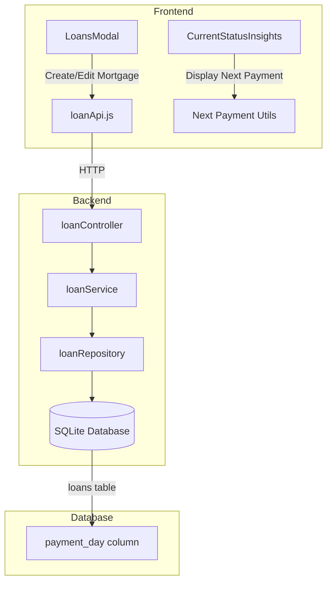

# Design Document: Mortgage Payment Date Tracking

## Overview

This feature extends the existing mortgage tracking system to include payment day configuration, enabling users to track when their mortgage payments are due each month. The implementation adds a `payment_day` column to the loans table, updates the mortgage creation/edit forms, and displays the calculated next payment date in the CurrentStatusInsights component.

The design follows the existing layered architecture pattern (Controller → Service → Repository → Database) and integrates seamlessly with the current mortgage tracking infrastructure.

## Architecture

### System Context



### Data Flow

1. **Create/Update Flow**: User enters payment_day in LoansModal → loanApi sends to backend → loanController validates → loanService processes → loanRepository persists to loans table

2. **Display Flow**: CurrentStatusInsights receives loan data with payment_day → Next Payment Calculator computes next date → Component renders formatted date with visual indicators

### Migration Strategy

Since the loans table has foreign key references from `loan_balances` (with CASCADE DELETE), the migration must:
1. Disable foreign keys before the transaction
2. Create new table with payment_day column
3. Copy existing data
4. Drop old table and rename new table
5. Re-enable foreign keys

This follows the established pattern in `database-migrations.md`.

## Components and Interfaces

### Backend Components

#### 1. Database Migration (`backend/database/migrations.js`)

```javascript
/**
 * Migration: Add payment_day column to loans table
 * @param {Database} db - SQLite database instance
 * @returns {Promise<void>}
 */
async function migrateAddPaymentDay(db) {
  const migrationName = 'add_payment_day_v1';
  
  // Check if already applied
  const isApplied = await checkMigrationApplied(db, migrationName);
  if (isApplied) return;
  
  await createBackup();
  await disableForeignKeys(db);
  
  // Create new table with payment_day, copy data, swap tables
  // payment_day: INTEGER CHECK(payment_day >= 1 AND payment_day <= 31)
}
```

#### 2. Loan Repository (`backend/repositories/loanRepository.js`)

Update existing methods to include payment_day:

```javascript
// create() - Add payment_day to INSERT
// update() - Add payment_day to UPDATE  
// updateMortgageFields() - Add payment_day to allowed fields
```

#### 3. Loan Service (`backend/services/loanService.js`)

Add validation for payment_day:

```javascript
/**
 * Validate payment_day value
 * @param {number|null} paymentDay - Day of month (1-31) or null
 * @returns {boolean} True if valid
 * @throws {Error} If invalid
 */
validatePaymentDay(paymentDay) {
  if (paymentDay === null || paymentDay === undefined) return true;
  if (!Number.isInteger(paymentDay) || paymentDay < 1 || paymentDay > 31) {
    throw new Error('Payment day must be between 1 and 31');
  }
  return true;
}
```

### Frontend Components

#### 1. LoansModal (`frontend/src/components/LoansModal.jsx`)

Add payment_day field to mortgage section:

```jsx
// Form state addition
const [formData, setFormData] = useState({
  // ... existing fields
  payment_day: ''  // New field
});

// Render payment day dropdown in mortgage section
<div className="loans-input-group">
  <label>Payment Day (optional)</label>
  <select
    value={formData.payment_day}
    onChange={(e) => setFormData({ ...formData, payment_day: e.target.value })}
  >
    <option value="">Not set</option>
    {[...Array(31)].map((_, i) => (
      <option key={i + 1} value={i + 1}>{i + 1}</option>
    ))}
  </select>
</div>
```

#### 2. Next Payment Calculator (`frontend/src/utils/nextPaymentCalculator.js`)

New utility module for date calculations:

```javascript
/**
 * Calculate the next payment date based on payment_day and current date
 * @param {number} paymentDay - Day of month (1-31)
 * @param {Date} [referenceDate=new Date()] - Reference date for calculation
 * @returns {Date} Next payment date
 */
function calculateNextPaymentDate(paymentDay, referenceDate = new Date()) {
  // Handle edge cases for months with fewer days
  // Return next occurrence of payment_day
}

/**
 * Get the last day of a given month
 * @param {number} year - Year
 * @param {number} month - Month (0-11)
 * @returns {number} Last day of month
 */
function getLastDayOfMonth(year, month) {
  return new Date(year, month + 1, 0).getDate();
}

/**
 * Adjust payment day for months with fewer days
 * @param {number} paymentDay - Configured payment day (1-31)
 * @param {number} year - Target year
 * @param {number} month - Target month (0-11)
 * @returns {number} Adjusted payment day
 */
function adjustPaymentDayForMonth(paymentDay, year, month) {
  const lastDay = getLastDayOfMonth(year, month);
  return Math.min(paymentDay, lastDay);
}
```

#### 3. CurrentStatusInsights (`frontend/src/components/CurrentStatusInsights.jsx`)

Add next payment display section:

```jsx
// New section for next payment display
<div className="insights-section">
  <div className="insights-next-payment">
    <span className="next-payment-label">Next Payment</span>
    {paymentDay ? (
      <div className="next-payment-info">
        <span className={`next-payment-date ${isPaymentSoon ? 'soon' : ''} ${isPaymentToday ? 'today' : ''}`}>
          {isPaymentToday ? 'Payment due today' : formatDate(nextPaymentDate)}
        </span>
        {isPaymentSoon && !isPaymentToday && (
          <span className="payment-soon-badge">Due soon</span>
        )}
      </div>
    ) : (
      <div className="next-payment-not-set">
        <span>Payment day not set</span>
        <span className="hint">Configure in mortgage settings</span>
      </div>
    )}
  </div>
</div>
```

## Data Models

### Database Schema

#### Loans Table (Updated)

```sql
CREATE TABLE loans (
  id INTEGER PRIMARY KEY AUTOINCREMENT,
  name TEXT NOT NULL,
  initial_balance REAL NOT NULL CHECK(initial_balance >= 0),
  start_date TEXT NOT NULL,
  notes TEXT,
  loan_type TEXT NOT NULL DEFAULT 'loan' CHECK(loan_type IN ('loan', 'line_of_credit', 'mortgage')),
  is_paid_off INTEGER DEFAULT 0,
  estimated_months_left INTEGER,
  -- Mortgage-specific fields
  amortization_period INTEGER,
  term_length INTEGER,
  renewal_date TEXT,
  rate_type TEXT CHECK(rate_type IN ('fixed', 'variable')),
  payment_frequency TEXT CHECK(payment_frequency IN ('monthly', 'bi-weekly', 'accelerated_bi-weekly')),
  estimated_property_value REAL,
  payment_day INTEGER CHECK(payment_day >= 1 AND payment_day <= 31),  -- NEW COLUMN
  created_at TEXT DEFAULT CURRENT_TIMESTAMP,
  updated_at TEXT DEFAULT CURRENT_TIMESTAMP
)
```

### API Data Structures

#### Create/Update Loan Request (Mortgage)

```typescript
interface MortgageLoanRequest {
  name: string;
  initial_balance: number;
  start_date: string;
  loan_type: 'mortgage';
  notes?: string;
  amortization_period: number;
  term_length: number;
  renewal_date: string;
  rate_type: 'fixed' | 'variable';
  payment_frequency: 'monthly' | 'bi-weekly' | 'accelerated_bi-weekly';
  estimated_property_value?: number;
  payment_day?: number;  // NEW FIELD: 1-31 or null
}
```

#### Loan Response

```typescript
interface LoanResponse {
  id: number;
  name: string;
  initial_balance: number;
  start_date: string;
  loan_type: 'loan' | 'line_of_credit' | 'mortgage';
  notes: string | null;
  is_paid_off: number;
  estimated_months_left: number | null;
  // Mortgage fields
  amortization_period: number | null;
  term_length: number | null;
  renewal_date: string | null;
  rate_type: 'fixed' | 'variable' | null;
  payment_frequency: 'monthly' | 'bi-weekly' | 'accelerated_bi-weekly' | null;
  estimated_property_value: number | null;
  payment_day: number | null;  // NEW FIELD
  currentBalance: number;
  currentRate: number;
  created_at: string;
  updated_at: string;
}
```

### Frontend State

#### LoansModal Form State

```typescript
interface LoanFormData {
  name: string;
  initial_balance: string;
  start_date: string;
  loan_type: 'loan' | 'line_of_credit' | 'mortgage';
  notes: string;
  // Mortgage fields
  amortization_period: string;
  term_length: string;
  renewal_date: string;
  rate_type: 'fixed' | 'variable';
  payment_frequency: 'monthly' | 'bi-weekly' | 'accelerated_bi-weekly';
  estimated_property_value: string;
  payment_day: string;  // NEW FIELD: '' or '1'-'31'
}
```


## Correctness Properties

*A property is a characteristic or behavior that should hold true across all valid executions of a system—essentially, a formal statement about what the system should do. Properties serve as the bridge between human-readable specifications and machine-verifiable correctness guarantees.*

Based on the prework analysis, the following properties have been identified and consolidated to eliminate redundancy:

### Property 1: Payment Day Validation Range

*For any* integer value provided as payment_day, the validation function SHALL accept values between 1 and 31 inclusive, and SHALL reject all values outside this range (including 0, negative numbers, and values > 31).

**Validates: Requirements 1.2, 2.4, 6.4**

**Rationale:** This property consolidates validation at all layers (database constraint, form validation, API validation). The same rule applies everywhere: payment_day must be 1-31 or null.

### Property 2: Migration Data Preservation

*For any* existing loans table with valid loan records, running the payment_day migration SHALL preserve all existing column values exactly, with the new payment_day column set to NULL for all existing records.

**Validates: Requirements 1.5**

**Rationale:** This is a round-trip property ensuring data integrity during schema migration. Before and after migration, all non-payment_day fields should be identical.

### Property 3: Payment Day Update Round-Trip

*For any* mortgage with a valid payment_day value (1-31), updating the payment_day and then retrieving the loan SHALL return the same payment_day value that was set.

**Validates: Requirements 3.4**

**Rationale:** This ensures the update flow correctly persists and retrieves payment_day values through the full stack (frontend → API → database → API → frontend).

### Property 4: Next Payment Date Calculation

*For any* payment_day (1-31) and any reference date, the calculated next payment date SHALL satisfy:
1. The result date is greater than or equal to the reference date
2. The day of the result date equals payment_day, OR equals the last day of the month if payment_day exceeds the month's length
3. If reference date's day < payment_day, result is in the same month
4. If reference date's day >= payment_day, result is in the next month

**Validates: Requirements 4.2, 4.3, 4.4**

**Rationale:** This comprehensive property covers all calculation scenarios including the month boundary logic and short-month edge cases.

### Property 5: Payment Soon Indicator Logic

*For any* next payment date and current date, the "payment soon" indicator SHALL be displayed if and only if the next payment date is within 7 days of the current date (inclusive of today, exclusive of 8+ days).

**Validates: Requirements 5.3**

**Rationale:** This property ensures the visual indicator logic is correct for all date combinations.

## Error Handling

### Database Layer

| Error Condition | Handling Strategy |
|----------------|-------------------|
| payment_day constraint violation | SQLite CHECK constraint returns error; repository propagates to service |
| Migration failure | Transaction rollback; foreign keys re-enabled; backup available for restore |
| NULL payment_day on non-mortgage | Allowed by schema; no error (semantic constraint only) |

### API Layer

| Error Condition | HTTP Status | Response |
|----------------|-------------|----------|
| payment_day < 1 or > 31 | 400 Bad Request | `{ "error": "Payment day must be between 1 and 31" }` |
| payment_day not an integer | 400 Bad Request | `{ "error": "Payment day must be a valid integer" }` |
| Loan not found for update | 404 Not Found | `{ "error": "Loan not found" }` |

### Frontend Layer

| Error Condition | User Feedback |
|----------------|---------------|
| Invalid payment_day selection | Validation error message below field |
| API error on save | Error banner with retry option |
| Network failure | "Network error. Please check your connection." |

### Edge Cases

1. **February 29 (Leap Year)**: If payment_day is 29-31 and target month is February in a non-leap year, use February 28
2. **Month Boundary**: If payment_day is 31 and target month has 30 days, use day 30
3. **Same Day Payment**: If today is the payment_day, show "Payment due today" (not next month)

## Testing Strategy

### Dual Testing Approach

This feature requires both unit tests and property-based tests for comprehensive coverage:

- **Unit tests**: Verify specific examples, edge cases (February, month boundaries), and error conditions
- **Property tests**: Verify universal properties across all valid inputs using randomized testing

### Property-Based Testing Configuration

- **Library**: fast-check (already used in the project)
- **Minimum iterations**: 100 per property test
- **Tag format**: `Feature: mortgage-payment-date-tracking, Property N: [property description]`

### Test Files

| Component | Test File | Test Type |
|-----------|-----------|-----------|
| Migration | `backend/database/migrations.paymentDay.pbt.test.js` | Property + Unit |
| Repository | `backend/repositories/loanRepository.paymentDay.pbt.test.js` | Property + Unit |
| Service validation | `backend/services/loanService.paymentDay.pbt.test.js` | Property |
| Next payment calculator | `frontend/src/utils/nextPaymentCalculator.pbt.test.js` | Property |
| CurrentStatusInsights | `frontend/src/components/CurrentStatusInsights.paymentDay.test.jsx` | Unit |
| LoansModal | `frontend/src/components/LoansModal.paymentDay.test.jsx` | Unit |

### Property Test Implementation

Each correctness property maps to a single property-based test:

```javascript
// Example: Property 1 - Payment Day Validation Range
// Feature: mortgage-payment-date-tracking, Property 1: Payment day validation range
test.prop([fc.integer()], (value) => {
  const isValid = value >= 1 && value <= 31;
  if (isValid) {
    expect(() => validatePaymentDay(value)).not.toThrow();
  } else {
    expect(() => validatePaymentDay(value)).toThrow();
  }
});

// Example: Property 4 - Next Payment Date Calculation
// Feature: mortgage-payment-date-tracking, Property 4: Next payment date calculation
test.prop([
  fc.integer({ min: 1, max: 31 }),
  fc.date({ min: new Date(2020, 0, 1), max: new Date(2030, 11, 31) })
], (paymentDay, referenceDate) => {
  const result = calculateNextPaymentDate(paymentDay, referenceDate);
  
  // Result is >= reference date
  expect(result >= referenceDate).toBe(true);
  
  // Day is correct (or last day of month)
  const lastDay = getLastDayOfMonth(result.getFullYear(), result.getMonth());
  const expectedDay = Math.min(paymentDay, lastDay);
  expect(result.getDate()).toBe(expectedDay);
  
  // Month logic is correct
  if (referenceDate.getDate() < paymentDay) {
    expect(result.getMonth()).toBe(referenceDate.getMonth());
  } else {
    expect(result.getMonth()).toBe((referenceDate.getMonth() + 1) % 12);
  }
});
```

### Unit Test Coverage

Unit tests should cover:

1. **Edge cases**: February 28/29, months with 30 days, payment_day = 31
2. **UI rendering**: Payment day dropdown options, conditional display
3. **Form validation**: Error messages, form submission blocking
4. **API integration**: Request/response structure, error responses
5. **Migration**: Schema verification, data preservation

### Test Data Generators

```javascript
// Arbitrary for valid payment days
const validPaymentDay = fc.integer({ min: 1, max: 31 });

// Arbitrary for invalid payment days
const invalidPaymentDay = fc.oneof(
  fc.integer({ max: 0 }),
  fc.integer({ min: 32 })
);

// Arbitrary for mortgage loan data
const mortgageLoan = fc.record({
  name: fc.string({ minLength: 1, maxLength: 100 }),
  initial_balance: fc.float({ min: 1000, max: 10000000 }),
  start_date: fc.date().map(d => d.toISOString().split('T')[0]),
  loan_type: fc.constant('mortgage'),
  payment_day: fc.option(validPaymentDay, { nil: null })
});
```
