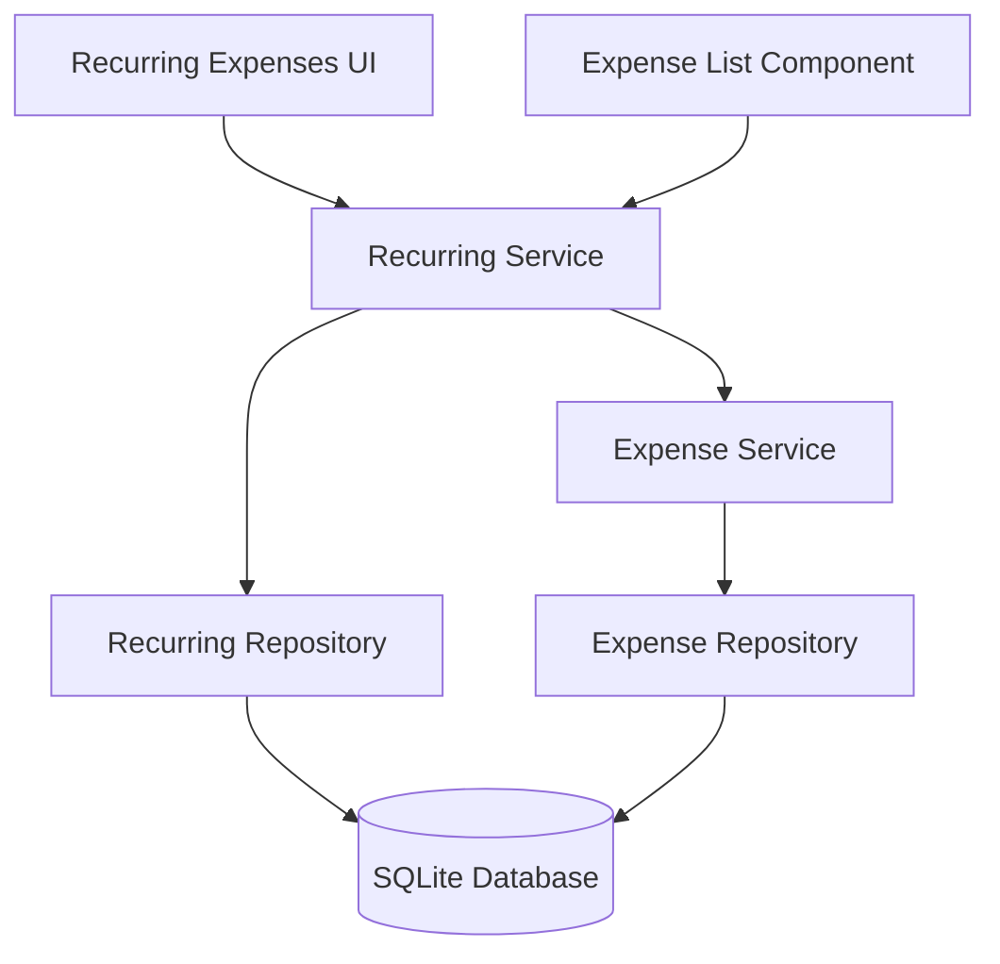

# Design Document

> **⚠️ DEPRECATED - Feature Removed in v4.0.0**
> 
> This feature was removed from the Expense Tracker application in version 4.0.0 (November 2025).
> The recurring expenses functionality has been replaced by the **Fixed Expenses** feature for 
> predictable monthly costs. This spec is retained for historical reference only.
> 
> **Migration Information:**
> - See: `RECURRING_EXPENSES_REMOVAL.md` for removal details
> - See: `RECURRING_EXPENSES_REMOVAL_COMPLETE.md` for completion report
> - Database migration automatically converts generated expenses to regular expenses
> - Use Fixed Expenses feature for tracking predictable monthly obligations

## Overview

The Recurring Expenses feature extends the existing Expense Tracker with template-based expense generation. Users can define recurring expense patterns that automatically create expense entries for each applicable month. The system uses a lazy generation approach - expenses are created on-demand when a user views a month, rather than through scheduled batch processing.

## Architecture

### System Components



### Technology Stack

Same as existing application:
- **Frontend**: React, CSS
- **Backend**: Node.js, Express
- **Database**: SQLite

## Components and Interfaces

### Backend Components

#### 1. Recurring Expense Repository
- `create(template)` - Create new recurring template
- `findAll()` - Get all recurring templates
- `findById(id)` - Get specific template
- `findActive(year, month)` - Get templates active for a specific month
- `update(id, template)` - Update template
- `delete(id)` - Delete template
- `togglePause(id, paused)` - Pause/resume template

#### 2. Recurring Expense Service
- `createRecurring(data)` - Validate and create template
- `getRecurringExpenses()` - Get all templates
- `updateRecurring(id, data)` - Update template
- `deleteRecurring(id)` - Delete template
- `generateExpensesForMonth(year, month)` - Generate expenses for viewing month
- `pauseRecurring(id, paused)` - Pause/resume

#### 3. Recurring Expense Controller
- `POST /api/recurring` - Create template
- `GET /api/recurring` - List templates
- `PUT /api/recurring/:id` - Update template
- `DELETE /api/recurring/:id` - Delete template
- `PATCH /api/recurring/:id/pause` - Pause/resume
- `POST /api/recurring/generate` - Generate for specific month

### Frontend Components

#### 1. RecurringExpensesManager Component
- List of all recurring templates
- Add/Edit/Delete buttons
- Pause/Resume toggle
- Shows: place, amount, type, method, day, start/end dates, status

#### 2. RecurringExpenseForm Component
- Form fields: place, amount, type, method, day of month, start month, end month (optional), notes
- Validation
- Save/Cancel actions

#### 3. ExpenseList Enhancement
- Visual indicator (icon/badge) for generated expenses
- Link to source recurring template

## Data Models

### Recurring Expense Template

```typescript
interface RecurringExpense {
  id: number;
  place: string;
  amount: number;
  notes: string;
  type: 'Housing' | 'Utilities' | 'Groceries' | 'Dining Out' | 'Insurance' | 
        'Gas' | 'Vehicle Maintenance' | 'Entertainment' | 'Subscriptions' | 
        'Recreation Activities' | 'Pet Care' | 'Tax - Medical' | 'Tax - Donation' | 'Other';
  method: 'Cash' | 'Debit' | 'CIBC MC' | 'PCF MC' | 'WS VISA' | 'VISA';
  day_of_month: number;        // 1-31
  start_month: string;          // YYYY-MM
  end_month: string | null;     // YYYY-MM or null for ongoing
  paused: boolean;
  created_at: string;
}
```

### Database Schema

```sql
CREATE TABLE recurring_expenses (
  id INTEGER PRIMARY KEY AUTOINCREMENT,
  place TEXT NOT NULL,
  amount REAL NOT NULL,
  notes TEXT,
  type TEXT NOT NULL CHECK(type IN ('Housing', 'Utilities', 'Groceries', 'Dining Out', 'Insurance',
                                     'Gas', 'Vehicle Maintenance', 'Entertainment', 'Subscriptions',
                                     'Recreation Activities', 'Pet Care', 'Tax - Medical', 'Tax - Donation', 'Other')),
  method TEXT NOT NULL CHECK(method IN ('Cash', 'Debit', 'CIBC MC', 'PCF MC', 'WS VISA', 'VISA')),
  day_of_month INTEGER NOT NULL CHECK(day_of_month >= 1 AND day_of_month <= 31),
  start_month TEXT NOT NULL,
  end_month TEXT,
  paused INTEGER DEFAULT 0,
  created_at TEXT DEFAULT CURRENT_TIMESTAMP
);

-- Add to expenses table
ALTER TABLE expenses ADD COLUMN recurring_id INTEGER;
ALTER TABLE expenses ADD COLUMN is_generated INTEGER DEFAULT 0;

-- Index for finding active recurring expenses
CREATE INDEX idx_recurring_dates ON recurring_expenses(start_month, end_month);
```

### Expense Enhancement

Existing expense records get two new fields:
- `recurring_id` - Links to the recurring template (null for manual expenses)
- `is_generated` - Boolean flag (0 = manual, 1 = generated)

## Generation Logic

### When to Generate

Expenses are generated lazily when:
1. User navigates to a month view
2. User explicitly requests generation via API

### Generation Algorithm

```javascript
function generateExpensesForMonth(year, month) {
  // 1. Get all active recurring templates for this month
  const templates = getActiveTemplates(year, month);
  
  // 2. For each template
  for (const template of templates) {
    // 3. Check if expense already exists for this month
    const exists = checkExpenseExists(template.id, year, month);
    
    if (!exists && !template.paused) {
      // 4. Calculate the date
      const day = Math.min(template.day_of_month, getDaysInMonth(year, month));
      const date = `${year}-${month.toString().padStart(2, '0')}-${day.toString().padStart(2, '0')}`;
      
      // 5. Create the expense
      createExpense({
        date,
        place: template.place,
        amount: template.amount,
        notes: template.notes,
        type: template.type,
        method: template.method,
        recurring_id: template.id,
        is_generated: 1
      });
    }
  }
}

function getActiveTemplates(year, month) {
  const currentMonth = `${year}-${month.toString().padStart(2, '0')}`;
  
  return templates.filter(t => {
    const afterStart = currentMonth >= t.start_month;
    const beforeEnd = !t.end_month || currentMonth <= t.end_month;
    return afterStart && beforeEnd;
  });
}
```

## Error Handling

### Validation
- Day of month: 1-31
- Start month: Valid YYYY-MM format
- End month: Must be >= start month if provided
- Amount: Positive number
- All other fields: Same validation as regular expenses

### Edge Cases
- Day 31 in months with fewer days → Use last day of month
- February 29-31 → Use February 28 (or 29 in leap years)
- Deleted template → Generated expenses remain but show "template deleted"
- Paused template → No new generation, existing expenses remain

## UI/UX Design

### Recurring Expenses Manager

Location: New button in header "🔄 Recurring" or in expense list header

Layout:
```
┌─────────────────────────────────────────────────────┐
│ Recurring Expenses                    [+ Add New]   │
├─────────────────────────────────────────────────────┤
│ 🔄 Netflix                                          │
│    $15.99 • Other • Debit • Day 1                   │
│    Jan 2024 → Ongoing                    [⏸️][✏️][🗑️] │
├─────────────────────────────────────────────────────┤
│ 🔄 Rent                                             │
│    $1,200.00 • Other • Cash • Day 1                 │
│    Jan 2024 → Dec 2024                   [▶️][✏️][🗑️] │
└─────────────────────────────────────────────────────┘
```

### Expense List Enhancement

Generated expenses show a small recurring icon (🔄) next to the place name.

### Form Fields

- Place (text)
- Amount (number)
- Type (dropdown)
- Payment Method (dropdown)
- Day of Month (number 1-31)
- Start Month (month picker YYYY-MM)
- End Month (month picker YYYY-MM, optional checkbox "Ongoing")
- Notes (textarea)

## Testing Strategy

### Unit Tests
- Date calculation logic (day of month edge cases)
- Active template filtering
- Generation algorithm
- Validation rules

### Integration Tests
- Create recurring template → Generate expenses for multiple months
- Edit template → Verify existing expenses unchanged
- Delete template → Verify expenses remain
- Pause/resume → Verify generation stops/starts

### Manual Testing
- Create recurring expense spanning multiple months
- Navigate through months and verify generation
- Edit generated expense independently
- Delete individual generated expense
- Pause template and verify no new generation

## Implementation Notes

### Performance
- Generation is O(n) where n = number of active templates
- Index on start_month/end_month for fast filtering
- Cache generated expense checks to avoid duplicate queries

### Migration
- Add new table and columns via ALTER TABLE
- Existing expenses get recurring_id = null, is_generated = 0

### Future Enhancements
- Weekly/bi-weekly recurring patterns
- Custom recurrence rules
- Bulk edit generated expenses
- Recurring expense reports
