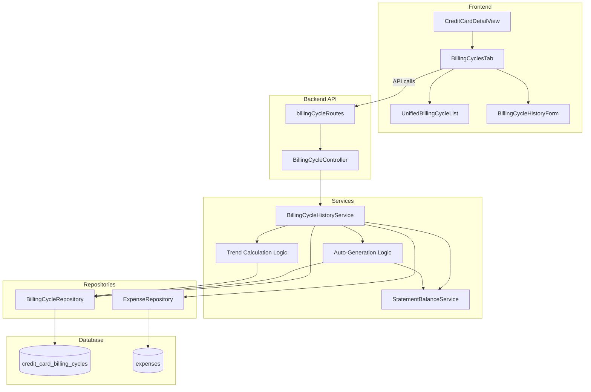

# Design Document: Unified Billing Cycles

## Overview

This feature consolidates the credit card billing cycle functionality by merging the "Billing Cycle History" section from the Overview tab and the "Statements" tab into a unified "Billing Cycles" tab. The system auto-generates billing cycle entries based on historical expenses, displays transaction counts per cycle, and shows trend indicators comparing cycle-to-cycle spending.

The design builds on the existing credit-card-billing-cycle-history infrastructure, enhancing the `BillingCycleHistoryService` with auto-generation capabilities and trend calculation, while simplifying the UI by removing redundant sections.

## Architecture



## Components and Interfaces

### Backend Components

#### Enhanced BillingCycleHistoryService

The existing service is enhanced with auto-generation and trend calculation capabilities.

```javascript
class BillingCycleHistoryService {
  // Existing methods remain unchanged...
  
  /**
   * Get unified billing cycles with auto-generation, transaction counts, and trends
   * @param {number} paymentMethodId - Payment method ID
   * @param {Object} options - Query options
   * @param {number} [options.limit=12] - Maximum cycles to return
   * @param {boolean} [options.includeAutoGenerate=true] - Whether to auto-generate missing cycles
   * @param {Date} [options.referenceDate] - Reference date for calculations
   * @returns {Promise<Array>} Array of unified billing cycle records
   */
  async getUnifiedBillingCycles(paymentMethodId, options = {});
  
  /**
   * Auto-generate billing cycles for historical periods with expenses
   * @param {number} paymentMethodId - Payment method ID
   * @param {number} billingCycleDay - Day of month when statement closes
   * @param {Date} referenceDate - Reference date (generates up to 12 months back)
   * @returns {Promise<Array>} Array of newly generated cycle records
   */
  async autoGenerateBillingCycles(paymentMethodId, billingCycleDay, referenceDate);
  
  /**
   * Calculate effective balance for a billing cycle
   * @param {Object} cycle - Billing cycle record
   * @returns {Object} { effectiveBalance, balanceType }
   */
  calculateEffectiveBalance(cycle);
  
  /**
   * Calculate trend indicator comparing two cycles
   * @param {number} currentEffectiveBalance - Current cycle's effective balance
   * @param {number} previousEffectiveBalance - Previous cycle's effective balance
   * @returns {Object|null} { type, icon, amount, cssClass } or null if no previous
   */
  calculateTrendIndicator(currentEffectiveBalance, previousEffectiveBalance);
  
  /**
   * Get transaction count for a billing cycle period
   * @param {number} paymentMethodId - Payment method ID
   * @param {string} cycleStartDate - Cycle start date (YYYY-MM-DD)
   * @param {string} cycleEndDate - Cycle end date (YYYY-MM-DD)
   * @returns {Promise<number>} Transaction count
   */
  async getTransactionCount(paymentMethodId, cycleStartDate, cycleEndDate);
  
  /**
   * Get historical periods that need billing cycle records
   * @param {number} paymentMethodId - Payment method ID
   * @param {number} billingCycleDay - Day of month when statement closes
   * @param {Date} referenceDate - Reference date
   * @param {number} monthsBack - How many months to look back (default 12)
   * @returns {Promise<Array>} Array of { startDate, endDate } for missing periods
   */
  async getMissingCyclePeriods(paymentMethodId, billingCycleDay, referenceDate, monthsBack);
}
```

#### Enhanced BillingCycleController

New endpoint for unified billing cycles.

```javascript
class BillingCycleController {
  // Existing methods remain unchanged...
  
  /**
   * GET /api/payment-methods/:id/billing-cycles/unified
   * Returns unified billing cycles with auto-generation, counts, and trends
   */
  async getUnifiedBillingCycles(req, res);
}
```

### Frontend Components

#### Updated CreditCardDetailView

The component is modified to:
1. Rename "Statements" tab to "Billing Cycles"
2. Remove "Billing Cycle History" collapsible section from Overview tab
3. Keep "Current Billing Cycle" card in Overview tab (shows transaction count, total spent, payments)
4. Use new unified billing cycles endpoint

#### UnifiedBillingCycleList Component

Enhanced list component replacing BillingCycleHistoryList for the unified view.

```jsx
const UnifiedBillingCycleList = ({
  cycles,                    // Array of unified billing cycle records
  paymentMethodId,
  onEnterStatement,          // Callback for "Enter Statement" action
  onEdit,                    // Callback for edit action
  onDelete,                  // Callback for delete action
  onViewPdf,                 // Callback for PDF view
  formatCurrency,
  formatDate,
  loading,
  error
}) => {
  // Display: cycle dates, effective balance, balance type, transaction count, trend indicator
  // Conditional actions: Edit/Delete for user-entered, "Enter Statement" for auto-generated
  // PDF indicator when statement_pdf_path exists
};
```

### API Endpoints

| Method | Endpoint | Description |
|--------|----------|-------------|
| GET | `/api/payment-methods/:id/billing-cycles/unified` | Get unified billing cycles with auto-generation |

Existing endpoints remain unchanged for backward compatibility.

### Query Parameters for Unified Endpoint

| Parameter | Type | Default | Description |
|-----------|------|---------|-------------|
| limit | number | 12 | Maximum number of cycles to return |
| include_auto_generate | boolean | true | Whether to auto-generate missing cycles |

## Data Models

### Unified Billing Cycle Response

```typescript
interface UnifiedBillingCycle {
  id: number;
  payment_method_id: number;
  cycle_start_date: string;           // YYYY-MM-DD
  cycle_end_date: string;             // YYYY-MM-DD
  actual_statement_balance: number;   // 0 if auto-generated
  calculated_statement_balance: number;
  effective_balance: number;          // actual if > 0, else calculated
  balance_type: 'actual' | 'calculated';
  transaction_count: number;
  trend_indicator: TrendIndicator | null;
  minimum_payment: number | null;
  due_date: string | null;
  notes: string | null;
  statement_pdf_path: string | null;
  created_at: string;
  updated_at: string;
}

interface TrendIndicator {
  type: 'higher' | 'lower' | 'same';
  icon: '↑' | '↓' | '✓';
  amount: number;                     // Absolute difference
  cssClass: 'trend-higher' | 'trend-lower' | 'trend-same';
}
```

### Unified Endpoint Response

```json
{
  "success": true,
  "billingCycles": [
    {
      "id": 5,
      "payment_method_id": 4,
      "cycle_start_date": "2025-01-16",
      "cycle_end_date": "2025-02-15",
      "actual_statement_balance": 1234.56,
      "calculated_statement_balance": 1189.23,
      "effective_balance": 1234.56,
      "balance_type": "actual",
      "transaction_count": 23,
      "trend_indicator": {
        "type": "higher",
        "icon": "↑",
        "amount": 145.33,
        "cssClass": "trend-higher"
      },
      "minimum_payment": 25.00,
      "due_date": "2025-03-01",
      "notes": null,
      "statement_pdf_path": null
    },
    {
      "id": 4,
      "payment_method_id": 4,
      "cycle_start_date": "2024-12-16",
      "cycle_end_date": "2025-01-15",
      "actual_statement_balance": 0,
      "calculated_statement_balance": 1089.23,
      "effective_balance": 1089.23,
      "balance_type": "calculated",
      "transaction_count": 18,
      "trend_indicator": {
        "type": "lower",
        "icon": "↓",
        "amount": 210.77,
        "cssClass": "trend-lower"
      },
      "minimum_payment": null,
      "due_date": null,
      "notes": null,
      "statement_pdf_path": null
    }
  ],
  "autoGeneratedCount": 3,
  "totalCount": 12
}
```

## Auto-Generation Algorithm

```
FUNCTION autoGenerateBillingCycles(paymentMethodId, billingCycleDay, referenceDate):
  1. Calculate 12 months of cycle periods from referenceDate
  2. Get existing billing cycle records for this payment method
  3. For each period NOT in existing records:
     a. Check if any expenses exist in this period
     b. If expenses exist:
        - Calculate statement balance using StatementBalanceService
        - Create billing cycle record with:
          - actual_statement_balance = 0
          - calculated_statement_balance = calculated value
          - transaction_count = count of expenses in period
  4. Return list of newly created records
```

## Trend Calculation Algorithm

```
FUNCTION calculateTrendIndicator(currentBalance, previousBalance):
  IF previousBalance is null:
    RETURN null
  
  difference = currentBalance - previousBalance
  absoluteDiff = ABS(difference)
  
  IF absoluteDiff <= 1.00:  // $1 tolerance
    RETURN { type: 'same', icon: '✓', amount: 0, cssClass: 'trend-same' }
  ELSE IF difference > 0:
    RETURN { type: 'higher', icon: '↑', amount: absoluteDiff, cssClass: 'trend-higher' }
  ELSE:
    RETURN { type: 'lower', icon: '↓', amount: absoluteDiff, cssClass: 'trend-lower' }
```

## Effective Balance Algorithm

```
FUNCTION calculateEffectiveBalance(cycle):
  IF cycle.actual_statement_balance > 0:
    RETURN { 
      effectiveBalance: cycle.actual_statement_balance, 
      balanceType: 'actual' 
    }
  ELSE:
    RETURN { 
      effectiveBalance: cycle.calculated_statement_balance, 
      balanceType: 'calculated' 
    }
```


## Correctness Properties

*A property is a characteristic or behavior that should hold true across all valid executions of a system—essentially, a formal statement about what the system should do. Properties serve as the bridge between human-readable specifications and machine-verifiable correctness guarantees.*

### Property 1: Auto-Generation Date Calculation

*For any* billing_cycle_day (1-31) and reference date, auto-generated billing cycles SHALL have cycle_start_date and cycle_end_date correctly calculated based on the billing_cycle_day, where cycle_end_date falls on billing_cycle_day (or last day of month if billing_cycle_day exceeds month length) and cycle_start_date is the day after the previous cycle's end date.

**Validates: Requirements 2.2**

### Property 2: Auto-Generated Cycles Have Zero Actual Balance

*For any* auto-generated billing cycle, the actual_statement_balance SHALL be 0, indicating no user-provided value.

**Validates: Requirements 2.3**

### Property 3: Auto-Generation Idempotence

*For any* payment method, calling auto-generate multiple times with the same reference date SHALL NOT create duplicate billing cycle records. The number of records after N calls equals the number after 1 call.

**Validates: Requirements 2.5**

### Property 4: Auto-Generation 12-Month Limit

*For any* auto-generation operation, all generated billing cycles SHALL have cycle_end_date within 12 months of the reference date. No cycles older than 12 months SHALL be generated.

**Validates: Requirements 2.6**

### Property 5: Transaction Count Accuracy

*For any* billing cycle period, the transaction_count SHALL equal the count of expenses where COALESCE(posted_date, date) falls within [cycle_start_date, cycle_end_date] inclusive.

**Validates: Requirements 3.2**

### Property 6: Effective Balance Calculation

*For any* billing cycle:
- If actual_statement_balance > 0, effective_balance SHALL equal actual_statement_balance and balance_type SHALL be 'actual'
- If actual_statement_balance = 0, effective_balance SHALL equal calculated_statement_balance and balance_type SHALL be 'calculated'

**Validates: Requirements 4.1, 4.2**

### Property 7: Trend Indicator Calculation

*For any* two consecutive billing cycles (current and previous) with effective balances Ec and Ep:
- If |Ec - Ep| <= 1.00, trend type SHALL be 'same' with icon '✓'
- If Ec - Ep > 1.00, trend type SHALL be 'higher' with icon '↑' and amount = |Ec - Ep|
- If Ep - Ec > 1.00, trend type SHALL be 'lower' with icon '↓' and amount = |Ep - Ec|

**Validates: Requirements 5.2, 5.3, 5.4, 5.6**

### Property 8: Billing Cycles Sorted Descending

*For any* list of billing cycles returned by the unified endpoint, cycles SHALL be sorted by cycle_end_date in descending order (most recent first).

**Validates: Requirements 6.1**

### Property 9: Action Buttons Based on Actual Balance

*For any* billing cycle displayed in the UI:
- If actual_statement_balance > 0, edit and delete buttons SHALL be displayed
- If actual_statement_balance = 0, "Enter Statement" button SHALL be displayed instead

**Validates: Requirements 6.3, 6.4**

### Property 10: Auto-Generation Preserves Existing Records

*For any* existing billing cycle record, auto-generation SHALL NOT modify its actual_statement_balance, calculated_statement_balance, or any other field.

**Validates: Requirements 9.1, 9.2**

### Property 11: No Auto-Generation Without Billing Cycle Day

*For any* payment method where billing_cycle_day is null or undefined, the auto-generation function SHALL NOT create any billing cycle records and SHALL return an empty array or appropriate error.

**Validates: Requirements 7.2**

## Error Handling

### Service Layer Errors

| Error Condition | Error Type | HTTP Status | Message |
|-----------------|------------|-------------|---------|
| Payment method not found | NotFoundError | 404 | "Payment method not found" |
| Payment method is not a credit card | ValidationError | 400 | "Billing cycles only available for credit cards" |
| No billing_cycle_day configured | ValidationError | 400 | "Billing cycle day not configured for this credit card" |
| Invalid limit parameter | ValidationError | 400 | "Limit must be a positive integer" |
| Database operation failed | DatabaseError | 500 | "Failed to retrieve billing cycles" |

### Controller Layer Errors

| Error Condition | Error Type | HTTP Status | Message |
|-----------------|------------|-------------|---------|
| Invalid payment method ID format | ValidationError | 400 | "Invalid payment method ID" |
| Invalid query parameters | ValidationError | 400 | "Invalid query parameter: {param}" |

### Error Response Format

```json
{
  "success": false,
  "error": "Error message describing the issue",
  "code": "ERROR_CODE"
}
```

## Testing Strategy

### Dual Testing Approach

This feature requires both unit tests and property-based tests for comprehensive coverage:

- **Unit tests**: Verify specific examples, edge cases, API endpoint behavior, and error conditions
- **Property tests**: Verify universal properties across all valid inputs using randomized testing

### Property-Based Testing Configuration

- **Library**: fast-check (already used in the project)
- **Minimum iterations**: 100 per property test
- **Tag format**: `Feature: unified-billing-cycles, Property {number}: {property_text}`

### Test Files Structure

```
backend/
├── services/
│   ├── billingCycleHistoryService.autoGeneration.pbt.test.js  # Properties 1-4, 10-11
│   ├── billingCycleHistoryService.effective.pbt.test.js       # Property 6
│   └── billingCycleHistoryService.trend.pbt.test.js           # Property 7
├── repositories/
│   └── billingCycleRepository.transactionCount.pbt.test.js    # Property 5
├── controllers/
│   └── billingCycleController.unified.test.js                 # API endpoint tests, Property 8

frontend/
├── components/
│   ├── UnifiedBillingCycleList.test.jsx                       # UI rendering tests
│   ├── UnifiedBillingCycleList.actions.pbt.test.jsx           # Property 9
│   └── CreditCardDetailView.unified.test.jsx                  # Tab renaming, section removal
```

### Unit Test Coverage

1. **Service Tests**
   - Auto-generation with various expense distributions
   - Edge cases: empty expense history, single expense, expenses spanning multiple cycles
   - Effective balance calculation edge cases
   - Trend calculation with boundary values ($1 tolerance)

2. **Controller Tests**
   - Unified endpoint with valid parameters
   - Query parameter validation
   - Error responses for invalid inputs

3. **Frontend Tests**
   - Tab label is "Billing Cycles" not "Statements"
   - Overview tab does not contain "Billing Cycle History" section
   - Empty state when billing_cycle_day not configured
   - Correct action buttons based on actual_statement_balance

### Property Test Coverage

Each correctness property (1-11) will have a corresponding property-based test that:
- Generates random valid inputs using fast-check arbitraries
- Verifies the property holds for all generated inputs
- Includes edge cases in the generator (zero balances, boundary dates, etc.)

### Integration Test Scenarios

1. **Full Auto-Generation Flow**: Create expenses → Call unified endpoint → Verify cycles generated
2. **Mixed Data Flow**: Some cycles with user data, some auto-generated → Verify correct effective balances
3. **Trend Calculation Flow**: Multiple cycles → Verify trend indicators are correct
4. **Backward Compatibility**: Existing CRUD operations still work after changes

