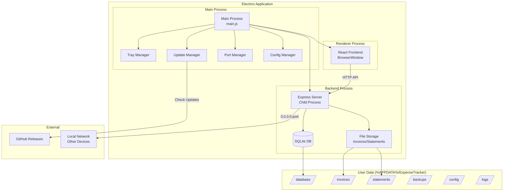

# Design Document: Windows Desktop App

## Overview

This design describes the architecture for packaging the Expense Tracker as a distributable Windows desktop application using Electron. The solution bundles the existing React frontend and Node.js/Express backend into a single installable package with auto-update capabilities, system tray support, and proper Windows integration.

**Status: For Future Consideration** - This specification is planned for future implementation.

### Key Design Decisions

1. **Electron as the wrapper framework** - Industry standard for web-to-desktop apps, mature ecosystem
2. **electron-builder for packaging** - Supports NSIS installers, auto-update, and code signing
3. **Child process for backend** - Backend runs as a spawned Node.js process, not embedded
4. **electron-updater for updates** - Seamless integration with GitHub releases
5. **%APPDATA% for user data** - Standard Windows location, survives reinstalls

## Architecture



## Components and Interfaces

### 1. Main Process (main.js)

The Electron main process orchestrates the application lifecycle.

```javascript
// electron/main.js - Main process entry point
const { app, BrowserWindow, Tray, Menu, ipcMain, nativeTheme } = require('electron');
const path = require('path');
const { spawn } = require('child_process');

class ExpenseTrackerApp {
  constructor() {
    this.mainWindow = null;
    this.tray = null;
    this.backendProcess = null;
    this.serverPort = null;
    this.configManager = new ConfigManager();
    this.portManager = new PortManager();
    this.updateManager = new UpdateManager();
  }

  async initialize() {
    await this.configManager.load();
    this.serverPort = await this.portManager.findAvailablePort(
      this.configManager.get('port', 2626)
    );
    await this.startBackend();
    await this.createWindow();
    this.setupTray();
    this.updateManager.checkForUpdates();
  }

  async startBackend() {
    // Spawn backend as child process
  }

  async createWindow() {
    // Create BrowserWindow with security settings
  }

  setupTray() {
    // Configure system tray
  }
}
```

**Interface: IAppLifecycle**
```typescript
interface IAppLifecycle {
  initialize(): Promise<void>;
  startBackend(): Promise<void>;
  stopBackend(): Promise<void>;
  createWindow(): Promise<void>;
  setupTray(): void;
  quit(): void;
}
```

### 2. Backend Process Manager

Manages the Express server as a child process.

```javascript
// electron/backendManager.js
class BackendManager {
  constructor(port, dataPath) {
    this.port = port;
    this.dataPath = dataPath;
    this.process = null;
    this.isReady = false;
  }

  async start() {
    return new Promise((resolve, reject) => {
      const env = {
        ...process.env,
        PORT: this.port,
        DATA_PATH: this.dataPath,
        NODE_ENV: 'production'
      };

      // Path to bundled backend
      const serverPath = path.join(__dirname, '../backend/server.js');
      
      this.process = spawn('node', [serverPath], { env });
      
      this.process.stdout.on('data', (data) => {
        if (data.toString().includes('Server is running')) {
          this.isReady = true;
          resolve();
        }
      });

      this.process.on('error', reject);
      
      // Timeout after 30 seconds
      setTimeout(() => {
        if (!this.isReady) {
          reject(new Error('Backend failed to start within timeout'));
        }
      }, 30000);
    });
  }

  async stop() {
    if (this.process) {
      this.process.kill('SIGTERM');
      await this.waitForExit();
    }
  }

  async waitForExit() {
    return new Promise((resolve) => {
      if (!this.process) return resolve();
      this.process.on('exit', resolve);
      setTimeout(resolve, 5000); // Force resolve after 5s
    });
  }
}
```

**Interface: IBackendManager**
```typescript
interface IBackendManager {
  start(): Promise<void>;
  stop(): Promise<void>;
  isRunning(): boolean;
  getPort(): number;
  restart(): Promise<void>;
}
```

### 3. Port Manager

Finds available ports and handles port conflicts.

```javascript
// electron/portManager.js
const net = require('net');

class PortManager {
  async findAvailablePort(preferredPort, maxAttempts = 10) {
    let port = preferredPort;
    
    for (let i = 0; i < maxAttempts; i++) {
      if (await this.isPortAvailable(port)) {
        return port;
      }
      port++;
    }
    
    throw new Error(`No available port found starting from ${preferredPort}`);
  }

  isPortAvailable(port) {
    return new Promise((resolve) => {
      const server = net.createServer();
      server.once('error', () => resolve(false));
      server.once('listening', () => {
        server.close();
        resolve(true);
      });
      server.listen(port, '127.0.0.1');
    });
  }
}
```

**Interface: IPortManager**
```typescript
interface IPortManager {
  findAvailablePort(preferredPort: number, maxAttempts?: number): Promise<number>;
  isPortAvailable(port: number): Promise<boolean>;
}
```

### 4. Config Manager

Manages application configuration persisted to disk.

```javascript
// electron/configManager.js
const fs = require('fs').promises;
const path = require('path');

class ConfigManager {
  constructor() {
    this.configPath = path.join(
      process.env.APPDATA || app.getPath('userData'),
      'ExpenseTracker',
      'config',
      'settings.json'
    );
    this.config = {};
  }

  async load() {
    try {
      const data = await fs.readFile(this.configPath, 'utf8');
      this.config = JSON.parse(data);
    } catch (err) {
      if (err.code !== 'ENOENT') throw err;
      this.config = this.getDefaults();
    }
  }

  async save() {
    await fs.mkdir(path.dirname(this.configPath), { recursive: true });
    await fs.writeFile(this.configPath, JSON.stringify(this.config, null, 2));
  }

  get(key, defaultValue) {
    return this.config[key] ?? defaultValue;
  }

  set(key, value) {
    this.config[key] = value;
  }

  getDefaults() {
    return {
      port: 2626,
      minimizeToTray: true,
      startOnBoot: false,
      autoUpdate: true,
      localNetworkAccess: true,
      theme: 'system'
    };
  }
}
```

**Interface: IConfigManager**
```typescript
interface IConfigManager {
  load(): Promise<void>;
  save(): Promise<void>;
  get<T>(key: string, defaultValue?: T): T;
  set<T>(key: string, value: T): void;
  getDefaults(): AppConfig;
}

interface AppConfig {
  port: number;
  minimizeToTray: boolean;
  startOnBoot: boolean;
  autoUpdate: boolean;
  localNetworkAccess: boolean;
  theme: 'light' | 'dark' | 'system';
}
```

### 5. Update Manager

Handles auto-updates via electron-updater.

```javascript
// electron/updateManager.js
const { autoUpdater } = require('electron-updater');
const { ipcMain, dialog } = require('electron');

class UpdateManager {
  constructor(mainWindow) {
    this.mainWindow = mainWindow;
    this.setupAutoUpdater();
  }

  setupAutoUpdater() {
    autoUpdater.autoDownload = false;
    autoUpdater.autoInstallOnAppQuit = true;

    autoUpdater.on('update-available', (info) => {
      this.mainWindow.webContents.send('update-available', info);
    });

    autoUpdater.on('update-downloaded', (info) => {
      this.mainWindow.webContents.send('update-downloaded', info);
    });

    autoUpdater.on('error', (err) => {
      this.mainWindow.webContents.send('update-error', err.message);
    });

    autoUpdater.on('download-progress', (progress) => {
      this.mainWindow.webContents.send('update-progress', progress);
    });
  }

  async checkForUpdates() {
    try {
      return await autoUpdater.checkForUpdates();
    } catch (err) {
      console.error('Update check failed:', err);
      return null;
    }
  }

  async downloadUpdate() {
    return autoUpdater.downloadUpdate();
  }

  quitAndInstall() {
    autoUpdater.quitAndInstall();
  }
}
```

**Interface: IUpdateManager**
```typescript
interface IUpdateManager {
  checkForUpdates(): Promise<UpdateCheckResult | null>;
  downloadUpdate(): Promise<void>;
  quitAndInstall(): void;
}
```

### 6. Tray Manager

Manages the system tray icon and menu.

```javascript
// electron/trayManager.js
const { Tray, Menu, nativeImage } = require('electron');
const path = require('path');

class TrayManager {
  constructor(app, mainWindow, updateManager) {
    this.app = app;
    this.mainWindow = mainWindow;
    this.updateManager = updateManager;
    this.tray = null;
  }

  create() {
    const iconPath = path.join(__dirname, '../assets/tray-icon.png');
    this.tray = new Tray(nativeImage.createFromPath(iconPath));
    
    this.tray.setToolTip('Expense Tracker');
    this.updateContextMenu();

    this.tray.on('click', () => {
      this.mainWindow.show();
    });
  }

  updateContextMenu(status = 'running') {
    const contextMenu = Menu.buildFromTemplate([
      { label: 'Open Expense Tracker', click: () => this.mainWindow.show() },
      { type: 'separator' },
      { label: 'Check for Updates', click: () => this.updateManager.checkForUpdates() },
      { label: 'Settings', click: () => this.openSettings() },
      { type: 'separator' },
      { label: `Status: ${status}`, enabled: false },
      { type: 'separator' },
      { label: 'Exit', click: () => this.app.quit() }
    ]);
    
    this.tray.setContextMenu(contextMenu);
  }

  setStatus(status) {
    this.updateContextMenu(status);
    // Update icon based on status
  }

  destroy() {
    if (this.tray) {
      this.tray.destroy();
    }
  }
}
```

**Interface: ITrayManager**
```typescript
interface ITrayManager {
  create(): void;
  setStatus(status: 'running' | 'updating' | 'error'): void;
  destroy(): void;
}
```

### 7. Window Manager

Creates and manages the main BrowserWindow with security settings.

```javascript
// electron/windowManager.js
const { BrowserWindow, shell } = require('electron');
const path = require('path');

class WindowManager {
  constructor(serverPort) {
    this.serverPort = serverPort;
    this.mainWindow = null;
  }

  create() {
    this.mainWindow = new BrowserWindow({
      width: 1400,
      height: 900,
      minWidth: 800,
      minHeight: 600,
      icon: path.join(__dirname, '../assets/icon.ico'),
      webPreferences: {
        nodeIntegration: false,
        contextIsolation: true,
        preload: path.join(__dirname, 'preload.js'),
        sandbox: true
      },
      show: false
    });

    // Load the app from the local backend server
    this.mainWindow.loadURL(`http://localhost:${this.serverPort}`);

    // Show window when ready
    this.mainWindow.once('ready-to-show', () => {
      this.mainWindow.show();
    });

    // Handle external links
    this.mainWindow.webContents.setWindowOpenHandler(({ url }) => {
      shell.openExternal(url);
      return { action: 'deny' };
    });

    // Minimize to tray instead of closing
    this.mainWindow.on('close', (event) => {
      if (!this.isQuitting) {
        event.preventDefault();
        this.mainWindow.hide();
      }
    });

    return this.mainWindow;
  }

  setQuitting(value) {
    this.isQuitting = value;
  }
}
```

**Interface: IWindowManager**
```typescript
interface IWindowManager {
  create(): BrowserWindow;
  setQuitting(value: boolean): void;
  getWindow(): BrowserWindow | null;
}
```

### 8. Preload Script

Secure bridge between main and renderer processes.

```javascript
// electron/preload.js
const { contextBridge, ipcRenderer } = require('electron');

contextBridge.exposeInMainWorld('electronAPI', {
  // App info
  getVersion: () => ipcRenderer.invoke('get-version'),
  getServerUrl: () => ipcRenderer.invoke('get-server-url'),
  getLocalNetworkUrl: () => ipcRenderer.invoke('get-local-network-url'),
  
  // Updates
  checkForUpdates: () => ipcRenderer.invoke('check-for-updates'),
  downloadUpdate: () => ipcRenderer.invoke('download-update'),
  installUpdate: () => ipcRenderer.invoke('install-update'),
  onUpdateAvailable: (callback) => ipcRenderer.on('update-available', callback),
  onUpdateProgress: (callback) => ipcRenderer.on('update-progress', callback),
  onUpdateDownloaded: (callback) => ipcRenderer.on('update-downloaded', callback),
  
  // Settings
  getSettings: () => ipcRenderer.invoke('get-settings'),
  saveSettings: (settings) => ipcRenderer.invoke('save-settings', settings),
  
  // Dialogs
  showOpenDialog: (options) => ipcRenderer.invoke('show-open-dialog', options),
  showSaveDialog: (options) => ipcRenderer.invoke('show-save-dialog', options),
  
  // Logs
  openLogsFolder: () => ipcRenderer.invoke('open-logs-folder'),
  exportLogs: () => ipcRenderer.invoke('export-logs')
});
```

## Data Models

### Application Configuration

```typescript
interface AppConfiguration {
  // Server settings
  port: number;                    // Default: 2626
  localNetworkAccess: boolean;     // Default: true
  
  // UI settings
  minimizeToTray: boolean;         // Default: true
  startOnBoot: boolean;            // Default: false
  theme: 'light' | 'dark' | 'system';  // Default: 'system'
  
  // Update settings
  autoUpdate: boolean;             // Default: true
  checkUpdateOnStart: boolean;     // Default: true
  
  // Backup settings (inherited from existing app)
  autoBackup: boolean;
  backupInterval: number;
  maxBackups: number;
  
  // First run
  setupCompleted: boolean;         // Default: false
  installedVersion: string;
}
```

### Data Directory Structure

```
%APPDATA%/ExpenseTracker/
├── config/
│   └── settings.json          # Application configuration
├── database/
│   └── expenses.db            # SQLite database
├── invoices/
│   └── {expense_id}/          # Invoice PDFs per expense
├── statements/
│   └── {payment_method_id}/   # Credit card statements
├── backups/
│   └── expense-tracker-backup-*.tar.gz
└── logs/
    ├── main.log               # Main process logs
    ├── backend.log            # Backend server logs
    └── renderer.log           # Renderer process logs
```

### Update Information

```typescript
interface UpdateInfo {
  version: string;
  releaseDate: string;
  releaseNotes: string;
  downloadUrl: string;
  sha512: string;
}

interface UpdateProgress {
  bytesPerSecond: number;
  percent: number;
  transferred: number;
  total: number;
}
```


## Correctness Properties

*A property is a characteristic or behavior that should hold true across all valid executions of a system—essentially, a formal statement about what the system should do. Properties serve as the bridge between human-readable specifications and machine-verifiable correctness guarantees.*

### Property 1: Port Management Correctness

*For any* port configuration (preferred port and max attempts), the PortManager should either return the preferred port if available, or find the next available port within the attempt range, or throw an error if no port is available.

**Validates: Requirements 1.3, 7.5**

### Property 2: Semantic Version Comparison

*For any* two valid semantic version strings (major.minor.patch), the version comparison should correctly determine which version is newer, older, or equal according to semver specification.

**Validates: Requirements 3.8**

### Property 3: Update Retry Logic

*For any* failed update download attempt, the Auto_Updater should retry exactly up to 3 times before notifying the user of failure, and the retry count should reset on successful download.

**Validates: Requirements 3.6**

### Property 4: Data Storage Location Invariant

*For any* data write operation (database, invoices, statements, backups, config), the resulting file path should be within the AppData_Directory (%APPDATA%/ExpenseTracker/).

**Validates: Requirements 5.1, 5.2, 5.3, 5.4, 5.5, 5.6**

### Property 5: Log Storage Location Invariant

*For any* log event generated by the application (main process, backend, renderer), the log entry should be written to a file within %APPDATA%/ExpenseTracker/logs/.

**Validates: Requirements 11.1**

### Property 6: Log Rotation Bounds

*For any* sequence of log writes, the total size of log files should never exceed the configured maximum (e.g., 50MB), and the number of rotated log files should never exceed the configured count (e.g., 5 files).

**Validates: Requirements 11.6**

### Property 7: IPC Message Validation

*For any* IPC message received by the main process from the renderer, the message should be validated against the allowed channel list and parameter schema before processing.

**Validates: Requirements 12.3**

### Property 8: Configuration Round-Trip

*For any* valid AppConfiguration object, saving it to disk and loading it back should produce an equivalent configuration object.

**Validates: Requirements 5.6, 6.6**

## Error Handling

### Backend Startup Failures

```javascript
// electron/errorHandler.js
class ErrorHandler {
  handleBackendStartupError(error) {
    const errorTypes = {
      EADDRINUSE: {
        title: 'Port Already in Use',
        message: `Port ${error.port} is already in use by another application.`,
        actions: [
          { label: 'Use Different Port', action: 'changePort' },
          { label: 'Retry', action: 'retry' },
          { label: 'Exit', action: 'quit' }
        ]
      },
      EACCES: {
        title: 'Permission Denied',
        message: 'The application does not have permission to use this port.',
        actions: [
          { label: 'Use Different Port', action: 'changePort' },
          { label: 'Run as Administrator', action: 'elevate' },
          { label: 'Exit', action: 'quit' }
        ]
      },
      TIMEOUT: {
        title: 'Backend Startup Timeout',
        message: 'The backend server took too long to start.',
        actions: [
          { label: 'Retry', action: 'retry' },
          { label: 'View Logs', action: 'viewLogs' },
          { label: 'Exit', action: 'quit' }
        ]
      }
    };

    const errorInfo = errorTypes[error.code] || {
      title: 'Startup Error',
      message: error.message,
      actions: [
        { label: 'Retry', action: 'retry' },
        { label: 'View Logs', action: 'viewLogs' },
        { label: 'Exit', action: 'quit' }
      ]
    };

    return this.showErrorDialog(errorInfo);
  }

  async showErrorDialog(errorInfo) {
    const { dialog } = require('electron');
    const result = await dialog.showMessageBox({
      type: 'error',
      title: errorInfo.title,
      message: errorInfo.message,
      buttons: errorInfo.actions.map(a => a.label),
      defaultId: 0
    });
    
    return errorInfo.actions[result.response].action;
  }
}
```

### Update Failures

```javascript
// Retry logic with exponential backoff
class UpdateRetryHandler {
  constructor(maxRetries = 3) {
    this.maxRetries = maxRetries;
    this.retryCount = 0;
    this.baseDelay = 1000; // 1 second
  }

  async attemptDownload(downloadFn) {
    while (this.retryCount < this.maxRetries) {
      try {
        await downloadFn();
        this.retryCount = 0; // Reset on success
        return true;
      } catch (error) {
        this.retryCount++;
        if (this.retryCount >= this.maxRetries) {
          throw new Error(`Update failed after ${this.maxRetries} attempts: ${error.message}`);
        }
        const delay = this.baseDelay * Math.pow(2, this.retryCount - 1);
        await this.sleep(delay);
      }
    }
  }

  sleep(ms) {
    return new Promise(resolve => setTimeout(resolve, ms));
  }
}
```

### Database Errors

```javascript
// Handle database corruption or migration failures
class DatabaseErrorHandler {
  async handleDatabaseError(error) {
    if (error.code === 'SQLITE_CORRUPT') {
      return this.offerRestoreFromBackup();
    }
    
    if (error.code === 'SQLITE_CANTOPEN') {
      return this.offerCreateNewDatabase();
    }
    
    // Log and show generic error
    logger.error('Database error:', error);
    return this.showGenericDatabaseError(error);
  }

  async offerRestoreFromBackup() {
    const backups = await this.listAvailableBackups();
    if (backups.length === 0) {
      return this.offerCreateNewDatabase();
    }
    
    // Show dialog to select backup
    return this.showBackupRestoreDialog(backups);
  }
}
```

## Testing Strategy

### Unit Tests

Unit tests focus on individual components and their logic:

1. **PortManager Tests**
   - Test port availability checking
   - Test finding next available port
   - Test handling of all ports in use

2. **ConfigManager Tests**
   - Test loading existing config
   - Test creating default config
   - Test saving config changes
   - Test handling corrupted config files

3. **Version Comparison Tests**
   - Test semver comparison edge cases
   - Test pre-release version handling

4. **Path Resolution Tests**
   - Test AppData path resolution on different Windows versions
   - Test path construction for all data types

### Property-Based Tests

Property tests verify universal properties across many generated inputs:

1. **Port Management Property Test**
   - Generate random port numbers and availability states
   - Verify correct port selection behavior
   - Library: fast-check
   - Minimum iterations: 100

2. **Semver Comparison Property Test**
   - Generate random valid semver strings
   - Verify comparison transitivity and correctness
   - Library: fast-check
   - Minimum iterations: 100

3. **Configuration Round-Trip Property Test**
   - Generate random valid configurations
   - Verify save/load produces equivalent config
   - Library: fast-check
   - Minimum iterations: 100

4. **IPC Validation Property Test**
   - Generate random IPC messages (valid and invalid)
   - Verify validation correctly accepts/rejects
   - Library: fast-check
   - Minimum iterations: 100

### Integration Tests

1. **Application Lifecycle Tests**
   - Test full startup sequence
   - Test graceful shutdown
   - Test minimize to tray behavior

2. **Update Flow Tests**
   - Mock GitHub releases API
   - Test update detection
   - Test download and install flow

3. **Data Persistence Tests**
   - Test data survives app restart
   - Test data survives reinstall (simulated)

### End-to-End Tests

1. **Installation Tests** (manual or CI)
   - Verify installer creates correct shortcuts
   - Verify uninstaller preserves user data
   - Verify registry entries

2. **Network Access Tests**
   - Test local network accessibility
   - Test localhost-only mode

## Build Configuration

### electron-builder Configuration

```json
// electron-builder.json
{
  "appId": "com.expensetracker.app",
  "productName": "Expense Tracker",
  "directories": {
    "output": "dist-electron"
  },
  "files": [
    "electron/**/*",
    "backend/**/*",
    "frontend/dist/**/*",
    "!**/*.test.js",
    "!**/node_modules/*/{test,__tests__,tests}/**"
  ],
  "extraResources": [
    {
      "from": "assets",
      "to": "assets"
    }
  ],
  "win": {
    "target": [
      {
        "target": "nsis",
        "arch": ["x64"]
      }
    ],
    "icon": "assets/icon.ico"
  },
  "nsis": {
    "oneClick": false,
    "allowToChangeInstallationDirectory": true,
    "createDesktopShortcut": "always",
    "createStartMenuShortcut": true,
    "shortcutName": "Expense Tracker",
    "include": "installer/installer.nsh",
    "installerIcon": "assets/icon.ico",
    "uninstallerIcon": "assets/icon.ico",
    "license": "LICENSE"
  },
  "publish": {
    "provider": "github",
    "owner": "your-username",
    "repo": "expense-tracker"
  }
}
```

### GitHub Actions Workflow

```yaml
# .github/workflows/electron-build.yml
name: Build Electron App

on:
  push:
    branches: [release/*]
    tags: ['v*']
  workflow_dispatch:

jobs:
  build:
    runs-on: windows-latest
    
    steps:
      - uses: actions/checkout@v4
      
      - name: Setup Node.js
        uses: actions/setup-node@v4
        with:
          node-version: '20'
          cache: 'npm'
      
      - name: Install dependencies
        run: |
          npm ci
          cd frontend && npm ci
          cd ../backend && npm ci
          cd ../electron && npm ci
      
      - name: Run tests
        run: |
          cd backend && npm test
          cd ../frontend && npm test
      
      - name: Build frontend
        run: cd frontend && npm run build
      
      - name: Build Electron app
        env:
          GH_TOKEN: ${{ secrets.GITHUB_TOKEN }}
          CSC_LINK: ${{ secrets.WIN_CSC_LINK }}
          CSC_KEY_PASSWORD: ${{ secrets.WIN_CSC_KEY_PASSWORD }}
        run: cd electron && npm run build
      
      - name: Upload artifacts
        uses: actions/upload-artifact@v4
        with:
          name: windows-installer
          path: dist-electron/*.exe
      
      - name: Create Release
        if: startsWith(github.ref, 'refs/tags/')
        uses: softprops/action-gh-release@v1
        with:
          files: dist-electron/*.exe
          generate_release_notes: true
```

## Project Structure

```
expense-tracker/
├── electron/                    # NEW: Electron-specific code
│   ├── main.js                  # Main process entry point
│   ├── preload.js               # Preload script for IPC
│   ├── backendManager.js        # Backend process management
│   ├── configManager.js         # Configuration management
│   ├── portManager.js           # Port availability management
│   ├── updateManager.js         # Auto-update handling
│   ├── trayManager.js           # System tray management
│   ├── windowManager.js         # BrowserWindow management
│   ├── errorHandler.js          # Error handling utilities
│   ├── logger.js                # Electron-specific logging
│   └── package.json             # Electron dependencies
├── assets/                      # NEW: Application assets
│   ├── icon.ico                 # Windows icon
│   ├── icon.png                 # PNG icon for various uses
│   ├── tray-icon.png            # System tray icon
│   └── tray-icon-updating.png   # Tray icon during updates
├── installer/                   # NEW: NSIS installer customization
│   └── installer.nsh            # Custom NSIS script
├── backend/                     # Existing backend (unchanged)
├── frontend/                    # Existing frontend (unchanged)
├── electron-builder.json        # NEW: Build configuration
└── package.json                 # Updated with electron scripts
```
