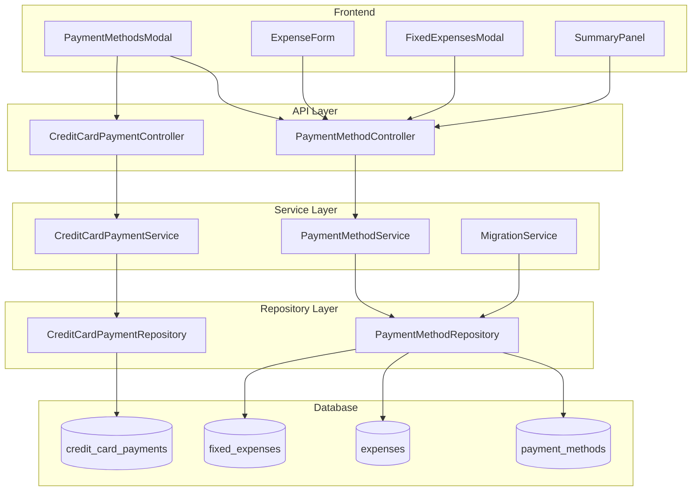

# Design Document: Configurable Payment Methods

## Overview

This design transforms the payment method system from a hardcoded enum to a database-driven configurable system. The architecture follows the existing layered pattern (Controller → Service → Repository → Database) and introduces new tables for payment methods and credit card payments while maintaining backward compatibility with existing expense records.

## Architecture

The system introduces a new domain entity `PaymentMethod` with type-specific behavior handled through a discriminated union pattern. Credit cards have additional tracking capabilities through a separate `CreditCardPayment` entity.



## Components and Interfaces

### Backend Components

#### PaymentMethodRepository

```javascript
class PaymentMethodRepository {
  // Create a new payment method
  async create(paymentMethod: PaymentMethodData): Promise<PaymentMethod>
  
  // Find all payment methods, optionally filtered by type and/or active status
  async findAll(options?: { type?: PaymentMethodType, activeOnly?: boolean }): Promise<PaymentMethod[]>
  
  // Find a payment method by ID
  async findById(id: number): Promise<PaymentMethod | null>
  
  // Find a payment method by display name (for backward compatibility)
  async findByDisplayName(displayName: string): Promise<PaymentMethod | null>
  
  // Update a payment method
  async update(id: number, data: PaymentMethodData): Promise<PaymentMethod | null>
  
  // Delete a payment method (only if no associated expenses)
  async delete(id: number): Promise<boolean>
  
  // Set active/inactive status
  async setActive(id: number, isActive: boolean): Promise<PaymentMethod | null>
  
  // Count expenses associated with a payment method (via payment_method_id)
  async countAssociatedExpenses(id: number): Promise<number>
  
  // Get all active payment methods for dropdown population
  async getActivePaymentMethods(): Promise<PaymentMethod[]>
  
  // Update credit card balance (increment/decrement)
  async updateBalance(id: number, amount: number): Promise<PaymentMethod | null>
}
```

#### CreditCardPaymentRepository

```javascript
class CreditCardPaymentRepository {
  // Record a payment to a credit card
  async create(payment: CreditCardPaymentData): Promise<CreditCardPayment>
  
  // Get payment history for a credit card
  async findByPaymentMethodId(paymentMethodId: number): Promise<CreditCardPayment[]>
  
  // Get payments within a date range
  async findByDateRange(paymentMethodId: number, startDate: string, endDate: string): Promise<CreditCardPayment[]>
  
  // Delete a payment record
  async delete(id: number): Promise<boolean>
  
  // Get total payments for a credit card in a date range
  async getTotalPayments(paymentMethodId: number, startDate: string, endDate: string): Promise<number>
}
```

#### PaymentMethodService

```javascript
class PaymentMethodService {
  // Validate payment method data based on type
  validatePaymentMethod(data: PaymentMethodData): ValidationResult
  
  // Create a new payment method with type-specific validation
  async createPaymentMethod(data: PaymentMethodData): Promise<PaymentMethod>
  
  // Update a payment method
  async updatePaymentMethod(id: number, data: PaymentMethodData): Promise<PaymentMethod | null>
  
  // Delete payment method (only if no associated expenses)
  async deletePaymentMethod(id: number): Promise<DeleteResult>
  
  // Activate or deactivate a payment method
  async setPaymentMethodActive(id: number, isActive: boolean): Promise<PaymentMethod | null>
  
  // Get all payment methods with expense counts
  async getAllWithExpenseCounts(): Promise<PaymentMethodWithCount[]>
  
  // Get only active payment methods (for dropdowns)
  async getActivePaymentMethods(): Promise<PaymentMethod[]>
  
  // Record an expense and update credit card balance if applicable
  async recordExpensePayment(paymentMethodId: number, amount: number): Promise<void>
  
  // Validate display name uniqueness among active payment methods
  async isDisplayNameUnique(displayName: string, excludeId?: number): Promise<boolean>
}
```

#### CreditCardPaymentService

```javascript
class CreditCardPaymentService {
  // Validate payment data
  validatePayment(data: CreditCardPaymentData): ValidationResult
  
  // Record a payment and update the credit card balance
  async recordPayment(data: CreditCardPaymentData): Promise<CreditCardPayment>
  
  // Get payment history with running balance
  async getPaymentHistory(paymentMethodId: number): Promise<PaymentHistoryEntry[]>
  
  // Calculate total payments in a date range
  async getTotalPaymentsInRange(paymentMethodId: number, startDate: string, endDate: string): Promise<number>
}
```

#### MigrationService (for data migration)

```javascript
// Migration function to convert existing payment method strings to database records
async function migratePaymentMethods(db: Database): Promise<void>
```

### Frontend Components

#### PaymentMethodsModal

A new modal component accessible from the main toolbar that provides:
- List view of all payment methods grouped by type
- Type-specific creation forms
- Inline editing capabilities
- Credit card balance display and "Log Payment" action
- Delete confirmation with reassignment selection

#### PaymentMethodForm

Type-specific form that adapts based on selected payment method type:
- Cash: Display name only
- Cheque: Display name, optional account details
- Debit: Display name, optional account details
- Credit Card: Display name, full name, optional billing cycle, initial balance

#### CreditCardPaymentForm

Form for recording payments to credit cards:
- Payment amount (required, positive number)
- Payment date (required, defaults to today)
- Notes (optional)

### API Endpoints

| Method | Endpoint | Description |
|--------|----------|-------------|
| GET | `/api/payment-methods` | Get all payment methods |
| GET | `/api/payment-methods/:id` | Get a specific payment method with computed fields |
| POST | `/api/payment-methods` | Create a new payment method |
| PUT | `/api/payment-methods/:id` | Update a payment method |
| DELETE | `/api/payment-methods/:id` | Delete a payment method |
| GET | `/api/payment-methods/display-names` | Get all display names (for validation) |
| POST | `/api/payment-methods/:id/payments` | Record a credit card payment |
| GET | `/api/payment-methods/:id/payments` | Get payment history for a credit card |
| DELETE | `/api/payment-methods/:id/payments/:paymentId` | Delete a payment record |
| POST | `/api/payment-methods/:id/statements` | Upload a credit card statement |
| GET | `/api/payment-methods/:id/statements` | Get statement history for a credit card |
| GET | `/api/payment-methods/:id/statements/:statementId` | Download a statement file |
| DELETE | `/api/payment-methods/:id/statements/:statementId` | Delete a statement |
| GET | `/api/payment-methods/:id/cycle-spending` | Get spending for current billing cycle |

## Data Models

### Database Schema

#### payment_methods Table

```sql
CREATE TABLE payment_methods (
  id INTEGER PRIMARY KEY AUTOINCREMENT,
  type TEXT NOT NULL CHECK(type IN ('cash', 'cheque', 'debit', 'credit_card')),
  display_name TEXT NOT NULL UNIQUE,
  full_name TEXT,
  account_details TEXT,
  -- Credit card specific fields
  credit_limit REAL CHECK(credit_limit IS NULL OR credit_limit > 0),
  current_balance REAL DEFAULT 0 CHECK(current_balance >= 0),
  payment_due_day INTEGER CHECK(payment_due_day IS NULL OR (payment_due_day >= 1 AND payment_due_day <= 31)),
  billing_cycle_start INTEGER CHECK(billing_cycle_start IS NULL OR (billing_cycle_start >= 1 AND billing_cycle_start <= 31)),
  billing_cycle_end INTEGER CHECK(billing_cycle_end IS NULL OR (billing_cycle_end >= 1 AND billing_cycle_end <= 31)),
  -- Status
  is_active INTEGER DEFAULT 1,
  created_at TEXT DEFAULT CURRENT_TIMESTAMP,
  updated_at TEXT DEFAULT CURRENT_TIMESTAMP
);

CREATE INDEX idx_payment_methods_type ON payment_methods(type);
CREATE INDEX idx_payment_methods_display_name ON payment_methods(display_name);
CREATE INDEX idx_payment_methods_is_active ON payment_methods(is_active);
```

#### expenses Table Changes

The migration adds a `payment_method_id` foreign key column to the existing expenses table:

```sql
-- Add payment_method_id column to expenses table
ALTER TABLE expenses ADD COLUMN payment_method_id INTEGER REFERENCES payment_methods(id);

-- Create index for efficient lookups
CREATE INDEX idx_expenses_payment_method_id ON expenses(payment_method_id);

-- Note: The existing 'method' column is retained during transition for backward compatibility
-- New expenses should use payment_method_id; the method column will be deprecated
```

#### fixed_expenses Table Changes

Similarly, the migration adds a `payment_method_id` foreign key to fixed_expenses:

```sql
-- Add payment_method_id column to fixed_expenses table
ALTER TABLE fixed_expenses ADD COLUMN payment_method_id INTEGER REFERENCES payment_methods(id);

-- Create index for efficient lookups
CREATE INDEX idx_fixed_expenses_payment_method_id ON fixed_expenses(payment_method_id);

-- Note: The existing 'payment_type' column is retained during transition
```

#### credit_card_payments Table

```sql
CREATE TABLE credit_card_payments (
  id INTEGER PRIMARY KEY AUTOINCREMENT,
  payment_method_id INTEGER NOT NULL,
  amount REAL NOT NULL CHECK(amount > 0),
  payment_date TEXT NOT NULL,
  notes TEXT,
  created_at TEXT DEFAULT CURRENT_TIMESTAMP,
  FOREIGN KEY (payment_method_id) REFERENCES payment_methods(id) ON DELETE CASCADE
);

CREATE INDEX idx_cc_payments_method_id ON credit_card_payments(payment_method_id);
CREATE INDEX idx_cc_payments_date ON credit_card_payments(payment_date);
```

#### credit_card_statements Table

```sql
CREATE TABLE credit_card_statements (
  id INTEGER PRIMARY KEY AUTOINCREMENT,
  payment_method_id INTEGER NOT NULL,
  statement_date TEXT NOT NULL,
  statement_period_start TEXT NOT NULL,
  statement_period_end TEXT NOT NULL,
  filename TEXT NOT NULL,
  original_filename TEXT NOT NULL,
  file_path TEXT NOT NULL,
  file_size INTEGER NOT NULL,
  mime_type TEXT NOT NULL DEFAULT 'application/pdf',
  created_at TEXT DEFAULT CURRENT_TIMESTAMP,
  FOREIGN KEY (payment_method_id) REFERENCES payment_methods(id) ON DELETE CASCADE
);

CREATE INDEX idx_cc_statements_method_id ON credit_card_statements(payment_method_id);
CREATE INDEX idx_cc_statements_date ON credit_card_statements(statement_date);
```

### Migration Strategy

The migration handles thousands of existing expenses safely with explicit mapping from old enum values to new payment method records, and adds foreign key relationships.

#### Migration Mapping

| Old Enum Value | New Display Name | Full Name | Type | ID |
|----------------|------------------|-----------|------|-----|
| `Cash` | `Cash` | Cash | cash | 1 |
| `Debit` | `Debit` | Debit | debit | 2 |
| `Cheque` | `Cheque` | Cheque | cheque | 3 |
| `CIBC MC` | `CIBC MC` | CIBC Mastercard | credit_card | 4 |
| `PCF MC` | `PCF MC` | PCF Mastercard | credit_card | 5 |
| `WS VISA` | `WS VISA` | WealthSimple VISA | credit_card | 6 |
| `VISA` | `RBC VISA` | RBC VISA | credit_card | 7 |

#### Migration Approach

1. **Create payment_methods table**: Insert all payment methods with explicit IDs
2. **Add payment_method_id to expenses**: Add foreign key column and populate based on method string
3. **Add payment_method_id to fixed_expenses**: Add foreign key column and populate based on payment_type string
4. **Update display names**: For VISA → RBC VISA, update the method string column
5. **Idempotent**: Migration checks if already run and skips if payment_methods has data
6. **Transactional**: All changes wrapped in a single transaction with rollback on failure

#### Migration Steps

```javascript
async function migratePaymentMethods(db) {
  const migrationName = 'configurable_payment_methods_v1';
  
  // 1. Check if already applied
  const isApplied = await checkMigrationApplied(db, migrationName);
  if (isApplied) return;
  
  // 2. Create backup
  await createBackup();
  
  // 3. Define explicit migration mapping
  const migrationMapping = [
    { id: 1, oldValue: 'Cash', displayName: 'Cash', fullName: 'Cash', type: 'cash' },
    { id: 2, oldValue: 'Debit', displayName: 'Debit', fullName: 'Debit', type: 'debit' },
    { id: 3, oldValue: 'Cheque', displayName: 'Cheque', fullName: 'Cheque', type: 'cheque' },
    { id: 4, oldValue: 'CIBC MC', displayName: 'CIBC MC', fullName: 'CIBC Mastercard', type: 'credit_card' },
    { id: 5, oldValue: 'PCF MC', displayName: 'PCF MC', fullName: 'PCF Mastercard', type: 'credit_card' },
    { id: 6, oldValue: 'WS VISA', displayName: 'WS VISA', fullName: 'WealthSimple VISA', type: 'credit_card' },
    { id: 7, oldValue: 'VISA', displayName: 'RBC VISA', fullName: 'RBC VISA', type: 'credit_card' }
  ];
  
  // 4. Create tables, insert records, add foreign keys, populate IDs
  await db.run('BEGIN TRANSACTION');
  try {
    // Create payment_methods table
    await createPaymentMethodsTable(db);
    
    // Insert payment methods with explicit IDs
    for (const mapping of migrationMapping) {
      await db.run(
        `INSERT INTO payment_methods (id, type, display_name, full_name, is_active) 
         VALUES (?, ?, ?, ?, 1)`,
        [mapping.id, mapping.type, mapping.displayName, mapping.fullName]
      );
    }
    
    // Add payment_method_id column to expenses
    await db.run('ALTER TABLE expenses ADD COLUMN payment_method_id INTEGER REFERENCES payment_methods(id)');
    await db.run('CREATE INDEX idx_expenses_payment_method_id ON expenses(payment_method_id)');
    
    // Add payment_method_id column to fixed_expenses
    await db.run('ALTER TABLE fixed_expenses ADD COLUMN payment_method_id INTEGER REFERENCES payment_methods(id)');
    await db.run('CREATE INDEX idx_fixed_expenses_payment_method_id ON fixed_expenses(payment_method_id)');
    
    // Populate payment_method_id for expenses based on method string
    for (const mapping of migrationMapping) {
      await db.run(
        'UPDATE expenses SET payment_method_id = ? WHERE method = ?',
        [mapping.id, mapping.oldValue]
      );
    }
    
    // Populate payment_method_id for fixed_expenses based on payment_type string
    for (const mapping of migrationMapping) {
      await db.run(
        'UPDATE fixed_expenses SET payment_method_id = ? WHERE payment_type = ?',
        [mapping.id, mapping.oldValue]
      );
    }
    
    // Update display names where they changed (VISA → RBC VISA)
    await db.run(
      'UPDATE expenses SET method = ? WHERE method = ?',
      ['RBC VISA', 'VISA']
    );
    await db.run(
      'UPDATE fixed_expenses SET payment_type = ? WHERE payment_type = ?',
      ['RBC VISA', 'VISA']
    );
    
    await markMigrationApplied(db, migrationName);
    await db.run('COMMIT');
    
    logger.info(`Migration complete: Created ${migrationMapping.length} payment methods, added payment_method_id to expenses and fixed_expenses`);
  } catch (error) {
    await db.run('ROLLBACK');
    logger.error('Migration failed:', error);
    throw error;
  }
}
```

#### Why This Approach Works

1. **Foreign key relationship**: Expenses now reference payment_methods by ID for data integrity
2. **Explicit control**: Each old value maps to a known new payment method with proper full names
3. **Backward compatible**: Original method/payment_type string columns retained during transition
4. **Credit card enrichment**: Credit cards get proper full names (e.g., "CIBC Mastercard" instead of just "CIBC MC")
5. **Safe for thousands of records**: Batch UPDATE statements are efficient even for large datasets
6. **Query efficiency**: Foreign key lookups are faster than string matching

### TypeScript Interfaces (Frontend)

```typescript
type PaymentMethodType = 'cash' | 'cheque' | 'debit' | 'credit_card';

interface PaymentMethod {
  id: number;
  type: PaymentMethodType;
  display_name: string;
  full_name?: string;
  account_details?: string;
  // Credit card specific
  credit_limit?: number;
  current_balance?: number;
  payment_due_day?: number;
  billing_cycle_start?: number;
  billing_cycle_end?: number;
  // Computed fields (from service)
  utilization_percentage?: number;
  days_until_due?: number;
  current_cycle_spending?: number;
  // Status
  is_active: boolean;
  created_at: string;
  updated_at: string;
}

interface PaymentMethodWithCount extends PaymentMethod {
  expense_count: number;
}

interface CreditCardPayment {
  id: number;
  payment_method_id: number;
  amount: number;
  payment_date: string;
  notes?: string;
  created_at: string;
}

interface CreditCardStatement {
  id: number;
  payment_method_id: number;
  statement_date: string;
  statement_period_start: string;
  statement_period_end: string;
  filename: string;
  original_filename: string;
  file_size: number;
  created_at: string;
}

interface PaymentMethodFormData {
  type: PaymentMethodType;
  display_name: string;
  full_name?: string;
  account_details?: string;
  credit_limit?: number;
  payment_due_day?: number;
  billing_cycle_start?: number;
  billing_cycle_end?: number;
  initial_balance?: number;
}

// Utilization thresholds
const UTILIZATION_WARNING_THRESHOLD = 30;  // Yellow warning
const UTILIZATION_DANGER_THRESHOLD = 70;   // Red danger
```

## Correctness Properties

*A property is a characteristic or behavior that should hold true across all valid executions of a system—essentially, a formal statement about what the system should do. Properties serve as the bridge between human-readable specifications and machine-verifiable correctness guarantees.*


### Property 1: Type-Specific Validation Rules

*For any* payment method creation request, the system should enforce type-specific required fields: Cash requires only display_name; Cheque and Debit require display_name with optional account_details; Credit_Card requires display_name and full_name with optional billing cycle fields.

**Validates: Requirements 1.2, 1.3, 1.4, 1.5**

### Property 2: Multiple Methods Per Type

*For any* payment method type and any positive integer N, creating N payment methods of that type should result in exactly N distinct payment methods being persisted and retrievable.

**Validates: Requirements 1.6**

### Property 3: Payment Method CRUD Round-Trip

*For any* valid payment method data, creating a payment method and then retrieving it by ID should return an equivalent payment method with all attributes preserved.

**Validates: Requirements 2.1**

### Property 4: Update Preserves Expense Associations

*For any* payment method with associated expenses, updating the payment method's attributes should preserve all expense associations (expense count before and after update should be equal).

**Validates: Requirements 2.2**

### Property 5: Inactive Payment Methods Hidden From Dropdowns

*For any* payment method marked as inactive, it should not appear in the list of payment methods returned for dropdown population (active-only queries), but should still be retrievable by ID for historical expense display.

**Validates: Requirements 2.4, 2.5, 2.8**

### Property 6: Display Name Uniqueness

*For any* two payment method creation requests with the same display_name (after trimming and case normalization), the second request should be rejected regardless of other attributes.

**Validates: Requirements 2.6, 9.5**

### Property 7: Credit Card Payment Reduces Balance

*For any* credit card with balance B and any valid payment amount P, recording a payment should result in a new balance of exactly B - P.

**Validates: Requirements 3.2**

### Property 8: Expense Increases Credit Card Balance

*For any* credit card with balance B and any expense amount E recorded with that card, the resulting balance should be exactly B + E.

**Validates: Requirements 3.3**

### Property 9: Payment History Round-Trip

*For any* credit card payment with amount, date, and notes, creating the payment and retrieving the payment history should include an entry with equivalent attributes.

**Validates: Requirements 3.4**

### Property 10: Payment History Chronological Ordering

*For any* set of credit card payments with distinct dates, retrieving the payment history should return payments in descending date order (most recent first).

**Validates: Requirements 3.5**

### Property 11: Payment Sum Calculation

*For any* set of credit card payments within a date range, the calculated total should equal the sum of all individual payment amounts in that range.

**Validates: Requirements 3.6**

### Property 12: Migration Round-Trip

*For any* expense with a payment method string before migration, after migration the expense should resolve to a payment method with a display_name equal to the original string.

**Validates: Requirements 6.1, 6.2, 6.3, 6.7**

### Property 13: Migration Type Assignment

*For any* payment method string containing "VISA" or "MC", the migrated payment method should have type "credit_card". For "Cash", type should be "cash". For "Cheque", type should be "cheque". For "Debit", type should be "debit".

**Validates: Requirements 6.4**

### Property 14: Expense Filtering By Method

*For any* set of expenses with various payment methods and any selected payment method, filtering should return exactly those expenses whose payment method matches the selection.

**Validates: Requirements 7.2**

### Property 15: Expense Filtering By Type

*For any* set of expenses and any selected payment method type, filtering by type should return exactly those expenses whose payment method has the selected type.

**Validates: Requirements 7.3**

### Property 16: Expense Count Accuracy

*For any* payment method, the reported expense count should equal the actual count of expenses in the database associated with that payment method.

**Validates: Requirements 8.6**

### Property 17: Input Validation

*For any* payment method submission: empty display_name should be rejected; credit cards with empty full_name should be rejected; negative balance values should be rejected; non-positive payment amounts should be rejected; whitespace-only inputs should be treated as empty.

**Validates: Requirements 9.1, 9.2, 9.3, 9.4, 9.6**

### Property 18: Backward Compatible Expense Submission

*For any* valid payment method display_name, submitting an expense with that string should succeed. For any string not matching a configured display_name, submission should be rejected with an error.

**Validates: Requirements 10.1, 10.2**

### Property 19: Credit Utilization Calculation

*For any* credit card with balance B and credit limit L where L > 0, the utilization percentage should equal exactly (B / L) * 100, rounded to two decimal places.

**Validates: Requirements 3.7, 3.8**

### Property 20: Payment Due Date Calculation

*For any* credit card with payment_due_day D, the calculated next due date should be the next occurrence of day D in the current or following month.

**Validates: Requirements 3A.2**

### Property 21: Billing Cycle Spending Calculation

*For any* credit card with billing cycle dates and associated expenses, the current cycle spending should equal the sum of all expenses within the current billing period.

**Validates: Requirements 3B.1, 3B.2**

### Property 22: Statement Upload Round-Trip

*For any* valid PDF file uploaded as a credit card statement, retrieving the statement should return the same file content and metadata.

**Validates: Requirements 3B.3, 3B.4**

### Property 23: Backup Includes Payment Methods

*For any* backup created after migration, restoring the backup should result in identical payment_methods, credit_card_payments, and credit_card_statements tables.

**Validates: Requirements 11.1, 11.2, 11.3, 11.4, 11.5**

### Property 24: Migration Idempotency

*For any* database state, running the migration multiple times should produce the same result as running it once.

**Validates: Requirements 6A.4, 6A.5**

## Error Handling

### Validation Errors

| Error Condition | HTTP Status | Error Message |
|-----------------|-------------|---------------|
| Empty display_name | 400 | "Display name is required" |
| Duplicate display_name | 400 | "A payment method with this display name already exists" |
| Empty full_name (credit card) | 400 | "Full name is required for credit cards" |
| Invalid payment method type | 400 | "Invalid payment method type. Must be one of: cash, cheque, debit, credit_card" |
| Negative balance | 400 | "Balance cannot be negative" |
| Non-positive payment amount | 400 | "Payment amount must be greater than zero" |
| Invalid billing cycle day | 400 | "Billing cycle day must be between 1 and 31" |

### Business Logic Errors

| Error Condition | HTTP Status | Error Message |
|-----------------|-------------|---------------|
| Delete last active payment method | 400 | "Cannot delete the last active payment method. At least one active payment method must exist" |
| Delete payment method with expenses | 400 | "Cannot delete payment method with associated expenses. Mark it as inactive instead" |
| Payment method not found | 404 | "Payment method not found" |
| Credit card payment not found | 404 | "Payment record not found" |
| Non-credit card payment attempt | 400 | "Payments can only be recorded for credit card payment methods" |
| Deactivate last active payment method | 400 | "Cannot deactivate the last active payment method" |

### Migration Errors

| Error Condition | Action |
|-----------------|--------|
| Backup creation fails | Abort migration, log error |
| Table creation fails | Rollback transaction, log error |
| Data copy fails | Rollback transaction, log error |
| Foreign key constraint violation | Rollback transaction, log error |

## Testing Strategy

### Dual Testing Approach

This feature requires both unit tests and property-based tests for comprehensive coverage:

- **Unit tests**: Verify specific examples, edge cases, and error conditions
- **Property tests**: Verify universal properties across all valid inputs

### Property-Based Testing Configuration

- **Library**: fast-check (already used in the project)
- **Minimum iterations**: 100 per property test
- **Tag format**: `Feature: configurable-payment-methods, Property N: {property_text}`

### Test Categories

#### Repository Tests
- CRUD operations for payment_methods table
- CRUD operations for credit_card_payments table
- Expense count queries
- Balance update operations

#### Service Tests
- Type-specific validation logic
- Display name uniqueness checking
- Delete with reassignment logic
- Balance calculation accuracy

#### Migration Tests
- Round-trip preservation of expense-method associations
- Type assignment based on method name patterns
- Rollback on failure
- Backup creation verification

#### Integration Tests
- Full API endpoint testing
- Expense form integration
- Fixed expenses integration
- Summary panel aggregation

#### Frontend Tests
- PaymentMethodsModal rendering and interactions
- Type-specific form field visibility
- Credit card payment form validation
- Dropdown population and grouping

### Edge Cases to Test

1. Deleting the last payment method (should fail)
2. Creating payment method with whitespace-only display name
3. Recording payment that would make balance negative (should this be allowed?)
4. Migration with no existing expenses
5. Migration with duplicate method strings in expenses
6. Concurrent payment method updates
7. Very long display names (boundary testing)
