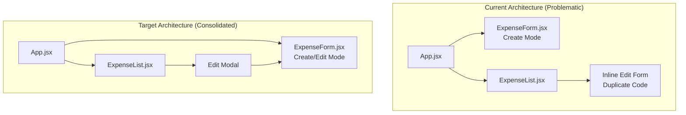
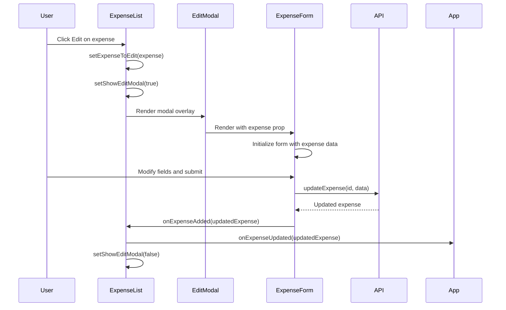

# Design Document: Expense Form Consolidation

## Overview

This design document describes the refactoring of the expense editing functionality to eliminate code duplication between `ExpenseForm.jsx` and `ExpenseList.jsx`. Currently, `ExpenseList.jsx` contains a complete inline edit form that duplicates most of `ExpenseForm.jsx`'s functionality, leading to maintenance issues where features added to one form are missed in the other.

The solution is to have `ExpenseList.jsx` render `ExpenseForm` inside its edit modal, passing the expense to edit via the `expense` prop (which ExpenseForm already supports for edit mode).

## Architecture



### Data Flow



## Components and Interfaces

### ExpenseList Component (Refactored)

The ExpenseList component will be simplified to only manage modal visibility state.

#### State to Retain
```javascript
// Modal visibility state
const [showEditModal, setShowEditModal] = useState(false);
const [expenseToEdit, setExpenseToEdit] = useState(null);
```

#### State to Remove
```javascript
// All of these will be removed:
const [editFormData, setEditFormData] = useState({});
const [editInsuranceEligible, setEditInsuranceEligible] = useState(false);
const [editClaimStatus, setEditClaimStatus] = useState('not_claimed');
const [editOriginalCost, setEditOriginalCost] = useState('');
const [editFutureMonths, setEditFutureMonths] = useState(0);
const [editInvoices, setEditInvoices] = useState([]);
const [selectedPeople, setSelectedPeople] = useState([]); // for edit form
```

#### Handlers to Retain (Simplified)
```javascript
// Simplified edit click handler
const handleEditClick = useCallback((expense) => {
  setExpenseToEdit(expense);
  setShowEditModal(true);
}, []);

// Simplified cancel handler
const handleCancelEdit = useCallback(() => {
  setShowEditModal(false);
  setExpenseToEdit(null);
}, []);

// Callback for ExpenseForm - handles update and closes modal
const handleExpenseUpdated = useCallback((updatedExpense) => {
  if (onExpenseUpdated) {
    onExpenseUpdated(updatedExpense);
  }
  setShowEditModal(false);
  setExpenseToEdit(null);
}, [onExpenseUpdated]);
```

#### Handlers to Remove
```javascript
// All of these will be removed:
handleEditChange
handleEditSubmit
handleEditPeopleChange
handleEditPersonAllocation
handleEditInvoiceUploaded
handleEditInvoiceDeleted
handleEditPersonLinkUpdated
```

#### Constants to Remove
```javascript
// Remove from ExpenseList (already exists in ExpenseForm):
FUTURE_MONTHS_OPTIONS
calculateFutureDatePreview
```

### Edit Modal Structure

The edit modal will wrap ExpenseForm while maintaining existing UX:

```jsx
{showEditModal && expenseToEdit && (
  <div className="modal-overlay" onClick={handleCancelEdit}>
    <div className="edit-modal" onClick={(e) => e.stopPropagation()}>
      <button 
        className="modal-close-button" 
        onClick={handleCancelEdit}
        aria-label="Close"
      >
        ×
      </button>
      <ExpenseForm
        expense={expenseToEdit}
        people={people}
        onExpenseAdded={handleExpenseUpdated}
      />
    </div>
  </div>
)}
```

### ExpenseForm Props Interface

ExpenseForm already supports these props:

| Prop | Type | Description |
|------|------|-------------|
| `expense` | `object \| null` | Expense to edit (null for create mode) |
| `people` | `array` | List of people for medical expense assignment |
| `onExpenseAdded` | `function` | Callback when expense is created/updated |

### Callback Chain

```
ExpenseForm.onExpenseAdded(expense)
    ↓
ExpenseList.handleExpenseUpdated(expense)
    ↓
App.onExpenseUpdated(expense)  // Updates expense list state
    ↓
Modal closes
```

## Data Models

No changes to data models are required. The existing expense object structure is used:

```typescript
interface Expense {
  id: number;
  date: string;           // YYYY-MM-DD format
  place: string;
  notes: string;
  amount: number;
  type: string;           // Category
  method: string;         // Payment method
  week: number;
  // Medical expense fields
  insurance_eligible?: boolean;
  claim_status?: 'not_claimed' | 'in_progress' | 'paid' | 'denied';
  original_cost?: number;
  // Related data
  people?: PersonAllocation[];
  invoices?: Invoice[];
}

interface PersonAllocation {
  id: number;
  personId: number;
  name: string;
  amount: number;
  originalAmount?: number;
}

interface Invoice {
  id: number;
  expenseId: number;
  filename: string;
  personId?: number;
  personName?: string;
}
```

## Correctness Properties

*A property is a characteristic or behavior that should hold true across all valid executions of a system—essentially, a formal statement about what the system should do. Properties serve as the bridge between human-readable specifications and machine-verifiable correctness guarantees.*

### Property 1: Modal Renders ExpenseForm with Correct Props

*For any* expense in the expense list, when the user clicks the Edit button, the edit modal SHALL render ExpenseForm with the `expense` prop set to the clicked expense and the `people` prop containing the available family members.

**Validates: Requirements 2.1, 2.2, 2.3, 2.4, 2.5**

### Property 2: Modal Close Behavior

*For any* open edit modal, clicking outside the modal content area OR clicking the close button (×) SHALL close the modal without saving changes.

**Validates: Requirements 3.1, 3.2, 3.4**

### Property 3: Form Pre-population

*For any* expense being edited, the ExpenseForm SHALL display the expense's existing values (date, place, notes, amount, type, method, and any insurance/people/invoice data) as the initial form state.

**Validates: Requirements 3.5**

### Property 4: Medical Expense Sections Visibility

*For any* expense with type "Tax - Medical", the ExpenseForm SHALL display both the insurance tracking section (eligibility checkbox, original cost, claim status, reimbursement) AND the people assignment section.

**Validates: Requirements 4.1, 4.2**

### Property 5: Tax-Deductible Invoice Section Visibility

*For any* expense with type "Tax - Medical" OR "Tax - Donation", the ExpenseForm SHALL display the invoice upload section with support for multiple invoices.

**Validates: Requirements 4.3**

### Property 6: General Form Features Availability

*For any* expense being edited, the ExpenseForm SHALL display the "Add to Future Months" option, all available expense categories in the type dropdown, and all available payment methods in the method dropdown.

**Validates: Requirements 4.4, 4.5, 4.6**

### Property 7: Successful Update Callback Chain

*For any* successful expense update, ExpenseForm SHALL call onExpenseAdded with the updated expense data, which SHALL trigger ExpenseList to call onExpenseUpdated AND close the edit modal.

**Validates: Requirements 5.1, 5.2, 5.3, 3.3**

### Property 8: Error Handling Preserves Modal State

*For any* failed expense update attempt, the ExpenseForm SHALL display an error message AND the edit modal SHALL remain open with the user's entered data preserved.

**Validates: Requirements 5.4**

### Property 9: Invoice Data Loading and Display

*For any* tax-deductible expense (medical or donation) being edited, the system SHALL load existing invoice data and ExpenseForm SHALL display all associated invoices.

**Validates: Requirements 6.1, 6.2**

### Property 10: Invoice CRUD Operations

*For any* invoice uploaded during editing, it SHALL be associated with the expense being edited. *For any* invoice deleted during editing, it SHALL be removed from the expense.

**Validates: Requirements 6.3, 6.4**

### Property 11: People Data Loading and Display

*For any* medical expense being edited, the system SHALL load existing people assignments and ExpenseForm SHALL display the currently assigned people.

**Validates: Requirements 7.1, 7.2**

### Property 12: People Modification and Allocation

*For any* modification to people assignments during editing, the changes SHALL be saved when the expense is updated. *For any* multi-person assignment, the PersonAllocationModal SHALL open to allow amount allocation.

**Validates: Requirements 7.3, 7.4**

## Error Handling

### API Errors

ExpenseForm already handles API errors by:
1. Catching errors from `updateExpense()` API call
2. Displaying error message in the form's message area
3. Keeping the form open with user's data preserved
4. Setting `isSubmitting` to false to re-enable the submit button

### Validation Errors

ExpenseForm's existing `validateForm()` function handles:
- Required field validation (date, amount, type, method)
- Amount must be positive
- Field length limits (place: 200 chars, notes: 200 chars)
- Insurance validation (original cost required, amount ≤ original cost)

### Modal State Recovery

If the modal is closed unexpectedly (e.g., component unmount), no data is lost because:
- The original expense data remains in the expense list
- No changes are persisted until successful API call
- User can re-open the edit modal to try again

## Testing Strategy

### Unit Tests

Unit tests should cover specific examples and edge cases:

1. **Modal Visibility Tests**
   - Edit button click opens modal with correct expense
   - Close button closes modal
   - Click outside closes modal
   - Successful save closes modal

2. **Prop Passing Tests**
   - ExpenseForm receives expense prop
   - ExpenseForm receives people prop
   - ExpenseForm receives onExpenseAdded callback

3. **Callback Chain Tests**
   - onExpenseAdded triggers onExpenseUpdated
   - Modal closes after callback

4. **Code Removal Verification**
   - Verify removed state variables don't exist
   - Verify removed handlers don't exist
   - Verify removed constants don't exist

### Property-Based Tests

Property-based tests should verify universal properties across all inputs. Use a property-based testing library (e.g., fast-check for JavaScript).

**Configuration:**
- Minimum 100 iterations per property test
- Tag format: **Feature: expense-form-consolidation, Property {number}: {property_text}**

**Property Tests to Implement:**

1. **Property 1: Modal Renders ExpenseForm with Correct Props**
   - Generate random expenses with various types and data
   - Verify ExpenseForm is rendered with correct expense and people props

2. **Property 3: Form Pre-population**
   - Generate random expenses with all field combinations
   - Verify form fields match expense data

3. **Property 4: Medical Expense Sections Visibility**
   - Generate random medical expenses
   - Verify insurance and people sections are visible

4. **Property 5: Tax-Deductible Invoice Section Visibility**
   - Generate random medical and donation expenses
   - Verify invoice section is visible

5. **Property 7: Successful Update Callback Chain**
   - Generate random expense updates
   - Verify callback chain executes correctly

6. **Property 8: Error Handling Preserves Modal State**
   - Generate random form data with simulated API errors
   - Verify modal stays open and error is displayed

### Integration Tests

Integration tests should verify the complete flow:

1. **Edit Flow Integration**
   - Click edit → modal opens → modify data → save → modal closes → list updates

2. **Cancel Flow Integration**
   - Click edit → modal opens → modify data → cancel → modal closes → no changes

3. **Error Flow Integration**
   - Click edit → modal opens → modify data → API error → error shown → modal stays open

## Migration Notes

### Files to Modify

1. **frontend/src/components/ExpenseList.jsx**
   - Remove duplicate state variables
   - Remove duplicate handler functions
   - Remove duplicate constants
   - Simplify edit modal to render ExpenseForm
   - Add import for ExpenseForm

2. **frontend/src/components/ExpenseList.css** (if needed)
   - May need minor adjustments for ExpenseForm styling within modal

### Backward Compatibility

- No API changes required
- No database changes required
- User experience remains the same (same modal, same fields, same behavior)
- All existing functionality preserved through ExpenseForm

### Risk Mitigation

1. **Feature Parity Risk**: ExpenseForm already supports all features (insurance, people, invoices, future months)
2. **Styling Risk**: ExpenseForm has its own CSS; may need modal-specific overrides
3. **State Management Risk**: ExpenseForm manages its own state; no external state needed

