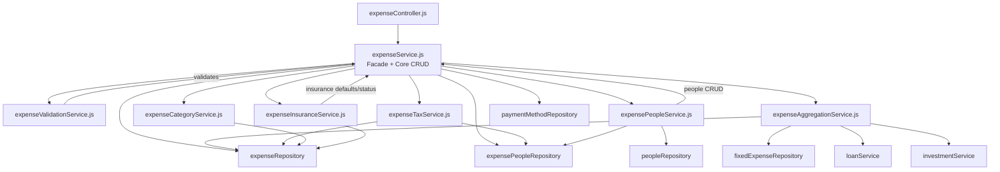

# Design Document: Expense Service Refactor

## Overview

This refactoring decomposes the 2,391-line `expenseService.js` god object into 6 focused sub-services plus a slim orchestrator/facade. The facade (`expenseService.js`) retains core CRUD logic and delegates domain-specific operations to sub-services. All existing consumers (controllers, tests, other services) continue importing `expenseService` unchanged — the facade re-exports every public method.

The approach is a strangler fig pattern applied at the module level: extract one concern at a time, wire it through the facade, verify tests pass, repeat.

## Architecture

### Key Design Decisions

1. **Facade pattern over re-exports**: `expenseService.js` remains a class instance that delegates to sub-services rather than a barrel file. This preserves the `new ExpenseService()` singleton pattern and allows the facade to orchestrate cross-cutting concerns (e.g., calling validation before CRUD).

2. **CRUD stays in the facade**: `createExpense`, `updateExpense`, `deleteExpense`, `getExpenses`, `getExpenseById` and their private helpers remain in the facade. These methods are tightly coupled to each other and to the expense creation/update lifecycle.

3. **Sub-services are plain classes**: Each sub-service is a CommonJS module exporting a singleton instance, matching the existing project pattern.

4. **No circular dependencies**: Sub-services depend on repositories and utilities, not on each other or on the facade. The facade depends on sub-services. The People_Service receives the facade's CRUD methods via constructor injection to avoid circular imports.

## Components and Interfaces

(See original design for full component details)

## Correctness Properties

### Property 1: Validation equivalence
### Property 2: Insurance defaults equivalence
### Property 3: People grouping equivalence
### Property 4: Person totals equivalence
### Property 5: Insurance summary equivalence
### Property 6: Facade API surface completeness

## Testing Strategy

- Library: fast-check
- Dual approach: unit tests + property-based tests for behavioral equivalence
- All existing tests pass unchanged through the facade
