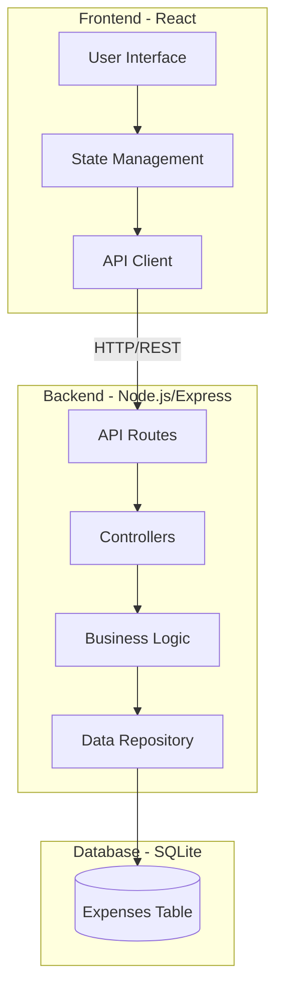

# Design Document

## Overview

The Expense Tracker Application is a full-stack web application consisting of a React-based frontend and a Node.js/Express backend with a relational database. The system enables users to record, edit, and delete expenses with detailed attributes, view transactions by month, search globally through all records, and analyze spending through various aggregated views including weekly totals, payment method breakdowns, and annual summaries. The application includes automated backup functionality, data import/restore capabilities, and visual highlighting for tax-related expenses (medical and donations) and high-value expenses.

> **Related Specs:** This core spec has been extended by several feature specs:
> - [Tax Deductible View](../tax-deductible-view/design.md) - Dedicated tax expense reporting
> - [Medical Expense People Tracking](../medical-expense-people-tracking/design.md) (v4.6.0) - Associate medical expenses with family members
> - [Budget Tracking Alerts](../budget-tracking-alerts/design.md) - Category budget management
> - [Investment Tracking](../investment-tracking/design.md) - Portfolio tracking
> - [Monthly Loans Balance](../monthly-loans-balance/design.md) - Loan and debt tracking

## Architecture

### System Architecture



### Technology Stack

**Frontend:**
- React 18+ for UI components
- React Hooks for state management
- Fetch API for HTTP requests
- CSS for styling

**Backend:**
- Node.js with Express framework
- SQLite3 for database
- CORS middleware for cross-origin requests
- Body-parser for JSON parsing

**Database:**
- SQLite (file-based, simple setup)

## Components and Interfaces

### Frontend Components

#### 1. App Component
- Root component managing overall application state
- Coordinates between child components
- Manages selected month/year state

#### 2. ExpenseForm Component
- Input fields displayed in order: date, place, type dropdown, amount, method dropdown, notes
- Place field receives initial focus when form opens
- Validates required fields before submission
- Calculates week automatically from date
- Submits new expense to backend API
- Type dropdown includes: Clothing, Dining Out, Entertainment, Gas, Gifts, Groceries, Housing, Insurance, Personal Care, Pet Care, Recreation Activities, Subscriptions, Utilities, Vehicle Maintenance, Other, Tax - Medical, Tax - Donation
- Smart category suggestion: fetches suggested category when place is entered/selected
- Visual indicator ("✨ suggested") shown when category is auto-filled
- Focus automatically moves to Amount field after place entry
- Payment method persistence: remembers last used method in localStorage
- Pre-selects last used payment method (defaults to "Cash" if none saved)

#### 3. MonthSelector Component
- Dropdown for year selection
- Dropdown for month selection
- Triggers data refresh when selection changes

#### 4. ExpenseList Component
- Displays table of expenses for selected month
- Columns: Date, Place, Notes, Amount, Type, Week, Method, Actions
- Edit and delete buttons for each row
- Sorted by date (most recent first)
- Applies dark blue row highlighting (#1e3a5f with white text) for expenses with type "Tax - Medical"
- Applies orange row highlighting (#ea580c with white text) for expenses with type "Tax - Donation"
- Applies visual highlighting for high-value expenses (≥$350)
- Inline edit functionality with event propagation handling

#### 5. SearchBar Component
- Text input for search query
- Category (Type) filter dropdown
- Payment Method filter dropdown
- Clear filters button (visible when any filter is active)
- Filters expense list in real-time
- Searches place and notes fields (case-insensitive)
- Performs global search across all expenses regardless of selected month
- Supports independent filtering by category and payment method
- Combines multiple filters using AND logic
- Automatically switches to global view when any filter is active

#### 6. SummaryPanel Component
- Displays multiple summary sections:
  - Weekly totals (weeks 1-5)
  - Payment method totals (all 7 methods)
  - Type-specific totals for all 17 expense categories
  - Monthly gross income with View/Edit button
  - Total fixed expenses with View/Edit button
  - Overall total for the month
  - Net balance calculation
- Opens IncomeManagementModal for managing income sources
- Opens FixedExpensesModal for managing fixed monthly expenses

#### 7. AnnualSummary Component
- Displays comprehensive yearly expense analysis
- Year selector for choosing which year to analyze
- Monthly breakdown showing totals for each month
- Category analysis with totals for each expense type
- Visual charts/graphs for spending patterns
- Overall annual total with two decimal places

#### 8. BackupSettings Component
- Backup configuration interface
- Manual backup trigger button
- Automated backup scheduling controls
- Last backup timestamp display
- Import functionality for uploading backup files
- Restore functionality with confirmation dialog
- Backup status indicators

#### 9. IncomeManagementModal Component
- Modal interface for managing monthly gross income
- Displays list of income sources for selected month/year
- Add, edit, and delete income sources
- Each source has a name and amount
- Displays total income from all sources
- Carry-forward functionality to copy previous month's sources

#### 10. FixedExpensesModal Component
- Modal interface for managing fixed monthly expenses
- Displays list of fixed expenses for selected month/year
- Add, edit, and delete fixed expense items
- Each item has a name, amount, category, and payment type
- Category dropdown with all expense categories
- Payment type dropdown with all payment methods
- Displays total of all fixed expenses
- Fixed expenses are included in category and payment type breakdowns
- Carry-forward functionality to copy previous month's expenses (including category and payment type)
- Validates input (name required, amount must be positive, category and payment type must be selected)

### Backend API Endpoints

#### POST /api/expenses
- Creates a new expense entry
- Request body: `{ date, place, notes, amount, type, method }`
- Calculates week from date
- Returns: Created expense with ID

#### GET /api/expenses
- Retrieves all expenses
- Query parameters: `year`, `month` (optional)
- Returns: Array of expense objects

#### DELETE /api/expenses/:id
- Deletes expense by ID
- Returns: Success status

#### PUT /api/expenses/:id
- Updates an existing expense entry
- Request body: `{ date, place, notes, amount, type, method }`
- Recalculates week from updated date
- Returns: Updated expense object

#### GET /api/expenses/summary
- Retrieves aggregated data for a specific month
- Query parameters: `year`, `month` (required)
- Returns: Object containing weekly totals, payment method totals, type totals for all 17 expense categories

#### GET /api/expenses/annual-summary
- Retrieves aggregated data for an entire year
- Query parameters: `year` (required)
- Returns: Object containing monthly totals, category totals, and annual total

#### GET /api/expenses/suggest-category
- Retrieves category suggestion for a place based on historical data
- Query parameters: `place` (required)
- Returns: Object containing suggestion (category, confidence, count) and breakdown array
- Returns null suggestion for places with no history

#### POST /api/backup/create
- Creates a manual backup of the database
- Returns: Backup file information with timestamp

#### GET /api/backup/status
- Retrieves backup system status
- Returns: Last backup timestamp and configuration

#### POST /api/backup/schedule
- Configures automated backup schedule
- Request body: `{ frequency, enabled }`
- Returns: Updated schedule configuration

#### POST /api/backup/import
- Imports data from a backup file
- Request body: File upload (multipart/form-data)
- Returns: Import status and record count

#### POST /api/backup/restore
- Restores database from a backup file
- Request body: `{ backupFileName }`
- Returns: Restore status

#### GET /api/fixed-expenses/:year/:month
- Retrieves all fixed expenses for a specific month
- Path parameters: `year`, `month`
- Returns: Object with `items` array and `total` amount

#### POST /api/fixed-expenses
- Creates a new fixed expense item
- Request body: `{ year, month, name, amount, category, payment_type }`
- Returns: Created fixed expense with ID

#### PUT /api/fixed-expenses/:id
- Updates an existing fixed expense item
- Request body: `{ name, amount, category, payment_type }`
- Returns: Updated fixed expense object

#### DELETE /api/fixed-expenses/:id
- Deletes a fixed expense item by ID
- Returns: Success status

#### POST /api/fixed-expenses/carry-forward
- Copies all fixed expenses from previous month to current month
- Request body: `{ fromYear, fromMonth, toYear, toMonth }`
- Returns: Array of newly created fixed expense items

### Data Repository Layer

#### ExpenseRepository
- `create(expense)`: Insert new expense into database
- `findAll(filters)`: Query expenses with optional year/month filters
- `findById(id)`: Retrieve single expense
- `update(id, expense)`: Update existing expense in database
- `delete(id)`: Remove expense from database
- `getSummary(year, month)`: Calculate aggregated totals for a month
- `getAnnualSummary(year)`: Calculate aggregated totals for a year

#### BackupRepository
- `createBackup()`: Create a timestamped backup file of the database
- `getBackupList()`: Retrieve list of available backup files
- `restoreBackup(filename)`: Restore database from a backup file
- `importBackup(fileData)`: Import data from an uploaded backup file
- `getLastBackupTime()`: Retrieve timestamp of most recent backup

## Data Models

### Expense Entry

```typescript
interface Expense {
  id: number;              // Auto-generated primary key
  date: string;            // ISO 8601 format (YYYY-MM-DD)
  place: string;           // Max 200 characters
  notes: string;           // Max 200 characters
  amount: number;          // Decimal with 2 places
  type: 'Clothing' | 'Dining Out' | 'Entertainment' | 'Gas' | 'Gifts' | 'Groceries' | 
        'Housing' | 'Insurance' | 'Personal Care' | 'Pet Care' | 'Recreation Activities' | 
        'Subscriptions' | 'Utilities' | 'Vehicle Maintenance' | 'Other' | 'Tax - Medical' | 'Tax - Donation';
  week: number;            // 1-5, calculated from date
  method: 'Cash' | 'Debit' | 'Cheque' | 'CIBC MC' | 'PCF MC' | 'WS VISA' | 'VISA';
  created_at: string;      // Timestamp
}
```

### Database Schema

```sql
CREATE TABLE expenses (
  id INTEGER PRIMARY KEY AUTOINCREMENT,
  date TEXT NOT NULL,
  place TEXT,
  notes TEXT,
  amount REAL NOT NULL,
  type TEXT NOT NULL CHECK(type IN ('Clothing', 'Dining Out', 'Entertainment', 'Gas', 'Gifts', 'Groceries',
                                     'Housing', 'Insurance', 'Personal Care', 'Pet Care', 'Recreation Activities',
                                     'Subscriptions', 'Utilities', 'Vehicle Maintenance', 'Other', 'Tax - Medical', 'Tax - Donation')),
  week INTEGER NOT NULL CHECK(week >= 1 AND week <= 5),
  method TEXT NOT NULL CHECK(method IN ('Cash', 'Debit', 'Cheque', 'CIBC MC', 'PCF MC', 'WS VISA', 'VISA')),
  created_at TEXT DEFAULT CURRENT_TIMESTAMP
);

CREATE INDEX idx_date ON expenses(date);
CREATE INDEX idx_type ON expenses(type);
CREATE INDEX idx_method ON expenses(method);
```

### Summary Response

```typescript
interface Summary {
  weeklyTotals: {
    week1: number;
    week2: number;
    week3: number;
    week4: number;
    week5: number;
  };
  methodTotals: {
    Cash: number;
    Debit: number;
    Cheque: number;
    'CIBC MC': number;
    'PCF MC': number;
    'WS VISA': number;
    VISA: number;
  };
  typeTotals: {
    Housing: number;
    Utilities: number;
    Groceries: number;
    'Dining Out': number;
    Insurance: number;
    Gas: number;
    'Vehicle Maintenance': number;
    Entertainment: number;
    Subscriptions: number;
    'Recreation Activities': number;
    'Pet Care': number;
    'Tax - Medical': number;
    'Tax - Donation': number;
    Other: number;
  };
  total: number;                    // Total of variable expenses only
  monthlyGross: number;             // Total gross income from all sources
  totalFixedExpenses: number;       // Total of all fixed expenses
  totalExpenses: number;            // Sum of total + totalFixedExpenses
  netBalance: number;               // monthlyGross - totalExpenses
}
```

### Annual Summary Response

```typescript
interface AnnualSummary {
  year: number;
  monthlyTotals: {
    [month: string]: number; // e.g., "January": 1234.56
  };
  categoryTotals: {
    Housing: number;
    Utilities: number;
    Groceries: number;
    'Dining Out': number;
    Insurance: number;
    Gas: number;
    'Vehicle Maintenance': number;
    Entertainment: number;
    Subscriptions: number;
    'Recreation Activities': number;
    'Pet Care': number;
    'Tax - Medical': number;
    'Tax - Donation': number;
    Other: number;
  };
  annualTotal: number;
}
```

### Backup Configuration

```typescript
interface BackupConfig {
  enabled: boolean;
  frequency: 'daily' | 'weekly' | 'monthly';
  lastBackupTime: string; // ISO 8601 timestamp
  autoBackupEnabled: boolean;
}
```

### Fixed Expense

```typescript
interface FixedExpense {
  id: number;              // Auto-generated primary key
  year: number;            // Year (e.g., 2024)
  month: number;           // Month (1-12)
  name: string;            // Name of the fixed expense (e.g., "Rent", "Internet")
  amount: number;          // Decimal with 2 places
  category: string;        // Expense category (e.g., "Housing", "Utilities")
  payment_type: string;    // Payment method (e.g., "Debit", "CIBC MC")
  created_at: string;      // Timestamp
  updated_at: string;      // Timestamp
}
```

### Fixed Expenses Database Schema

```sql
CREATE TABLE fixed_expenses (
  id INTEGER PRIMARY KEY AUTOINCREMENT,
  year INTEGER NOT NULL,
  month INTEGER NOT NULL CHECK(month >= 1 AND month <= 12),
  name TEXT NOT NULL,
  amount REAL NOT NULL CHECK(amount >= 0),
  category TEXT NOT NULL DEFAULT 'Other',
  payment_type TEXT NOT NULL DEFAULT 'Debit',
  created_at TEXT DEFAULT CURRENT_TIMESTAMP,
  updated_at TEXT DEFAULT CURRENT_TIMESTAMP
);

CREATE INDEX idx_fixed_expenses_year_month ON fixed_expenses(year, month);
```

## Error Handling

### Frontend Error Handling
- Display user-friendly error messages for failed API calls
- Validate form inputs before submission
- Show loading states during API requests
- Handle network errors gracefully

### Backend Error Handling
- Return appropriate HTTP status codes:
  - 200: Success
  - 201: Created
  - 400: Bad request (validation errors)
  - 404: Not found
  - 500: Server error
- Log errors to console for debugging
- Return JSON error responses with descriptive messages

### Validation Rules
- Date: Required, valid date format
- Amount: Required, positive number with max 2 decimal places
- Type: Required, must be one of the seventeen valid options (Clothing, Dining Out, Entertainment, Gas, Gifts, Groceries, Housing, Insurance, Personal Care, Pet Care, Recreation Activities, Subscriptions, Utilities, Vehicle Maintenance, Other, Tax - Medical, Tax - Donation)
- Method: Required, must be one of the seven valid options (Cash, Debit, Cheque, CIBC MC, PCF MC, WS VISA, VISA)
- Place: Optional, max 200 characters
- Notes: Optional, max 200 characters

## Testing Strategy

### Frontend Testing
- Component rendering tests for each React component
- Form validation tests
- User interaction tests (button clicks, form submissions)
- API integration tests with mocked responses

### Backend Testing
- API endpoint tests for all routes
- Database operation tests
- Week calculation logic tests
- Summary aggregation tests
- Error handling tests

### Integration Testing
- End-to-end tests for complete user workflows:
  - Add expense and verify it appears in list
  - Delete expense and verify removal
  - Filter by month and verify correct data
  - Search functionality
  - Summary calculations

## Implementation Notes

### Row Styling

```css
/* Apply dark blue background to Tax - Medical expense rows */
.expense-row.tax-medical-row {
  background-color: #1e3a5f; /* Dark blue */
  color: #ffffff; /* White text for contrast */
}

/* Apply orange background to Tax - Donation expense rows */
.expense-row.tax-donation-row {
  background-color: #ea580c; /* Orange */
  color: #ffffff; /* White text for contrast */
}

/* Apply highlighting to high-value expenses (≥$350) */
.expense-row.high-amount {
  border-left: 4px solid #f59e0b; /* Orange accent */
  font-weight: 600;
}
```

### Backup File Naming Convention
```javascript
// Backup files use timestamp format
const backupFileName = `expense-backup-${Date.now()}.db`;
// Example: expense-backup-1699564800000.db
```

### Global Search and Filtering Implementation
```javascript
// Determine if global view should be active
const isGlobalView = searchText.trim().length > 0 || filterType || filterMethod;

// Fetch expenses based on view mode
const fetchExpenses = async () => {
  let url;
  if (isGlobalView) {
    // Fetch all expenses for global filtering
    url = `${API_ENDPOINTS.EXPENSES}`;
  } else {
    // Fetch month-specific expenses
    url = `${API_ENDPOINTS.EXPENSES}?year=${selectedYear}&month=${selectedMonth}`;
  }
  // ... fetch and filter
};

// Client-side filtering with multiple criteria
const filteredExpenses = expenses.filter(expense => {
  // Text search filter
  if (searchText) {
    const searchLower = searchText.toLowerCase();
    const placeMatch = expense.place?.toLowerCase().includes(searchLower);
    const notesMatch = expense.notes?.toLowerCase().includes(searchLower);
    if (!placeMatch && !notesMatch) return false;
  }
  
  // Category filter
  if (filterType && expense.type !== filterType) return false;
  
  // Payment method filter
  if (filterMethod && expense.method !== filterMethod) return false;
  
  return true;
});
```

### Week Calculation Logic
```javascript
function calculateWeek(dateString) {
  const date = new Date(dateString);
  const day = date.getDate();
  return Math.ceil(day / 7);
}
```

### Frontend State Management
- Use React useState for local component state
- Use useEffect for data fetching on mount and filter changes
- Lift state up to App component for shared data (selected month/year, filter state)
- Filter state includes: searchText, filterType, filterMethod
- Computed isGlobalView state determines whether to fetch all expenses or monthly expenses
- Filter state is shared between SearchBar and ExpenseList components for synchronization

### API Communication
- Base URL configuration for environment flexibility
- Consistent error handling across all API calls
- Loading states for better UX

### Database Initialization
- Create database file and table on first run
- Seed with sample data for development (optional)
- Support for database schema migrations when adding new features

### Backup System Architecture
- Scheduled backup service runs in background
- Node-cron for scheduling automated backups
- File system operations for backup creation and restoration
- Backup files stored in dedicated backups directory
- Validation of backup file integrity before restore operations

## Security Considerations

- Input validation on both frontend and backend
- SQL injection prevention using parameterized queries
- CORS configuration to restrict allowed origins
- No authentication required for initial version (single-user application)

## Performance Considerations

- Database indexes on date, type, and method columns for faster queries
- Limit query results if dataset grows large
- Consider pagination for expense list if needed
- Cache summary calculations on frontend to avoid redundant API calls
