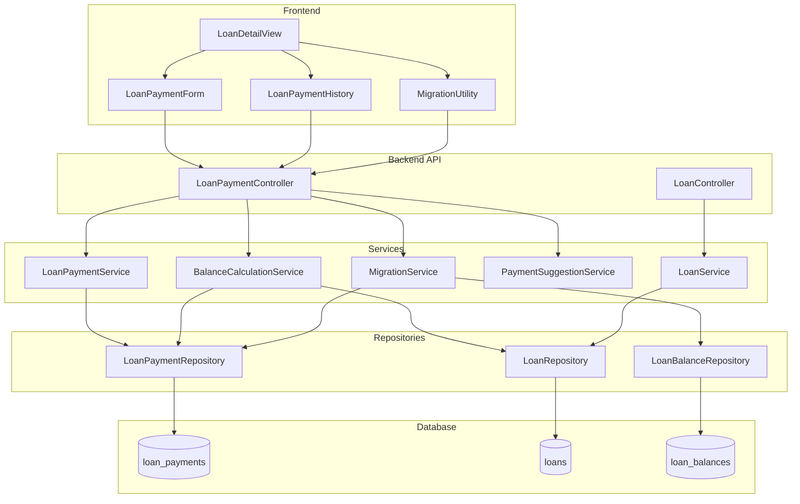

# Design Document: Loan Payment Tracking

## Overview

This design introduces a payment-based tracking system for loans and mortgages, replacing the current balance-entry approach. The system will store individual payment records and calculate the current balance dynamically. This approach is more intuitive for users who make regular payments and want to track their debt reduction progress.

The design maintains backward compatibility with existing balance entries and preserves the balance-based tracking for lines of credit, which have variable usage patterns.

## Architecture



### Component Responsibilities

1. **LoanPaymentController**: Handles HTTP requests for payment CRUD operations, balance calculation, and migration
2. **LoanPaymentService**: Business logic for payment validation and management
3. **BalanceCalculationService**: Computes current balance from initial_balance - sum(payments)
4. **PaymentSuggestionService**: Generates payment suggestions based on loan type and history
5. **MigrationService**: Converts existing balance entries to payment entries

## Components and Interfaces

### Backend API Endpoints

```
POST   /api/loans/:loanId/payments          - Create a payment entry
GET    /api/loans/:loanId/payments          - Get all payments for a loan
GET    /api/loans/:loanId/payments/:id      - Get a specific payment
PUT    /api/loans/:loanId/payments/:id      - Update a payment entry
DELETE /api/loans/:loanId/payments/:id      - Delete a payment entry
GET    /api/loans/:loanId/calculated-balance - Get calculated balance
GET    /api/loans/:loanId/payment-suggestion - Get suggested payment amount
POST   /api/loans/:loanId/migrate-balances  - Convert balance entries to payments
```

### LoanPaymentService Interface

```javascript
class LoanPaymentService {
  /**
   * Create a new payment entry
   * @param {number} loanId - Loan ID
   * @param {Object} paymentData - { amount, payment_date, notes }
   * @returns {Promise<Object>} Created payment entry
   */
  async createPayment(loanId, paymentData);
  
  /**
   * Get all payments for a loan
   * @param {number} loanId - Loan ID
   * @returns {Promise<Array>} Array of payment entries
   */
  async getPayments(loanId);
  
  /**
   * Update a payment entry
   * @param {number} paymentId - Payment ID
   * @param {Object} paymentData - Updated payment data
   * @returns {Promise<Object|null>} Updated payment or null
   */
  async updatePayment(paymentId, paymentData);
  
  /**
   * Delete a payment entry
   * @param {number} paymentId - Payment ID
   * @returns {Promise<boolean>} True if deleted
   */
  async deletePayment(paymentId);
  
  /**
   * Validate payment data
   * @param {Object} paymentData - Payment data to validate
   * @throws {Error} If validation fails
   */
  validatePayment(paymentData);
}
```

### BalanceCalculationService Interface

```javascript
class BalanceCalculationService {
  /**
   * Calculate current balance for a loan
   * @param {number} loanId - Loan ID
   * @returns {Promise<Object>} { currentBalance, totalPayments, paymentCount }
   */
  async calculateBalance(loanId);
  
  /**
   * Get balance history with running totals
   * @param {number} loanId - Loan ID
   * @returns {Promise<Array>} Array of { date, payment, runningBalance }
   */
  async getBalanceHistory(loanId);
}
```

### PaymentSuggestionService Interface

```javascript
class PaymentSuggestionService {
  /**
   * Get suggested payment amount for a loan
   * @param {number} loanId - Loan ID
   * @returns {Promise<Object>} { suggestedAmount, source, confidence }
   */
  async getSuggestion(loanId);
}
```

### MigrationService Interface

```javascript
class MigrationService {
  /**
   * Migrate balance entries to payment entries
   * @param {number} loanId - Loan ID
   * @returns {Promise<Object>} { converted, skipped, errors }
   */
  async migrateBalanceEntries(loanId);
  
  /**
   * Preview migration without executing
   * @param {number} loanId - Loan ID
   * @returns {Promise<Object>} Preview of what would be migrated
   */
  async previewMigration(loanId);
}
```

## Data Models

### New Table: loan_payments

```sql
CREATE TABLE IF NOT EXISTS loan_payments (
  id INTEGER PRIMARY KEY AUTOINCREMENT,
  loan_id INTEGER NOT NULL,
  amount REAL NOT NULL CHECK(amount > 0),
  payment_date TEXT NOT NULL,
  notes TEXT,
  created_at TEXT DEFAULT CURRENT_TIMESTAMP,
  updated_at TEXT DEFAULT CURRENT_TIMESTAMP,
  FOREIGN KEY (loan_id) REFERENCES loans(id) ON DELETE CASCADE
);

CREATE INDEX IF NOT EXISTS idx_loan_payments_loan_id ON loan_payments(loan_id);
CREATE INDEX IF NOT EXISTS idx_loan_payments_date ON loan_payments(payment_date);
```

### Payment Entry Object

```javascript
{
  id: number,           // Auto-generated ID
  loan_id: number,      // Reference to loans table
  amount: number,       // Payment amount (positive)
  payment_date: string, // YYYY-MM-DD format
  notes: string | null, // Optional notes
  created_at: string,   // Timestamp
  updated_at: string    // Timestamp
}
```

### Calculated Balance Response

```javascript
{
  loanId: number,
  initialBalance: number,
  totalPayments: number,
  currentBalance: number,  // max(0, initialBalance - totalPayments)
  paymentCount: number,
  lastPaymentDate: string | null
}
```

### Payment Suggestion Response

```javascript
{
  suggestedAmount: number | null,
  source: 'monthly_payment' | 'average_history' | 'none',
  confidence: 'high' | 'medium' | 'low',
  message: string
}
```

### Migration Result

```javascript
{
  loanId: number,
  converted: [
    { balanceEntryId: number, paymentAmount: number, paymentDate: string }
  ],
  skipped: [
    { balanceEntryId: number, reason: string }
  ],
  summary: {
    totalConverted: number,
    totalSkipped: number,
    totalPaymentAmount: number
  }
}
```


## Correctness Properties

*A property is a characteristic or behavior that should hold true across all valid executions of a system—essentially, a formal statement about what the system should do. Properties serve as the bridge between human-readable specifications and machine-verifiable correctness guarantees.*

### Property 1: Payment CRUD Round-Trip

*For any* valid payment data (positive amount, valid date, optional notes), creating a payment and then retrieving it should return the same data that was submitted.

**Validates: Requirements 1.1, 1.3**

### Property 2: Payment Ordering

*For any* set of payment entries with different dates, retrieving payments should return them sorted in reverse chronological order (newest first).

**Validates: Requirements 1.2**

### Property 3: Payment Deletion Updates Balance

*For any* loan with payments, deleting a payment should remove it from the list and the calculated balance should increase by exactly the deleted payment amount.

**Validates: Requirements 1.4**

### Property 4: Payment Amount Validation

*For any* payment amount that is zero, negative, or non-numeric, the system should reject the payment with a validation error.

**Validates: Requirements 1.5**

### Property 5: Payment Date Validation

*For any* payment date that is not in YYYY-MM-DD format or is in the future, the system should reject the payment with a validation error.

**Validates: Requirements 1.6**

### Property 6: Balance Calculation Formula

*For any* loan with initial_balance B and a set of payments P, the calculated current balance should equal max(0, B - sum(P)).

**Validates: Requirements 2.1, 2.2, 2.4**

### Property 7: Mortgage Payment Suggestion

*For any* mortgage with a monthly_payment field value M, the payment suggestion should return M with source 'monthly_payment'.

**Validates: Requirements 3.1**

### Property 8: Loan Average Payment Suggestion

*For any* loan (not mortgage) with payment history, the payment suggestion should return the arithmetic mean of all previous payment amounts.

**Validates: Requirements 3.2**

### Property 9: No Suggestion for Empty History

*For any* loan with no payment history and no monthly_payment field, the payment suggestion should return null with source 'none'.

**Validates: Requirements 3.3**

### Property 10: Migration Payment Calculation

*For any* sequence of balance entries [B1, B2, B3, ...] in chronological order, the migration should create payments with amounts equal to the positive differences (B1-B2, B2-B3, ...) where the balance decreased.

**Validates: Requirements 4.1, 4.2**

### Property 11: Migration Preserves Balance Entries

*For any* loan with balance entries, after migration completes, all original balance entries should still exist in the loan_balances table.

**Validates: Requirements 4.3, 2.5**

### Property 12: Migration Skips Balance Increases

*For any* pair of consecutive balance entries where the later balance is higher than the earlier balance, the migration should skip that entry and include it in the skipped list.

**Validates: Requirements 4.4**

### Property 13: Loan Type Determines Tracking Method

*For any* loan, if loan_type is 'loan' or 'mortgage', the system should support payment-based tracking; if loan_type is 'line_of_credit', the system should use balance-based tracking.

**Validates: Requirements 5.1, 5.2**

### Property 14: Running Balance in Payment History

*For any* payment history display, each entry should show a running balance that equals initial_balance minus the cumulative sum of all payments up to and including that entry.

**Validates: Requirements 6.2**

## Error Handling

### Validation Errors

| Error Condition | Error Message | HTTP Status |
|----------------|---------------|-------------|
| Payment amount <= 0 | "Payment amount must be a positive number" | 400 |
| Payment amount not a number | "Payment amount must be a valid number" | 400 |
| Invalid date format | "Payment date must be in YYYY-MM-DD format" | 400 |
| Future date | "Payment date cannot be in the future" | 400 |
| Loan not found | "Loan not found" | 404 |
| Wrong loan type for payment | "Payment tracking is only available for loans and mortgages" | 400 |
| Payment not found | "Payment not found" | 404 |

### Migration Errors

| Error Condition | Handling |
|----------------|----------|
| No balance entries to migrate | Return empty result with message |
| Balance increased between entries | Skip entry, add to skipped list with reason |
| Database error during migration | Rollback transaction, return error |

### Service Layer Error Handling

```javascript
// All service methods should follow this pattern
async createPayment(loanId, paymentData) {
  // 1. Validate loan exists and is correct type
  const loan = await loanRepository.findById(loanId);
  if (!loan) {
    throw new Error('Loan not found');
  }
  if (loan.loan_type === 'line_of_credit') {
    throw new Error('Payment tracking is only available for loans and mortgages');
  }
  
  // 2. Validate payment data
  this.validatePayment(paymentData);
  
  // 3. Perform operation
  return await loanPaymentRepository.create({ loan_id: loanId, ...paymentData });
}
```

## Testing Strategy

### Dual Testing Approach

This feature requires both unit tests and property-based tests for comprehensive coverage:

- **Unit tests**: Verify specific examples, edge cases, and error conditions
- **Property tests**: Verify universal properties across randomly generated inputs

### Property-Based Testing Configuration

- **Library**: fast-check (already used in the project)
- **Minimum iterations**: 100 per property test
- **Tag format**: `Feature: loan-payment-tracking, Property {number}: {property_text}`

### Test Categories

#### Unit Tests
- Payment validation edge cases (boundary values, special characters in notes)
- Date validation edge cases (leap years, month boundaries)
- Migration with various balance patterns
- Error handling for all error conditions
- Integration tests for API endpoints

#### Property-Based Tests
- Payment CRUD round-trip consistency
- Balance calculation correctness
- Payment ordering invariant
- Suggestion algorithm correctness
- Migration calculation correctness

### Test File Organization

```
backend/
├── services/
│   ├── loanPaymentService.test.js           # Unit tests
│   ├── loanPaymentService.roundtrip.pbt.test.js  # Property: CRUD round-trip
│   ├── balanceCalculationService.pbt.test.js     # Property: Balance formula
│   ├── paymentSuggestionService.pbt.test.js      # Property: Suggestions
│   └── migrationService.pbt.test.js              # Property: Migration
├── repositories/
│   └── loanPaymentRepository.pbt.test.js    # Property: Ordering
└── controllers/
    └── loanPaymentController.test.js        # Integration tests

frontend/
└── src/components/
    ├── LoanPaymentForm.test.jsx             # Unit tests
    └── LoanPaymentHistory.test.jsx          # Unit tests
```
