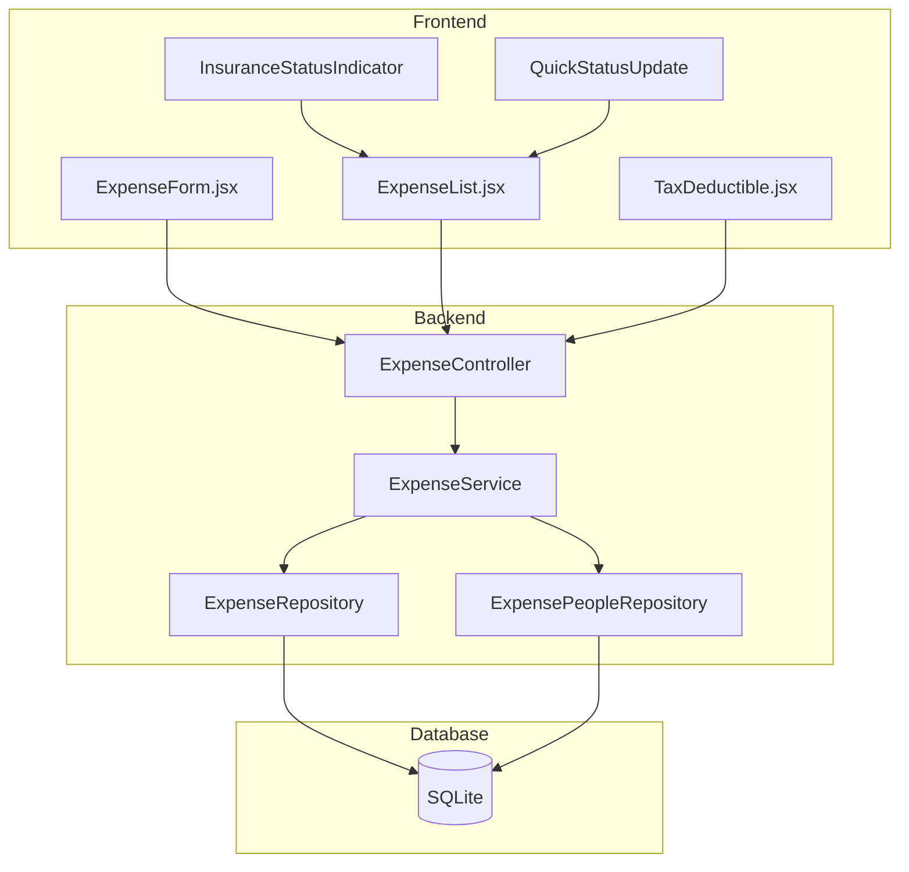
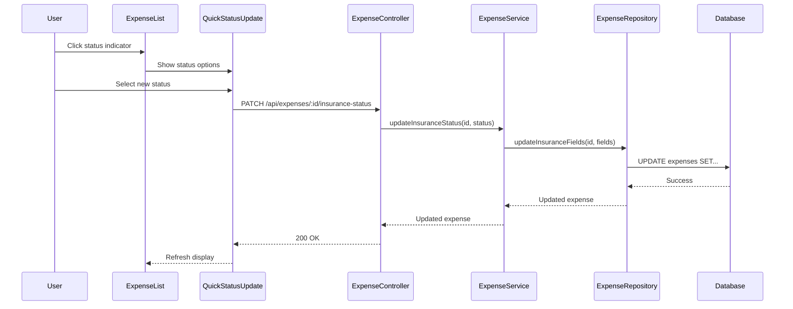

# Design Document: Medical Insurance Tracking

## Overview

This feature adds insurance tracking capabilities to medical expenses (Tax - Medical type) in the expense tracker application. The design extends the existing expense tracking system to include insurance eligibility flags, claim status tracking, original cost vs out-of-pocket amount tracking, and integration with the existing people allocation system.

The implementation follows the existing layered architecture pattern (Controller → Service → Repository → Database) and integrates with the current medical expense workflow including people assignment and invoice attachments.

## Architecture

### High-Level Architecture



### Data Flow for Insurance Status Update



## Components and Interfaces

### Database Schema Changes

New columns added to the `expenses` table:

```sql
-- Insurance tracking fields (only applicable for Tax - Medical expenses)
insurance_eligible INTEGER DEFAULT 0,           -- 0 = not eligible, 1 = eligible
claim_status TEXT DEFAULT NULL,                 -- 'not_claimed', 'in_progress', 'paid', 'denied'
original_cost REAL DEFAULT NULL                 -- Original cost before reimbursement
```

The `amount` field continues to represent the out-of-pocket cost. When insurance is involved:
- `original_cost` stores the full expense amount
- `amount` stores what the user actually paid (out-of-pocket)
- Reimbursement = `original_cost` - `amount`

### Backend Components

#### ExpenseRepository Extensions

```javascript
// New methods for insurance tracking
class ExpenseRepository {
  /**
   * Update insurance-related fields for an expense
   * @param {number} id - Expense ID
   * @param {Object} insuranceData - Insurance fields to update
   * @returns {Promise<Object>} Updated expense
   */
  async updateInsuranceFields(id, insuranceData) { }
  
  /**
   * Get tax-deductible expenses with insurance data
   * @param {number} year - Year
   * @returns {Promise<Array>} Expenses with insurance info
   */
  async getTaxDeductibleExpensesWithInsurance(year) { }
}
```

#### ExpenseService Extensions

```javascript
class ExpenseService {
  /**
   * Update insurance status for a medical expense
   * @param {number} id - Expense ID
   * @param {string} status - New claim status
   * @returns {Promise<Object>} Updated expense
   */
  async updateInsuranceStatus(id, status) { }
  
  /**
   * Update insurance eligibility for a medical expense
   * @param {number} id - Expense ID
   * @param {boolean} eligible - Whether expense is insurance eligible
   * @param {number} originalCost - Original cost (if eligible)
   * @returns {Promise<Object>} Updated expense
   */
  async updateInsuranceEligibility(id, eligible, originalCost) { }
  
  /**
   * Validate insurance data
   * @param {Object} insuranceData - Insurance data to validate
   * @param {number} expenseAmount - Current expense amount
   * @throws {Error} If validation fails
   */
  validateInsuranceData(insuranceData, expenseAmount) { }
}
```

#### ExpenseController Extensions

```javascript
// New endpoint for quick status update
router.patch('/expenses/:id/insurance-status', async (req, res) => {
  // Updates claim_status field only
});

// Extended expense update to handle insurance fields
router.put('/expenses/:id', async (req, res) => {
  // Handles insurance_eligible, claim_status, original_cost
});
```

### Frontend Components

#### InsuranceStatusIndicator Component

A visual indicator showing the current insurance claim status.

```jsx
// Props
interface InsuranceStatusIndicatorProps {
  insuranceEligible: boolean;
  claimStatus: 'not_claimed' | 'in_progress' | 'paid' | 'denied' | null;
  originalCost?: number;
  outOfPocket?: number;
  size?: 'small' | 'medium';
  onClick?: () => void;
}
```

Visual indicators:
- Not eligible: No indicator shown
- Not Claimed: 📋 Gray badge
- In Progress: ⏳ Yellow/orange badge
- Paid: ✅ Green badge
- Denied: ❌ Red badge

#### QuickStatusUpdate Component

A dropdown/popover for quickly changing claim status.

```jsx
// Props
interface QuickStatusUpdateProps {
  expenseId: number;
  currentStatus: string;
  onStatusChange: (newStatus: string) => void;
}
```

Status transitions:
- Not Claimed → In Progress
- In Progress → Paid | Denied
- Paid/Denied → (can revert to In Progress via edit form)

#### ExpenseForm Insurance Section

Extended form section for medical expenses:

```jsx
// Insurance fields (shown when type === 'Tax - Medical')
{isMedicalExpense && (
  <div className="insurance-section">
    <label>
      <input type="checkbox" checked={insuranceEligible} onChange={...} />
      Eligible for Insurance
    </label>
    
    {insuranceEligible && (
      <>
        <div className="form-group">
          <label>Original Cost</label>
          <input type="number" value={originalCost} onChange={...} />
        </div>
        
        <div className="form-group">
          <label>Out-of-Pocket (Amount)</label>
          <input type="number" value={amount} onChange={...} />
        </div>
        
        <div className="form-group">
          <label>Claim Status</label>
          <select value={claimStatus} onChange={...}>
            <option value="not_claimed">Not Claimed</option>
            <option value="in_progress">In Progress</option>
            <option value="paid">Paid</option>
            <option value="denied">Denied</option>
          </select>
        </div>
        
        <div className="reimbursement-display">
          Reimbursement: ${originalCost - amount}
        </div>
      </>
    )}
  </div>
)}
```

### API Endpoints

| Method | Endpoint | Description |
|--------|----------|-------------|
| PATCH | `/api/expenses/:id/insurance-status` | Quick status update |
| GET | `/api/expenses/tax-deductible?year=YYYY` | Extended with insurance data |

### Integration with People Allocation

When a medical expense is allocated to multiple people:
- `original_cost` is split according to the allocation percentages
- `amount` (out-of-pocket) is also split per person
- Each person's allocation tracks both original and out-of-pocket amounts

The `expense_people` table already has an `amount` field which will represent the out-of-pocket allocation. A new field `original_amount` will be added:

```sql
ALTER TABLE expense_people ADD COLUMN original_amount REAL DEFAULT NULL;
```

## Data Models

### Expense Model (Extended)

```typescript
interface Expense {
  id: number;
  date: string;
  place: string | null;
  notes: string | null;
  amount: number;              // Out-of-pocket cost
  type: string;
  week: number;
  method: string;
  created_at: string;
  
  // Insurance fields (Tax - Medical only)
  insurance_eligible: boolean;
  claim_status: 'not_claimed' | 'in_progress' | 'paid' | 'denied' | null;
  original_cost: number | null;
  
  // Computed
  reimbursement?: number;      // original_cost - amount
}
```

### ExpensePerson Model (Extended)

```typescript
interface ExpensePerson {
  id: number;
  expense_id: number;
  person_id: number;
  amount: number;              // Out-of-pocket allocation
  original_amount: number | null;  // Original cost allocation
}
```

### Insurance Summary Model

```typescript
interface InsuranceSummary {
  totalOriginalCost: number;
  totalOutOfPocket: number;
  totalReimbursement: number;
  byStatus: {
    not_claimed: { count: number; amount: number };
    in_progress: { count: number; amount: number };
    paid: { count: number; amount: number };
    denied: { count: number; amount: number };
  };
}
```

## Correctness Properties

*A property is a characteristic or behavior that should hold true across all valid executions of a system—essentially, a formal statement about what the system should do. Properties serve as the bridge between human-readable specifications and machine-verifiable correctness guarantees.*


### Property 1: Insurance Eligibility Conditional Display

*For any* expense object, insurance-related fields (claim status, original cost) SHALL only be displayed and editable when the expense type is "Tax - Medical" AND insurance_eligible is true.

**Validates: Requirements 1.1, 1.4, 2.1, 3.1, 7.3**

### Property 2: Insurance Data Defaults

*For any* newly created medical expense, the insurance_eligible field SHALL default to false (0), and when insurance_eligible is set to true, claim_status SHALL default to "not_claimed" and original_cost SHALL equal the amount field.

**Validates: Requirements 1.2, 2.4, 2.5**

### Property 3: Insurance Data Persistence Round-Trip

*For any* medical expense with insurance data, saving the expense and then retrieving it SHALL produce an expense with identical insurance_eligible, claim_status, original_cost, and amount values.

**Validates: Requirements 1.3, 2.3, 5.4**

### Property 4: Claim Status Enum Validation

*For any* claim_status value, the system SHALL only accept values from the set {"not_claimed", "in_progress", "paid", "denied", null}, and SHALL reject any other value.

**Validates: Requirements 2.2**

### Property 5: Amount Validation Invariant

*For any* insurance-eligible expense, the amount (out-of-pocket) SHALL be less than or equal to the original_cost. For expenses with people allocations, each person's amount SHALL be less than or equal to their original_amount.

**Validates: Requirements 3.5, 4.4**

### Property 6: Reimbursement Calculation

*For any* insurance-eligible expense with original_cost and amount values, the calculated reimbursement SHALL equal (original_cost - amount), and this value SHALL be non-negative.

**Validates: Requirements 3.6**

### Property 7: People Allocation Original Cost Consistency

*For any* medical expense allocated to multiple people, the sum of all person original_amount allocations SHALL equal the expense's original_cost, and the sum of all person amount allocations SHALL equal the expense's amount.

**Validates: Requirements 4.1, 4.2**

### Property 8: Insurance Totals Aggregation

*For any* year, the total original costs SHALL equal the sum of original_cost for all insurance-eligible medical expenses, and the total out-of-pocket SHALL equal the sum of amount for all medical expenses in that year.

**Validates: Requirements 6.3, 6.4**

### Property 9: Claim Status Filtering

*For any* claim status filter value, filtering expenses by that status SHALL return only expenses where claim_status matches the filter value, and the count of filtered results SHALL be less than or equal to the total count.

**Validates: Requirements 6.5, 7.4**

### Property 10: Migration Data Preservation

*For any* existing medical expense before migration, after migration the expense SHALL retain all original field values (date, place, notes, amount, type, week, method, people allocations).

**Validates: Requirements 8.1, 8.4**

### Property 11: Migration Defaults

*For any* existing medical expense after migration, insurance_eligible SHALL be 0 (false), claim_status SHALL be null, and original_cost SHALL equal the pre-migration amount value.

**Validates: Requirements 8.2, 8.3**

### Property 12: Backup/Restore Round-Trip

*For any* expense with insurance data, creating a backup and restoring from that backup SHALL produce an expense with identical values for all fields including insurance_eligible, claim_status, original_cost, and amount.

**Validates: Requirements 9.1, 9.2, 9.3**

## Error Handling

### Validation Errors

| Error Condition | Error Message | HTTP Status |
|-----------------|---------------|-------------|
| Invalid claim status | "Claim status must be one of: not_claimed, in_progress, paid, denied" | 400 |
| Amount exceeds original cost | "Out-of-pocket amount cannot exceed original cost" | 400 |
| Negative original cost | "Original cost must be a positive number" | 400 |
| Insurance fields on non-medical expense | "Insurance fields are only valid for Tax - Medical expenses" | 400 |
| Person allocation exceeds original | "Person allocation cannot exceed their original cost allocation" | 400 |

### Database Errors

- Migration failures trigger automatic rollback
- Backup is created before any migration
- Transaction wrapping for multi-table updates (expense + expense_people)

### API Error Responses

```javascript
// Standard error response format
{
  "error": "Error message",
  "code": "ERROR_CODE",
  "details": { /* optional additional context */ }
}
```

## Testing Strategy

### Unit Tests

Unit tests focus on specific examples and edge cases:

1. **Validation Tests**
   - Test invalid claim status values are rejected
   - Test amount > original_cost is rejected
   - Test negative amounts are rejected
   - Test insurance fields on non-medical expenses are rejected

2. **Default Value Tests**
   - Test new medical expense has insurance_eligible = false
   - Test setting insurance_eligible = true sets claim_status = "not_claimed"

3. **Calculation Tests**
   - Test reimbursement calculation with specific values
   - Test aggregation totals with known data sets

### Property-Based Tests

Property-based tests verify universal properties across randomly generated inputs. Each test runs minimum 100 iterations.

**Testing Framework**: fast-check (JavaScript property-based testing library)

1. **Property 2: Insurance Data Defaults**
   - Generate random medical expense data
   - Verify defaults are applied correctly
   - Tag: **Feature: medical-insurance-tracking, Property 2: Insurance Data Defaults**

2. **Property 3: Insurance Data Persistence Round-Trip**
   - Generate random insurance data
   - Save and retrieve
   - Verify equality
   - Tag: **Feature: medical-insurance-tracking, Property 3: Insurance Data Persistence Round-Trip**

3. **Property 4: Claim Status Enum Validation**
   - Generate random strings
   - Verify only valid statuses are accepted
   - Tag: **Feature: medical-insurance-tracking, Property 4: Claim Status Enum Validation**

4. **Property 5: Amount Validation Invariant**
   - Generate random original_cost and amount pairs
   - Verify validation rejects amount > original_cost
   - Tag: **Feature: medical-insurance-tracking, Property 5: Amount Validation Invariant**

5. **Property 6: Reimbursement Calculation**
   - Generate random original_cost and amount values
   - Verify reimbursement = original_cost - amount
   - Tag: **Feature: medical-insurance-tracking, Property 6: Reimbursement Calculation**

6. **Property 7: People Allocation Original Cost Consistency**
   - Generate random allocations
   - Verify sums match totals
   - Tag: **Feature: medical-insurance-tracking, Property 7: People Allocation Original Cost Consistency**

7. **Property 9: Claim Status Filtering**
   - Generate random expenses with various statuses
   - Apply filter
   - Verify only matching expenses returned
   - Tag: **Feature: medical-insurance-tracking, Property 9: Claim Status Filtering**

8. **Property 10: Migration Data Preservation**
   - Generate random existing expense data
   - Run migration
   - Verify original data preserved
   - Tag: **Feature: medical-insurance-tracking, Property 10: Migration Data Preservation**

9. **Property 11: Migration Defaults**
   - Generate random existing expenses
   - Run migration
   - Verify defaults applied
   - Tag: **Feature: medical-insurance-tracking, Property 11: Migration Defaults**

10. **Property 12: Backup/Restore Round-Trip**
    - Generate random expense with insurance data
    - Backup and restore
    - Verify equality
    - Tag: **Feature: medical-insurance-tracking, Property 12: Backup/Restore Round-Trip**

### Integration Tests

1. **API Integration**
   - Test PATCH /api/expenses/:id/insurance-status endpoint
   - Test extended GET /api/expenses/tax-deductible response

2. **Frontend Integration**
   - Test ExpenseForm insurance section rendering
   - Test QuickStatusUpdate component interactions
   - Test TaxDeductible view with insurance data

### Test Data Generators

```javascript
// fast-check arbitraries for insurance data
const claimStatusArb = fc.constantFrom('not_claimed', 'in_progress', 'paid', 'denied', null);

const insuranceDataArb = fc.record({
  insurance_eligible: fc.boolean(),
  claim_status: claimStatusArb,
  original_cost: fc.float({ min: 0.01, max: 10000, noNaN: true }),
  amount: fc.float({ min: 0.01, max: 10000, noNaN: true })
}).filter(data => !data.insurance_eligible || data.amount <= data.original_cost);

const medicalExpenseArb = fc.record({
  date: fc.date({ min: new Date('2020-01-01'), max: new Date('2030-12-31') })
    .map(d => d.toISOString().split('T')[0]),
  place: fc.string({ minLength: 1, maxLength: 100 }),
  amount: fc.float({ min: 0.01, max: 10000, noNaN: true }),
  type: fc.constant('Tax - Medical'),
  method: fc.constantFrom('Cash', 'Debit', 'CIBC MC', 'PCF MC', 'WS VISA', 'VISA')
});
```
