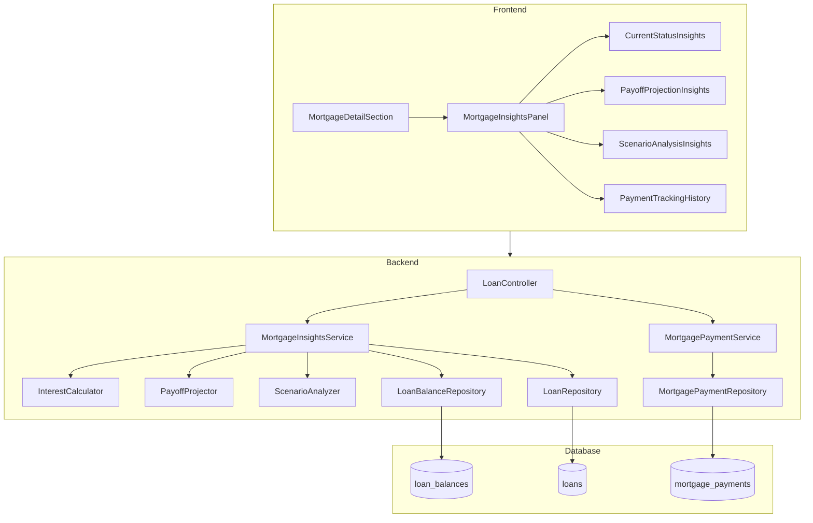

# Design Document: Mortgage Insights

## Overview

This design extends the existing mortgage tracking system with practical financial insights. The feature builds on the existing `mortgageService.js` and `loan_balances` table, adding a new `mortgage_payments` table for payment tracking and a dedicated `MortgageInsightsService` for insight calculations.

The architecture follows a modular approach where each insight type (daily interest, payoff projection, scenario analysis) is implemented as a separate calculation method, making it easy to add new insights in the future. The frontend displays insights within the existing `MortgageDetailSection` component through a new `MortgageInsightsPanel` component.

## Architecture



### Key Design Decisions

1. **Extend existing services** rather than creating entirely new infrastructure - leverage `mortgageService.js` for base calculations
2. **New `mortgage_payments` table** for tracking user-entered payment amounts over time with effective dates
3. **Modular insight calculations** - each insight type is a separate method that can be called independently
4. **Single insights endpoint** that returns all calculated insights in one response to minimize API calls
5. **Preset scenario buttons** for common extra payment amounts to improve UX

## Components and Interfaces

### Backend Components

#### MortgageInsightsService (New)

```javascript
// backend/services/mortgageInsightsService.js
class MortgageInsightsService {
  /**
   * Calculate daily interest based on current balance and rate
   * @param {number} balance - Current mortgage balance
   * @param {number} annualRate - Annual interest rate (percentage)
   * @returns {Object} { daily, weekly, monthly, annual }
   */
  calculateInterestBreakdown(balance, annualRate) {
    // daily = balance * (rate/100) / 365
    // weekly = daily * 7
    // monthly = daily * 30.44
    // annual = balance * (rate/100)
  }

  /**
   * Project payoff date based on payment amount
   * @param {Object} params - { balance, rate, paymentAmount, paymentFrequency }
   * @returns {Object} { payoffDate, totalMonths, totalInterest, totalPaid }
   */
  projectPayoff(params) {
    // Iteratively calculate months until balance reaches zero
    // Track total interest paid along the way
  }

  /**
   * Compare two payment scenarios
   * @param {Object} params - { balance, rate, currentPayment, minimumPayment, paymentFrequency }
   * @returns {Object} { currentScenario, minimumScenario, comparison }
   */
  comparePaymentScenarios(params) {
    // Calculate both scenarios and return comparison
  }

  /**
   * Calculate what-if scenario for extra payment
   * @param {Object} params - { balance, rate, currentPayment, extraPayment, paymentFrequency }
   * @returns {Object} { newPayoffDate, monthsSaved, interestSaved, newTotalInterest }
   */
  calculateExtraPaymentScenario(params) {
    // Project with extra payment and compare to current
  }

  /**
   * Get all insights for a mortgage
   * @param {number} mortgageId - Mortgage loan ID
   * @returns {Object} Complete insights object
   */
  async getMortgageInsights(mortgageId) {
    // Aggregate all insight calculations into single response
  }
}
```

#### MortgagePaymentService (New)

```javascript
// backend/services/mortgagePaymentService.js
class MortgagePaymentService {
  /**
   * Set or update current payment amount for a mortgage
   * @param {number} mortgageId - Mortgage loan ID
   * @param {number} paymentAmount - Payment amount
   * @param {string} effectiveDate - Date payment amount takes effect (YYYY-MM-DD)
   * @returns {Promise<Object>} Created payment entry
   */
  async setPaymentAmount(mortgageId, paymentAmount, effectiveDate) {
    // Validate and persist payment amount
  }

  /**
   * Get current payment amount for a mortgage
   * @param {number} mortgageId - Mortgage loan ID
   * @returns {Promise<Object|null>} Current payment entry or null
   */
  async getCurrentPayment(mortgageId) {
    // Return most recent payment entry
  }

  /**
   * Get payment history for a mortgage
   * @param {number} mortgageId - Mortgage loan ID
   * @returns {Promise<Array>} Array of payment entries
   */
  async getPaymentHistory(mortgageId) {
    // Return all payment entries in chronological order
  }
}
```

#### MortgagePaymentRepository (New)

```javascript
// backend/repositories/mortgagePaymentRepository.js
class MortgagePaymentRepository {
  async create(paymentEntry) { /* INSERT into mortgage_payments */ }
  async findByMortgage(mortgageId) { /* SELECT all for mortgage */ }
  async findCurrentByMortgage(mortgageId) { /* SELECT most recent */ }
  async update(id, paymentEntry) { /* UPDATE payment entry */ }
  async delete(id) { /* DELETE payment entry */ }
}
```

### Frontend Components

#### MortgageInsightsPanel (New)

```jsx
// frontend/src/components/MortgageInsightsPanel.jsx
// Main container for all mortgage insights
// Props: { mortgageId, mortgageData }
// Sections:
//   - Current Status (rate, daily interest, payment info)
//   - Payoff Projections (current vs minimum comparison)
//   - What-If Scenarios (extra payment calculator)
```

#### CurrentStatusInsights (New)

```jsx
// frontend/src/components/CurrentStatusInsights.jsx
// Displays: current rate, daily/weekly/monthly interest, current payment
// Visual indicators for variable rate mortgages
```

#### PayoffProjectionInsights (New)

```jsx
// frontend/src/components/PayoffProjectionInsights.jsx
// Displays: payoff date comparison table
// Shows time saved and interest saved when current > minimum
// Warning display when current < minimum
```

#### ScenarioAnalysisInsights (New)

```jsx
// frontend/src/components/ScenarioAnalysisInsights.jsx
// Input for custom extra payment amount
// Preset buttons: $100, $250, $500, $1000
// Results display: new payoff date, months saved, interest saved
```

### API Endpoints

| Method | Endpoint | Description |
|--------|----------|-------------|
| GET | `/api/loans/:id/insights` | Get all mortgage insights |
| GET | `/api/loans/:id/payments` | Get payment history |
| POST | `/api/loans/:id/payments` | Set current payment amount |
| PUT | `/api/loans/:id/payments/:paymentId` | Update payment entry |
| DELETE | `/api/loans/:id/payments/:paymentId` | Delete payment entry |
| POST | `/api/loans/:id/insights/scenario` | Calculate what-if scenario |

## Data Models

### New Table: mortgage_payments

```sql
CREATE TABLE mortgage_payments (
  id INTEGER PRIMARY KEY AUTOINCREMENT,
  loan_id INTEGER NOT NULL,
  payment_amount REAL NOT NULL,
  effective_date TEXT NOT NULL,
  notes TEXT,
  created_at TEXT DEFAULT CURRENT_TIMESTAMP,
  updated_at TEXT DEFAULT CURRENT_TIMESTAMP,
  FOREIGN KEY (loan_id) REFERENCES loans(id) ON DELETE CASCADE
);

CREATE INDEX idx_mortgage_payments_loan_id ON mortgage_payments(loan_id);
CREATE INDEX idx_mortgage_payments_effective_date ON mortgage_payments(loan_id, effective_date);
```

### MortgagePayment Entity

```typescript
interface MortgagePayment {
  id: number;
  loan_id: number;
  payment_amount: number;
  effective_date: string;  // YYYY-MM-DD
  notes: string | null;
  created_at: string;
  updated_at: string;
}
```

### InterestBreakdown

```typescript
interface InterestBreakdown {
  daily: number;
  weekly: number;
  monthly: number;
  annual: number;
  balance: number;
  rate: number;
}
```

### PayoffProjection

```typescript
interface PayoffProjection {
  payoffDate: string;        // YYYY-MM-DD
  totalMonths: number;
  totalInterest: number;
  totalPaid: number;
  paymentAmount: number;
}
```

### ScenarioComparison

```typescript
interface ScenarioComparison {
  currentScenario: PayoffProjection;
  minimumScenario: PayoffProjection;
  comparison: {
    monthsSaved: number;
    interestSaved: number;
    payoffDateDifference: number;  // days
  };
}
```

### WhatIfScenario

```typescript
interface WhatIfScenario {
  extraPayment: number;
  newPayment: number;
  newPayoffDate: string;
  monthsSaved: number;
  interestSaved: number;
  newTotalInterest: number;
  originalTotalInterest: number;
}
```

### MortgageInsights (Aggregate)

```typescript
interface MortgageInsights {
  mortgageId: number;
  currentStatus: {
    balance: number;
    rate: number;
    rateType: 'fixed' | 'variable';
    currentPayment: number | null;
    minimumPayment: number;
    interestBreakdown: InterestBreakdown;
  };
  projections: ScenarioComparison | null;
  dataStatus: {
    hasBalanceData: boolean;
    hasPaymentData: boolean;
    lastUpdated: string | null;
  };
}
```

</content>
</invoke>


## Correctness Properties

*A property is a characteristic or behavior that should hold true across all valid executions of a system—essentially, a formal statement about what the system should do. Properties serve as the bridge between human-readable specifications and machine-verifiable correctness guarantees.*

### Property 1: Payment Round-Trip

*For any* valid payment entry with a positive payment amount and valid effective date, storing the payment and then retrieving it by mortgage ID shall return an equivalent payment entry with all fields preserved (payment_amount, effective_date, notes).

**Validates: Requirements 1.2, 8.1, 8.2**

### Property 2: Payment History Preservation

*For any* sequence of payment amount updates to a mortgage, the payment history shall contain all previous values in chronological order, with no entries lost or modified.

**Validates: Requirements 1.3**

### Property 3: Default Payment Fallback

*For any* mortgage with no payment entries, the insights calculation shall use the calculated minimum payment as the current payment value.

**Validates: Requirements 1.5**

### Property 4: Current Rate Retrieval

*For any* mortgage with one or more balance entries, the displayed current rate shall equal the interest_rate from the most recent loan_balances entry (by year and month).

**Validates: Requirements 2.1**

### Property 5: Interest Calculation Formula

*For any* mortgage with positive balance B and positive annual rate R, the calculated daily interest shall equal B × (R/100) / 365, weekly interest shall equal daily × 7, and monthly interest shall equal daily × 30.44 (within floating-point tolerance).

**Validates: Requirements 3.1, 3.3, 3.4**

### Property 6: Payoff Projection Consistency

*For any* mortgage with positive balance, positive rate, and payment amount greater than or equal to the interest-only payment, the projected payoff shall satisfy: (a) payoff date is in the future, (b) total interest equals total paid minus original balance, and (c) higher payment amounts result in earlier payoff dates and lower total interest.

**Validates: Requirements 4.1, 4.2, 4.4, 4.5**

### Property 7: Underpayment Detection

*For any* mortgage where the current payment amount is less than the calculated minimum payment, the system shall flag this as an underpayment condition.

**Validates: Requirements 4.6**

### Property 8: Extra Payment Scenario Benefits

*For any* mortgage with valid projection data and any extra payment amount greater than zero, the scenario calculation shall show: (a) new payoff date earlier than current payoff date, (b) months saved greater than zero, and (c) interest saved greater than zero.

**Validates: Requirements 5.2, 5.3, 5.4**

### Property 9: Payment History Ordering

*For any* mortgage with multiple payment entries, retrieving the payment history shall return entries sorted by effective_date in ascending chronological order.

**Validates: Requirements 8.3**

### Property 10: Cascade Delete Integrity

*For any* mortgage with associated payment entries, deleting the mortgage shall result in all associated payment entries being deleted (no orphaned records).

**Validates: Requirements 8.5**

## Error Handling

### Validation Errors

| Error Condition | Error Message | HTTP Status |
|----------------|---------------|-------------|
| Invalid payment amount | "Payment amount must be a positive number" | 400 |
| Invalid effective date | "Effective date must be in YYYY-MM-DD format" | 400 |
| Future effective date | "Effective date cannot be in the future" | 400 |
| Mortgage not found | "Mortgage not found" | 404 |
| Not a mortgage | "Insights are only available for mortgages" | 400 |
| Invalid extra payment | "Extra payment amount must be a positive number" | 400 |
| Missing balance data | "No balance data available for calculations" | 400 |

### Calculation Edge Cases

- Zero balance: Return zero for all interest calculations, payoff date is "now"
- Zero rate: Calculate payoff based on principal-only payments
- Payment less than interest: Flag as underpayment, do not project payoff
- Very large extra payment: Cap scenario at single-payment payoff

### Database Errors

- Migration failures: Log error, create backup, allow app to start with existing schema
- Foreign key violations: Return 400 with specific constraint message
- Connection errors: Return 500 with generic database error message

## Testing Strategy

### Dual Testing Approach

This feature requires both unit tests and property-based tests for comprehensive coverage:

- **Unit tests**: Verify specific examples, edge cases, UI rendering, and integration points
- **Property tests**: Verify universal properties across randomly generated inputs

### Property-Based Testing Configuration

- **Library**: fast-check (already used in the project)
- **Minimum iterations**: 100 per property test
- **Tag format**: `Feature: mortgage-insights, Property {number}: {property_text}`

### Test Files Structure

```
backend/
  services/
    mortgageInsightsService.test.js                    # Unit tests
    mortgageInsightsService.interestCalc.pbt.test.js   # Property 5: Interest calculation
    mortgageInsightsService.payoffProj.pbt.test.js     # Property 6: Payoff projection
    mortgageInsightsService.scenario.pbt.test.js       # Property 8: Extra payment scenarios
    mortgagePaymentService.test.js                     # Unit tests
    mortgagePaymentService.roundtrip.pbt.test.js       # Property 1, 2, 9: Payment persistence
  repositories/
    mortgagePaymentRepository.test.js                  # Unit tests
    mortgagePaymentRepository.cascade.pbt.test.js      # Property 10: Cascade delete

frontend/
  components/
    MortgageInsightsPanel.test.jsx                     # Unit tests for panel
    CurrentStatusInsights.test.jsx                     # Unit tests for status display
    PayoffProjectionInsights.test.jsx                  # Unit tests for projections
    ScenarioAnalysisInsights.test.jsx                  # Unit tests for scenarios
```

### Unit Test Coverage

| Component | Test Focus |
|-----------|------------|
| MortgageInsightsService.calculateInterestBreakdown | Zero balance, zero rate, typical values |
| MortgageInsightsService.projectPayoff | Edge cases, boundary conditions |
| MortgageInsightsService.calculateExtraPaymentScenario | Various extra amounts |
| MortgagePaymentService | CRUD operations, validation |
| MortgagePaymentRepository | Database operations |
| MortgageInsightsPanel | Rendering, loading states |
| ScenarioAnalysisInsights | Preset buttons, input handling |

### Property Test Mapping

| Property | Test File | Description |
|----------|-----------|-------------|
| P1 | mortgagePaymentService.roundtrip.pbt.test.js | Payment round-trip |
| P2 | mortgagePaymentService.roundtrip.pbt.test.js | History preservation |
| P3 | mortgageInsightsService.test.js | Default fallback (unit test) |
| P4 | mortgageInsightsService.test.js | Rate retrieval (unit test) |
| P5 | mortgageInsightsService.interestCalc.pbt.test.js | Interest formula |
| P6 | mortgageInsightsService.payoffProj.pbt.test.js | Payoff consistency |
| P7 | mortgageInsightsService.payoffProj.pbt.test.js | Underpayment detection |
| P8 | mortgageInsightsService.scenario.pbt.test.js | Extra payment benefits |
| P9 | mortgagePaymentService.roundtrip.pbt.test.js | History ordering |
| P10 | mortgagePaymentRepository.cascade.pbt.test.js | Cascade delete |

### Test Data Generators (fast-check Arbitraries)

```javascript
// Arbitrary for valid mortgage balance/rate data
const mortgageDataArb = fc.record({
  balance: fc.float({ min: 1000, max: 2000000, noNaN: true }),
  rate: fc.float({ min: 0.1, max: 15, noNaN: true }),
  paymentFrequency: fc.constantFrom('monthly', 'bi-weekly', 'accelerated_bi-weekly')
});

// Arbitrary for valid payment entry
const paymentEntryArb = fc.record({
  payment_amount: fc.float({ min: 100, max: 50000, noNaN: true }),
  effective_date: fc.date({ min: new Date('2020-01-01'), max: new Date() })
    .map(d => d.toISOString().split('T')[0]),
  notes: fc.option(fc.string({ minLength: 0, maxLength: 200 }))
});

// Arbitrary for extra payment amounts
const extraPaymentArb = fc.float({ min: 1, max: 10000, noNaN: true });

// Arbitrary for payment history (multiple entries)
const paymentHistoryArb = fc.array(paymentEntryArb, { minLength: 1, maxLength: 20 });
```

### Integration Tests

- End-to-end insights retrieval for a mortgage
- Payment tracking flow (create, update, history)
- Scenario calculation with various inputs
- Migration script execution on fresh database
