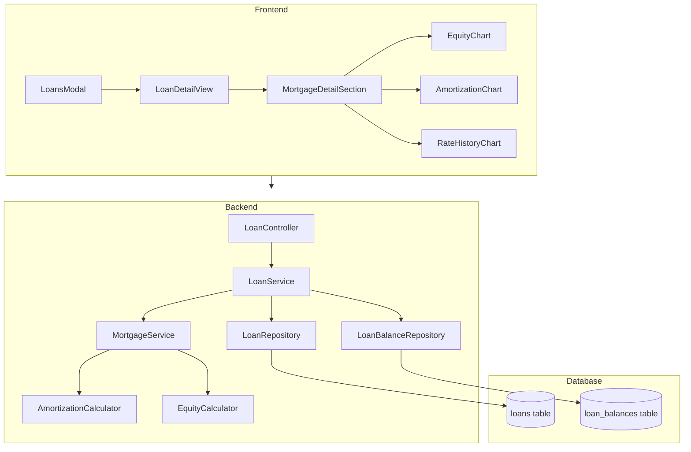

# Design Document: Mortgage Tracking

## Overview

This design extends the existing loan tracking system to support mortgages as a specialized loan type. The implementation leverages the existing `loans` and `loan_balances` tables, adding mortgage-specific fields and calculations while maintaining backward compatibility with existing loan and line of credit functionality.

The design follows the established Controller → Service → Repository architecture pattern and integrates with existing frontend components (LoansModal, LoanDetailView) through conditional rendering based on loan type.

## Architecture



### Key Design Decisions

1. **Extend existing tables** rather than creating new mortgage-specific tables to maintain data consistency and leverage existing balance tracking
2. **Conditional UI rendering** based on loan_type to show mortgage-specific fields only when relevant
3. **Calculation services** for amortization and equity to keep business logic centralized and testable
4. **Leverage existing loan_balances** for rate history tracking - no new tables needed for variable rate support

## Components and Interfaces

### Backend Components

#### MortgageService (New)

```javascript
// backend/services/mortgageService.js
class MortgageService {
  /**
   * Validate mortgage-specific fields
   * @param {Object} mortgageData - Mortgage data to validate
   * @throws {Error} If validation fails
   */
  validateMortgageFields(mortgageData) {
    // Validates: amortization_period (1-40 years)
    // Validates: term_length (1-10 years, <= amortization_period)
    // Validates: renewal_date (future date)
    // Validates: rate_type ('fixed' or 'variable')
    // Validates: payment_frequency ('monthly', 'bi-weekly', 'accelerated_bi-weekly')
    // Validates: estimated_property_value (> 0 if provided)
  }

  /**
   * Calculate equity for a mortgage
   * @param {number} estimatedPropertyValue - Current property value estimate
   * @param {number} remainingBalance - Current mortgage balance
   * @returns {Object} { equityAmount, equityPercentage }
   */
  calculateEquity(estimatedPropertyValue, remainingBalance) {
    // Returns equity amount and percentage
  }

  /**
   * Generate amortization schedule
   * @param {Object} params - { balance, rate, amortizationYears, paymentFrequency }
   * @returns {Array} Array of payment periods with principal/interest breakdown
   */
  generateAmortizationSchedule(params) {
    // Calculates payment schedule based on current parameters
  }

  /**
   * Calculate payment amount based on frequency
   * @param {Object} params - { balance, rate, amortizationYears, paymentFrequency }
   * @returns {number} Payment amount per period
   */
  calculatePaymentAmount(params) {
    // Standard mortgage payment formula adjusted for frequency
  }

  /**
   * Check if renewal is approaching
   * @param {string} renewalDate - ISO date string
   * @returns {Object} { isApproaching, monthsUntilRenewal, isPastDue }
   */
  checkRenewalStatus(renewalDate) {
    // Returns renewal status information
  }

  /**
   * Calculate principal vs interest paid from balance history
   * @param {number} loanId - Loan ID
   * @param {Array} balanceHistory - Historical balance entries
   * @returns {Object} { totalPrincipalPaid, totalInterestPaid, breakdown }
   */
  calculatePaymentBreakdown(loanId, balanceHistory) {
    // Analyzes balance changes to estimate principal/interest split
  }
}
```

#### Extended LoanService

```javascript
// Additions to backend/services/loanService.js
class LoanService {
  // Existing methods...

  /**
   * Create a new mortgage
   * @param {Object} data - Mortgage data including mortgage-specific fields
   * @returns {Promise<Object>} Created mortgage
   */
  async createMortgage(data) {
    // Validates standard loan fields
    // Validates mortgage-specific fields via MortgageService
    // Persists to database
  }

  /**
   * Update mortgage-specific fields
   * @param {number} id - Loan ID
   * @param {Object} data - Updated mortgage data
   * @returns {Promise<Object>} Updated mortgage
   */
  async updateMortgage(id, data) {
    // Only allows updating: name, notes, estimated_property_value, renewal_date
    // Prevents modification of: initial_balance, start_date, amortization_period, term_length
  }
}
```

#### Extended LoanRepository

```javascript
// Additions to backend/repositories/loanRepository.js
class LoanRepository {
  // Existing methods updated to include mortgage fields...

  /**
   * Create a loan/mortgage with all fields
   * @param {Object} loan - Loan data including optional mortgage fields
   * @returns {Promise<Object>} Created loan
   */
  async create(loan) {
    // INSERT includes: amortization_period, term_length, renewal_date,
    //                  rate_type, payment_frequency, estimated_property_value
  }

  /**
   * Update mortgage-specific fields
   * @param {number} id - Loan ID
   * @param {Object} updates - Fields to update
   * @returns {Promise<Object>} Updated loan
   */
  async updateMortgageFields(id, updates) {
    // Updates only allowed mortgage fields
  }
}
```

### Frontend Components

#### Extended LoansModal

```jsx
// Additions to frontend/src/components/LoansModal.jsx
// Conditional form fields when loan_type === 'mortgage':
// - Amortization Period (years) - number input
// - Term Length (years) - number input
// - Renewal Date - date picker
// - Rate Type - select (Fixed/Variable)
// - Payment Frequency - select (Monthly/Bi-weekly/Accelerated Bi-weekly)
// - Estimated Property Value - optional number input
```

#### MortgageDetailSection (New)

```jsx
// frontend/src/components/MortgageDetailSection.jsx
// Renders mortgage-specific information within LoanDetailView:
// - Mortgage summary (amortization, term, renewal date, rate type, frequency)
// - Equity section (if property value provided)
// - Amortization schedule visualization
// - Principal vs Interest chart
// - Rate history chart (for variable rate mortgages)
// - Renewal reminder banner (if within 6 months)
```

#### Chart Components (New)

```jsx
// frontend/src/components/EquityChart.jsx
// SVG line chart showing equity buildup over time

// frontend/src/components/AmortizationChart.jsx
// Stacked area chart showing principal vs interest over loan life

// frontend/src/components/RateHistoryChart.jsx
// Line chart showing interest rate changes (for variable mortgages)
```

### API Endpoints

| Method | Endpoint | Description |
|--------|----------|-------------|
| POST | `/api/loans` | Create loan/mortgage (extended to handle mortgage fields) |
| PUT | `/api/loans/:id` | Update loan/mortgage (extended for mortgage fields) |
| GET | `/api/loans/:id/amortization` | Get amortization schedule for mortgage |
| GET | `/api/loans/:id/equity-history` | Get equity history for mortgage |
| PUT | `/api/loans/:id/property-value` | Update estimated property value |

## Data Models

### Extended Loans Table Schema

```sql
-- Migration: add_mortgage_fields_v1
ALTER TABLE loans ADD COLUMN amortization_period INTEGER;
ALTER TABLE loans ADD COLUMN term_length INTEGER;
ALTER TABLE loans ADD COLUMN renewal_date TEXT;
ALTER TABLE loans ADD COLUMN rate_type TEXT CHECK(rate_type IN ('fixed', 'variable'));
ALTER TABLE loans ADD COLUMN payment_frequency TEXT CHECK(payment_frequency IN ('monthly', 'bi-weekly', 'accelerated_bi-weekly'));
ALTER TABLE loans ADD COLUMN estimated_property_value REAL;

-- Update loan_type constraint to include 'mortgage'
-- (Requires table recreation in SQLite)
```

### Loan Entity (Extended)

```typescript
interface Loan {
  // Existing fields
  id: number;
  name: string;
  initial_balance: number;
  start_date: string;
  notes: string | null;
  loan_type: 'loan' | 'line_of_credit' | 'mortgage';
  is_paid_off: number;
  estimated_months_left: number | null;
  created_at: string;
  updated_at: string;

  // Mortgage-specific fields (null for non-mortgages)
  amortization_period: number | null;      // Years (1-40)
  term_length: number | null;              // Years (1-10)
  renewal_date: string | null;             // ISO date
  rate_type: 'fixed' | 'variable' | null;
  payment_frequency: 'monthly' | 'bi-weekly' | 'accelerated_bi-weekly' | null;
  estimated_property_value: number | null;
}
```

### Amortization Schedule Entry

```typescript
interface AmortizationEntry {
  period: number;              // Payment period number
  date: string;                // Projected payment date
  payment: number;             // Total payment amount
  principal: number;           // Principal portion
  interest: number;            // Interest portion
  remainingBalance: number;    // Balance after payment
  cumulativePrincipal: number; // Total principal paid to date
  cumulativeInterest: number;  // Total interest paid to date
}
```

### Equity Data

```typescript
interface EquityData {
  estimatedPropertyValue: number;
  remainingBalance: number;
  equityAmount: number;
  equityPercentage: number;
}

interface EquityHistoryEntry {
  year: number;
  month: number;
  estimatedPropertyValue: number;
  remainingBalance: number;
  equityAmount: number;
  equityPercentage: number;
}
```

### Renewal Status

```typescript
interface RenewalStatus {
  renewalDate: string;
  isApproaching: boolean;      // Within 6 months
  monthsUntilRenewal: number;
  isPastDue: boolean;
}
```


## Correctness Properties

*A property is a characteristic or behavior that should hold true across all valid executions of a system—essentially, a formal statement about what the system should do. Properties serve as the bridge between human-readable specifications and machine-verifiable correctness guarantees.*

### Property 1: Mortgage Required Fields Validation

*For any* mortgage creation attempt, if any required field (amortization_period, term_length, renewal_date, rate_type, payment_frequency) is missing or null, the system shall reject the creation with a validation error.

**Validates: Requirements 1.2, 1.3, 1.4, 1.5, 1.6**

### Property 2: Mortgage Data Round-Trip

*For any* valid mortgage object with all required and optional fields populated, storing the mortgage and then retrieving it by ID shall return an equivalent mortgage object with all fields preserved.

**Validates: Requirements 2.1, 2.2, 2.3**

### Property 3: Non-Mortgage Loans Have Null Mortgage Fields

*For any* loan with loan_type "loan" or "line_of_credit", all mortgage-specific fields (amortization_period, term_length, renewal_date, rate_type, payment_frequency, estimated_property_value) shall be null.

**Validates: Requirements 2.5**

### Property 4: Equity Calculation Formula

*For any* mortgage with a positive estimated_property_value and a non-negative remaining_balance, the calculated equity amount shall equal (estimated_property_value - remaining_balance) and the equity percentage shall equal ((estimated_property_value - remaining_balance) / estimated_property_value) * 100.

**Validates: Requirements 4.1, 4.4**

### Property 5: Amortization Schedule Invariants

*For any* generated amortization schedule entry, the sum of principal and interest portions shall equal the total payment amount (within floating-point tolerance), and the remaining balance shall decrease by exactly the principal amount from the previous period.

**Validates: Requirements 5.2, 5.3**

### Property 6: Renewal Status Calculation

*For any* mortgage with a renewal_date, the renewal status calculation shall correctly identify: (a) isApproaching as true if and only if the renewal date is within 6 months from today, (b) isPastDue as true if and only if the renewal date is before today, and (c) monthsUntilRenewal as the correct number of months between today and the renewal date.

**Validates: Requirements 7.1, 7.2, 7.3**

### Property 7: Validation Bounds

*For any* mortgage creation attempt: (a) amortization_period outside 1-40 years shall be rejected, (b) term_length outside 1-10 years shall be rejected, (c) term_length greater than amortization_period shall be rejected, (d) renewal_date in the past shall be rejected, and (e) estimated_property_value of zero or negative (when provided) shall be rejected.

**Validates: Requirements 10.1, 10.2, 10.3, 10.4, 10.5**

### Property 8: Immutable Fields on Update

*For any* mortgage update operation, attempts to modify initial_balance, start_date, amortization_period, or term_length shall either be rejected or ignored, and the original values shall be preserved in the database.

**Validates: Requirements 9.3**

## Error Handling

### Validation Errors

| Error Condition | Error Message | HTTP Status |
|----------------|---------------|-------------|
| Missing amortization_period | "Amortization period is required for mortgages" | 400 |
| Invalid amortization_period | "Amortization period must be between 1 and 40 years" | 400 |
| Missing term_length | "Term length is required for mortgages" | 400 |
| Invalid term_length | "Term length must be between 1 and 10 years" | 400 |
| Term exceeds amortization | "Term length cannot exceed amortization period" | 400 |
| Missing renewal_date | "Renewal date is required for mortgages" | 400 |
| Past renewal_date | "Renewal date must be in the future" | 400 |
| Invalid renewal_date format | "Renewal date must be in YYYY-MM-DD format" | 400 |
| Missing rate_type | "Rate type is required for mortgages" | 400 |
| Invalid rate_type | "Rate type must be 'fixed' or 'variable'" | 400 |
| Missing payment_frequency | "Payment frequency is required for mortgages" | 400 |
| Invalid payment_frequency | "Payment frequency must be 'monthly', 'bi-weekly', or 'accelerated_bi-weekly'" | 400 |
| Invalid estimated_property_value | "Estimated property value must be greater than zero" | 400 |
| Mortgage not found | "Mortgage not found" | 404 |
| Attempt to modify immutable field | "Cannot modify [field_name] after mortgage creation" | 400 |

### Database Errors

- Migration failures: Log error, create backup, allow app to start with existing schema
- Constraint violations: Return 400 with specific constraint message
- Connection errors: Return 500 with generic database error message

### Calculation Errors

- Division by zero in equity calculation: Return null equity if property value is zero
- Negative balance in amortization: Cap at zero, log warning
- Invalid rate for calculations: Use 0% rate, display warning to user

## Testing Strategy

### Dual Testing Approach

This feature requires both unit tests and property-based tests for comprehensive coverage:

- **Unit tests**: Verify specific examples, edge cases, UI rendering, and integration points
- **Property tests**: Verify universal properties across randomly generated inputs

### Property-Based Testing Configuration

- **Library**: fast-check (already used in the project)
- **Minimum iterations**: 100 per property test
- **Tag format**: `Feature: mortgage-tracking, Property {number}: {property_text}`

### Test Files Structure

```
backend/
  services/
    mortgageService.test.js           # Unit tests for mortgage service
    mortgageService.validation.pbt.test.js    # Property 1, 7: Validation
    mortgageService.roundtrip.pbt.test.js     # Property 2: Round-trip
    mortgageService.calculations.pbt.test.js  # Property 4, 5, 6: Calculations
  repositories/
    loanRepository.mortgage.pbt.test.js       # Property 3, 8: Data layer

frontend/
  components/
    LoansModal.mortgage.test.jsx      # Unit tests for mortgage form
    MortgageDetailSection.test.jsx    # Unit tests for detail view
```

### Unit Test Coverage

| Component | Test Focus |
|-----------|------------|
| MortgageService.validateMortgageFields | Edge cases for each validation rule |
| MortgageService.calculateEquity | Zero values, negative scenarios |
| MortgageService.generateAmortizationSchedule | Different frequencies, edge periods |
| MortgageService.checkRenewalStatus | Boundary dates (exactly 6 months) |
| LoanRepository (extended) | Mortgage field persistence |
| LoansModal | Conditional form field rendering |
| MortgageDetailSection | Chart rendering, data display |

### Property Test Mapping

| Property | Test File | Description |
|----------|-----------|-------------|
| P1 | mortgageService.validation.pbt.test.js | Required fields validation |
| P2 | mortgageService.roundtrip.pbt.test.js | Data persistence round-trip |
| P3 | loanRepository.mortgage.pbt.test.js | Non-mortgage null fields |
| P4 | mortgageService.calculations.pbt.test.js | Equity formula |
| P5 | mortgageService.calculations.pbt.test.js | Amortization invariants |
| P6 | mortgageService.calculations.pbt.test.js | Renewal status |
| P7 | mortgageService.validation.pbt.test.js | Validation bounds |
| P8 | loanRepository.mortgage.pbt.test.js | Immutable fields |

### Integration Tests

- End-to-end mortgage creation flow
- Mortgage update with balance entry creation
- Equity recalculation on property value update
- Migration script execution on fresh database

### Test Data Generators (fast-check Arbitraries)

```javascript
// Arbitrary for valid mortgage data
const validMortgageArb = fc.record({
  name: fc.string({ minLength: 1, maxLength: 100 }),
  initial_balance: fc.float({ min: 1000, max: 10000000 }),
  start_date: fc.date({ min: new Date('2000-01-01'), max: new Date() })
    .map(d => d.toISOString().split('T')[0]),
  loan_type: fc.constant('mortgage'),
  amortization_period: fc.integer({ min: 1, max: 40 }),
  term_length: fc.integer({ min: 1, max: 10 }),
  renewal_date: fc.date({ min: new Date(), max: new Date('2050-01-01') })
    .map(d => d.toISOString().split('T')[0]),
  rate_type: fc.constantFrom('fixed', 'variable'),
  payment_frequency: fc.constantFrom('monthly', 'bi-weekly', 'accelerated_bi-weekly'),
  estimated_property_value: fc.option(fc.float({ min: 1, max: 50000000 }))
}).filter(m => m.term_length <= m.amortization_period);

// Arbitrary for invalid mortgage data (missing required fields)
const invalidMortgageArb = fc.record({
  name: fc.string({ minLength: 1 }),
  initial_balance: fc.float({ min: 1000 }),
  start_date: fc.date().map(d => d.toISOString().split('T')[0]),
  loan_type: fc.constant('mortgage'),
  // Randomly omit required fields
  amortization_period: fc.option(fc.integer({ min: 1, max: 40 })),
  term_length: fc.option(fc.integer({ min: 1, max: 10 })),
  renewal_date: fc.option(fc.date().map(d => d.toISOString().split('T')[0])),
  rate_type: fc.option(fc.constantFrom('fixed', 'variable')),
  payment_frequency: fc.option(fc.constantFrom('monthly', 'bi-weekly', 'accelerated_bi-weekly'))
}).filter(m =>
  m.amortization_period === null ||
  m.term_length === null ||
  m.renewal_date === null ||
  m.rate_type === null ||
  m.payment_frequency === null
);
```
