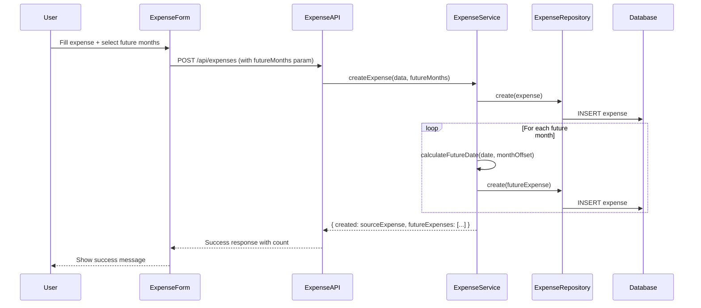

# Design Document: Recurring Expenses v2 (Add to Future Months)

## Overview

This feature adds a simple "Add to future months" capability to the expense form, allowing users to create duplicate expense entries in future months when creating or editing an expense. Unlike the original recurring expenses feature (removed in v4.0.0), this implementation is intentionally simple: no templates, no automatic generation, just straightforward copying of expense data to future months.

The key design principle is **independence**: each future expense is a completely standalone entry with no links or references to the source expense. This eliminates complexity around cascading updates, orphaned references, and template management.

## Architecture

### High-Level Flow



### Component Integration

The feature integrates with existing components:

1. **ExpenseForm.jsx** - Add "Add to future months" dropdown
2. **expenseApi.js** - Pass `futureMonths` parameter to API
3. **expenseController.js** - Handle `futureMonths` in request body
4. **expenseService.js** - Implement future expense creation logic
5. **expenseRepository.js** - No changes needed (uses existing `create` method)

No new database tables are required since future expenses are standard expense entries.

## Components and Interfaces

### Frontend Components

#### ExpenseForm.jsx Changes

Add a new "Add to future months" control to the form:

```jsx
// New state for future months selection
const [futureMonths, setFutureMonths] = useState(0);

// Dropdown options
const futureMonthOptions = [
  { value: 0, label: "Don't add to future months" },
  { value: 1, label: "Add to 1 future month" },
  { value: 2, label: "Add to 2 future months" },
  // ... up to 12
  { value: 12, label: "Add to 12 future months" }
];
```

The control should:
- Appear below the notes field
- Default to 0 (don't add)
- Reset to 0 after successful submission
- Show a preview of the date range when > 0 selected

#### Success Message Component

Display feedback after creating future expenses:

```jsx
// Success message format
const successMessage = futureCount > 0 
  ? `Expense saved and added to ${futureCount} future month${futureCount > 1 ? 's' : ''} through ${lastMonthName}`
  : 'Expense saved';
```

### Backend API

#### POST /api/expenses (Modified)

Request body adds optional `futureMonths` field:

```javascript
{
  date: "2025-01-15",
  place: "Netflix",
  amount: 15.99,
  type: "Subscriptions",
  method: "VISA",
  notes: "Monthly subscription",
  futureMonths: 3  // Optional, 0-12, default 0
}
```

Response includes future expenses info:

```javascript
{
  expense: { id: 123, ... },  // The source expense
  futureExpenses: [           // Array of created future expenses
    { id: 124, date: "2025-02-15", ... },
    { id: 125, date: "2025-03-15", ... },
    { id: 126, date: "2025-04-15", ... }
  ],
  message: "Expense saved and added to 3 future months through April 2025"
}
```

#### PUT /api/expenses/:id (Modified)

Same `futureMonths` parameter support for editing:

```javascript
{
  date: "2025-01-15",
  place: "Netflix",
  amount: 17.99,  // Updated amount
  type: "Subscriptions",
  method: "VISA",
  notes: "Monthly subscription",
  futureMonths: 2  // Create 2 new future expenses with updated values
}
```

### Service Layer

#### ExpenseService.createExpense (Modified)

```javascript
async createExpense(expenseData, futureMonths = 0) {
  // Validate futureMonths
  if (futureMonths < 0 || futureMonths > 12) {
    throw new Error('Future months must be between 0 and 12');
  }

  // Create source expense (with people allocations if medical)
  const sourceExpense = await this._createSingleExpense(expenseData);
  
  // Create future expenses if requested
  const futureExpenses = [];
  if (futureMonths > 0) {
    for (let i = 1; i <= futureMonths; i++) {
      const futureDate = this._calculateFutureDate(expenseData.date, i);
      const futureExpense = await this._createSingleExpense({
        ...expenseData,
        date: futureDate
        // Note: people allocations are included, invoices are NOT
      });
      futureExpenses.push(futureExpense);
    }
  }

  return { expense: sourceExpense, futureExpenses };
}
```

#### Date Calculation Logic

```javascript
_calculateFutureDate(sourceDate, monthsAhead) {
  const date = new Date(sourceDate);
  const sourceDay = date.getDate();
  
  // Move to target month
  date.setMonth(date.getMonth() + monthsAhead);
  
  // Handle month-end edge cases (e.g., Jan 31 -> Feb 28)
  const targetMonth = date.getMonth();
  const daysInTargetMonth = new Date(date.getFullYear(), targetMonth + 1, 0).getDate();
  
  if (sourceDay > daysInTargetMonth) {
    date.setDate(daysInTargetMonth);
  } else {
    date.setDate(sourceDay);
  }
  
  return date.toISOString().split('T')[0]; // YYYY-MM-DD format
}
```

## Data Models

### Expense Table (No Changes)

The existing `expenses` table is used for all expenses including future expenses:

```sql
CREATE TABLE expenses (
  id INTEGER PRIMARY KEY AUTOINCREMENT,
  date TEXT NOT NULL,
  place TEXT,
  notes TEXT,
  amount REAL NOT NULL,
  type TEXT NOT NULL,
  week INTEGER NOT NULL,
  method TEXT NOT NULL
);
```

Future expenses are completely independent entries - no additional columns or foreign keys needed.

### API Request/Response Models

#### CreateExpenseRequest

```typescript
interface CreateExpenseRequest {
  date: string;           // YYYY-MM-DD
  place?: string;         // Optional place/merchant name
  notes?: string;         // Optional notes
  amount: number;         // Positive number, max 2 decimal places
  type: string;           // Category from CATEGORIES list
  method: string;         // Payment method from PAYMENT_METHODS list
  futureMonths?: number;  // 0-12, default 0
  people?: PersonAllocation[];  // For medical expenses - copied to future expenses
  // Note: invoices are NOT included - they are unique per expense
}

interface PersonAllocation {
  personId: number;
  amount: number;
}
```

#### CreateExpenseResponse

```typescript
interface CreateExpenseResponse {
  expense: Expense;              // The source expense
  futureExpenses: Expense[];     // Array of future expenses (empty if futureMonths=0)
  message: string;               // User-friendly success message
}
```

#### UpdateExpenseRequest

```typescript
interface UpdateExpenseRequest {
  date: string;
  place?: string;
  notes?: string;
  amount: number;
  type: string;
  method: string;
  futureMonths?: number;  // 0-12, creates NEW future expenses with updated values
}
```

#### UpdateExpenseResponse

```typescript
interface UpdateExpenseResponse {
  expense: Expense;              // The updated expense
  futureExpenses: Expense[];     // Array of newly created future expenses
  message: string;               // User-friendly success message
}
```


## Correctness Properties

*A property is a characteristic or behavior that should hold true across all valid executions of a system—essentially, a formal statement about what the system should do. Properties serve as the bridge between human-readable specifications and machine-verifiable correctness guarantees.*

Based on the prework analysis of acceptance criteria, the following properties have been identified for property-based testing:

### Property 1: Future Expense Count

*For any* valid expense data and any futureMonths value N (where 1 ≤ N ≤ 12), when creating an expense with futureMonths=N, the system should create exactly N+1 total expenses (1 source + N future).

**Validates: Requirements 1.3**

### Property 2: Field Consistency

*For any* source expense and any future expense created from it (via create or edit), the future expense should have identical values for place, amount, type, method, and notes fields. Only the date field should differ.

For medical expenses specifically:
- People allocations should be copied to future expenses
- Invoices should NOT be copied (they are unique per expense)

**Validates: Requirements 1.4, 2.4**

### Property 3: Date Calculation Correctness

*For any* source date and any month offset (1-12), the calculated future date should:
- Preserve the day of month when that day exists in the target month
- Use the last day of the target month when the source day exceeds the days in the target month

**Validates: Requirements 1.5, 1.6**

### Property 4: Edit Creates New Future Expenses

*For any* existing expense and any futureMonths value N > 0, updating the expense should:
- Update the existing expense with new values
- Create exactly N new future expenses with the updated values
- Not modify any other existing expenses

**Validates: Requirements 2.3**

### Property 5: Expense Independence

*For any* set of expenses created via "add to future months", each expense should be completely independent such that:
- Editing any one expense does not affect any other expense
- Deleting any one expense does not affect any other expense
- No foreign key or reference exists between the source and future expenses

**Validates: Requirements 3.1, 3.2, 3.3, 3.4**

### Property 6: Creation Atomicity

*For any* expense creation with futureMonths > 0, if an error occurs during the creation process, no expenses should be created (all-or-nothing semantics).

**Validates: Requirements 4.3**

### Property 7: Budget Integration

*For any* future expense created, the budget recalculation event should be triggered for the expense's category and the month corresponding to the expense's date.

**Validates: Requirements 5.1, 5.2**

## Error Handling

### Input Validation Errors

| Error Condition | Response | HTTP Status |
|----------------|----------|-------------|
| futureMonths < 0 | "Future months must be between 0 and 12" | 400 |
| futureMonths > 12 | "Future months must be between 0 and 12" | 400 |
| futureMonths not an integer | "Future months must be a whole number" | 400 |
| Invalid expense data | Standard expense validation errors | 400 |

### Database Errors

If a database error occurs during future expense creation:

1. **Transaction Rollback**: All expenses created in the current operation should be rolled back
2. **Error Response**: Return 500 with message "Failed to create future expenses. Please try again."
3. **Logging**: Log the error with full context using the logger module

### Edge Cases

| Edge Case | Handling |
|-----------|----------|
| Source date is Feb 29 (leap year) | Future dates in non-leap years use Feb 28 |
| Source date is day 31 | Months with 30 days use day 30; Feb uses 28/29 |
| Source date is day 30 | Feb uses 28/29 |
| futureMonths spans year boundary | Correctly calculate dates into next year |

## Testing Strategy

### Dual Testing Approach

This feature requires both unit tests and property-based tests:

- **Unit tests**: Verify specific examples, edge cases, UI rendering, and error conditions
- **Property tests**: Verify universal properties across randomized inputs

### Property-Based Testing Configuration

- **Library**: fast-check (already used in the project)
- **Minimum iterations**: 100 per property test
- **Tag format**: `Feature: recurring-expenses-v2, Property N: [property description]`

### Unit Test Coverage

#### Frontend (Vitest + React Testing Library)

1. **ExpenseForm.jsx**
   - Renders "Add to future months" dropdown
   - Dropdown has options 0-12
   - Default value is 0
   - Shows date range preview when > 0 selected
   - Resets to 0 after successful submission
   - Passes futureMonths to API

2. **Success Message**
   - Shows correct count in message
   - Shows correct end date in message
   - Shows simple message when futureMonths=0

#### Backend (Jest)

1. **expenseController.js**
   - Accepts futureMonths parameter
   - Validates futureMonths range
   - Returns correct response structure

2. **expenseService.js**
   - Creates correct number of expenses
   - Calculates dates correctly for various edge cases
   - Handles transaction rollback on error

### Property Test Coverage

Each correctness property should have a corresponding property-based test:

| Property | Test File | Description |
|----------|-----------|-------------|
| P1: Future Expense Count | expenseService.futureMonths.pbt.test.js | Verify N+1 expenses created |
| P2: Field Consistency | expenseService.futureMonths.pbt.test.js | Verify field copying |
| P3: Date Calculation | expenseService.dateCalculation.pbt.test.js | Verify date handling |
| P4: Edit Creates Futures | expenseService.futureMonths.pbt.test.js | Verify edit behavior |
| P5: Independence | expenseService.independence.pbt.test.js | Verify no cascading |
| P6: Atomicity | expenseService.atomicity.pbt.test.js | Verify rollback |
| P7: Budget Integration | expenseService.budgetIntegration.pbt.test.js | Verify events |

### Test Data Generators

```javascript
// Generate valid expense data
const expenseArbitrary = fc.record({
  date: fc.date({ min: new Date('2020-01-01'), max: new Date('2030-12-31') })
    .map(d => d.toISOString().split('T')[0]),
  place: fc.string({ minLength: 1, maxLength: 100 }),
  amount: fc.float({ min: 0.01, max: 10000, noNaN: true })
    .map(n => Math.round(n * 100) / 100),
  type: fc.constantFrom(...CATEGORIES),
  method: fc.constantFrom(...PAYMENT_METHODS),
  notes: fc.option(fc.string({ maxLength: 200 }), { nil: undefined })
});

// Generate futureMonths value
const futureMonthsArbitrary = fc.integer({ min: 0, max: 12 });

// Generate dates that test edge cases (end of month)
const edgeCaseDateArbitrary = fc.oneof(
  fc.constant('2024-01-31'),  // 31st day
  fc.constant('2024-03-30'),  // 30th day
  fc.constant('2024-02-29'),  // Leap year Feb 29
  fc.constant('2023-02-28'),  // Non-leap year Feb 28
  fc.date({ min: new Date('2020-01-01'), max: new Date('2030-12-31') })
    .map(d => d.toISOString().split('T')[0])
);
```
