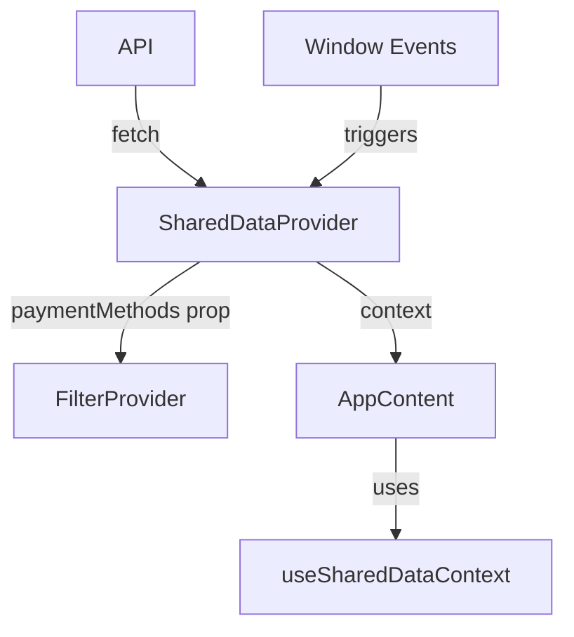

# Design Document: SharedDataContext (Phase 4)

## Overview

SharedDataContext is the fourth and final phase of the frontend state management refactoring. It extracts shared data fetching and state management from App.jsx into a dedicated context, centralizing payment methods, people, and budgets data along with their refresh mechanisms.

This context follows the same architectural patterns established in the previous phases:
- FilterContext (Phase 1): Filter and view mode state
- ExpenseContext (Phase 2): Expense data and CRUD handlers
- ModalContext (Phase 3): Modal visibility state

## Architecture

### Provider Nesting Order

```
FilterProvider (paymentMethods prop)
  └── ExpenseProvider
        └── ModalProvider
              └── SharedDataProvider  <-- NEW
                    └── AppContent
```

### Context Independence

SharedDataProvider is designed to be independent of other contexts:
- Does NOT consume FilterContext, ExpenseContext, or ModalContext
- Receives year/month as props for budget fetching (from App component)
- Provides data that FilterProvider needs via props (paymentMethods)

### Data Flow



## Components and Interfaces

### SharedDataContext Value Interface

```javascript
interface SharedDataContextValue {
  // Payment Methods
  paymentMethods: string[];
  showPaymentMethods: boolean;
  openPaymentMethods: () => void;
  closePaymentMethods: () => void;
  refreshPaymentMethods: () => void;

  // People
  people: Person[];
  refreshPeople: () => void;

  // Budgets
  budgets: Budget[];
  refreshBudgets: () => void;
}
```

### SharedDataProvider Props

```javascript
interface SharedDataProviderProps {
  children: React.ReactNode;
  selectedYear: number;   // For budget fetching
  selectedMonth: number;  // For budget fetching
}
```

### Component Structure

```javascript
// SharedDataContext.jsx
export function SharedDataProvider({ children, selectedYear, selectedMonth }) {
  // Payment methods state
  const [paymentMethods, setPaymentMethods] = useState([]);
  const [paymentMethodsRefreshTrigger, setPaymentMethodsRefreshTrigger] = useState(0);
  const [showPaymentMethods, setShowPaymentMethods] = useState(false);

  // People state
  const [people, setPeople] = useState([]);
  const [peopleRefreshTrigger, setPeopleRefreshTrigger] = useState(0);

  // Budgets state
  const [budgets, setBudgets] = useState([]);
  const [budgetRefreshTrigger, setBudgetRefreshTrigger] = useState(0);

  // Effects for data fetching...
  // Event listeners...
  // Callbacks...

  return (
    <SharedDataContext.Provider value={contextValue}>
      {children}
    </SharedDataContext.Provider>
  );
}

export function useSharedDataContext() {
  const context = useContext(SharedDataContext);
  if (context === null) {
    throw new Error('useSharedDataContext must be used within a SharedDataProvider');
  }
  return context;
}
```

## Data Models

### Payment Method

```javascript
// From API response
interface PaymentMethod {
  id: number;
  display_name: string;
  payment_type: string;
  is_active: boolean;
  // ... other fields
}

// Stored in context (display names only for filtering)
paymentMethods: string[]  // e.g., ['Cash', 'Debit', 'Visa', 'Mastercard']
```

### Person

```javascript
interface Person {
  id: number;
  name: string;
  date_of_birth: string;
}
```

### Budget

```javascript
interface Budget {
  id: number;
  category: string;
  limit_amount: number;
  year: number;
  month: number;
  spent: number;
}
```

</content>


## Correctness Properties

*A property is a characteristic or behavior that should hold true across all valid executions of a system—essentially, a formal statement about what the system should do. Properties serve as the bridge between human-readable specifications and machine-verifiable correctness guarantees.*

### Property 1: Refresh Callback Triggers Re-fetch

*For any* data type (paymentMethods, people, budgets), calling the corresponding refresh callback (refreshPaymentMethods, refreshPeople, refreshBudgets) N times should result in exactly N additional API fetch calls after the initial mount fetch.

**Validates: Requirements 1.4, 1.5, 3.4, 3.5, 4.4, 4.5**

### Property 2: Modal State Transitions are Idempotent

*For any* sequence of openPaymentMethods and closePaymentMethods calls, the final state of showPaymentMethods should equal the result of the last operation called (true for open, false for close). Calling the same operation multiple times consecutively should have the same effect as calling it once.

**Validates: Requirements 2.2, 2.3**

### Property 3: Budget Fetching Responds to Year/Month Changes

*For any* change in selectedYear or selectedMonth props, the SharedDataProvider should trigger a budget re-fetch. The number of budget fetches should equal the number of distinct (year, month) combinations seen plus any manual refresh calls.

**Validates: Requirements 4.3**

### Property 4: Error Handling Preserves State

*For any* existing state (paymentMethods, people, budgets arrays with data), if an API fetch fails, the existing state should be preserved unchanged. The provider should not crash or throw unhandled errors.

**Validates: Requirements 5.3, 5.4**

### Property 5: Handler References are Stable

*For any* sequence of re-renders where the dependencies don't change, the handler function references (openPaymentMethods, closePaymentMethods, refreshPaymentMethods, refreshPeople, refreshBudgets) should remain referentially equal (same object reference).

**Validates: Requirements 6.4, 6.5**

## Error Handling

### API Fetch Errors

```javascript
// Pattern for all data fetching
const fetchData = async () => {
  try {
    const data = await apiCall();
    if (isMounted) {
      setData(data);
    }
  } catch (err) {
    if (isMounted) {
      console.error('Error fetching data:', err);
      // Preserve existing state - do not clear data on error
    }
  }
};
```

### Cleanup Pattern

```javascript
useEffect(() => {
  let isMounted = true;
  
  // ... fetch logic using isMounted check
  
  return () => {
    isMounted = false;
  };
}, [dependencies]);
```

### Event Listener Cleanup

```javascript
useEffect(() => {
  const handler = () => { /* ... */ };
  window.addEventListener('eventName', handler);
  return () => window.removeEventListener('eventName', handler);
}, []);
```

## Testing Strategy

### Unit Tests

Unit tests verify specific examples and edge cases:

1. **Initial State Tests**
   - Context provides empty arrays on mount before fetch completes
   - showPaymentMethods is false initially

2. **API Integration Tests**
   - Payment methods are fetched on mount
   - People are fetched on mount
   - Budgets are fetched on mount with correct year/month

3. **Event Handling Tests**
   - openPaymentMethods window event opens modal
   - peopleUpdated window event triggers refresh
   - Event listeners are cleaned up on unmount

4. **Error Handling Tests**
   - Hook throws error when used outside provider
   - API errors don't crash the provider

### Property-Based Tests

Property-based tests verify universal properties using fast-check:

1. **Property 1: Refresh triggers re-fetch**
   - Generate random number of refresh calls
   - Verify API call count matches expected

2. **Property 2: Modal state idempotence**
   - Generate random sequence of open/close operations
   - Verify final state matches last operation

3. **Property 3: Year/month change triggers fetch**
   - Generate random year/month changes
   - Verify fetch count matches distinct combinations

4. **Property 4: Error preserves state**
   - Generate random initial state
   - Simulate API error
   - Verify state unchanged

5. **Property 5: Handler stability**
   - Generate random re-render triggers
   - Verify handler references stable

### Test Configuration

- Use vitest as test runner
- Use @testing-library/react for component testing
- Use fast-check for property-based testing
- Minimum 100 iterations per property test
- Mock API calls using vi.mock()

### Test File Structure

```
frontend/src/contexts/
├── SharedDataContext.jsx
├── SharedDataContext.test.jsx      # Unit tests
└── SharedDataContext.pbt.test.jsx  # Property-based tests
```
