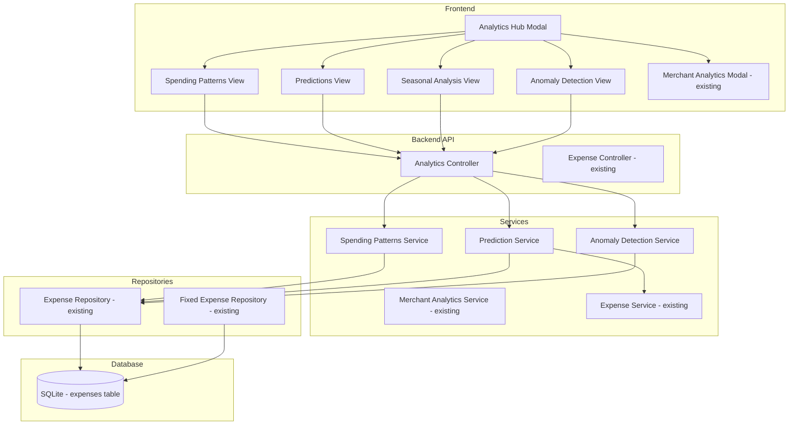

# Design Document: Spending Patterns & Predictions

## Overview

The Spending Patterns & Predictions feature extends the Expense Tracker application with intelligent analytics capabilities. It analyzes historical expense data to identify recurring patterns, predict future spending, detect anomalies, and provide seasonal insights. The feature integrates with the existing Merchant Analytics under a unified "Analytics" hub, following the established layered architecture (Controller → Service → Repository).

The system requires a minimum of 3 months of historical data to provide meaningful insights, with confidence levels that improve as more data becomes available.

## Architecture



### Design Decisions

1. **Unified Analytics Hub**: Consolidate Merchant Analytics and new spending pattern features under a single "Analytics" navigation item for better UX organization.

2. **Service Separation**: Create dedicated services for each analysis type (patterns, predictions, anomalies) to maintain single responsibility and testability.

3. **No New Database Tables**: All analysis is computed from existing expense data. No schema changes required, avoiding migration complexity.

4. **Configurable Thresholds**: Anomaly detection thresholds and pattern tolerances are configurable constants, allowing future tuning without code changes.

5. **Graceful Degradation**: Features degrade gracefully when insufficient data is available, showing partial insights rather than errors.

## Components and Interfaces

### Backend Components

#### SpendingPatternsService

Responsible for identifying recurring spending patterns from historical data.

```javascript
class SpendingPatternsService {
  /**
   * Identify recurring expense patterns
   * @param {Object} options - { minMonths: 3, toleranceDays: 3 }
   * @returns {Promise<Array<RecurringPattern>>}
   */
  async getRecurringPatterns(options = {});
  
  /**
   * Get day-of-week spending analysis
   * @param {Object} filters - { startDate, endDate, category? }
   * @returns {Promise<DayOfWeekAnalysis>}
   */
  async getDayOfWeekPatterns(filters = {});
  
  /**
   * Get seasonal spending analysis
   * @param {number} months - Number of months to analyze (default 12)
   * @returns {Promise<SeasonalAnalysis>}
   */
  async getSeasonalAnalysis(months = 12);
  
  /**
   * Check if sufficient data exists for pattern analysis
   * @returns {Promise<DataSufficiencyResult>}
   */
  async checkDataSufficiency();
}
```

#### PredictionService

Responsible for calculating end-of-month spending predictions.

```javascript
class PredictionService {
  /**
   * Calculate end-of-month spending prediction
   * @param {number} year
   * @param {number} month
   * @returns {Promise<MonthPrediction>}
   */
  async getMonthEndPrediction(year, month);
  
  /**
   * Get prediction confidence level based on data quality
   * @param {number} year
   * @param {number} month
   * @returns {Promise<'low'|'medium'|'high'>}
   */
  async calculateConfidenceLevel(year, month);
  
  /**
   * Compare prediction to historical same-month data
   * @param {number} year
   * @param {number} month
   * @returns {Promise<HistoricalComparison>}
   */
  async compareToHistorical(year, month);
}
```

#### AnomalyDetectionService

Responsible for identifying unusual spending patterns.

```javascript
class AnomalyDetectionService {
  /**
   * Detect anomalies in recent expenses
   * @param {Object} options - { lookbackDays: 30 }
   * @returns {Promise<Array<Anomaly>>}
   */
  async detectAnomalies(options = {});
  
  /**
   * Calculate baseline statistics for anomaly detection
   * @param {string} category
   * @returns {Promise<CategoryBaseline>}
   */
  async calculateCategoryBaseline(category);
  
  /**
   * Dismiss an anomaly (mark as expected)
   * @param {number} expenseId
   * @returns {Promise<void>}
   */
  async dismissAnomaly(expenseId);
  
  /**
   * Get dismissed anomalies for learning
   * @returns {Promise<Array<number>>} - Array of expense IDs
   */
  async getDismissedAnomalies();
}
```

#### AnalyticsController

New controller to handle all analytics-related API endpoints.

```javascript
// Routes:
// GET /api/analytics/patterns - Get recurring patterns
// GET /api/analytics/patterns/day-of-week - Get day-of-week analysis
// GET /api/analytics/seasonal - Get seasonal analysis
// GET /api/analytics/predictions/:year/:month - Get month prediction
// GET /api/analytics/anomalies - Get detected anomalies
// POST /api/analytics/anomalies/:expenseId/dismiss - Dismiss anomaly
// GET /api/analytics/data-sufficiency - Check data availability
```

### Frontend Components

#### AnalyticsHubModal

Main container component that provides tabbed navigation between analytics views.

```jsx
// Props
interface AnalyticsHubModalProps {
  isOpen: boolean;
  onClose: () => void;
  initialTab?: 'patterns' | 'predictions' | 'seasonal' | 'merchants' | 'anomalies';
  currentYear: number;
  currentMonth: number;
}
```

#### SpendingPatternsView

Displays recurring patterns and day-of-week analysis.

```jsx
// Props
interface SpendingPatternsViewProps {
  onPatternClick?: (pattern: RecurringPattern) => void;
}
```

#### PredictionsView

Displays end-of-month predictions with confidence indicators.

```jsx
// Props
interface PredictionsViewProps {
  year: number;
  month: number;
  monthlyIncome?: number;
}
```

#### SeasonalAnalysisView

Displays month-over-month and quarter-over-quarter comparisons.

```jsx
// Props
interface SeasonalAnalysisViewProps {
  months?: number; // Default 12
}
```

#### AnomalyAlertsView

Displays detected anomalies with dismiss functionality.

```jsx
// Props
interface AnomalyAlertsViewProps {
  onDismiss: (expenseId: number) => void;
}
```

### API Service (Frontend)

```javascript
// frontend/src/services/analyticsApi.js

export const getRecurringPatterns = async () => { ... };
export const getDayOfWeekPatterns = async (filters) => { ... };
export const getSeasonalAnalysis = async (months) => { ... };
export const getMonthPrediction = async (year, month) => { ... };
export const getAnomalies = async () => { ... };
export const dismissAnomaly = async (expenseId) => { ... };
export const checkDataSufficiency = async () => { ... };
```

## Data Models

### RecurringPattern

```typescript
interface RecurringPattern {
  merchantName: string;
  category: string;
  frequency: 'weekly' | 'bi-weekly' | 'monthly';
  averageAmount: number;
  amountVariance: { min: number; max: number };
  occurrenceCount: number;
  lastOccurrence: string; // ISO date
  nextExpected: string; // ISO date
  confidence: number; // 0-100
}
```

### MonthPrediction

```typescript
interface MonthPrediction {
  year: number;
  month: number;
  currentSpent: number;
  predictedTotal: number;
  daysElapsed: number;
  daysRemaining: number;
  dailyAverage: number;
  historicalMonthlyAverage: number;
  confidenceLevel: 'low' | 'medium' | 'high';
  exceedsIncome: boolean;
  yearOverYearChange: number | null; // Percentage, null if no prior year data
  categoryBreakdown: Array<{
    category: string;
    currentSpent: number;
    predicted: number;
  }>;
}
```

### DayOfWeekAnalysis

```typescript
interface DayOfWeekAnalysis {
  days: Array<{
    dayName: string; // 'Monday', 'Tuesday', etc.
    dayIndex: number; // 0-6
    averageSpend: number;
    transactionCount: number;
    percentOfWeeklyTotal: number;
    isHighSpendingDay: boolean; // >30% above weekly average
    topCategories: Array<{ category: string; amount: number }>;
  }>;
  weeklyAverage: number;
  highestSpendingDay: string;
  lowestSpendingDay: string;
}
```

### SeasonalAnalysis

```typescript
interface SeasonalAnalysis {
  monthlyData: Array<{
    year: number;
    month: number;
    monthName: string;
    totalSpent: number;
    previousMonthChange: number | null; // Percentage
    sameMonthLastYearChange: number | null; // Percentage
  }>;
  quarterlyData: Array<{
    year: number;
    quarter: number; // 1-4
    totalSpent: number;
    previousQuarterChange: number | null;
  }>;
  seasonalCategories: Array<{
    category: string;
    varianceFromAnnualAverage: number; // Percentage
    peakMonths: number[]; // Month numbers 1-12
    lowMonths: number[];
  }>;
}
```

### Anomaly

```typescript
interface Anomaly {
  id: number;
  expenseId: number;
  date: string;
  place: string;
  amount: number;
  category: string;
  anomalyType: 'amount' | 'daily_total' | 'new_merchant';
  reason: string;
  severity: 'low' | 'medium' | 'high';
  categoryAverage: number;
  standardDeviations: number; // How many SDs from mean
  dismissed: boolean;
}
```

### DataSufficiencyResult

```typescript
interface DataSufficiencyResult {
  hasSufficientData: boolean;
  monthsOfData: number;
  requiredMonths: number;
  oldestExpenseDate: string | null;
  newestExpenseDate: string | null;
  dataQualityScore: number; // 0-100
  availableFeatures: {
    recurringPatterns: boolean;
    predictions: boolean;
    seasonalAnalysis: boolean;
    dayOfWeekAnalysis: boolean;
    anomalyDetection: boolean;
  };
  missingDataMessage: string | null;
}
```

### Configuration Constants

```javascript
// backend/utils/analyticsConstants.js

const ANALYTICS_CONFIG = {
  // Minimum data requirements
  MIN_MONTHS_FOR_PATTERNS: 3,
  MIN_MONTHS_FOR_PREDICTIONS: 1,
  MIN_MONTHS_FOR_SEASONAL: 6,
  
  // Pattern detection
  PATTERN_TOLERANCE_DAYS: 3,
  MIN_OCCURRENCES_FOR_PATTERN: 3,
  
  // Anomaly detection
  ANOMALY_STD_DEVIATIONS: 3,
  DAILY_ANOMALY_MULTIPLIER: 2,
  
  // Thresholds
  HIGH_SPENDING_DAY_THRESHOLD: 0.30, // 30% above average
  SEASONAL_VARIANCE_THRESHOLD: 0.25, // 25% variance
  YOY_WARNING_THRESHOLD: 0.20, // 20% year-over-year increase
  
  // Confidence levels
  CONFIDENCE_HIGH_MONTHS: 12,
  CONFIDENCE_MEDIUM_MONTHS: 6,
  EARLY_MONTH_DAYS: 7 // Days before weighting historical more
};
```


## Correctness Properties

*A property is a characteristic or behavior that should hold true across all valid executions of a system—essentially, a formal statement about what the system should do. Properties serve as the bridge between human-readable specifications and machine-verifiable correctness guarantees.*

### Property 1: Recurring Pattern Detection Accuracy

*For any* expense history containing expenses from the same merchant at regular intervals (within ±3 days tolerance) occurring at least 3 times, the Pattern_Analyzer SHALL identify it as a recurring pattern with the correct frequency (weekly, bi-weekly, or monthly).

**Validates: Requirements 1.1, 1.4**

### Property 2: Output Structure Completeness

*For any* identified recurring pattern or detected anomaly, the output object SHALL contain all required fields: for patterns (merchantName, averageAmount, frequency, nextExpected) and for anomalies (expenseId, amount, anomalyType, reason).

**Validates: Requirements 1.2, 5.4**

### Property 3: Data Sufficiency Validation

*For any* expense dataset, if the date range spans fewer than 3 months, the System SHALL return hasSufficientData=false and disable pattern analysis features; if 3+ months exist, hasSufficientData=true.

**Validates: Requirements 1.3, 6.1**

### Property 4: Amount Variance Calculation

*For any* set of recurring expenses with varying amounts, the Pattern_Analyzer SHALL calculate the average as the arithmetic mean and the variance range as [min, max] of all amounts in the pattern.

**Validates: Requirements 1.5**

### Property 5: Prediction Formula Consistency

*For any* current month with spending data, the Prediction_Engine SHALL calculate predictedTotal using the formula: `currentSpent + (dailyAverage * daysRemaining)`, where dailyAverage incorporates both current trajectory and historical monthly average.

**Validates: Requirements 2.1, 2.2**

### Property 6: Income Exceedance Warning

*For any* prediction where predictedTotal > monthlyIncome, the exceedsIncome flag SHALL be true; otherwise false.

**Validates: Requirements 2.3**

### Property 7: Year-Over-Year Variance Highlighting

*For any* prediction where the same month last year has data, if (predictedTotal - lastYearSameMonth) / lastYearSameMonth > 0.20, the yearOverYearChange SHALL be highlighted as a warning.

**Validates: Requirements 2.4**

### Property 8: Confidence Level Assignment

*For any* prediction calculation, confidence level SHALL be 'high' if 12+ months of data exist, 'medium' if 6-11 months exist, and 'low' if fewer than 6 months exist.

**Validates: Requirements 2.5**

### Property 9: Early Month Historical Weighting

*For any* prediction calculated when daysElapsed < 7, the historical monthly average SHALL have greater weight than current trajectory in the prediction formula.

**Validates: Requirements 2.6**

### Property 10: Month-Over-Month Comparison Completeness

*For any* seasonal analysis request, the monthlyData array SHALL contain entries for each of the past 12 months with correct previousMonthChange percentage calculations.

**Validates: Requirements 3.1, 3.5**

### Property 11: Quarter-Over-Quarter Aggregation

*For any* seasonal analysis, quarterlyData SHALL correctly aggregate monthly totals into quarters (Q1=Jan-Mar, Q2=Apr-Jun, Q3=Jul-Sep, Q4=Oct-Dec) with correct previousQuarterChange calculations.

**Validates: Requirements 3.2**

### Property 12: Seasonal Category Variance Detection

*For any* category where the variance from annual average exceeds 25% in any month, that category SHALL appear in seasonalCategories with correct peakMonths and lowMonths arrays.

**Validates: Requirements 3.3, 3.4**

### Property 13: Day-of-Week Average Calculation

*For any* expense dataset, the day-of-week analysis SHALL return 7 entries (one per day) with averageSpend equal to the sum of expenses on that day divided by the number of occurrences of that day in the dataset.

**Validates: Requirements 4.1**

### Property 14: High-Spending Day Identification

*For any* day where averageSpend > weeklyAverage * 1.30, the isHighSpendingDay flag SHALL be true.

**Validates: Requirements 4.2**

### Property 15: Day Category Ranking

*For any* day in the day-of-week analysis, topCategories SHALL be sorted by total amount descending and include at least the top 3 categories (or all if fewer than 3 exist).

**Validates: Requirements 4.3**

### Property 16: Category Filter Application

*For any* day-of-week analysis with a category filter applied, all returned expense data SHALL belong to the specified category only.

**Validates: Requirements 4.4**

### Property 17: Amount Anomaly Detection

*For any* expense where (amount - categoryAverage) / categoryStdDev > 3, the Anomaly_Detector SHALL flag it as an anomaly with anomalyType='amount'.

**Validates: Requirements 5.1**

### Property 18: Daily Total Anomaly Detection

*For any* day where totalDailySpending > dailyAverage * 2, the Anomaly_Detector SHALL generate an alert with anomalyType='daily_total'.

**Validates: Requirements 5.2**

### Property 19: New Merchant Anomaly Detection

*For any* expense at a merchant with no prior history where amount > typicalFirstVisitAmount, the Anomaly_Detector SHALL flag it with anomalyType='new_merchant'.

**Validates: Requirements 5.3**

### Property 20: Dismissed Anomaly Learning

*For any* expense that has been dismissed as an anomaly, future anomaly detection runs SHALL NOT flag that same expense as an anomaly.

**Validates: Requirements 5.6**

### Property 21: Data Quality Score Calculation

*For any* expense dataset, the dataQualityScore SHALL be calculated based on: months with data / total months in range * 100, adjusted for consistency of expense frequency.

**Validates: Requirements 6.3**

### Property 22: Gap Exclusion in Baselines

*For any* baseline calculation, months with zero expenses SHALL be excluded from average calculations to prevent skewing results.

**Validates: Requirements 6.4**

### Property 23: Feature Availability Reporting

*For any* data sufficiency check, the availableFeatures object SHALL correctly indicate which features are enabled based on the amount of historical data available.

**Validates: Requirements 6.2**

### Property 24: Budget Integration

*For any* analytics hub view where budget alerts exist for the current month, the spending predictions SHALL display alongside budget status information.

**Validates: Requirements 7.4**

### Property 25: API Date Range Filtering

*For any* API request with startDate and endDate parameters, the returned data SHALL only include expenses within that date range (inclusive).

**Validates: Requirements 8.2**

### Property 26: API Response Metadata

*For any* analytics API response, the response object SHALL include metadata fields for dataQuality and confidenceLevel.

**Validates: Requirements 8.3**

### Property 27: Edge Case Handling

*For any* calculation involving division, if the divisor is zero, the result SHALL be 0 or null (not an error), and the system SHALL continue operating normally.

**Validates: Requirements 8.4**

## Error Handling

### Backend Error Handling

| Error Scenario | Response Code | Response Body | Recovery Action |
|----------------|---------------|---------------|-----------------|
| Insufficient data for analysis | 200 | `{ hasSufficientData: false, message: "..." }` | Display informative message to user |
| Invalid date range parameters | 400 | `{ error: "Invalid date range" }` | Return validation error |
| Database query failure | 500 | `{ error: "Analysis temporarily unavailable" }` | Log error, return graceful message |
| Division by zero in calculations | N/A | Return 0 or null | Continue with safe default |
| Missing category baseline | 200 | Exclude from anomaly detection | Skip anomaly check for that category |

### Frontend Error Handling

| Error Scenario | User Experience | Recovery Action |
|----------------|-----------------|-----------------|
| API request fails | Show error banner with retry option | Allow manual retry |
| Insufficient data | Show informative message with data requirements | Guide user to add more expenses |
| Partial data available | Show available insights with "limited data" indicator | Degrade gracefully |
| Network timeout | Show cached data if available, otherwise error | Retry with exponential backoff |

### Graceful Degradation Strategy

1. **No historical data**: Show empty state with guidance on data requirements
2. **1-2 months of data**: Enable basic predictions only, disable patterns
3. **3-5 months of data**: Enable patterns with "low confidence" indicator
4. **6-11 months of data**: Enable all features with "medium confidence"
5. **12+ months of data**: Full functionality with "high confidence"

## Testing Strategy

### Unit Testing

Unit tests will cover specific examples and edge cases:

- Empty dataset handling
- Single expense scenarios
- Boundary conditions (exactly 3 months, exactly 7 days)
- Zero amount expenses
- Missing fields in expense data
- Date parsing edge cases (leap years, month boundaries)

### Property-Based Testing

Property-based tests will verify universal properties across generated inputs using **fast-check** library:

**Configuration:**
- Minimum 100 iterations per property test
- Each test tagged with: `Feature: spending-patterns-predictions, Property {N}: {description}`

**Test Categories:**

1. **Pattern Detection Properties** (Properties 1-4)
   - Generate random expense histories with known patterns
   - Verify detection accuracy and output completeness

2. **Prediction Properties** (Properties 5-9)
   - Generate random monthly spending data
   - Verify prediction formula and confidence calculations

3. **Seasonal Analysis Properties** (Properties 10-12)
   - Generate multi-month expense datasets
   - Verify aggregation and comparison calculations

4. **Day-of-Week Properties** (Properties 13-16)
   - Generate expenses across different days
   - Verify averaging and filtering logic

5. **Anomaly Detection Properties** (Properties 17-20)
   - Generate expenses with known anomalies
   - Verify detection thresholds and dismiss functionality

6. **Data Quality Properties** (Properties 21-27)
   - Generate datasets with gaps and edge cases
   - Verify quality scoring and API behavior

### Integration Testing

- API endpoint integration tests
- Frontend component integration with mock API
- Analytics Hub navigation flow tests

### Test Data Generation

```javascript
// Example fast-check arbitraries for expense generation
const expenseArbitrary = fc.record({
  date: fc.date({ min: new Date('2023-01-01'), max: new Date('2024-12-31') })
    .map(d => d.toISOString().split('T')[0]),
  place: fc.string({ minLength: 1, maxLength: 50 }),
  amount: fc.float({ min: 0.01, max: 10000, noNaN: true })
    .map(n => Math.round(n * 100) / 100),
  type: fc.constantFrom(...CATEGORIES),
  method: fc.constantFrom(...PAYMENT_METHODS)
});

const recurringPatternArbitrary = fc.record({
  merchantName: fc.string({ minLength: 1, maxLength: 30 }),
  baseAmount: fc.float({ min: 10, max: 500 }),
  frequency: fc.constantFrom('weekly', 'bi-weekly', 'monthly'),
  occurrences: fc.integer({ min: 3, max: 12 })
});
```
