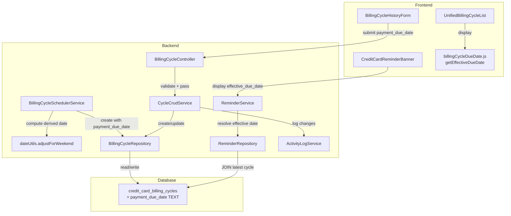

# Design Document: Billing Cycle Payment Due Date

## Overview

This feature adds a per-cycle `payment_due_date` override to billing cycle records, enabling weekend-adjusted due dates. When a credit card's configured `payment_due_day` falls on a Saturday or Sunday, the system shifts the due date to the preceding Friday. This override flows through the entire stack: database storage, backend reminder calculations, scheduler auto-generation, and frontend display/editing.

The core concept is the **Effective Due Date** — a resolved date that prefers the per-cycle `payment_due_date` override when non-null, falling back to the derived due date (computed from `payment_due_day` + `cycle_end_date`). This fallback chain is applied consistently across the reminder service, frontend display, and reminder banners.

### Key Design Decisions

1. **Nullable override column** — `payment_due_date` is NULL by default. Only cycles where the derived date falls on a weekend (or the user manually overrides) will have a non-null value. This preserves backward compatibility: all existing cycles continue to use derived dates.

2. **Weekend adjustment at generation time** — The scheduler computes the weekend adjustment when auto-generating cycles and stores it in `payment_due_date`. This avoids runtime weekend-checking on every display/reminder calculation.

3. **Single utility function** — `adjustForWeekend(dateStr)` in `dateUtils.js` is the single source of truth for weekend adjustment logic, used by both the scheduler and tests.

4. **Frontend `getEffectiveDueDate` utility** — A single function in `billingCycleDueDate.js` encapsulates the fallback chain, used by both `UnifiedBillingCycleList` and `CreditCardReminderBanner`.

## Architecture



### Data Flow

1. **Auto-generation**: Scheduler → derives due date from `payment_due_day` + cycle end → calls `adjustForWeekend()` → stores `payment_due_date` only if adjusted (NULL otherwise) → logs activity with `weekendAdjusted` flag.

2. **Manual entry/edit**: User sets date in `BillingCycleHistoryForm` → controller validates `YYYY-MM-DD` format → `cycleCrudService.updateBillingCycle()` persists → activity log records `payment_due_date` change.

3. **Reminder calculation**: `reminderRepository.getCreditCardsWithDueDates()` JOINs latest billing cycle → returns `payment_due_date` → `reminderService` resolves effective date → calculates `days_until_due` from effective date → returns `effective_due_date` in response.

4. **Frontend display**: `UnifiedBillingCycleList` calls `getEffectiveDueDate(cycle, paymentDueDay)` → shows "Adjusted" badge when override differs from derived → `CreditCardReminderBanner` shows `effective_due_date` from API response.

## Components and Interfaces

### Backend Changes

#### 1. `backend/database/schema.js` — Schema Update
Add `payment_due_date` column to `credit_card_billing_cycles` table:
```sql
payment_due_date TEXT DEFAULT NULL CHECK(
  payment_due_date IS NULL OR payment_due_date GLOB '[0-9][0-9][0-9][0-9]-[0-1][0-9]-[0-3][0-9]'
)
```
Position: after `balance_type`, before `created_at`.

#### 2. `backend/database/migrations.js` — Migration
Add a new migration entry `add_payment_due_date_v1`:
```javascript
{
  name: 'add_payment_due_date_v1',
  async apply(db) {
    await runSql(db, `ALTER TABLE credit_card_billing_cycles ADD COLUMN payment_due_date TEXT DEFAULT NULL`);
  }
}
```
The CHECK constraint cannot be added via `ALTER TABLE` in SQLite, so it only applies to fresh installs via `schema.js`. Existing databases get the column via migration; the application-level validation in the controller enforces the format for all writes.

#### 3. `backend/utils/dateUtils.js` — Weekend Adjustment Utility
New export `adjustForWeekend(dateStr)`:
- Input: `YYYY-MM-DD` string
- Parse date parts directly (no `new Date()` to avoid timezone issues)
- Use `Date.UTC` to determine day of week
- Saturday (6) → subtract 1 day → Friday
- Sunday (0) → subtract 2 days → Friday
- Weekday → return input unchanged
- Returns: `YYYY-MM-DD` string

#### 4. `backend/repositories/billingCycleRepository.js` — CRUD Updates
- **`create()`**: Add `payment_due_date` to INSERT column list and params. Include in returned object.
- **`update()`**: Add `payment_due_date` to UPDATE SET clause. Handle `undefined` vs explicit `null` (undefined = preserve existing, null = clear override).
- **`findById()` / `findByPaymentMethod()`**: Already use `SELECT *`, so `payment_due_date` is automatically included in results.

#### 5. `backend/repositories/reminderRepository.js` — JOIN Latest Cycle
Update `getCreditCardsWithDueDates()` query to LEFT JOIN the most recent billing cycle per card:
```sql
SELECT pm.*, latest_cycle.payment_due_date AS latest_payment_due_date
FROM payment_methods pm
LEFT JOIN (
  SELECT payment_method_id, payment_due_date,
    ROW_NUMBER() OVER (PARTITION BY payment_method_id ORDER BY cycle_end_date DESC) AS rn
  FROM credit_card_billing_cycles
) latest_cycle ON pm.id = latest_cycle.payment_method_id AND latest_cycle.rn = 1
WHERE pm.type = 'credit_card' AND pm.is_active = 1 AND pm.payment_due_day IS NOT NULL
```

#### 6. `backend/services/reminderService.js` — Effective Due Date Resolution
In `getCreditCardReminders()`:
- After fetching cards, check `card.latest_payment_due_date`
- If non-null: parse it, compute `days_until_due` as difference from reference date
- If null: use existing `calculateDaysUntilDue(card.payment_due_day, referenceDate)`
- Add `effective_due_date` field to each card in the response

#### 7. `backend/controllers/billingCycleController.js` — Validation
In `createBillingCycle()` and `updateBillingCycle()`:
- Extract `payment_due_date` from `req.body`
- If provided and not null: validate against `/^\d{4}-\d{2}-\d{2}$/` regex and verify it parses to a valid date
- If invalid: return 400 with descriptive message
- Pass validated value to service layer

#### 8. `backend/services/cycleCrudService.js` — Pass-through + Activity Log
- **`createBillingCycle()`**: Pass `payment_due_date` through to repository. Include in activity log metadata.
- **`updateBillingCycle()`**: Pass `payment_due_date` to repository update. Add `payment_due_date` to the changes array when value differs from existing.

#### 9. `backend/services/billingCycleSchedulerService.js` — Weekend Adjustment on Auto-Generate
In `processCard()`, after creating each cycle:
- Compute derived due date from `card.payment_due_day` + `period.endDate` (same logic as frontend `deriveDueDate`)
- Call `adjustForWeekend(derivedDate)`
- If adjusted date differs from derived date: set `payment_due_date` = adjusted date in the create call
- If same: set `payment_due_date` = null
- Include `paymentDueDate` and `weekendAdjusted: true/false` in the activity log metadata

### Frontend Changes

#### 10. `frontend/src/utils/billingCycleDueDate.js` — New `getEffectiveDueDate` Export
```javascript
export function getEffectiveDueDate(cycle, paymentDueDay) {
  if (cycle.payment_due_date) return cycle.payment_due_date;
  return deriveDueDate(cycle.cycle_end_date, paymentDueDay);
}
```

#### 11. `frontend/src/components/UnifiedBillingCycleList.jsx`
- Import `getEffectiveDueDate` from `billingCycleDueDate.js`
- Accept `paymentDueDay` prop
- For each cycle, compute effective due date via `getEffectiveDueDate(cycle, paymentDueDay)`
- Display the effective due date in the details row
- Show "Adjusted" badge when `cycle.payment_due_date` is non-null and differs from `deriveDueDate()`

#### 12. `frontend/src/components/BillingCycleHistoryForm.jsx`
- Add `paymentDueDate` state initialized from `editingCycle?.payment_due_date || ''`
- Add date input field labeled "Payment Due Date (optional)"
- On submit: include `payment_due_date` in the data payload (send null if empty)
- No special validation beyond what the browser date input provides

#### 13. `frontend/src/components/CreditCardReminderBanner.jsx`
- Use `card.effective_due_date` (from API response) instead of `card.payment_due_day` for the due date display
- Replace "Due on day N of each month" with formatted `effective_due_date` when available
- Fall back to existing "Due on day N" text when `effective_due_date` is not present

#### 14. `frontend/src/services/creditCardApi.js`
- Update `createBillingCycle()` and `updateBillingCycle()` to include `payment_due_date` in request body when present in the data object

## Data Models

### Database Column Addition

```sql
-- credit_card_billing_cycles table (addition)
payment_due_date TEXT DEFAULT NULL CHECK(
  payment_due_date IS NULL OR 
  payment_due_date GLOB '[0-9][0-9][0-9][0-9]-[0-1][0-9]-[0-3][0-9]'
)
```

### Billing Cycle Record (Backend)

```javascript
{
  id: 42,
  payment_method_id: 5,
  cycle_start_date: '2025-06-15',
  cycle_end_date: '2025-07-14',
  actual_statement_balance: 1234.56,
  calculated_statement_balance: 1200.00,
  minimum_payment: 25.00,
  notes: null,
  statement_pdf_path: null,
  is_user_entered: 1,
  effective_balance: 1234.56,
  balance_type: 'actual',
  payment_due_date: '2025-08-08',  // NEW — Friday (adjusted from Saturday Aug 9)
  created_at: '2025-07-15T00:00:00',
  updated_at: '2025-07-15T00:00:00'
}
```

### Credit Card Reminder Response (API)

```javascript
{
  id: 5,
  display_name: 'Visa',
  payment_due_day: 9,
  days_until_due: 3,
  effective_due_date: '2025-08-08',  // NEW — resolved from payment_due_date override
  is_overdue: false,
  is_due_soon: true,
  // ... existing fields unchanged
}
```

### Activity Log Metadata Examples

**Auto-generated cycle with weekend adjustment:**
```javascript
{
  cardName: 'Visa',
  cycleStartDate: '2025-06-15',
  cycleEndDate: '2025-07-14',
  calculatedBalance: 0,
  paymentDueDate: '2025-08-08',
  weekendAdjusted: true
}
```

**Manual update changing payment_due_date:**
```javascript
{
  paymentMethodId: 5,
  cycleEndDate: '2025-07-14',
  changes: [
    { field: 'payment_due_date', from: '2025-08-08', to: '2025-08-07' }
  ],
  cardName: 'Visa'
}
```


## Correctness Properties

*A property is a characteristic or behavior that should hold true across all valid executions of a system — essentially, a formal statement about what the system should do. Properties serve as the bridge between human-readable specifications and machine-verifiable correctness guarantees.*

### Property 1: Weekend adjustment yields correct weekday

*For any* valid `YYYY-MM-DD` date string, calling `adjustForWeekend(date)` should return:
- The same date if it falls on Monday–Friday
- The preceding Friday if it falls on Saturday (1 day back)
- The preceding Friday if it falls on Sunday (2 days back)

And in all cases, the result day-of-week should be Monday–Friday.

**Validates: Requirements 3.1, 3.2, 3.3, 3.6**

### Property 2: Frontend effective due date fallback chain

*For any* billing cycle object and payment due day, `getEffectiveDueDate(cycle, paymentDueDay)` should return `cycle.payment_due_date` when it is non-null, and `deriveDueDate(cycle.cycle_end_date, paymentDueDay)` when `payment_due_date` is null.

**Validates: Requirements 1.3, 5.1, 5.2, 6.1, 6.4**

### Property 3: Reminder service effective due date resolution

*For any* credit card with a most-recent billing cycle, the reminder service should use `payment_due_date` (when non-null) for days-until-due calculation, and derive the date from `payment_due_day` when `payment_due_date` is null. The `effective_due_date` field in the response should match the resolved date.

**Validates: Requirements 4.1, 4.2, 4.3**

### Property 4: Overdue and due-soon classification from effective date

*For any* credit card with balance > 0 and a resolved effective due date, the card should be marked `is_overdue` when the effective date is before the reference date, and `is_due_soon` when the effective date is within 7 days of the reference date (inclusive, non-negative).

**Validates: Requirements 4.4, 4.5**

### Property 5: Effective due date is always a valid date string

*For any* billing cycle (with or without `payment_due_date` override), the resolved effective due date should be a valid `YYYY-MM-DD` string that parses to a real calendar date.

**Validates: Requirements 6.2**

### Property 6: Scheduler stores payment_due_date only for weekend-derived dates

*For any* auto-generated billing cycle, `payment_due_date` should be non-null if and only if the derived due date (from `payment_due_day` + cycle end) falls on a Saturday or Sunday. When non-null, the stored value should equal `adjustForWeekend(derivedDate)`.

**Validates: Requirements 3.4, 3.5**

### Property 7: Repository round-trip for payment_due_date

*For any* valid `YYYY-MM-DD` date string (or null), creating or updating a billing cycle with that `payment_due_date` value and then reading the record back should return the same `payment_due_date` value.

**Validates: Requirements 2.1, 2.2, 2.3**

### Property 8: Invalid payment_due_date format rejection

*For any* string that does not match the `YYYY-MM-DD` date format (e.g., random strings, partial dates, wrong separators), the billing cycle controller should reject the request with a 400 status code.

**Validates: Requirements 2.5**

### Property 9: Activity log tracks payment_due_date changes

*For any* billing cycle update where the `payment_due_date` value changes (set, modified, or cleared), the activity log `changes` array should include an entry with `field: 'payment_due_date'` and correct `from`/`to` values.

**Validates: Requirements 7.2**

### Property 10: Adjusted badge display when override differs from derived

*For any* billing cycle where `payment_due_date` is non-null and differs from `deriveDueDate(cycle_end_date, paymentDueDay)`, the UI should display an "Adjusted" visual indicator. When `payment_due_date` is null or equals the derived date, no indicator should be shown.

**Validates: Requirements 6.3**

## Error Handling

| Scenario | Layer | Behavior |
|---|---|---|
| Invalid `payment_due_date` format in request body | Controller | Return 400 with "payment_due_date must be a valid YYYY-MM-DD date" |
| `payment_due_date` provided as non-string (number, boolean) | Controller | Return 400 with descriptive type error |
| SQLite CHECK constraint violation on direct DB insert | Database | SQLite error; caught by repository, logged, re-thrown |
| `adjustForWeekend` receives invalid date string | Utility | Return input unchanged (defensive); log warning |
| Reminder repository JOIN returns no billing cycles for a card | Reminder Service | `latest_payment_due_date` is null; fall back to `payment_due_day` derivation (existing behavior) |
| Frontend `getEffectiveDueDate` receives cycle with no `cycle_end_date` | Utility | Return `payment_due_date` if available, otherwise return empty string (defensive) |
| Migration fails on existing database | Migration | Error logged; application startup fails (existing migration error handling) |

## Testing Strategy

### Property-Based Tests (fast-check)

Each property test must run a minimum of 100 iterations and include an `@invariant` comment block within the first 30 lines per project convention.

| Property | Test File | Tag |
|---|---|---|
| P1: Weekend adjustment correctness | `backend/utils/dateUtils.pbt.test.js` (extend existing) | Feature: billing-cycle-payment-due-date, Property 1: Weekend adjustment yields correct weekday |
| P2: Frontend fallback chain | `frontend/src/utils/billingCycleDueDate.pbt.test.js` (extend existing) | Feature: billing-cycle-payment-due-date, Property 2: Frontend effective due date fallback chain |
| P3: Reminder effective date resolution | `backend/services/reminderService.billingCycleCheck.pbt.test.js` (extend existing) | Feature: billing-cycle-payment-due-date, Property 3: Reminder service effective due date resolution |
| P4: Overdue/due-soon classification | `backend/services/reminderService.billingCycleCheck.pbt.test.js` (extend existing) | Feature: billing-cycle-payment-due-date, Property 4: Overdue and due-soon classification |
| P5: Valid date output | `frontend/src/utils/billingCycleDueDate.pbt.test.js` (extend existing) | Feature: billing-cycle-payment-due-date, Property 5: Effective due date is always valid |
| P6: Scheduler conditional storage | `backend/services/billingCycleSchedulerService.pbt.test.js` (extend existing) | Feature: billing-cycle-payment-due-date, Property 6: Scheduler weekend-conditional storage |

### Unit Tests (Jest / Vitest)

| Test Area | Test File | Coverage |
|---|---|---|
| Controller validation (Req 2.5) | `backend/controllers/billingCycleController.test.js` | Invalid formats return 400; valid formats pass through |
| Scheduler integration (Req 3.4–3.5) | `backend/services/billingCycleSchedulerService.test.js` | Auto-generated cycles have correct payment_due_date |
| Activity log tracking (Req 7.1–7.3) | `backend/services/billingCycleHistoryService.activityLog.integration.test.js` | Create/update/auto-generate include payment_due_date metadata |
| Form rendering (Req 5.3–5.5) | `frontend/src/components/BillingCycleHistoryForm.test.jsx` (extend) | Date input present, pre-populated in edit mode, sends null when cleared |
| List display (Req 5.1–5.2) | `frontend/src/components/UnifiedBillingCycleList.test.jsx` (extend) | Shows override date, shows derived date, shows "Adjusted" badge |
| Reminder banner (Req 5.6) | `frontend/src/components/CreditCardReminderBanner.test.jsx` (extend) | Shows effective_due_date instead of generic day text |

### Test Configuration

- Backend PBT: fast-check with `{ numRuns: 100 }` minimum
- Frontend PBT: fast-check via Vitest with `{ numRuns: 100 }` minimum
- All PBT files include `@invariant` comment in first 30 lines
- Each PBT test references its design property number in a comment tag
